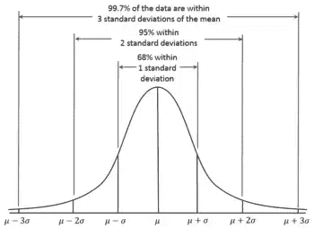
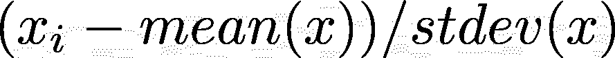
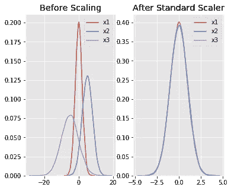
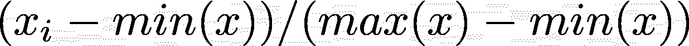
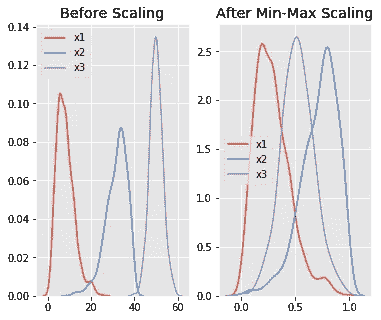
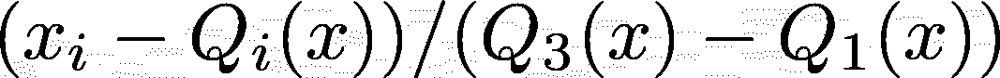
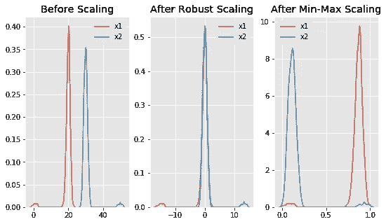
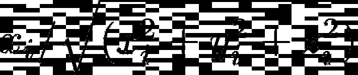
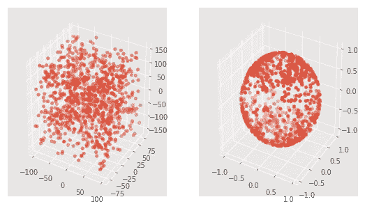

# 使用 Python 的 Scikit-learn 扩展功能

> 原文：<https://pub.towardsai.net/feature-scaling-with-pythons-scikit-learn-10ab42119ae0?source=collection_archive---------1----------------------->

## [机器学习](https://towardsai.net/p/category/machine-learning)，[编程](https://towardsai.net/p/category/programming)

标准化的主要目标之一是使数据接近于零。这使得优化问题更加“数值稳定”。

现在，使用平均值和标准偏差的缩放假设数据是正态分布的，也就是说，大部分数据足够接近平均值。因此，将平均值移至零可以确保大多数数据点的大部分成分接近于 0。具体来说，68%的数据介于-1 和 1 之间，如下图所示:



在本帖中，我们将探讨 scikit-learn 中实现的 3 种功能缩放方法:

*   `StandardScaler`
*   `MinMaxScaler`
*   `RobustScaler`
*   `Normalizer`

# 标准缩放器

`StandardScaler`假设您的数据在每个要素内呈正态分布，并将对其进行缩放，使分布现在以 0 为中心，标准差为 1。

计算特征的平均值和标准偏差，然后根据以下内容对特征进行缩放:



如果数据不是正态分布的，这不是最好的缩放器。

让我们来看看它的运行情况:

在[1]中:

```
**import** **pandas** **as** **pd**
**import** **numpy** **as** **np**
**from** **sklearn** **import** preprocessing
**import** **matplotlib**
**import** **matplotlib.pyplot** **as** **plt**
**import** **seaborn** **as** **sns**
%**matplotlib** inline
matplotlib.style.use('ggplot')
```

在[2]中:

```
np.random.seed(1)
df = pd.DataFrame({
    'x1': np.random.normal(0, 2, 10000),
    'x2': np.random.normal(5, 3, 10000),
    'x3': np.random.normal(-5, 5, 10000)
})scaler = preprocessing.StandardScaler()
scaled_df = scaler.fit_transform(df)
scaled_df = pd.DataFrame(scaled_df, columns=['x1', 'x2', 'x3'])fig, (ax1, ax2) = plt.subplots(ncols=2, figsize=(6, 5))ax1.set_title('Before Scaling')
sns.kdeplot(df['x1'], ax=ax1)
sns.kdeplot(df['x2'], ax=ax1)
sns.kdeplot(df['x3'], ax=ax1)
ax2.set_title('After Standard Scaler')
sns.kdeplot(scaled_df['x1'], ax=ax2)
sns.kdeplot(scaled_df['x2'], ax=ax2)
sns.kdeplot(scaled_df['x3'], ax=ax2)
plt.show()
```



现在，所有要素的相对比例都相同。

# 最小-最大缩放器

`MinMaxScaler`可能是最著名的缩放算法，每个特征遵循以下公式:



它实质上缩小了范围，使范围现在介于 0 和 1 之间(如果有负值，则为-1 到 1)。

这个定标器更适用于标准定标器不太适用的情况。如果分布不是高斯分布或者标准偏差非常小，最小-最大缩放器会更好。

但是，它对异常值很敏感，所以如果数据中有异常值，您可能需要考虑下面的`Robust Scaler`。

现在，让我们看看`min-max`缩放器的运行

在[3]中:

```
df = pd.DataFrame({
    # positive skew
    'x1': np.random.chisquare(8, 1000),
    # negative skew 
    'x2': np.random.beta(8, 2, 1000) * 40,
    # no skew
    'x3': np.random.normal(50, 3, 1000)
})scaler = preprocessing.MinMaxScaler()
scaled_df = scaler.fit_transform(df)
scaled_df = pd.DataFrame(scaled_df, columns=['x1', 'x2', 'x3'])fig, (ax1, ax2) = plt.subplots(ncols=2, figsize=(6, 5))
ax1.set_title('Before Scaling')
sns.kdeplot(df['x1'], ax=ax1)
sns.kdeplot(df['x2'], ax=ax1)
sns.kdeplot(df['x3'], ax=ax1)
ax2.set_title('After Min-Max Scaling')
sns.kdeplot(scaled_df['x1'], ax=ax2)
sns.kdeplot(scaled_df['x2'], ax=ax2)
sns.kdeplot(scaled_df['x3'], ax=ax2)
plt.show()
```



请注意，分布的偏斜度保持不变，但 3 个分布被置于相同的范围内，因此它们重叠。

# 鲁棒定标器

`RobustScaler`使用与最小-最大缩放器类似的方法，但它使用四分位数范围，而不是最小-最大值，因此它对异常值具有鲁棒性。因此，它遵循以下公式:



对于每个特性。

当然，这意味着它使用更少的数据进行缩放，因此更适合数据中有异常值的情况。

让我们来看看这个在一些有异常值的数据上的应用

在[4]中:

```
x = pd.DataFrame({
    # Distribution with lower outliers
    'x1': np.concatenate([np.random.normal(20, 1, 1000), np.random.normal(1, 1, 25)]),
    # Distribution with higher outliers
    'x2': np.concatenate([np.random.normal(30, 1, 1000), np.random.normal(50, 1, 25)]),
})scaler = preprocessing.RobustScaler()
robust_scaled_df = scaler.fit_transform(x)
robust_scaled_df = pd.DataFrame(robust_scaled_df, columns=['x1', 'x2'])scaler = preprocessing.MinMaxScaler()
minmax_scaled_df = scaler.fit_transform(x)
minmax_scaled_df = pd.DataFrame(minmax_scaled_df, columns=['x1', 'x2'])fig, (ax1, ax2, ax3) = plt.subplots(ncols=3, figsize=(9, 5))
ax1.set_title('Before Scaling')
sns.kdeplot(x['x1'], ax=ax1)
sns.kdeplot(x['x2'], ax=ax1)
ax2.set_title('After Robust Scaling')
sns.kdeplot(robust_scaled_df['x1'], ax=ax2)
sns.kdeplot(robust_scaled_df['x2'], ax=ax2)
ax3.set_title('After Min-Max Scaling')
sns.kdeplot(minmax_scaled_df['x1'], ax=ax3)
sns.kdeplot(minmax_scaled_df['x2'], ax=ax3)
plt.show()
```



请注意，在稳健缩放后，分布被带入相同的比例并重叠，但异常值仍在新分布的主体之外。

然而，在最小-最大比例中，两个正态分布被 0-1 范围内的异常值分开。

# 标准化者

对于 nn 个特征，规格化器通过将每个值除以其在 nn 维空间中的大小来缩放每个值。

假设您的要素是 x、y 和 z 笛卡尔坐标，则 x 的缩放值为:



现在，每个点都在笛卡尔坐标系原点的 1 个单位内。

在[5]中:

```
**from** **mpl_toolkits.mplot3d** **import** Axes3Ddf = pd.DataFrame({
    'x1': np.random.randint(-100, 100, 1000).astype(float),
    'y1': np.random.randint(-80, 80, 1000).astype(float),
    'z1': np.random.randint(-150, 150, 1000).astype(float),
})scaler = preprocessing.Normalizer()
scaled_df = scaler.fit_transform(df)
scaled_df = pd.DataFrame(scaled_df, columns=df.columns)fig = plt.figure(figsize=(9, 5))
ax1 = fig.add_subplot(121, projection='3d')
ax2 = fig.add_subplot(122, projection='3d')
ax1.scatter(df['x1'], df['y1'], df['z1'])
ax2.scatter(scaled_df['x1'], scaled_df['y1'], scaled_df['z1'])
plt.show()
```



请注意，所有的点都在一个球内，该球在任一点离原点最多 1。此外，以前不同刻度的轴现在都是一个刻度。