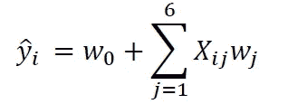
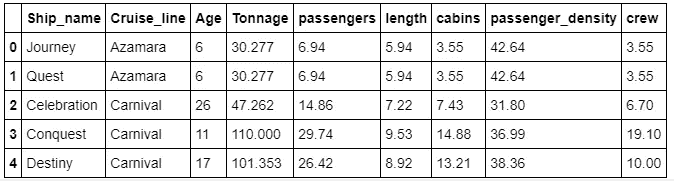
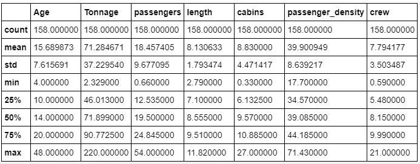
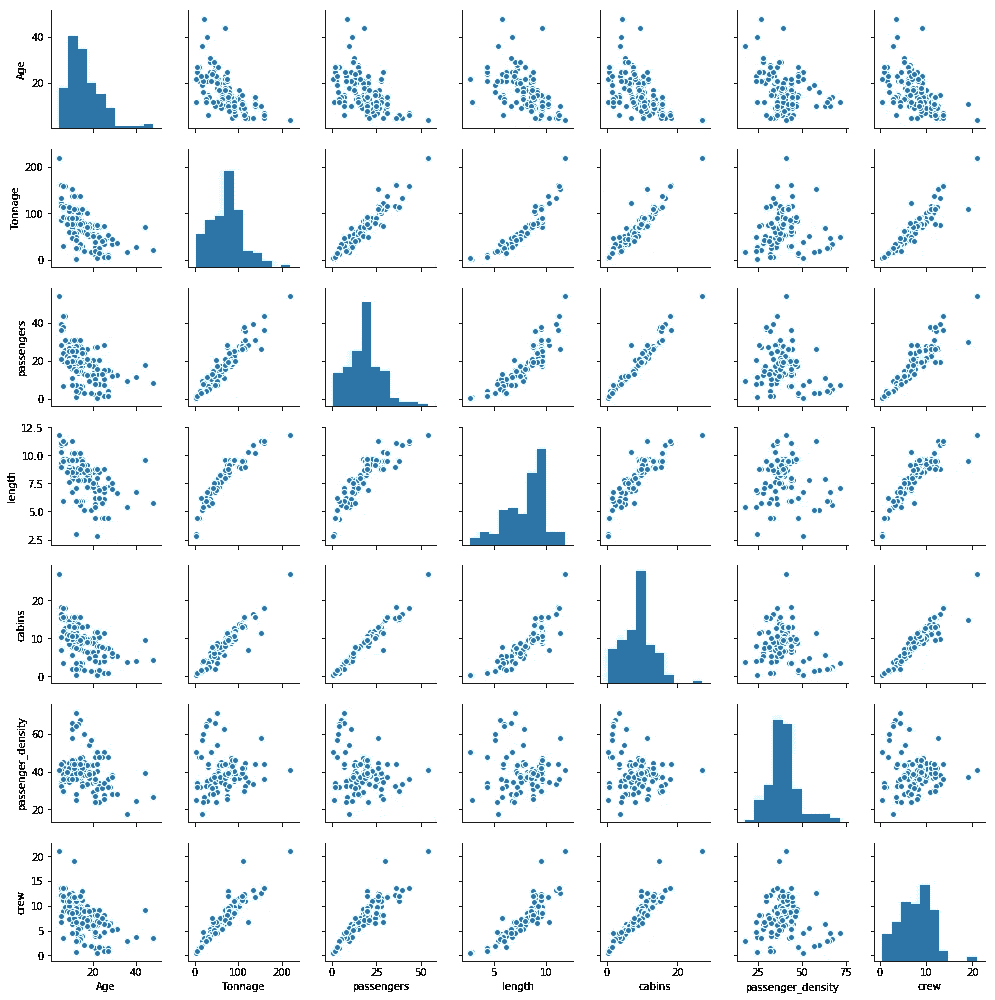

# 使用协方差矩阵图的特征选择和降维

> 原文：<https://pub.towardsai.net/feature-selection-and-dimensionality-reduction-using-covariance-matrix-plot-b4c7498abd07?source=collection_archive---------0----------------------->

## [机器学习](https://towardsai.net/p/category/machine-learning)


本文将讨论如何将协方差矩阵图用于特征选择和降维。

## **为什么特征选择和降维很重要？**

机器学习算法(如分类、聚类或回归)使用训练数据集来确定权重因子，这些权重因子可应用于未知数据以实现预测目的。在实现机器学习算法之前，有必要在训练数据集中仅选择相关特征。转换数据集以便只选择训练所需的相关特征的过程称为降维。特征选择和维数减少是重要的，因为有三个主要原因:

1.  **防止过度拟合**:拥有太多特征的高维数据集有时会导致过度拟合(模型捕捉真实和随机效果)。
2.  **简单性**:具有太多特征的过于复杂的模型可能很难解释，尤其是当特征相互关联的时候。
3.  **计算效率**:在低维数据集上训练的模型在计算上是高效的(算法的执行需要较少的计算时间)。

因此，降维在数据预处理中起着至关重要的作用。

我们将使用游轮数据集[**cruise _ ship _ info . CSV**](https://github.com/bot13956/ML_Model_for_Predicting_Ships_Crew_Size)用协方差矩阵图来说明特征选择和降维的过程。假设我们要建立一个回归模型来预测邮轮**的船员人数**，基于以下特征:【’**年龄**’、**吨位**’、**乘客**、**长度**、**舱室**、**乘客 _ 密度**。我们的模型可以表示为:



其中 **X** 为特征矩阵， **w** 为训练时需要学习的权重。我们要解决的问题如下:

在 6 个特征[' **年龄**'、**吨位**'、**乘客**'、**长度**'、**车厢**'、**乘客 _ 密度** ]中，哪一个最重要？

我们将确定训练模型需要哪些特征。

本文的数据集和 jupyter 笔记本文件可以从这个存储库下载:[https://github . com/bot 13956/ML _ Model _ for _ Predicting _ Ships _ Crew _ Size](https://github.com/bot13956/ML_Model_for_Predicting_Ships_Crew_Size)。

## 1.导入必要的库

```
**import** **numpy** **as** **np** 
**import** **pandas** **as** **pd** 
**import** **matplotlib.pyplot** **as** **plt** 
**import** **seaborn** **as** **sns**
```

## 2.读取数据集并显示列

```
df=pd.read_csv("cruise_ship_info.csv")
df.head()
```



## 3.计算数据的基本统计

```
df.describe()
```



## 4.生成配对图

```
cols = ['Age', 'Tonnage', 'passengers', 'length', 'cabins','passenger_density','crew']sns.pairplot(df[cols], size=2.0)
```



我们从配对图中观察到，目标变量'**乘务人员**'与 4 个预测变量有很好的相关性，即'**吨位**'、**乘客**'、**长度**'和'**客舱**'。

为了量化相关程度，我们计算协方差矩阵。

## **5。预测“团队”规模的变量选择**

## **5 (a)协方差矩阵的计算**

```
cols = ['Age', 'Tonnage', 'passengers', 'length', 'cabins','passenger_density','crew'] **from** **sklearn.preprocessing** **import** StandardScaler 
stdsc = StandardScaler() 
X_std = stdsc.fit_transform(df[cols].iloc[:,range(0,7)].values)cov_mat =np.cov(X_std.T)
plt.figure(figsize=(10,10))
sns.set(font_scale=1.5)
hm = sns.heatmap(cov_mat,
                 cbar=True,
                 annot=True,
                 square=True,
                 fmt='.2f',
                 annot_kws={'size': 12},
                 cmap='coolwarm',                 
                 yticklabels=cols,
                 xticklabels=cols)
plt.title('Covariance matrix showing correlation coefficients', size = 18)
plt.tight_layout()
plt.show()
```


## **5 (b)选择重要变量(列)**

从上面的协方差矩阵图中，如果我们假设重要特征具有 0.6 或更大的相关系数，那么我们看到"**船员**变量与 4 个预测变量强烈相关:"**吨位**"、"**乘客**"、"**长度**和"**客舱**"。

```
cols_selected = ['Tonnage', 'passengers', 'length', 'cabins','crew']

df[cols_selected].head()
```


总之，我们已经展示了协方差矩阵如何用于变量选择和维度缩减。我们已经将原始维度从 6 减少到 4。

其他高级的特征选择和降维方法有**主成分分析**(PCA)**线性判别分析**(LDA)**套索回归**、**岭回归**。点击以下链接了解更多信息:

[**在特征高度相关的数据集上训练机器学习模型**](https://medium.com/towards-artificial-intelligence/training-a-machine-learning-model-on-a-dataset-with-highly-correlated-features-debddf5b2e34)

[**机器学习:通过主成分分析进行降维**](https://medium.com/towards-artificial-intelligence/machine-learning-dimensionality-reduction-via-principal-component-analysis-1bdc77462831)

[**机器学习:通过线性判别分析进行降维**](https://medium.com/towards-artificial-intelligence/machine-learning-dimensionality-reduction-via-linear-discriminant-analysis-cc96b49d2757)

[**从零开始构建机器学习推荐模型**](https://medium.com/towards-artificial-intelligence/machine-learning-model-for-recommending-the-crew-size-for-cruise-ship-buyers-6dd478ad9900)