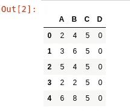
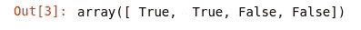
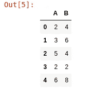
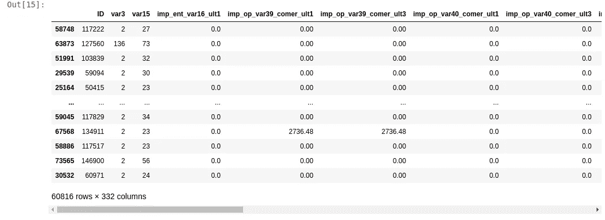
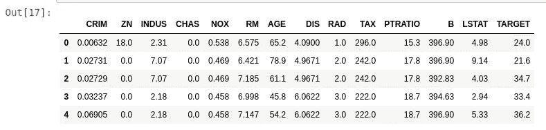
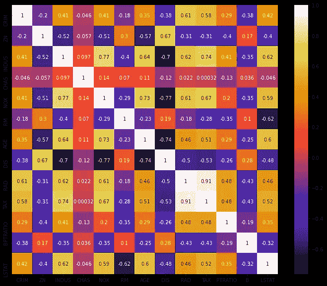
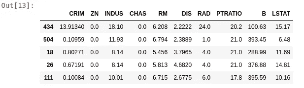

# 实用的特征选择方法

> 原文：<https://pub.towardsai.net/feature-selection-with-practical-approach-13ea32b7a46f?source=collection_archive---------2----------------------->

## [数据科学](https://towardsai.net/p/category/data-science)，[机器学习](https://towardsai.net/p/category/machine-learning)

## 了解用于以最实用的方式从数据集中选择重要要素的要素选择技术。


> 在本文中，我们将使用最实用的方法中的各种技术对数据集进行特征选择。

**特性选择**是任何数据科学项目生命周期的关键步骤之一。有许多文章从理论上描述了可用于特征选择的技术，但是缺乏实用的方法。在这里，我们将直接处理代码，看看它实际上是如何工作的。我将尝试提供初学者友好的代码片段的高级描述。

## 什么是特征选择？

当我们训练我们的机器学习模型时，并不是所有的特征都有同等的贡献。有些功能非常重要，有些甚至对训练毫无帮助。因此，我们应该从数据集中移除这些类型的要素。因此，**特征选择**是移除或减少输入特征/变量的过程，这反过来降低了**复杂性**，使得训练过程**更快**，并且还增加了模型的**准确性**。

有许多技术可用于特征选择，但是我们将只讨论著名的和重要的技术。这些技术是:-

*   方差阈值
*   相互关系
*   卡方检验
*   信息增益

**注意:-在本文中，我们将只讨论前两个，其余两个将在第二部分讨论。**

## 资料组

在本教程中，我们使用了来自 **Kaggle** 的"*桑坦德银行客户满意度*"数据集，该数据集也可在 [**GitHub**](https://github.com/PushkaraSharma/articles_codes/tree/master/Feature_Selection_with_Practical_Approach) 上获得。与此同时，使用的其他数据集可以通过描述的代码片段直接获得。

## 先决条件:

我假设你熟悉 ***python*** 并且已经在你的系统中安装了 ***python 3*** 。这个教程我用了一个 ***jupyter 笔记本*** 。你可以使用你喜欢的 **IDE** 。所有需要的库都内置在 ***anaconda*** 套件中。

# 让我们编码

这里，我们将讨论两种技术，即**方差阈值**和**相关性**。

# 使用方差阈值移除恒定要素

我们应该从数据集中移除的第一个要素是常量要素。手动执行似乎很容易，但假设您有**200**–**300**特征。在这种情况下，使用一些技巧是有意义的。

首先，让我们导入所有需要的库。`Pandas`用于创建和操作数据集。`VarianceThreshold`用于去除方差较小的特征。**方差**只是对**可变性**的一种度量。 **0** 方差意味着所有值都相同/不变。`Train_test_split`用于为训练和测试目的拆分数据。

```
import pandas as pd
from sklearn.feature_selection import VarianceThreshold
from sklearn.model_selection import train_test_split
```

这里，我们刚刚创建了一个虚拟的**数据框**，以便于理解该特征选择。我们可以看到列 **C** 和 **D** 具有常量值，因此它们应该被删除。

```
df = pd.DataFrame({"A":[2,3,5,2,6],
                  "B":[4,6,4,2,8],
                  "C":[5,5,5,5,5],
                  "D":[0,0,0,0,0]})
df
```



现在，我们已经初始化了 VarianceThreshold 的对象`var`，阈值为 **0** (常量)。我们可以根据需要改变这一点。然后，我们打印了布尔数组，其中`true`和`false` 分别代表非常数和常数特性。

```
var = VarianceThreshold(threshold=0.0)
var.fit(df)
var.get_support()
```



我们使用了列表理解，循环遍历所有列，并将常量特性插入到名为`constant_features`的列表中。最后，我们从数据集中删除了常量要素。

```
constant_features = [i for i in df.columns
                    if i not in df.columns[var.get_support()]]
print(constant_features)
df.drop(constant_features,axis=1)
```



前面的例子可能看起来太简单了，很容易被发现。但是在现实世界的场景中，将会有 **100** 或 **1000** 的特性。这种技术在这些情况下会有所帮助。让我们用更大更真实的数据集来看看同样的情况。

这里，我们已经加载了 GitHub 上的数据集。数据集由 **371** 个特征组成。

```
df = pd.read_csv("train.csv")
print(df.shape)
```

这里， **X** 代表输入变量， **Y** 代表目标变量。我们应该始终将任何特征选择技术应用于训练集，以避免任何类型的**过度拟合**。这就是我们将数据集分为训练和测试的原因。之后的过程和上面解释的一样。在这里，371–332 =**39**特征是不变的。因此，我们从训练集和测试集中删除了这些特性。

```
X = df.drop(labels=['TARGET'],axis=1)
Y = df['TARGET']
x_train,x_test,y_train,y_test = train_test_split(X,Y,test_size = 0.2)
var = VarianceThreshold(threshold=0.0)
var.fit(x_train)
sum(var.get_support())constant_features = [i for i in x_train
                    if i not in x_train.columns[var.get_support()]]
x_train.drop(constant_features,axis=1)
```



# 使用皮尔逊相关移除相似特征

一些特征彼此之间呈线性关系，即当变量 2 增加 **3** 倍时，变量 1 增加 **2** 倍。所以这两个特征是高度相关的。因此，我们可以删除其中一个，我们的模型仍然不会丢失任何重要信息。

这里，我们为示例导入了`boston`数据集。`seaborn`将用于绘制交互图形。其他库已经讨论过了。

```
from sklearn.datasets import load_boston
import pandas as pd
from sklearn.model_selection import train_test_split
import seaborn as sns
```

现在，我们已经创建了加载数据集的`pandas`数据帧，并添加了目标变量作为`TARGET`列。

```
dataset = load_boston()
df = pd.DataFrame(dataset.data,columns = dataset.feature_names)
df['TARGET'] = dataset.target
df.head()
```



这与前面的技术步骤相似，我们将输入变量声明为 **X** ，将目标变量声明为 **Y** 。需要分割数据，因为我们只对训练集执行特征选择部分，以避免任何类型的过拟合。`x_train`的形状是(404，13)`x_test`的形状是(102，13)。

```
X = df.drop('TARGET',axis=1)
Y = df['TARGET']
x_train,x_test,y_train,y_test = train_test_split(X,Y,test_size=0.2)
x_train.shape , x_test.shape
```

这里，我们给出了一个固定大小的图，然后在`x_train`上调用`corr()`函数，但是如果我们只打印`correlation`变量，那么将很难解释。因此，在`seaborn`的帮助下，我们绘制了**热图**，清楚地显示了特征之间的相关性。

```
plt.figure(figsize=(12,10))
correlation = x_train.corr()
sns.heatmap(correlation,annot=True,cmap=plt.cm.CMRmap)
```



之后，我们声明了以**数据集**和**阈值**为参数的函数`find_correlated_features`。在函数中，我们迭代了相关矩阵的每个值，如果相关值高于给定的阈值，则将列名添加到名为`col_corr`的集合中。

```
def find_correlated_features(data,threshold):
    col_corr = set()
    corr_metrix = data.corr()
    for i in range(len(corr_metrix.columns)):
        for j in range(i):
            if((corr_metrix.iloc[i,j])>threshold):
                column_name = corr_metrix.columns[i]
                col_corr.add(column_name)
    return col_corr
```

现在，我们刚刚使用`x_train`作为数据和 threshold = **0.7** 调用了上面的函数，以获得我们可以丢弃的相关特征。在我们的例子中，这些特征是{ **年龄**，**氮氧化物**，**税收** }。删除这些特征后，我们的数据集特征从 **13** 减少到 **10** 。

当要素数量过多而导致热图无助于解释时，定义上述函数将有助于我们。

```
corelated_features = find_correlated_features(x_train,0.7)
print(corelated_features)
x_train = x_train.drop(corelated_features,axis=1)
x_train.head()
```



我希望你理解这两个**特征选择**的技巧。如果你有任何疑问，请随时评论，我会尽快回复。

其他两种技术将很快介绍。

源代码在 [**GitHub**](https://github.com/PushkaraSharma/articles_codes/tree/master/Feature_Selection_with_Practical_Approach) 上有。请随意改进。

谢谢你宝贵的时间。😊我希望你喜欢这个教程。

另外，查看我关于[**利用机器学习**](https://medium.com/towards-artificial-intelligence/classify-plant-leaf-diseases-using-machine-learning-4747dc1eb43d) 对植物叶部病害进行分类的文章

[](https://medium.com/towards-artificial-intelligence/logistic-regression-from-scratch-with-only-python-code-9d3ae607e739) [## 仅使用 Python 代码从零开始进行逻辑回归

### 仅使用 Python 对多要素数据集应用逻辑回归。分步实现编码示例…

medium.com](https://medium.com/towards-artificial-intelligence/logistic-regression-from-scratch-with-only-python-code-9d3ae607e739) [](https://medium.com/towards-artificial-intelligence/gradient-descent-v-s-normal-equation-for-regression-problems-e6c3cdd705f) [## 回归问题的梯度下降 v/s 正规方程

### 选择正确的算法来找到使成本函数最小的参数。

medium.com](https://medium.com/towards-artificial-intelligence/gradient-descent-v-s-normal-equation-for-regression-problems-e6c3cdd705f)