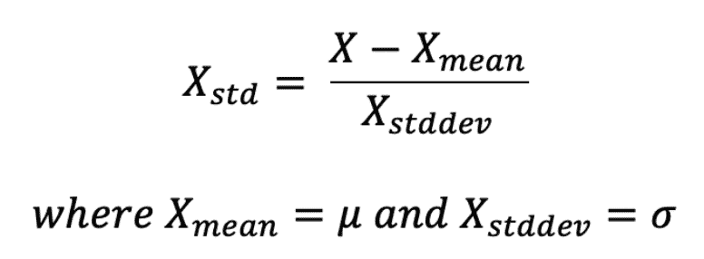
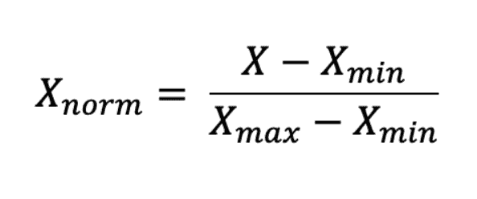
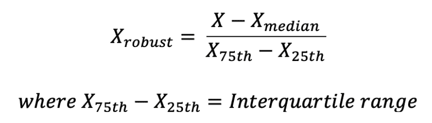
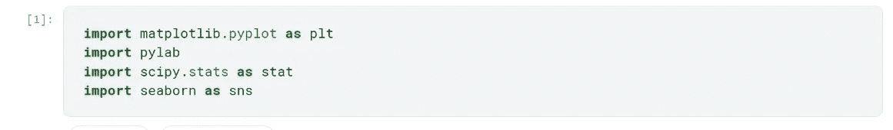
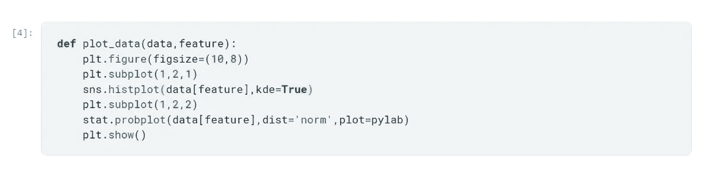
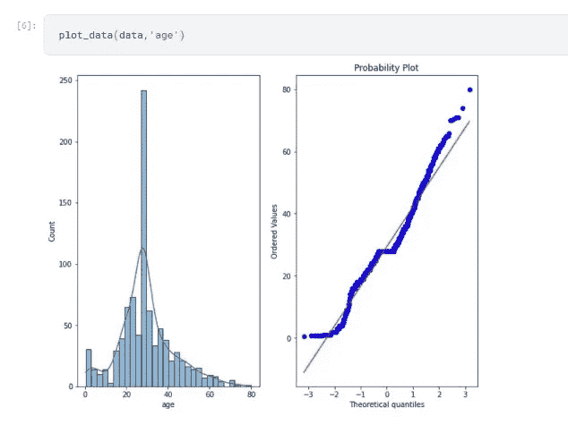
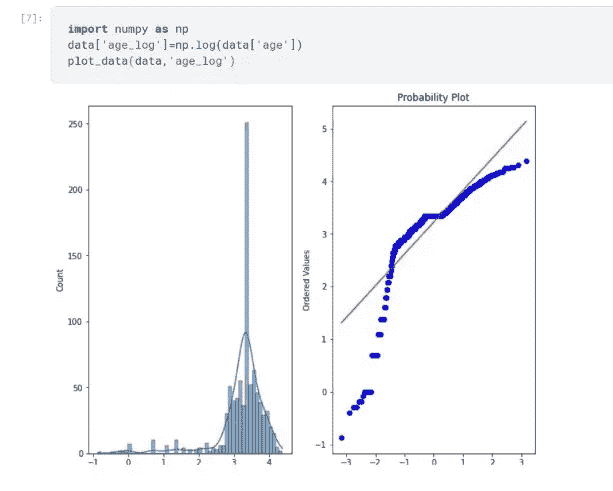
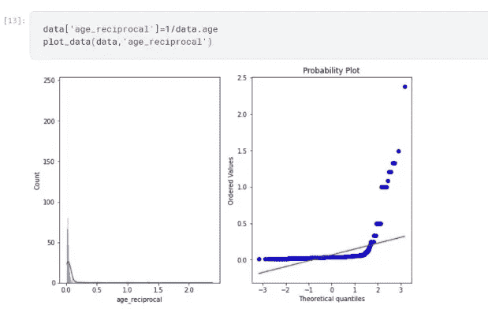
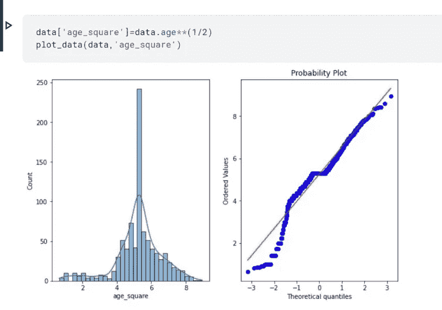
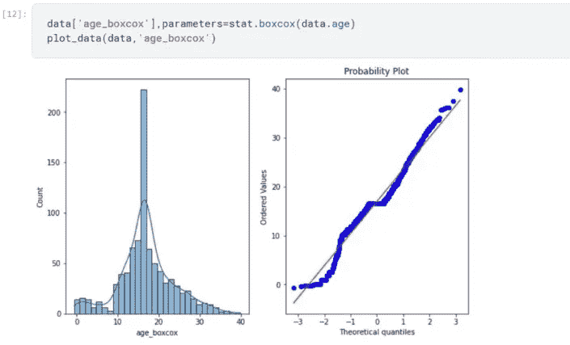

# 特征转换

> 原文：<https://pub.towardsai.net/feature-transformation-3306c7ac9dd5?source=collection_archive---------0----------------------->

## **根据数据，何时使用哪个特征转换。**

机器学习模型的生命周期可以分为以下几个步骤。

1.  数据收集
2.  数据预处理
3.  特征工程
4.  特征选择
5.  模型结构
6.  超参数调谐
7.  模型部署

为了建立一个模型，我们必须预处理数据。特征转换是这一过程中最重要的任务之一。在数据集中，大部分时间都会有不同量级的数据。因此，为了使我们的预测更好，我们必须将不同的特征缩小到相同的震级范围或一些特定的数据分布。因为大多数算法将给予具有高容量的特征更多的重要性，而不是给予所有特征相同的重要性。这将导致错误的预测和错误的模型，我们不希望这样。

# **何时使用特征变换**

1.  在 K-最近邻、SVM 和 K-均值等基于距离的算法中，它们会赋予值大的要素更大的权重，因为距离是通过数据点的值计算的，以找出它们之间的相似性。如果我们给算法输入未缩放的特征，预测将会受到严重影响。
2.  因为我们缩小了功能，所以计算的范围也将缩小，花费在计算上的时间也将减少。因此模型训练更快。
3.  在基于梯度下降优化的线性回归和逻辑回归等算法中，特征缩放变得至关重要，因为如果我们输入不同大小的数据，将很难收敛到全局最小值。对于相同范围的值，算法学习的负担变得更小。

# **何时不使用特征变换**

大多数集成方法不需要特征缩放，因为即使我们执行特征变换，分布的深度也不会改变太多。所以在这样的算法中，除非特别需要，否则不需要缩放。

## 特征变换的方法有很多种，我们将讨论最有用和最流行的方法。

1.  标准化
2.  最小-最大缩放/标准化
3.  鲁棒定标器
4.  对数变换
5.  相互转化
6.  平方根平移
7.  博克斯-考克斯变换
8.  约翰逊变换

# **1。标准化**

当输入数据集的要素在范围之间存在较大差异，或者使用不同的测量单位(如身高、体重、米、英里等)进行测量时，应使用标准化。

我们将所有的变量或特征放在一个相似的尺度上。其中平均值为 0，标准偏差为 1。

在标准化中，我们用平均值减去特征值，然后除以标准偏差，这就精确地给出了标准正态分布。

# **2。最小—最大缩放/标准化**

简单来说，最小-最大缩放将特征值降低到 0 到 1 的范围内。直到我们指定了我们想要缩小的范围。

在归一化中，我们将特征值减去其最小值，然后除以特征的范围(特征的范围=特征的最大值-特征的最小值)。

# **3。鲁棒定标器**

如果数据集有太多的异常值，标准化和规范化都很难实现，在这种情况下，您可以使用鲁棒的缩放器进行要素缩放。

你也可以说鲁棒定标器对异常值是鲁棒的😂。

它使用中位数和四分位数范围来缩放值，因此不会受到非常大或非常小的要素值的影响。

鲁棒缩放器通过中值减去特征值，然后除以其 IQR。

*   第 25 个百分位数=第 1 个四分位数
*   第 50 百分位=第二个四分位(也称为中位数)
*   第 75 个百分位数=第 3 个四分位数
*   第 100 个百分位数=第 4 个四分位数(也称为最大值)
*   IQR=四分位数间距
*   IQR=第三个四分位数—第一个四分位数

# 4.高斯变换

一些机器学习算法，如线性和逻辑回归，假设我们提供给它们的数据是正态分布的。如果数据是正态分布的，这种算法往往表现更好，并给出更高的准确性。标准化一个偏斜的分布在这里成为一个重要的部分。

但大多数情况下，数据会有偏差，因此您必须使用以下算法将其转换为高斯分布，在选择方法之前，您可能需要尝试几种方法，因为不同的数据集往往有不同的要求，我们无法让一种方法适用于所有数据。

在本文的其余部分，我们将使用这个函数来绘制数据。我将只使用 titanic 数据集中的年龄特征来绘制直方图和 QQ 图。

图表下方是特征缩放前的年龄特征

# A.对数变换

在对数变换中，我们将使用 NumPy 对所有要素值应用 log，并将其存储在新要素中。

使用对数变换似乎不太适合这个数据集，它甚至会使数据向左倾斜，从而恶化分布。所以我们不得不依靠其他方法来实现正态分布。

# B.相互转化

在倒数变换中，我们将一个特性的每个值除以 1(倒数)，并将其存储在新特性中。

倒数变换不适用于这种数据，它不能给出正态分布，反而使数据更加右偏。

# C.平方根平移

在平方根变换中，我们将特征值提升到分数的幂(1/2)以获得某个值的平方根。我们也可以使用 NumPy 进行这种转换。

对于这种数据，平方根转换似乎比倒数和对数转换执行得更好，但它有点向左倾斜。

# D.博克斯-考克斯变换

Box-Cox 变换是将数据分布转换为正态分布的最有用的缩放技术之一。

Box-Cox 变换可以定义为:

t(Y)=(Y exp(λ)-1)/λ

其中 Y 是响应变量，λ是转换参数。λ从-5 到 5 不等。在变换中，考虑λ的所有值，并选择给定变量的最佳值。

我们可以使用来自 SciPy 模块的统计数据来计算 box cox 变换。

到目前为止，box cox 变换似乎是最适合年龄特征的变换。

# 结论

还有其他方法可以用来获得高斯分布，但大多数情况下，这些方法中的一种似乎很适合数据集。