# 特征变换和缩放技术

> 原文：<https://pub.towardsai.net/feature-transformation-and-scaling-techniques-f9645cb538e?source=collection_archive---------1----------------------->

## [机器学习](https://towardsai.net/p/category/machine-learning)

## 提高机器学习模型性能的 9 种方法


由[苏珊·威廉姆斯](https://unsplash.com/@scw1217?utm_source=medium&utm_medium=referral)在 [Unsplash](https://unsplash.com?utm_source=medium&utm_medium=referral) 上拍摄的照片

特征变换只是将特征从一种表示形式变换到另一种表示形式的函数。要素缩放是一种转换同一范围内要素的所有值的技术。比如 0 比 1。

**为什么特性转换是必要的？？**

有时，我们的数据集中不同的列有不同的单位，比如一列可以用千米表示，而另一列可以用米或厘米表示。或者在相同的场景中，我们有一个年龄列，范围从 0 到 1000，另一方面，我们有一个薪水列，所有值都大于 10，000。那么在这样的场景下，这些值之间的差异就变得非常大。由于这种差异，**值越大的列对输出的影响越大。**因此，我们需要执行特征缩放和变换，以使所有值位于相同的范围内。

在这篇博客中，我们将讨论 9 种功能缩放和转换技术。

1.  最小最大缩放器
2.  标准缩放器
3.  MaxAbsScaler
4.  鲁棒定标器
5.  分位数变压器定标器
6.  对数变换
7.  电力变压器定标器
8.  单位向量缩放器/规格化器

让我们从使用 pandas 创建一个更简单的数据框开始

```
### TO REMOVE UNECESSARY WARNINGS #####
import warnings
warnings.filterwarnings('ignore')import numpy as np
import matplotlib.pyplot as plt
import pandas as pd%matplotlib inlinedf = pd.DataFrame({
    'salary':[18000,20000,10000,2600,23000],
    'age':[23,24,20,18,28],
    'department':['HR','Marketing','Development','Managment','Legal']
})
df.head()
```

## 1️⃣最小最大缩放器

最小最大缩放器是理解和实现起来比较简单的缩放器之一。它缩小 0 到 1 之间的所有值。列中的最大值被赋予值 1，列中的最小值被赋予值 0，除此之外的所有值被赋予 0 到 1 之间的值。

**公式:**

## ***x _ scaled =(x—x _ min)/(x _ max—x _ min)***

x_scaled =缩放后的 col 值
x =原始值
x_min =列中的最小值
x_max =列中的最大值

```
**### Defining Scaler ###**
from sklearn.preprocessing import MinMaxScaler
scaler = MinMaxScaler()**#### MinMax Scaling ###** col_names = ['salary', 'age']
features = df[col_names]
features[col_names] = scaler.fit_transform(features.values)
features
```

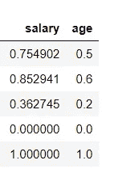

最小最大缩放器将缩小 0 到 1 之间的所有值。如果我们想在自定义范围内缩小数值，那么我们可以使用 **feature_range** 定义我们自己的范围。

```
### Defining Scaler ###
from sklearn.preprocessing import **MinMaxScaler**
**scaler = MinMaxScaler(feature_range=(2,4)) ##Custom Scaling Range**#### MinMax Scaling ###
col_names = ['salary', 'age']
features = df[col_names]
features[col_names] = scaler.fit_transform(features.values)
features
```

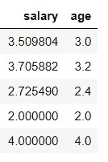

## 2️⃣标准标尺

标准定标器也是最常用和最容易理解的定标器之一。它不是在 0 到 1 之间缩放值，而是以均值为 0、方差为 1 的方式缩放值。

公式:-

## **x_scaled = x —平均值/标准差**

标准定标器假设变量的分布是正态的。因此在变量不是正态分布的情况下，

1.  或者，选择不同的缩放器
2.  或者首先，将变量转换为正态分布，然后应用 scaler。

```
from sklearn.preprocessing import **StandardScaler**
scaler = StandardScaler()col_names = ['salary', 'age']
features = df[col_names]
features[col_names] = scaler.fit_transform(features.values)
features
```

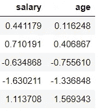

## 3️⃣马克斯布斯卡勒

这个缩放器的工作原理与其他两个没有什么不同。它取每列的绝对最大值，然后用该值除以该列中的每个值。这是一个分三步走的过程。

1.  获取列中每个值的绝对值。
2.  求该列的最大值。
3.  将最大值除以列中的每个值。

让我们在上面创建的数据框中再添加一列。

```
features = df[['salary','age']]
features['balance'] = [100.0, 25245.567, 134.567, 4567.2345,2345.345]
```

我们可以使用两个过程来衡量这些值。

```
**🔰 Using Sklearn Library** from sklearn.preprocessing import **MaxAbsScaler**
scaler = MaxAbsScaler()
col_names = ['salary','age','balance']
features[col_names] = scaler.fit_transform(features.values)
print(features.balance)🔰 **Using Custom Code**values = [100.0, 25245.567, 134.567, 4567.2345,2345.345]
abs_values = [abs(ele) for ele in values]
max_val = max(abs_values)
val = [ele/max_val for ele in abs_values]
val
```

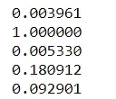

平衡栏->使用 Sklearn |自定义代码

现在我们已经看到了三个定标器，但是它们都使用列的最大值或最小值来定标数据。这些值对异常值很敏感，如果数据集中有许多异常值，那么这些值很容易受到异常值的影响。鲁棒定标器是一种对异常值 ***不敏感的定标器。***

## 4️⃣鲁棒定标器

鲁棒定标器的关键特性和优势之一是它对异常值不敏感。它使用 IQR(四分位数间距)来缩放数据。

1.  它从数据中去除了中间值。
2.  并且，使用 IQR 缩放数据

**公式:**

IQR = Q3-Q1

X_scaled = (X-Q1)/(Q3-Q1)

```
from sklearn.preprocessing import **RobustScaler**
scaler = RobustScaler()col_names = ['salary', 'age']
features = df[col_names]
features[col] = scaler.fit_transform(features.values)
features
```

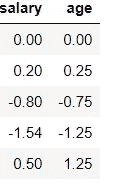

## 5️⃣分位数变压器定标器

这种技术就像一种神奇的结合。它将数据的分布转换为正态分布，并相应地进行缩放。因为它使变量呈正态分布，所以它也处理异常值。

✔异常值剔除
✔标度数据
✔转换成正态分布

**流程**

1.  首先，它计算变量的累积分布函数
2.  然后，它使用该 CDF 将值映射到正态分布
3.  最后，它使用相关联的分位数函数将获得的值映射到期望的输出分布

```
from sklearn.preprocessing import **QuantileTransformer**
scaler = QuantileTransformer()col_names = ['salary', 'age']
features = df[col_names]
features[col_names] = scaler.fit_transform(features.values)
features
```

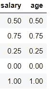

## 6️⃣对数变换

**用于将偏态分布转换为正态分布或不偏态分布。**在这种技术中，我们取列的值的对数，并将它们作为一列。

让我们用一些倾斜的数据条目再次添加 balance 列。

```
features = df2[['salary','age']]
features['balance'] = [15000, 1800, 120000, 10000,12000]
features.balance.hist()
```

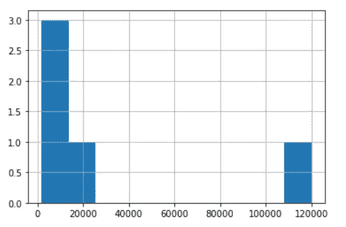

左偏数据

现在让我们使用日志转换器进行缩放。

```
import numpy as np
features['balance'] = np.log(features['balance'])
print(features.balance)
features.balance.hist(bins=5)
```

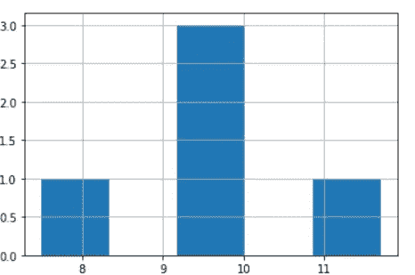

正态分布数据

上图显示了如何将对数转换分布转换为正态分布。

## 7️⃣电力变压器定标器

它还将变量的分布更改为更接近高斯(正态)的分布。有两种类型。

1.  [Box-Cox 变换](https://www.statisticshowto.com/box-cox-transformation/)
2.  [杨-约翰逊变换](https://www.stat.umn.edu/arc/yjpower.pdf)

```
from sklearn.preprocessing import **PowerTransformer**
scaler = **PowerTransformer(method = 'box-cox')**'''
parameters:
method = 'box-cox' or 'yeo-johnson'
'''col_names = ['salary', 'age']
features = df[col_names]
features[col] = scaler.fit_transform(features.values)
features
```

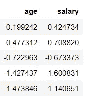

博克斯-考克斯变换

## 8️⃣单位向量定标器/规格化器

它和其他的不一样。它作用于数据框的每一行，而不是列。在这里，我们有两个规范 l1 和 l2。

*   如果我们使用的是 L1 范数，那么每一列中的值都会被转换，这样它们在这一行中的绝对值之和就是 1。
*   如果我们使用 L2 范数，那么每一列中的值首先被平方并相加，使得它们沿着行的绝对值之和是 1。

```
from sklearn.preprocessing import Normalizer
scaler = **Normalizer(norm='l2')**# norm = 'l2' is defaultcol_names = ['salary', 'age']
features = df[col_names]
features[col] = scaler.fit_transform(features.values)
features
```

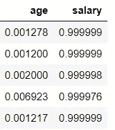

现在，如果我们将前两列相加，那么总和大约为 1。

```
features['sum']=abs(features['age'])+abs(features['salary'])
features
```

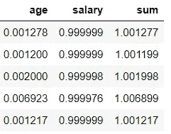

## 9️⃣定制变压器

考虑这样一种情况，您有自己的 python 函数来转换数据。Sklearn 提供了使用 FunctionTransformer 对数据应用您自己的函数的能力。

让我们使用一个更简单的函数，我们需要取该列中所有值的 log2。

```
from sklearn.preprocessing import FunctionTransformer
transformer  = FunctionTransformer(np.log2,validate=True)col_names = ['salary', 'age']
features = df[col_names]
features[col] = transformer.fit_transform(features.values)
features
```

[***笔记本& Github 链接***](https://github.com/Abhayparashar31/feature-engineering/blob/main/Feature%20Transformation%20Methods%20.ipynb)

## 额外小费

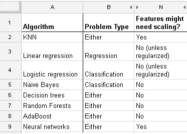

[来源](https://i.stack.imgur.com/kRbSk.png)

## -:推荐读物🚀:-

[处理机器学习中的异常值](https://medium.com/towards-artificial-intelligence/handling-outliers-in-machine-learning-f842d8f4c1dc)

[不同的特征选择技术](https://medium.com/towards-artificial-intelligence/different-feature-selection-techniques-f47ec43f71b8)

[处理分类值的不同方法](https://medium.com/towards-artificial-intelligence/different-approaches-to-handle-categorical-values-a2e35fbd6128)

[机器学习中处理缺失值的 9 种方法](https://medium.com/towards-artificial-intelligence/9-ways-to-handle-missing-values-in-machine-learning-1bbda345699a)

> ***感谢阅读😃，更多请跟我来*** [***这里***](https://parasharabhay13.medium.com/) ***👈***