# 图像中的特征[第一部分]

> 原文：<https://pub.towardsai.net/features-in-image-part-1-521eaec6b65a?source=collection_archive---------2----------------------->

## 使用 Monk，低代码深度学习工具和计算机视觉的统一包装器，使计算机视觉变得简单。

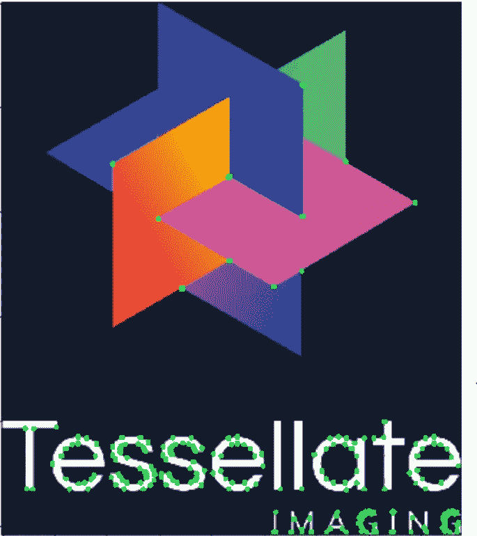

# 目录

1.  **图像特征**
2.  **以边角为特征**
3.  **使用 OpenCV 和 PIL 进行特征提取和可视化**
4.  **特征匹配**
5.  **图像拼接**

# **图像特征**

> 什么是图像特征？

> 特征

*   描述一幅图像
*   指出图像中的相关信息。
*   将一组图像与其他图像区分开来。

> 类型

*   全局:作为一个整体的图像。
*   局部:用于图像内部的区域。

> 形式定义

在计算机视觉和图像处理中，特征是与解决与特定应用相关的计算任务相关的一条信息。

*   所有的机器学习和深度学习算法都依赖于特征。

> 什么可以成为特色？

*   单独的像素强度不能成为特征。

> 特征

*   全局强度测量-平均值、直方图、调色板等。
*   边缘和脊-梯度和轮廓。
*   兴趣点-角落，独特的曲率。
*   斑点和纹理
*   过滤器的特征

例子

1.  强度

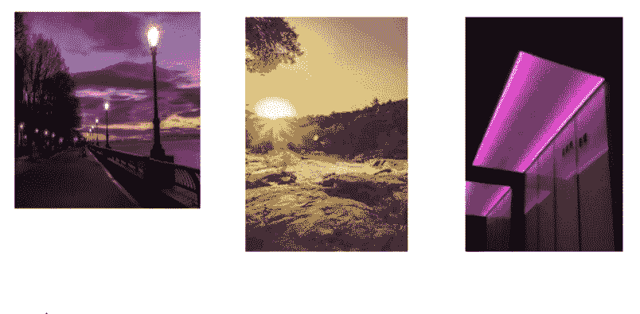

作为特征分组的强度

2.优势

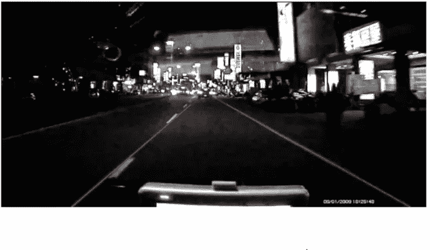

边缘作为特征

3.关键点

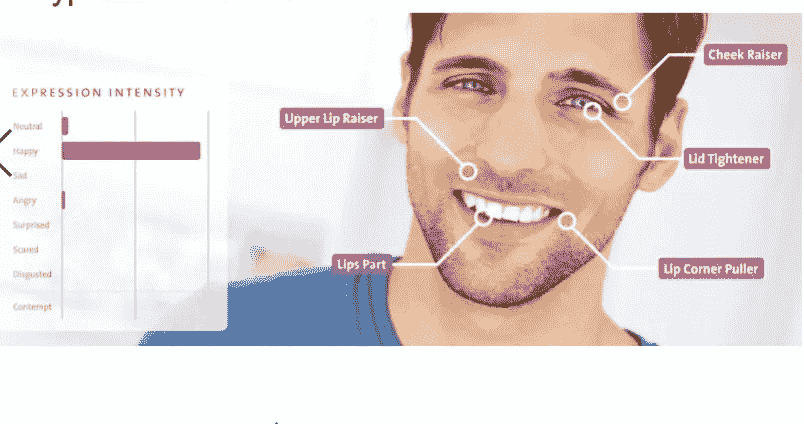

关键点作为特征

> 什么是好的特性？

*   如果特性没有受到外部因素的太大影响，则被认为是好的。

> 特征不变性

*   规模
*   旋转
*   翻译
*   远景
*   姻亲
*   颜色
*   照明

# **角点作为特征**

*   角-定义为两条边的交点。
*   关键点——图像中具有明确定义的位置并且可以被鲁棒地检测到的点。

> 用于

*   运动检测和视频跟踪。
*   图像注册。
*   图像拼接和全景拼接。
*   三维建模和物体识别。

例子

1.  关键点

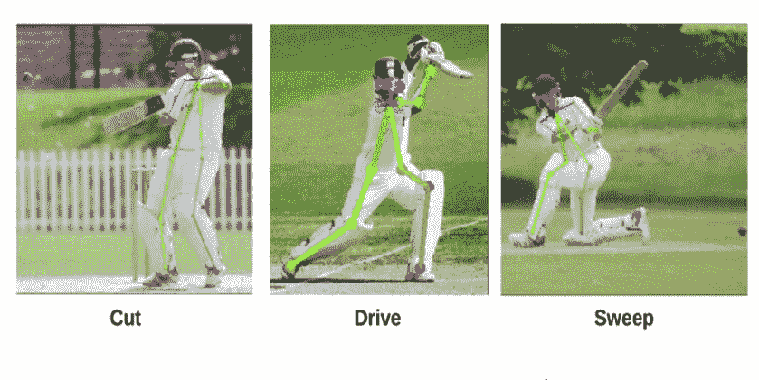

关键点检测

2.困境

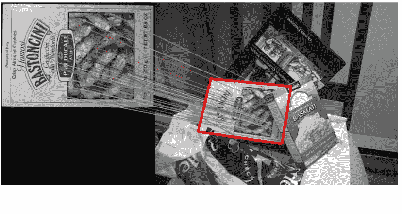

角点检测

> 哈里斯角点检测

> Harris 角点检测算法可以分为五个步骤。

*   彩色到灰度。
*   空间导数计算。
*   结构张量设置。
*   哈里斯反应计算。
*   非最大抑制。

> 利用 OpenCV 进行 Harris 角点检测

```
'''
Harris Corners using OpenCV
'''%matplotlib inline
import numpy as np
import cv2
from matplotlib import pyplot as pltimg = cv2.imread("imgs/chapter9/chess_slant.jpg", 1)
#img = cv2.resize(img, (96, 96))
gray = cv2.cvtColor(img,cv2.COLOR_BGR2GRAY)
gray = np.float32(gray)################################FOCUS###############################
dst = cv2.cornerHarris(gray,2,3,0.04)##################################################################### Self-study: Parametersplt.figure(figsize=(8, 8))
plt.imshow(dst, cmap="gray")
plt.show()
```

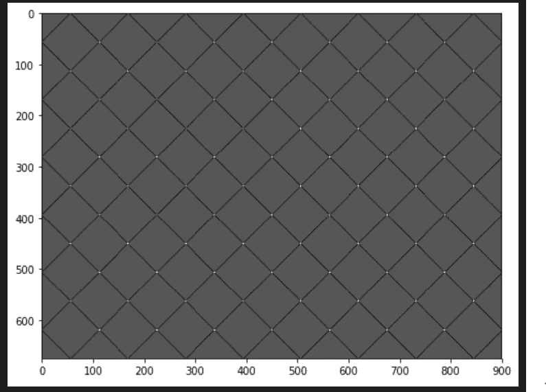

```
'''
result is dilated for marking the corners
'''dst = cv2.dilate(dst,None)
plt.figure(figsize=(8, 8))
plt.imshow(dst, cmap="gray")
plt.show()
```

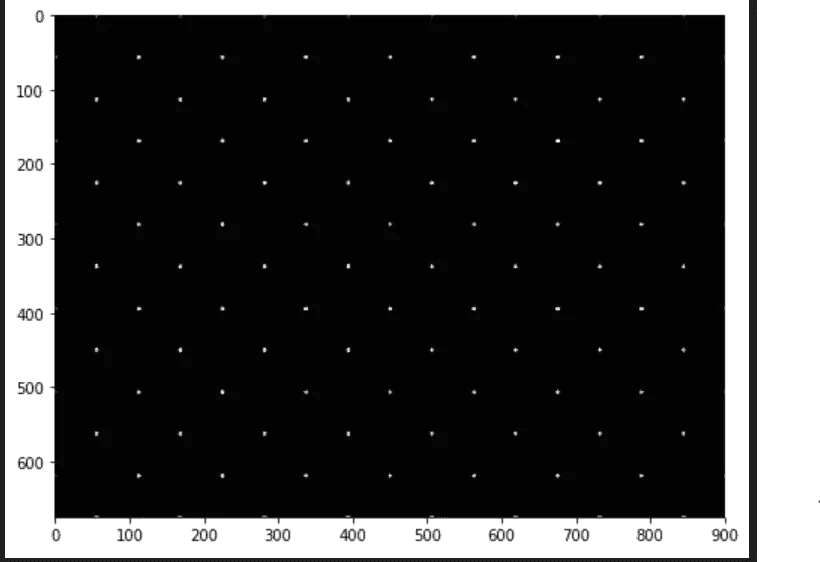

```
'''
1\. Threshold for an optimal value, it may vary depending on the image.
2\. We first calculate what is the maximum and minimum value of pixel in this image
'''
max_val = np.uint8(dst).max()
min_val = np.uint8(dst).min()
print("max_val = {}".format(max_val))
print("min_val = {}".format(min_val))
```

输出

```
max_val = 255
min_val = 0img = cv2.imread("imgs/chapter9/chess_slant.jpg", 1)
img[dst>0.1*dst.max()]=[0,0,255]
plt.figure(figsize=(8, 8))
plt.imshow(img[:,:,::-1])
plt.show()
```

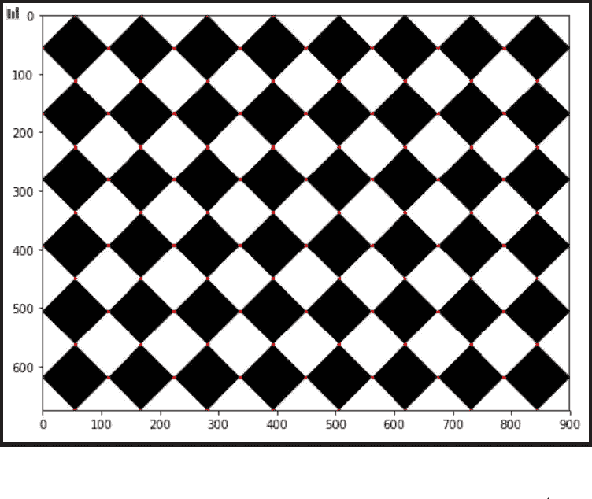

> 使用 OpenCV harris corner 查找角点坐标

```
%matplotlib inline
import numpy as np
import cv2
from matplotlib import pyplot as plt
img = cv2.imread("imgs/chapter9/chess_slant.jpg", 1);#img = cv2.resize(img, (96, 96))
gray = cv2.cvtColor(img,cv2.COLOR_BGR2GRAY)# find Harris corners
gray = np.float32(gray)
dst = cv2.cornerHarris(gray,2,3,0.04)
dst = cv2.dilate(dst,None)
ret, dst = cv2.threshold(dst,0.01*dst.max(),255,0)
dst = np.uint8(dst)
# find centroids
ret, labels, stats, centroids = cv2.connectedComponentsWithStats(dst)# define the criteria to stop and refine the corners
# Explain Criteria
criteria = (cv2.TERM_CRITERIA_EPS + cv2.TERM_CRITERIA_MAX_ITER, 100, 0.001)
corners = cv2.cornerSubPix(gray,np.float32(centroids),(5,5),(-1,-1),criteria)
# Now draw them
res = np.hstack((centroids,corners))
res = np.int0(res)
for x1, y1, x2, y2 in res:
    #cv2.circle(img,(x1, y1), 5, (0,255,0), -1) # Point Centroids
    cv2.circle(img,(x2, y2), 10, (0,0,255), -1) # Point corners
#img[res[:,1],res[:,0]]=[0,0,255]
#img[res[:,3],res[:,2]] = [0,255,0]
plt.figure(figsize=(8, 8))
plt.imshow(img[:,:,::-1])
plt.show()
```

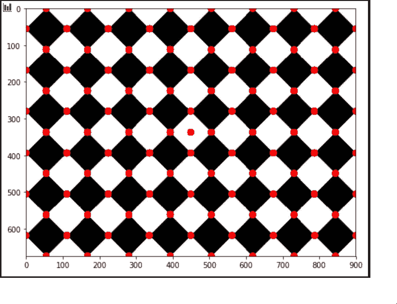

> Shi-Tomasi 角

*   哈里斯角点检测具有角点选择标准。
*   为每个像素计算分数，如果分数高于某个值，则该像素被标记为角点。
*   石和托马西建议取消这一职能。应该仅使用特征值来检查像素是否是拐角。
*   这些弯角和哈里斯弯角一模一样，只是稍微升级了一下。

```
%matplotlib inline
import numpy as np
import cv2
from matplotlib import pyplot as plt
img = cv2.imread("imgs/chapter9/shape.jpg", 1)
gray = cv2.cvtColor(img,cv2.COLOR_BGR2GRAY)################################FOCUS###############################corners = cv2.goodFeaturesToTrack(gray,25,0.01,10)# Self-study: Parameterscorners = np.int0(corners)####################################################################################################FOCUS###############################for i in corners:
     x,y = i.ravel()
     cv2.circle(img,(x,y), 5,(0, 125, 125),-1)################################################################plt.figure(figsize=(8, 8))
plt.imshow(img[:,:,::-1])
plt.show()
```

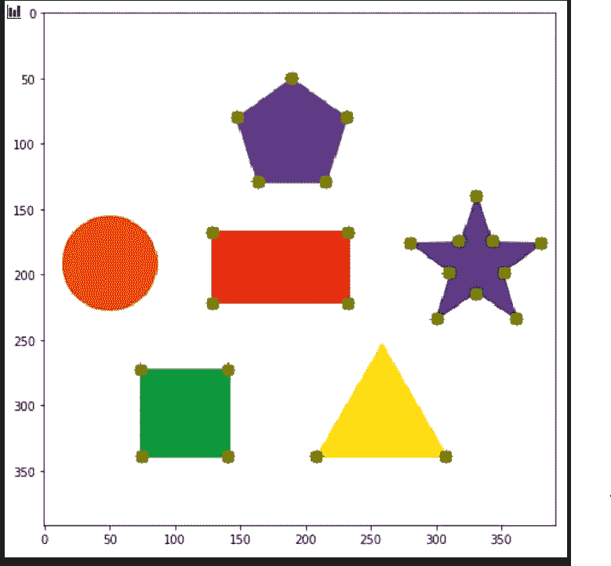

> OpenCV 快速角

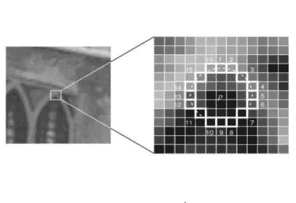

*   选择一个像素，让它的强度为 I。
*   选择阈值 t
*   如上图所示，考虑围绕像素的 16 个像素的圆。
*   现在，如果在圆(16 个像素)中存在一组 n 个相邻像素，它们都比 i+t 亮，或者都比 i-t 暗，则像素 p 是一个角

```
import cv2
from matplotlib import pyplot as plt
img = cv2.imread('imgs/chapter9/tessellate.png',1)
img2 = img.copy()
img3 = img.copy()###############################FOCUS################################# Initiate FAST object with default valuesfast = cv2.FastFeatureDetector_create()# find and draw the keypointskp = fast.detect(img,None)####################################################################for i in kp:
    x,y = int(i.pt[0]), int(i.pt[1])
    cv2.circle(img2,(x,y), 5,(0, 255, 0),-1)# Print all default params
print ("Threshold: ", fast.getThreshold())
print ("nonmaxSuppression: ", fast.getNonmaxSuppression())
print ("neighborhood: ", fast.getType())
print ("Total Keypoints with nonmaxSuppression: ", len(kp))# Disable nonmaxSuppressionfast.setNonmaxSuppression(0)
kp = fast.detect(img,None)print ("Total Keypoints without nonmaxSuppression: ", len(kp))
for i in kp:
    x,y = int(i.pt[0]), int(i.pt[1])
    cv2.circle(img3,(x,y), 5,(0, 255, 0),-1)f = plt.figure(figsize=(15,15))
f.add_subplot(2, 1, 1).set_title('Corners with non-maximal-suppression')
plt.imshow(img2[:, :,::-1])
f.add_subplot(2, 1, 2).set_title('Corners without non-maximal-suppression')
plt.imshow(img3[:, :,::-1])
plt.show()
```

输出

```
Threshold:  10 
nonmaxSuppression:  True 
neighborhood:  2 
Total Keypoints with nonmaxSuppression:  225 
Total Keypoints without nonmaxSuppression:  1633
```

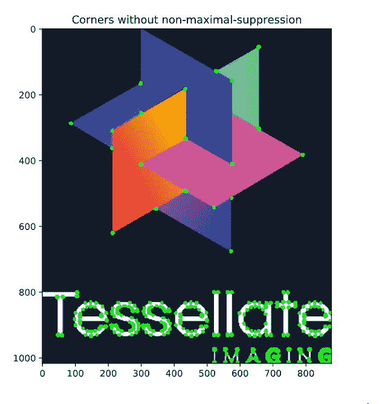

其余章节包含在第二部分中。

你可以在 [github](https://github.com/Tessellate-Imaging/monk_v1/blob/master/study_roadmaps/3_image_processing_deep_learning_roadmap/1_image_processing_basics/9)%20Features%20in%20Images.ipynb) 上找到完整的 jupyter 笔记本。

如果有任何问题，可以联系[阿布舍克](https://www.linkedin.com/in/abhishek-kumar-annamraju/)和[阿卡什](https://www.linkedin.com/in/akashdeepsingh01/)。请随意联系他们。

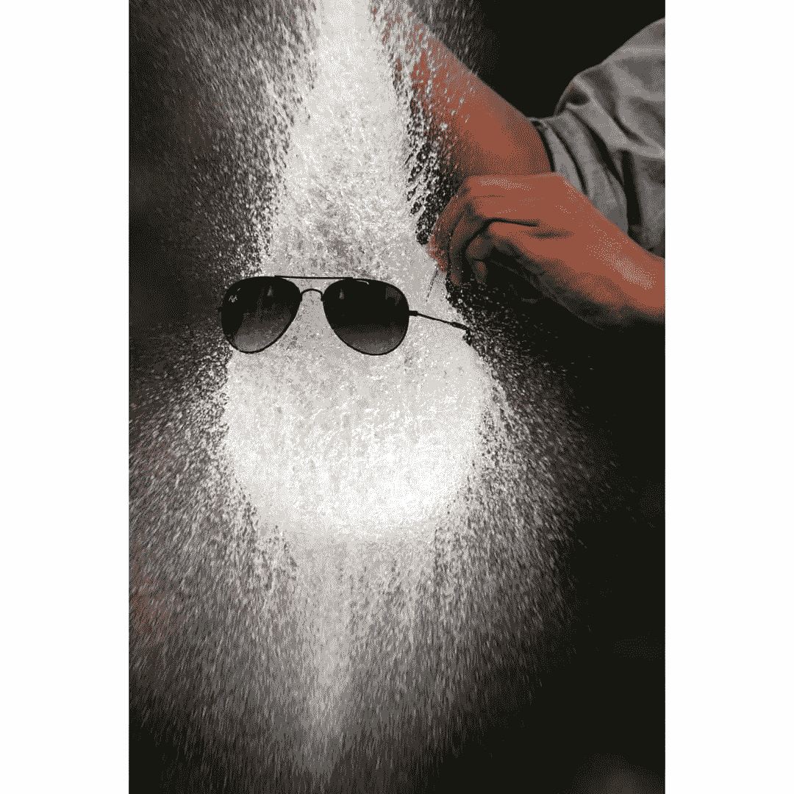

照片由
[clubcapture_vnit](https://www.instagram.com/clubcapture_vnit/) 拍摄