# 图像中的特征[第二部分]

> 原文：<https://pub.towardsai.net/features-in-image-part-2-70fc46dd316a?source=collection_archive---------0----------------------->

## 使用 Monk，低代码深度学习工具和计算机视觉的统一包装器，使计算机视觉变得简单。

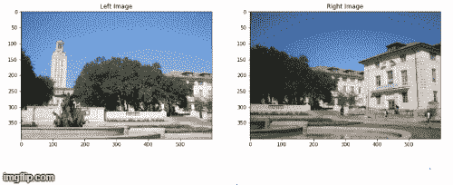

# 基于 OpenCV 和 PIL 的特征提取和可视化

**A 级特征**

> 猪的特征

*   梯度直方图。
*   用于对象检测。

> 步伐

*   查找 x 和 y 方向的渐变
*   使用渐变幅度和方向将渐变绑定到直方图中。

Hog 特征对图像中对象的旋转很敏感。

> 使用 Skimage 实现 Hog 功能

输出

```
(322218,)
```

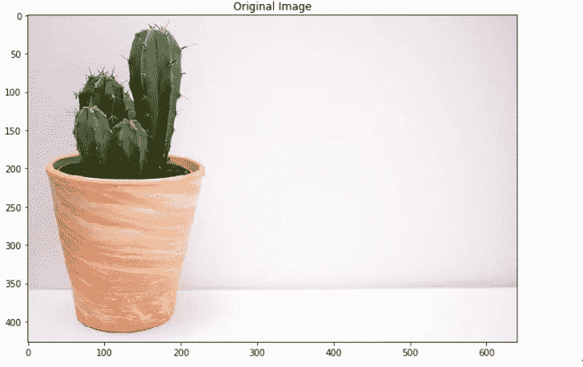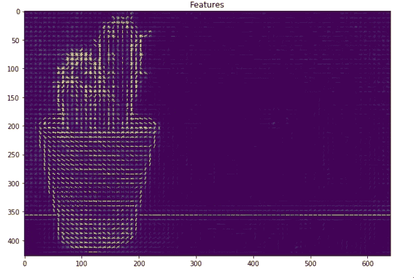

> 雏菊特征

*   升级的 HOG 功能
*   创建不适合可视化的密集特征向量。

> 过程

*   测试块->计算梯度或梯度直方图
*   s 块->使用高斯加权加法组合 T 块特征(轮廓)
*   N Block ->规范化添加的功能(使所有内容介于 0-1 之间)
*   d 块->减少特征的维数(PCA 算法)
*   Q Block ->出于存储目的压缩要素

> 使用 Sklearn 实现 Daisy 功能

输出

```
(2, 3, 153)
```

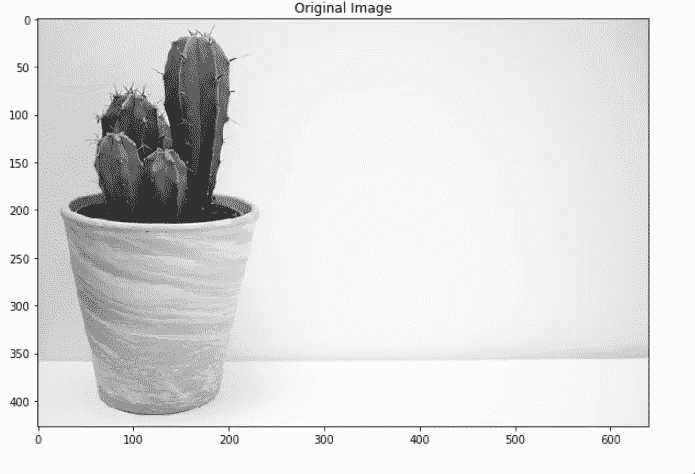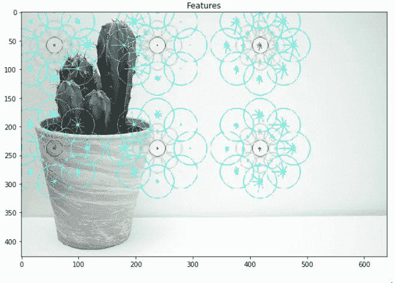

> GLCM 功能

*   灰度协方差矩阵。
*   计算不同方面(在同质性、均匀性方面)的像素对之间的相关度的总体平均值
*   灰度级共生矩阵(GLCM ),通过计算具有强度(灰度级)值 I 的像素在与具有值 j 的像素的特定空间关系中出现的频率

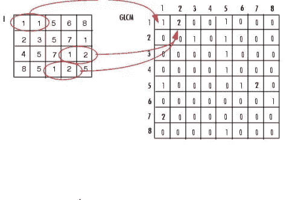

> 使用 Skimage 实施 GLCM 功能

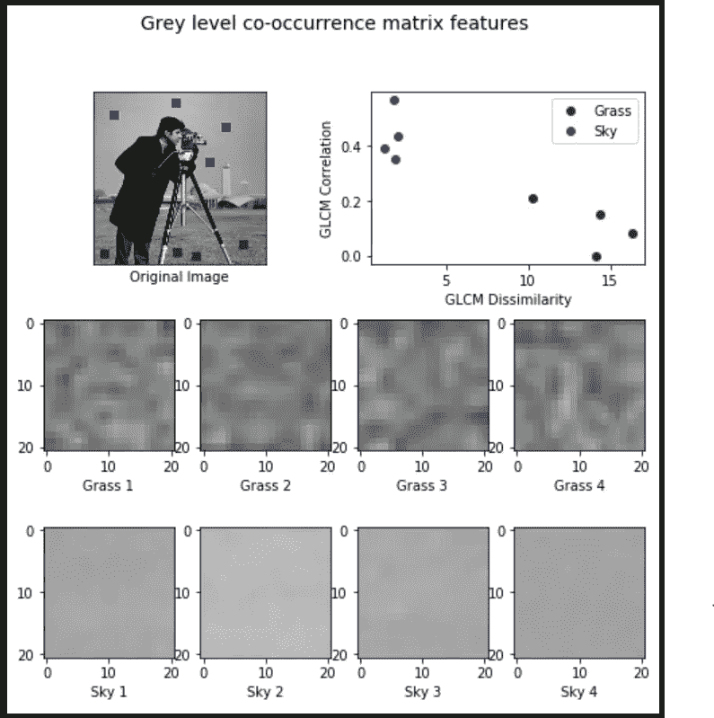

> 哈尔特征

*   用于物体识别。

> 矩形类哈尔特征

*   矩形内部区域像素总和的差值。

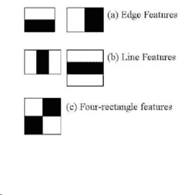

*   每个特征是通过从黑色矩形下的像素总和减去白色矩形下的像素总和而获得的单个值。

```
*'''
Source: 
https://scikitimage.org/docs/dev/auto_examples/features_detection/plot_haar.html* 
''' *# Haar like feature Descriptors* 
**import** **numpy** **as** **np** 
**import** **matplotlib.pyplot** **as** **plt** 
**import** **skimage.feature** 
**from** **skimage.feature** **import** haar_like_feature_coord, draw_haar_like_feature  
images = [np.zeros((2, 2)), np.zeros((2, 2)),np.zeros((3, 3)), np.zeros((3, 3)),np.zeros((2, 2))]  
feature_types = ['type-2-x', 'type-2-y','type-3-x', 'type-3-y',                  'type-4']  
fig, axs = plt.subplots(3, 2) 
**for** ax, img, feat_t **in** zip(np.ravel(axs), images, feature_types): 
    coord, _ = haar_like_feature_coord(img.shape[0], 
                                       img.shape[1], 
                                       feat_t)     
    haar_feature = draw_haar_like_feature(img, 0, 0,       img.shape[0],img.shape[1],coord,max_n_features=1,                       random_state=0)     
    ax.imshow(haar_feature)     
    ax.set_title(feat_t)     
    ax.set_xticks([])     
    ax.set_yticks([]) fig.suptitle('The different Haar-like feature descriptors') plt.axis('off') 
plt.show()
```

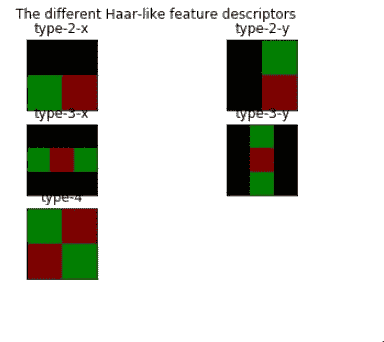

> LBP 特征

*   局部二元模式

> 元素

*   LBP 阈值
*   特征求和

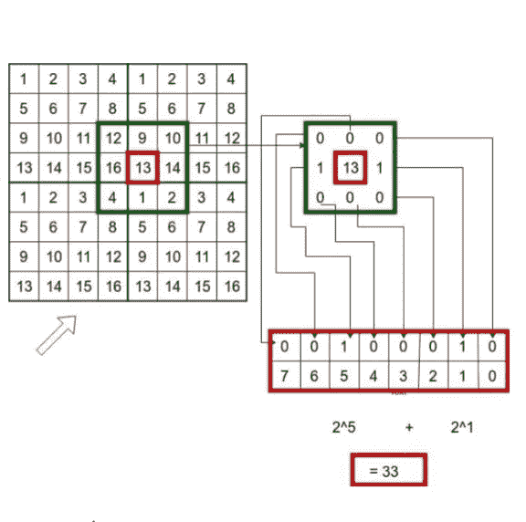

```
**import** **numpy** **as** **np**
**import** **skimage**
**import** **skimage.feature**
**import** **cv2**
**from** **matplotlib** **import** pyplot **as** plt
img = cv2.imread("imgs/chapter9/plant.jpg", 0);
*#img = cv2.resize(img, (img.shape[0]//4,img.shape[1]//4));*

output = skimage.feature.local_binary_pattern(img, 3, 8, method='default')
print(features.shape);

*# Rescale histogram for better display*
*#output = skimage.exposure.rescale_intensity(output, in_range=(0, 10))*

f = plt.figure(figsize=(15,15))
f.add_subplot(2, 1, 1).set_title('Original Image');
plt.imshow(img, cmap="gray")
f.add_subplot(2, 1, 2).set_title('Features');
plt.imshow(output);
plt.show()
```

输出

```
(2, 3, 153)
```

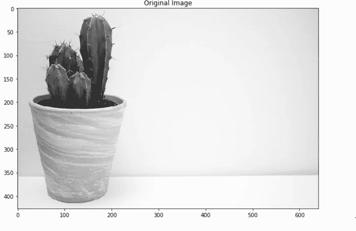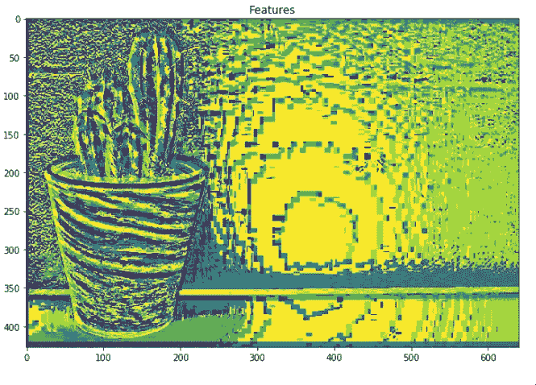

> 作为特征的斑点

*   斑点检测方法旨在检测数字图像中与周围区域相比在诸如亮度或颜色等属性上不同的区域。
*   非正式地，斑点是图像的一个区域，其中一些属性是恒定的或近似恒定的，斑点中的所有点在某种意义上可以被认为是彼此相似的。

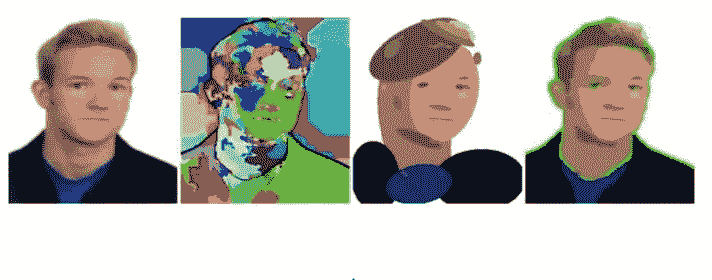

> 使用 Skimage 的 Blobs

```
**import** **numpy** **as** **np**
**import** **skimage**
**import** **skimage.feature**
**import** **cv2**
**import** **math**
**from** **matplotlib** **import** pyplot **as** plt

img = cv2.imread("imgs/chapter9/shape.jpg", 0)
*#img = skimage.data.hubble_deep_field()[0:500, 0:500]*
*#image_gray = skimage.color.rgb2gray(image)*

blobs = skimage.feature.blob_dog(img, max_sigma=5, threshold=0.05)

blobs[:, 2] = blobs[:, 2]
print(blobs.shape)

**for** y , x, r **in** blobs:
    cv2.circle(img,(int(x), int(y)), int(r), (0,255,0), 1)

f = plt.figure(figsize=(15,15))
f.add_subplot(2, 1, 1).set_title('Original Image');
plt.imshow(img, cmap="gray")
plt.show()
```

输出

```
(91, 3)
```

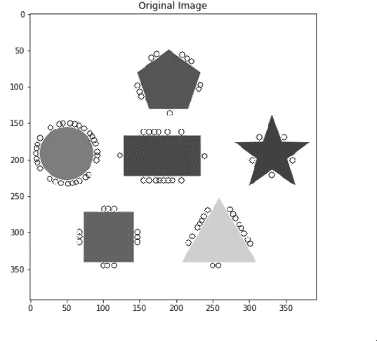

> 利用斑点探测深空星系

```
*'''
Source: 
https://scikitimage.org/docs/dev/auto_examples/features_detection/plot_blob.html*'''**from** **math** **import** sqrt
**from** **skimage** **import** data
**from** **skimage.feature** **import** blob_dog, blob_log, blob_doh
**from** **skimage.color** **import** rgb2gray

**import** **matplotlib.pyplot** **as** **plt**

image = data.hubble_deep_field()[0:500, 0:500]
image_gray = rgb2gray(image)

blobs_log = blob_log(image_gray, max_sigma=30, num_sigma=10, threshold=.1)

*# Compute radii in the 3rd column.*
blobs_log[:, 2] = blobs_log[:, 2] * sqrt(2)

blobs_dog = blob_dog(image_gray, max_sigma=30, threshold=.1)
blobs_dog[:, 2] = blobs_dog[:, 2] * sqrt(2)

blobs_doh = blob_doh(image_gray, max_sigma=30, threshold=.01)

blobs_list = [blobs_log, blobs_dog, blobs_doh]
colors = ['yellow', 'lime', 'red']
titles = ['Laplacian of Gaussian', 'Difference of Gaussian',
          'Determinant of Hessian']
sequence = zip(blobs_list, colors, titles)

fig, axes = plt.subplots(3, 1, figsize=(15, 15), sharex=**True**, sharey=**True**)
ax = axes.ravel()
**for** idx, (blobs, color, title) **in** enumerate(sequence):
    ax[idx].set_title(title)
    ax[idx].imshow(image, interpolation='nearest')
    **for** blob **in** blobs:
        y, x, r = blob
        c = plt.Circle((x, y), r, color=color, linewidth=2, fill=**False**)
        ax[idx].add_patch(c)
    ax[idx].set_axis_off()

plt.tight_layout()
plt.show()
```

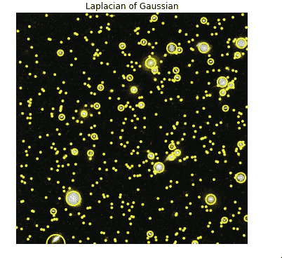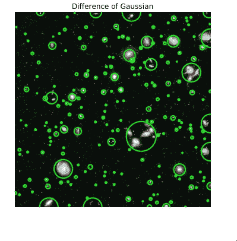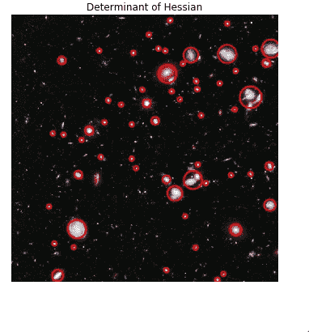

**B 级特色**

> 筛选特征

*   尺度不变特征变换。
*   由加拿大不列颠哥伦比亚大学申请专利。

> 这些功能是:

*   比例不变
*   旋转不变量
*   光照不变量
*   视点不变量

> 筛选步骤

*   建构一个尺度空间——金字塔世代
*   对数近似-高斯特征和梯度的拉普拉斯算子。
*   在高斯图像的差异中寻找关键点-最大值和最小值。
*   消除不好的关键点。
*   为关键点指定方向。
*   生成最终 SIFT 特征-为比例和旋转不变性生成另一种表示。

> 使用 OpenCV 实现 SIFT 特性

```
*'''
NOTE: Patented work. Cannot be used for commercial purposes**1.pip install opencv-contrib-python==3.4.2.16*
*2.pip install opencv-python==3.4.2.16*
'''
**import** **numpy** **as** **np**
**import** **cv2**
print(cv2.__version__)
**from** **matplotlib** **import** pyplot **as** plt
img = cv2.imread("imgs/chapter9/indoor.jpg", 1);

gray = cv2.cvtColor(img,cv2.COLOR_BGR2GRAY)

sift = cv2.xfeatures2d.SIFT_create()
keypoints, descriptors = sift.detectAndCompute(gray, **None**)

**for** i **in** keypoints:
    x,y = int(i.pt[0]), int(i.pt[1])
    cv2.circle(img,(x,y), 5,(0, 125, 125),-1)

plt.figure(figsize=(8, 8))
plt.imshow(img[:,:,::-1]);
plt.show()
```

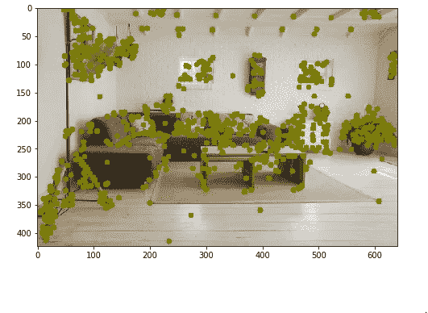

> 责难特征

*   中央环绕极端实时特征检测。
*   优于许多其他关键点检测器和特征提取器。

> 这些功能是

*   比例不变
*   旋转不变量
*   光照不变量
*   视点不变量

> 使用 Skimage 实现责难功能

```
**import** **numpy** **as** **np**
**import** **cv2**
**import** **skimage.feature**
**from** **matplotlib** **import** pyplot **as** plt
img = cv2.imread("imgs/chapter9/indoor.jpg", 1);

gray = cv2.cvtColor(img,cv2.COLOR_BGR2GRAY)

detector = skimage.feature.CENSURE(min_scale=1, max_scale=7, mode='Star', 
                                          non_max_threshold=0.05, line_threshold=10)

detector.detect(gray)

**for** i **in** detector.keypoints:
    x,y = int(i[1]), int(i[0])
    cv2.circle(img,(x,y), 5,(0, 125, 125),-1)

plt.figure(figsize=(8, 8))
plt.imshow(img[:,:,::-1]);
plt.show()
```

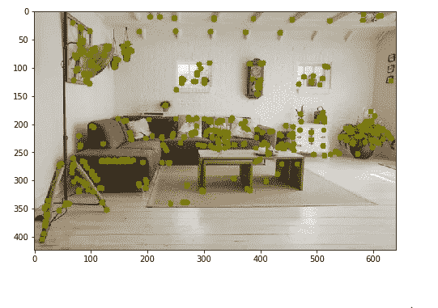

> 冲浪特征

*   加速强大的功能。
*   获得专利的局部特征检测器和描述符。
*   SURF 的标准版比 SIFT 快好几倍。

> SURF 使用这些算法

*   Hessian blob 检测器行列式的整数近似。
*   哈尔小波响应之和
*   多分辨率金字塔技术。

> 这些功能是

*   比例不变
*   旋转不变量
*   视点不变。

```
*'''
NOTE: Patented work. Cannot be used for commercial purposes*
 *1.pip install opencv-contrib-python==3.4.2.16*
*2.pip install opencv-python==3.4.2.16*
'''**import** **numpy** **as** **np**
**import** **cv2**
**from** **matplotlib** **import** pyplot **as** plt
img = cv2.imread("imgs/chapter9/indoor.jpg", 1);

gray = cv2.cvtColor(img,cv2.COLOR_BGR2GRAY)

surf = cv2.xfeatures2d.SURF_create(1000)
keypoints, descriptors = surf.detectAndCompute(gray, **None**)

**for** i **in** keypoints:
    x,y = int(i.pt[0]), int(i.pt[1])
    cv2.circle(img,(x,y), 5,(0, 125, 125),-1)

plt.figure(figsize=(8, 8))
plt.imshow(img[:,:,::-1]);
plt.show()
```

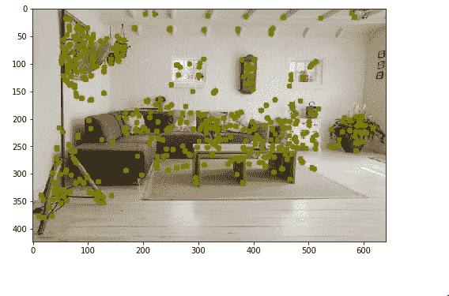

> 简要特征

*   二元鲁棒独立基本特征。
*   在许多情况下，在速度和识别率方面优于 SURF 和 SIFT 等其他快速描述符。

> 步伐

*   使用高斯核的图像平滑。
*   转换成二进制特征向量。

> 使用 OpenCV 实现简短特性

```
**import** **numpy** **as** **np**
**import** **cv2**
**from** **matplotlib** **import** pyplot **as** plt
img = cv2.imread("imgs/chapter9/indoor.jpg", 1);

gray = cv2.cvtColor(img,cv2.COLOR_BGR2GRAY)

*# Initiate FAST detector*
star = cv2.xfeatures2d.StarDetector_create()
kp = star.detect(gray,**None**)

brief = cv2.xfeatures2d.BriefDescriptorExtractor_create()
keypoints, descriptors = brief.compute(gray, kp)

**for** i **in** keypoints:
    x,y = int(i.pt[0]), int(i.pt[1])
    cv2.circle(img,(x,y), 5,(0, 125, 125),-1)

plt.figure(figsize=(8, 8))
plt.imshow(img[:,:,::-1]);
plt.show()
```

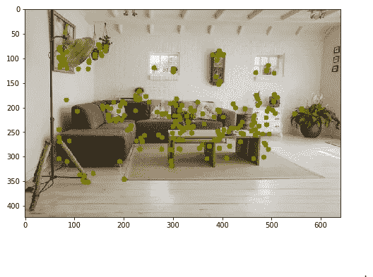

> 活泼的特征

二元鲁棒独立基本特征。

> 由三部分组成

*   采样模式:描述符周围的采样点

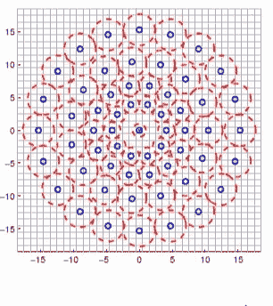

*   方向补偿:一些关键点和旋转方向的机制。
*   采样对:构建最终描述符时要比较哪些对。

```
**import** **numpy** **as** **np**
**import** **cv2**
**from** **matplotlib** **import** pyplot **as** plt
img = cv2.imread("imgs/chapter9/indoor.jpg", 1);

gray = cv2.cvtColor(img,cv2.COLOR_BGR2GRAY)

brisk = cv2.BRISK_create()
keypoints, descriptors = brisk.detectAndCompute(gray, **None**)

**for** i **in** keypoints:
    x,y = int(i.pt[0]), int(i.pt[1])
    cv2.circle(img,(x,y), 5,(0, 125, 125),-1)

plt.figure(figsize=(8, 8))
plt.imshow(img[:,:,::-1]);
plt.show()
```

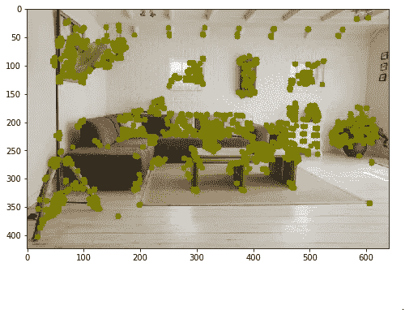

> 卡兹和加速-卡兹功能

> 使用 OpenCV 的 KAZE 特性

```
**import** **numpy** **as** **np**
**import** **cv2**
**from** **matplotlib** **import** pyplot **as** plt
img = cv2.imread("imgs/chapter9/indoor.jpg", 1);

gray = cv2.cvtColor(img,cv2.COLOR_BGR2GRAY)

kaze = cv2.KAZE_create()
keypoints, descriptors = kaze.detectAndCompute(gray, **None**)

**for** i **in** keypoints:
    x,y = int(i.pt[0]), int(i.pt[1])
    cv2.circle(img,(x,y), 5,(0, 125, 125),-1)

plt.figure(figsize=(8, 8))
plt.imshow(img[:,:,::-1]);
plt.show()
```

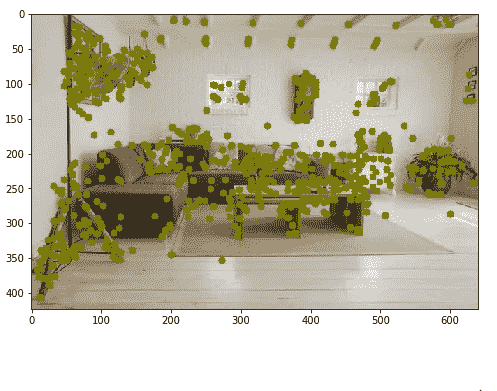

> 阿卡泽特征

> 使用 OpenCV 的 AKAZE 特性

```
**import** **numpy** **as** **np**
**import** **cv2**
**from** **matplotlib** **import** pyplot **as** plt
img = cv2.imread("imgs/chapter9/indoor.jpg", 1);

gray = cv2.cvtColor(img,cv2.COLOR_BGR2GRAY)

akaze = cv2.AKAZE_create()
keypoints, descriptors = akaze.detectAndCompute(gray, **None**)

**for** i **in** keypoints:
    x,y = int(i.pt[0]), int(i.pt[1])
    cv2.circle(img,(x,y), 5,(0, 125, 125),-1)

plt.figure(figsize=(8, 8))
plt.imshow(img[:,:,::-1]);
plt.show()
```

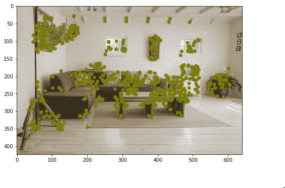

> ORB 功能

面向快速和健壮的简要特征

> 使用 OpenCV 的 Orb 特性

```
**import** **numpy** **as** **np**
**import** **cv2**
**from** **matplotlib** **import** pyplot **as** plt
img = cv2.imread("imgs/chapter9/indoor.jpg", 1)

gray = cv2.cvtColor(img,cv2.COLOR_BGR2GRAY)

orb = cv2.ORB_create(500)
keypoints, descriptors = orb.detectAndCompute(gray, **None**)

**for** i **in** keypoints:
    x,y = int(i.pt[0]), int(i.pt[1])
    cv2.circle(img,(x,y), 5,(0, 125, 125),-1)

plt.figure(figsize=(8, 8))
plt.imshow(img[:,:,::-1])
plt.show()
```

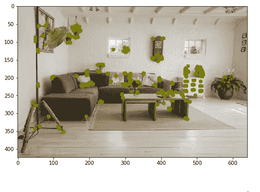

# 特征匹配

*   这样做是为了识别多幅图像中的相似特征。
*   用于对象检测。

> 方法

1.  **蛮力**

将图像 1 中的每个特征与图像 2 中的每个特征进行匹配

2.**弗兰恩基础匹配**

*   近似最近邻的快速库。
*   它包含一组针对大型数据集中的快速最近邻搜索和高维特征优化的算法。

> 使用 OpenCV 进行特征匹配

```
*'''
Using Brute-Force matching*
'''
**import** **numpy** **as** **np**
**import** **cv2**
**from** **matplotlib** **import** pyplot **as** plt

orb = cv2.ORB_create(500)

img1 = cv2.imread("imgs/chapter9/indoor_lamp.jpg", 1);
img1 = cv2.resize(img1, (256, 256));
gray1 = cv2.cvtColor(img1,cv2.COLOR_BGR2GRAY);

img2 = cv2.imread("imgs/chapter9/indoor.jpg", 1);
img2 = cv2.resize(img2, (640, 480));
gray2 = cv2.cvtColor(img2,cv2.COLOR_BGR2GRAY);

*# find the keypoints and descriptors with SIFT*
kp1, des1 = orb.detectAndCompute(img1,**None**)
kp2, des2 = orb.detectAndCompute(img2,**None**)

*# BFMatcher with default params*
bf = cv2.BFMatcher()
matches = bf.knnMatch(des1,des2,k=2)

*# Apply ratio test*
good = []
**for** m,n **in** matches:
    **if** m.distance < 0.75*n.distance:
        good.append([m])

        *# cv.drawMatchesKnn expects list of lists as matches.*
img3 = cv2.drawMatchesKnn(img1,kp1,img2,kp2,good,**None**,flags=cv2.DrawMatchesFlags_NOT_DRAW_SINGLE_POINTS)

plt.figure(figsize=(15, 15))
plt.imshow(img3[:,:,::-1])
plt.show()
```

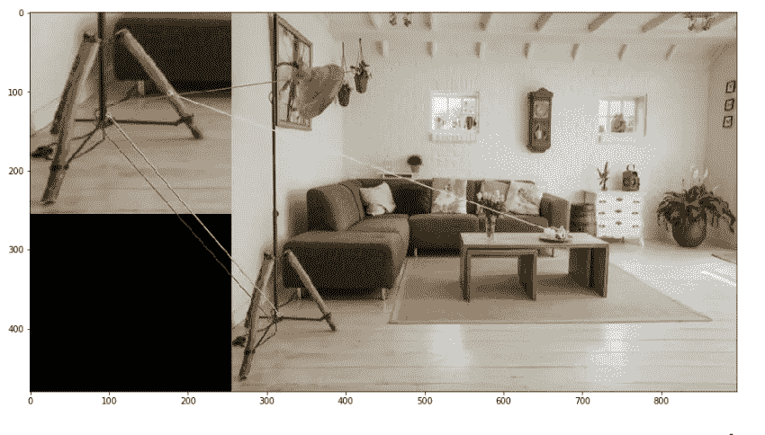

> 使用 OpenCV 的 FLann 匹配器

```
*'''
Using Flann-based matching on ORB features*
'''**import** **numpy** **as** **np**
**import** **cv2**
**from** **matplotlib** **import** pyplot **as** plt
**import** **imutils**

orb = cv2.ORB_create(500)

img1 = cv2.imread("imgs/chapter9/indoor_lamp.jpg", 1);
img1 = cv2.resize(img1, (256, 256));
gray1 = cv2.cvtColor(img1,cv2.COLOR_BGR2GRAY);

img2 = cv2.imread("imgs/chapter9/indoor.jpg", 1);
img2 = cv2.resize(img2, (640, 480));
gray2 = cv2.cvtColor(img2,cv2.COLOR_BGR2GRAY);

*# find the keypoints and descriptors with SIFT*
kp1, des1 = orb.detectAndCompute(img1,**None**)
kp2, des2 = orb.detectAndCompute(img2,**None**)

*# FLANN parameters*
FLANN_INDEX_LSH = 6
index_params= dict(algorithm = FLANN_INDEX_LSH,
                   table_number = 6, *# 12*
                   key_size = 12,     *# 20*
                   multi_probe_level = 1) *#2*
search_params = dict(checks=50)   *# or pass empty dictionary*
flann = cv2.FlannBasedMatcher(index_params,search_params)
matches = flann.knnMatch(des1,des2,k=2)
*# Need to draw only good matches, so create a mask*
matchesMask = [[0,0] **for** i **in** range(len(matches))]
*# ratio test as per Lowe's paper* **for** i,(m,n) **in** enumerate(matches):
    **if** m.distance < 0.7*n.distance:
        matchesMask[i]=[1,0]
draw_params = dict(matchColor = (0,255,0),
                   singlePointColor = (255,0,0),
                   matchesMask = matchesMask,
                   flags = cv2.DrawMatchesFlags_DEFAULT)
img3 = cv2.drawMatchesKnn(img1,kp1,img2,kp2,matches,**None**,**draw_params)

plt.figure(figsize=(15, 15))
plt.imshow(img3[:,:,::-1])
plt.show()
```

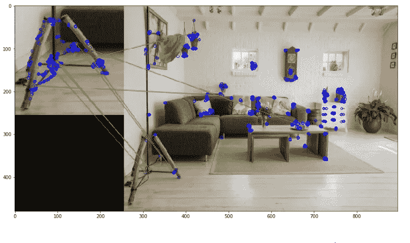

# 图像拼接

*   图像拼接或照片拼接是将多个具有重叠视野的照片图像组合起来以产生分段全景或高分辨率图像的过程。

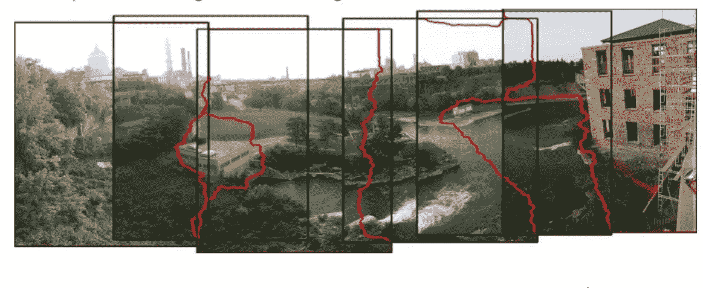

> **使用 OpenCV 的图像拼接**

```
from matplotlib import pyplot as plt
%matplotlib inline
import cv2
import numpy as np
import argparse
import sys
modes = (cv2.Stitcher_PANORAMA, cv2.Stitcher_SCANS)# read input imagesimgs = [cv2.imread("imgs/chapter9/left.jpeg", 1),cv2.imread("imgs/chapter9/right.jpeg", 1)]stitcher = cv2.Stitcher.create(cv2.Stitcher_PANORAMA)
status, pano = stitcher.stitch(imgs)f = plt.figure(figsize=(15,15))
f.add_subplot(1, 2, 1).set_title('Left Image')
plt.imshow(imgs[0][:,:,::-1])
f.add_subplot(1, 2, 2).set_title('Right Image')
plt.imshow(imgs[1][:,:,::-1])
plt.show()
```

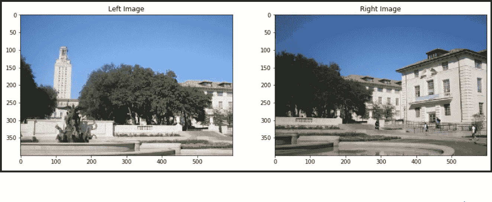

```
plt.figure(figsize=(15, 15))
plt.imshow(pano[:,:,::-1])
plt.show()
```

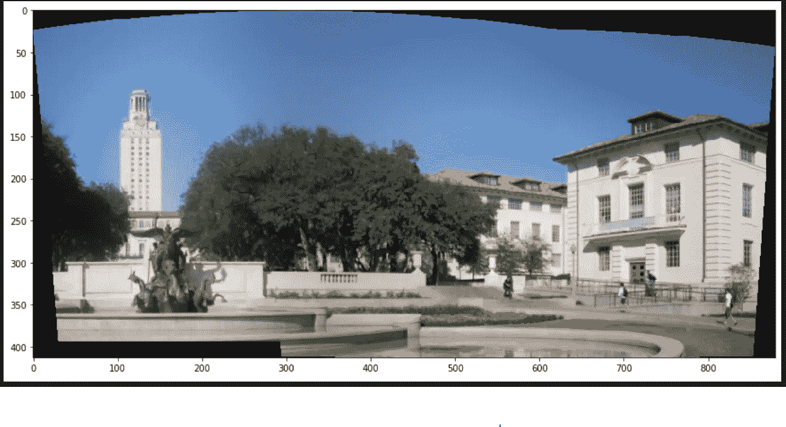

你可以在 [Github](https://github.com/Tessellate-Imaging/monk_v1/blob/master/study_roadmaps/3_image_processing_deep_learning_roadmap/1_image_processing_basics/9)%20Features%20in%20Images.ipynb) 上找到完整的 jupyter 笔记本。

有问题可以联系 [Abhishek](https://www.linkedin.com/in/abhishek-kumar-annamraju/) 和 [Akash](https://www.linkedin.com/in/akashdeepsingh01/) 。请随意联系他们。

我对计算机视觉和深度学习充满热情。我是 [Monk](https://github.com/Tessellate-Imaging/Monk_Object_Detection) 库的开源贡献者。

你也可以在以下网址看到我的其他作品:

[](https://medium.com/@akulahemanth) [## 阿库拉·赫曼思·库马尔培养基

### 阅读阿库拉·赫曼思·库马尔在媒介上的作品。计算机视觉爱好者。每天，阿库拉·赫曼思·库马尔和…

medium.com](https://medium.com/@akulahemanth) 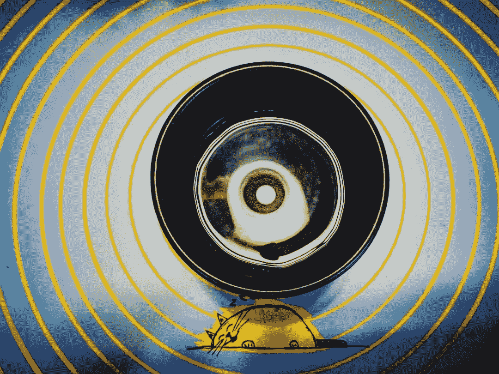

照片由 [Srilekha](https://www.instagram.com/_fernwehd_._/) 拍摄