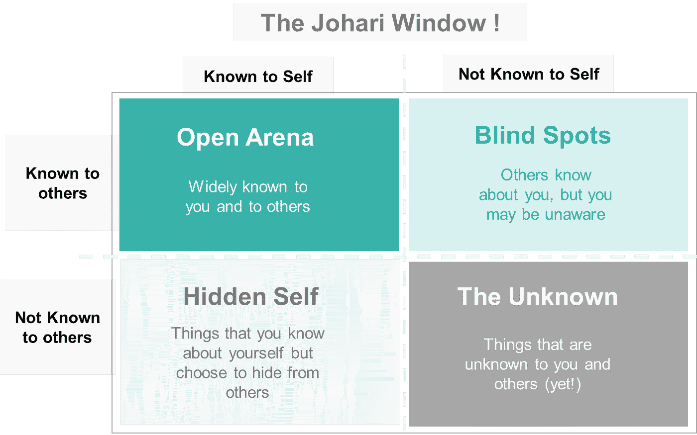

# 反馈是一份礼物——给别人反馈的艺术！

> 原文：<https://pub.towardsai.net/feedback-is-a-gift-the-art-of-giving-feedback-to-others-65cfbc8c26b3?source=collection_archive---------6----------------------->

为什么要反馈？如何反馈？..向他人提供反馈背后的艺术会导致富有成效的工作关系的发展。

乔恩·泰森在 [Unsplash](https://unsplash.com?utm_source=medium&utm_medium=referral) 上的照片

在专业机构*(或者任何类似的机构)*，**“反馈”是提高、帮助你周围的人提高并最终发展可靠关系的最有力的方法之一**。在下面的帖子中，根据我的职业经验，我将谈论反馈的重要性，并给出一些帮助我们以一种最终被他人“接受”的方式传达反馈的护栏。

*请注意，虽然下面讨论的大多数框架适用于专业设置；然而，它们同样适用于个人设置。*

***艰难、尴尬、苦恼***——这些是我们想到给别人反馈时想到的词。事实是，向他人提供反馈可能会令人生畏。提供反馈时感到不舒服的解药是**非常清楚你提供反馈背后的动机**。

> 给予反馈的动机: *-* ***动机:*** 强化你希望他人继续的行为。
> - ***发展型:*** 调整、改变或修正某人的行为。

在进入反馈聊天之前，试着积极思考以下问题: *-你为什么要提供反馈，你打算如何做？你打算帮助你的同事获得更好的体验，还是希望他们在某些方面有所改进？
-你是否打算以一种最大限度减少他们的不适感的方式提供反馈，同时也能让他们理解你的观点？我能真诚地理解他们的观点吗？*

可以肯定地说，

> 向他人提供反馈与其说是科学，不如说是一门艺术。

# 为什么反馈很重要？

在一个没有反馈的世界里，我们只需要依靠我们的思考和感知。获得一个局外人的观点可以带来清晰，连接这些点，并可以帮助我们发现我们没有意识到的事情。

*   反馈总是存在的。还是明确知道比较好。每当我们作为个体互动时，大多数人都会对这些互动有一些想法。知道这些比猜测要好。
*   反馈可以加强关系。通过了解那些行之有效的事情，更重要的是那些行之无效的事情，我们可以更加深思熟虑，更有计划。这将导致未来更好的互动。
    →改善个人和团队之间的关系。
*   反馈增加了透明度和个人之间的信任。
*   反馈可以激励我们做得更多，学得更多，发展得更好。
*   对建设性反馈采取行动可以让我们抓住发展机会，从而提高绩效。

> 反馈，即使一开始听起来有点痛苦，最终也是一份礼物。

我们都同意，我们身上有些东西是我们知道/不知道的，有些东西是别人知道/不知道的。将这些结合起来，我们可以得到 4 个互斥且累积详尽的场景，如下面的 2X2 所示，也称为 Johari 窗口。

## 乔哈里之窗！

乔哈里之窗是一种用来帮助人们更好地理解他们与自己和他人的关系的技术。

 [## 乔哈里之窗-维基百科

### 乔哈里之窗是一种技术，旨在帮助人们更好地理解自己与他人的关系

en.wikipedia.org](https://en.wikipedia.org/wiki/Johari_window) 

乔哈里之窗(图片由作者提供)

它经常在公司环境中使用，目的是展示开放沟通的重要性，并解释其对信任的影响。该模型还教会你自我表露的重要性，并展示反馈如何帮助你在个人和职业上成长。

这四个象限是:

**1。开放竞技场** —
这个象限代表你对自己的了解，以及别人对你的了解。这可以包括你的行为、知识、技能、态度和“公共”历史。

> 显然，这个象限越大，你作为一个个体的自我意识越强。

**2。盲点** —
这个象限代表你自己不知道，但其他人知道的事情。这可能包括你不知道的简单信息，也可能涉及深层问题*(例如，不胜任、不称职、被拒绝等感觉。)*这些往往是个人难以直接面对的，却又能被他人看到的。这个盲区代表了对自己的无知，对个人或团体来说不是一个有效或有生产力的空间。

> 通过**寻求他人的反馈**，目的应该是**减少“盲点”从而增加“开放领域”**，增加自我意识。

**3。隐藏的自我**——
这个象限代表你对自己的了解，但其他人不知道的事情。这种隐藏或回避的自我代表了一个人知道的关于自己的信息和感受，但这些信息和感受没有向他人透露或隐藏。隐藏区域也可能包括敏感、恐惧、隐藏的议程、秘密——任何一个人知道但出于某种原因没有透露的东西。
非常私人和私密的信息和感受被隐藏是很自然的事情。然而，通常情况下，许多隐藏的信息并不是非常私人的，而是与工作或表现相关的，因此最好放在公开的地方。

> 通过告诉别人我们的感受和其他关于我们自己的信息，我们减少了隐藏的区域，增加了开放的区域。

这有助于更好地理解、合作、信任、团队工作效率和生产力。减少隐藏区域也减少了潜在的混乱、误解、沟通不畅等，这些都会分散和破坏团队的效率。

**4。未知的自己** —
这最后一个象限代表着你不知道的，别人也不知道的东西。这个区域包含信息、感觉、潜在能力、资质、经验等。他/她自己不知道的和组中其他人不知道的。

> 年轻人和缺乏经验或自信的人通常会有较大的未知自我区域。

对于个人、团队和组织来说，探索个人的“未知自我”至关重要..像因缺乏机会而被低估或未尝试过的能力，对某事未被发现的厌恶，等等。

> 更广阔的“开放竞技场”和更小的“盲点”/“隐藏自我”区域；引领个人发展，使我们能够利用自己的优势并培养我们的关系。

改进是一个持续的过程，自我意识是其中很重要的一部分。我们都可以通过不断获得反馈并采取行动来提高。其他人越了解对我们有用或没用的东西，我们就越有可能和他们保持良好的关系。

# 提供质量反馈

重要的是要记住，对优势和成功提供激励性反馈与对不太顺利的项目或可以改进的行为提供发展性反馈同样重要。

“反馈”过程不应该是一年做一次或两次的一次性活动，仅仅作为一个勾选框练习*(如在我们的工作环境中)*，而是应该成为任何工作小组(或任何互动小组)日常文化的一部分。这应该是自然而然的，所有人都应该随时寻求并提供反馈。

> 寻求和提供反馈应该成为一种惯例

在考虑向他人提供反馈时，请谨记以下事项。

1.  **要具体，不要含糊:** 不要这个:*“你真棒！”* 本:*“谢谢..ABC ..”/“你在以下方面帮了大忙..XYZ ..”等等。*
2.  **积极主动:** 不是这个:*“你应该早点问我”* 这个:*“我对你的项目有一些想法，我们可以讨论一下吗”*
3.  **让它有建设性**
    不是这个:*“你不擅长管理时间表”* 这个:*“使用这个计划模板，它将帮助你完成时间表”*
4.  **使其相关**
    不是这个:*“参与项目的每个团队都没有做好自己的工作”* 这个:*“你在项目中的角色是照顾 X，它本来可以做得更好，因为……”*
5.  **及时给予**
    不是这个:*“你一年前做的项目很差，因为..”* 这个:*“我看了你的项目，有一些改进的建议，我们见面吧”*

# 摘要

反馈很重要。非常重要！这是帮助我们成长的唯一最有影响力的因素。

*   反馈总是有的，不如明确地抓住它。
*   你可以利用反馈作为一种工具来提高自我意识*(Johari Window 的“开放竞技场】)*并减少盲点。
*   你可以根据反馈来发展自己，加强与他人的关系，提高绩效。
*   提供反馈背后的意图——动机或发展。
*   我们给予他人的反馈应该是:
    -具体的，而不是笼统和模糊的
    -主动给予
    -建设性的方式
    -与人和情况相关
    -及时给予

*..例行寻求并提供反馈。记住，这是一份礼物！*