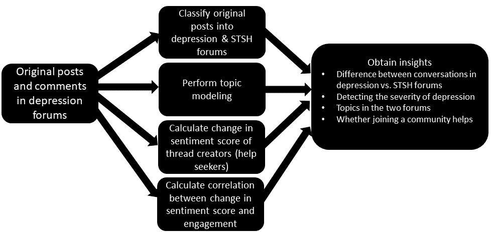
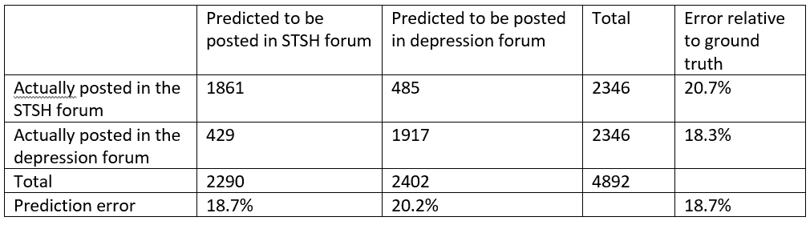
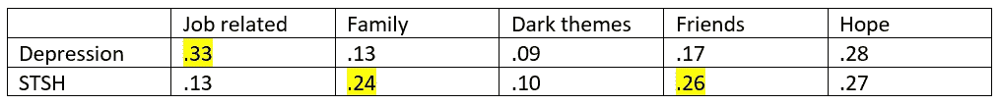
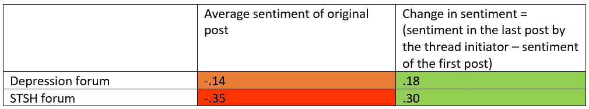

# 感觉好些了吗？使用自然语言处理分析社交媒体参与对抑郁的影响

> 原文：<https://pub.towardsai.net/feeling-better-859ec4b54e30?source=collection_archive---------0----------------------->

## [自然语言处理](https://towardsai.net/p/category/nlp)，[意见](https://towardsai.net/p/category/opinion)

照片由[斯特凡诺·波利奥](https://unsplash.com/@stefanopollio?utm_source=medium&utm_medium=referral)在 [Unsplash](https://unsplash.com?utm_source=medium&utm_medium=referral) 上拍摄

德克萨斯州奥斯汀西湖高中 Aadit Barua

**全球挑战**

根据世界卫生组织(世卫组织)的数据，抑郁症是一种心理健康疾病，影响着超过 2.5 亿人。由于新冠肺炎，情况变得更加糟糕；世界经济论坛(WEF)引用了一项研究，该研究发现，在疫情期间，多个国家每三个人中就有一个人患有某种程度的抑郁症。许多对抗抑郁症的人转向在线社区寻求支持和帮助。抑郁症可以从轻度到重度不等，在线平台已经出现，以满足患有这种疾病的个人的需求。我想在社交媒体数据上使用自然语言处理(NLP)技术来探索与抑郁症相关的各种问题。

*   如果有的话，抑郁症论坛上的信息和那些讨论自杀想法和自残的论坛上发布的信息有什么区别(STSH)？在社交媒体帖子中，有没有可以快速检测到的更严重程度的抑郁症的明显指标？
*   在涉及严重抑郁症的信息中，什么是主导话题？
*   随着时间的推移，加入一个专注于抑郁症的在线社区有助于个人感觉更好吗？如果是，敬业度如何影响这些福利？

我使用分类、主题建模和情感分析来解决这些问题。我的发现有点令人惊讶，但也非常令人鼓舞。与普遍看法相反，在抑郁症和 STSH 论坛上发布的信息之间的差异是微妙的，前者强调与工作有关的问题——这可能是新冠肺炎的功劳——而后者更关注家庭和朋友。好消息是，平均而言，从一个帖子被创建到最后一条消息在该帖子中发布，两个论坛的参与者都感觉更好。此外，这种提高与参与度(即其他人在该线程上发布的消息数量)有很强的正相关性。综上所述，我的发现表明，这些在线平台对那些治疗抑郁症的人来说非常有价值。

**我的方法**

图 1 显示了我的分析总结。首先，我根据抑郁程度对在线社区发布的信息进行分类。一个准确的模型将有助于发现严重抑郁症的早期迹象以及与这种状况相关的危险。第二，如果分类模型工作得相当好，我将研究两个论坛信息中主题的差异。第三，我想了解在抑郁论坛上开始一个新话题或线程的用户是否会因为互动而感觉更好。最后但并非最不重要的一点是，我将在情绪得分的变化和参与度之间建立关联，以发现与他人更多的互动可以在多大程度上帮助某人感觉更好。

图 1:了解抑郁症的严重程度和在线社区的作用

**数据和分析**

我从两个公共在线论坛获得数据，一个关注抑郁症，另一个关注“自杀想法和自残”(STSH)。我用一个神经网络来区分在大萧条和 STSH 论坛上发布的信息。我创建了一个平衡的数据集，尽管抑郁症论坛上发布的信息明显更多。带有文本的神经网络的代码与我在一篇关于情感分析的早期文章中使用的代码相同:[https://medium . com/swlh/adding-context-to-unsupervised-pseudo-analysis-7b 6693d 2c 9 f 8](https://medium.com/swlh/adding-context-to-unsupervised-sentiment-analysis-7b6693d2c9f8)

表 1:混淆矩阵

如表 1 所示，该模型的整体准确率为 81.3%，这是完全可以接受的。此外，这两个类别的误差相当平衡，预测 STSH 职位的误差略低。STSH 邮报的一些过采样可能会进一步降低错误率。

**原帖主题建模**

为了更深入的探究两个论坛的区别，而不是只看高 TF-IDF 的话，我进行了话题建模(毕竟话题比话少很多)。我尝试了 4、5 和 6 个主题，经过反复试验后，选定了 5 个。这些主题涉及(1)工作(实际的损失或对损失的恐惧)，(2)家庭，(3)身体伤害等黑暗主题，(4)朋友，以及(5)希望和积极的想法。表 2 显示了在两个论坛中发布的消息中的平均主题百分比。人们自然会认为，黑暗主题将主导 STSH 论坛。然而，现实更加微妙和微妙。黑暗主题在两个论坛中有几乎相同的小份额帖子。抑郁症论坛有许多以工作为主题的帖子，而 STSH 的帖子则更多地关注家庭和朋友。

表 2:两个论坛的主题

参与者的情绪会随着时间的推移而改善吗？

一个重要的问题是，创建原创主题来分享他们的故事并寻求帮助或支持的用户是否会在与他人互动时感觉更好。我跟踪了一个新用户在一段时间内发布的消息的情绪差异:

情绪变化=创建主题的用户在最后一篇帖子中的情绪得分-同一用户在主题中的第一篇帖子的情绪得分。该代码在 GitHub 上共享，地址为

[https://github . com/adib 2002/Depression-Analysis/blob/main/Changing % 20 voices . py](https://github.com/AdiB2002/Depression-Analysis/blob/main/Changing%20Sentiments.py)。结果如表 3 所示。

表 3:在一个线程的生命周期中情感得分的变化

随着时间的推移，两个论坛的情绪得分都有显著增加，这非常令人鼓舞。例如，如果用户在第一篇帖子中的情绪得分为 0.14，那么他/她在该主题上的最后一篇帖子的平均情绪得分为 0.18—. 14 = . 04(略微为正)。类似地，对于 STSH 论坛中的用户，最后一个帖子的情绪得分为 0.30-. 35 =-. 05，这稍微有点负面，但这代表了第一个帖子中负面语气的大幅减少。很明显，来到这些社区的用户感觉更好，因为他们与那些感同身受并提供不同类型帮助的人互动。

**参与度很重要吗？**

并不是所有的线程都经历相同程度的参与和交互。为了测试一个线程中其他人发布的消息数量是否会让线程创建者感觉更好，我在情绪变化和线程中的消息数量之间做了一个简单的关联，没有计算线程创建者发布的消息。总体相关性为 0.39，显著性水平小于 1%。我还没有机会深入探究是鼓励还是真正的帮助让用户感觉更好，但可以肯定的是，更多的参与会产生显著的积极影响。

**结论**

抑郁症是世界范围内的一个严重的心理健康问题，那些患有抑郁症的人往往不愿意在面对面的交谈中与他人讨论他们的情况。然而，许多人转向在线社区，也许是因为这种平台提供的匿名性。我研究了两个关注两种不同程度抑郁症的论坛。使用基于神经网络的 NLP 分类，我证明了我们可以预测发布消息的论坛，这表明了抑郁症的严重程度。这些信息的差异令人惊讶地微妙，但仍然可以识别，在 STSH 论坛上没有明显强调黑暗的主题。最令人鼓舞的发现是，人们从参与这些在线论坛中感觉更好，这种改善与一个线程上的交互水平相关。

我的分析基于一个在线平台，该平台来自一个对新冠肺炎疫情管理相对较好的国家。与其他在线社区一起测试上述想法，以发现结果是否相似，以及此类平台是否同样成功，这将非常重要。