# 费马大定理

> 原文：<https://pub.towardsai.net/fermats-last-theorem-dfdd53b78947?source=collection_archive---------1----------------------->

## [数学](https://towardsai.net/p/category/mathematics)

## 一个特例的简单证明

图由[agsandrew](https://www.shutterstock.com/g/agsandrew)/shutterstock . com 提供

[费马大定理](https://en.wikipedia.org/wiki/Fermat%27s_Last_Theorem) (FLT)陈述没有正整数 *x* 、 *y* 、 *z* 满足下面的[丢番图方程](https://en.wikipedia.org/wiki/Diophantine_equation)

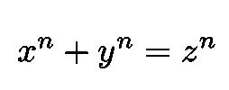

等式 1: FLT 指出，如果 n 是大于 2 的整数，则不存在满足该等式的正整数 *x* 、 *y* 和 *z* 。

对于任何这样的 T21

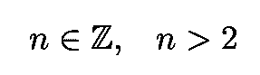

等式 2:在 FLT，n 必须遵守的条件。

其中 **Z** 表示整数的集合。法国律师兼数学家皮耶·德·费玛于 1637 年在《算术》一书的页边空白处提出了这个猜想，这是一部古希腊数学著作，由公元 3 世纪亚历山大的丢番图撰写。

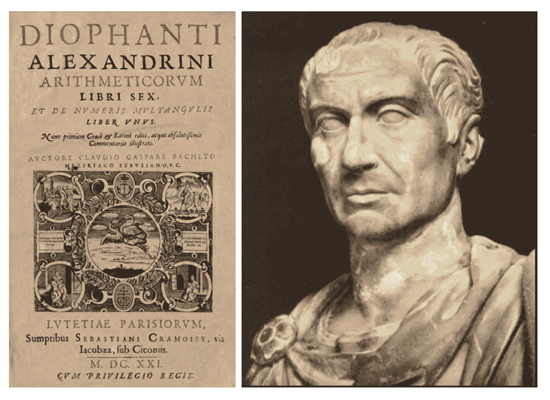

图 1:左边是丢番图《*算术》拉丁文原版的扉页(* [*来源*](https://en.wikipedia.org/wiki/Arithmetica) *)。右边是亚历山大的*丢番图雕像([来源](https://app.emaze.com/@ACFIZQZQ#2))。

费马有一个著名的猜想，他有一个情商的证明。但是它太大了，放不进书的页边空白处。经过历史上一些最伟大的数学家 350 多年的努力，英国数学家安德鲁·怀尔斯于 1995 年发表了该猜想的第一个成功证明。

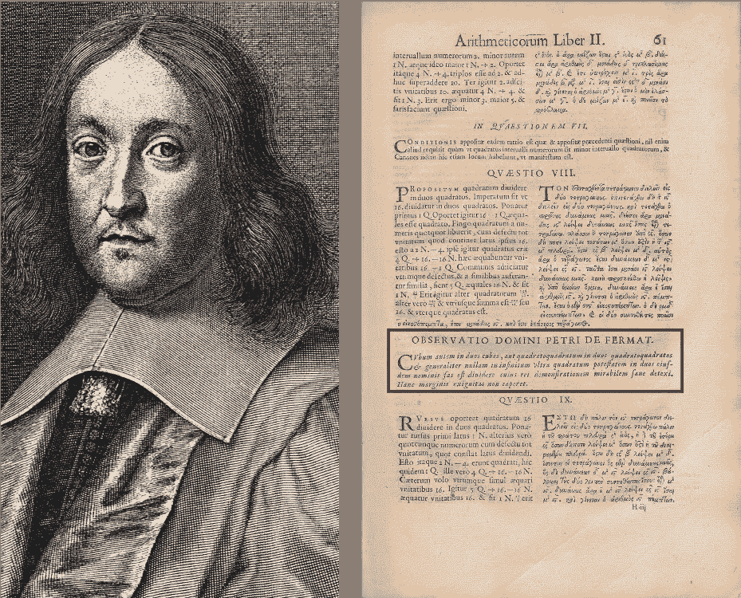

图 2:法国律师兼数学家皮耶·德·费玛(左)([来源](https://en.wikipedia.org/wiki/Pierre_de_Fermat))。1670 年版的丢番图*算术(*由费马之子*身后出版)，其中包括*费马猜想，被称为他的“最后定理”(在红盒子里)([来源](https://en.wikipedia.org/wiki/Fermat%27s_Last_Theorem))。

# n=4 时的费马定理

我们将证明 *n* =4 的特殊情况，这是最简单的一种。不过在此之前，我们需要证明下面这个更简单的关于[勾股三元组](https://mathworld.wolfram.com/PythagoreanTriple.html) ( *x* ， *y* ， *z* )的辅助定理。

## 辅助定理

所有服从勾股定理的三元组

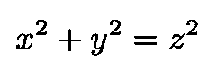

等式 3:著名的勾股定理。

由下式给出:

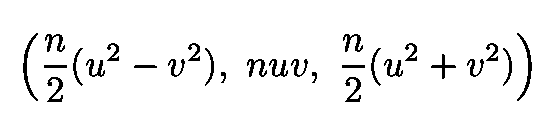

方程 4:方程的通解。3.

随着

其中 *u* 和 *v* 为奇数， **N** 为[自然数](https://mathworld.wolfram.com/NaturalNumber.html)的集合。注意，我们总是可以互换 *x* 和 *y，*自，如果( *x* ， *y* ， *z* )是解，那么( *y* ， *x* ， *z* )也是。

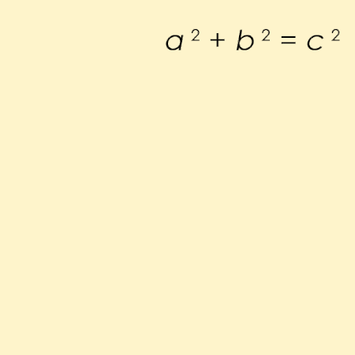

图 3:这个动画展示了一个毕达哥拉斯三元组的例子(来自维基百科)。

证据如下。

**第一部分**

首先，证明等式中的三元组是微不足道的。4 满足 Eq。3.只要把第一个代入后者，经过几行代数，我们就获得了想要的结果。

**第二部分**

我们现在要证明所有满足等式的三元组。3 由等式给出。4.我们首先不失一般性地假设( *x* ， *y* ， *z* )是一个[本原三元组](https://mathworld.wolfram.com/PrimitivePythagoreanTriple.html)，也就是说它们没有公因数 *y* 是偶数(它们是[互素](https://en.wikipedia.org/wiki/Coprime_integers)或者互质)。这暗示了两个因素 *y*

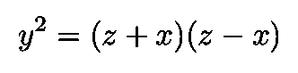

等式 5:等式的另一种写法。3.

没有公因数，它们中的每一个**都是一个[平方数](https://mathworld.wolfram.com/SquareNumber.html)，我们称之为 *u* 和 *v* (如果不清楚，请查看[链接](https://www.whitman.edu/Documents/Academics/Mathematics/byerleco.pdf)，第 6 页)。因此:**

等式 6:等式中的解。4 是这些(x，y，z)的倍数。

这就结束了我们的辅助定理的证明。

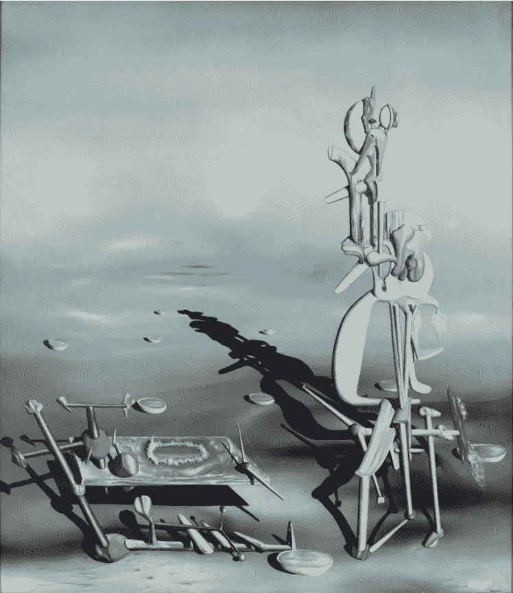

图 4:法国超现实主义画家伊夫·唐吉的作品《不确定的可分性》([来源](https://williamjennings.weebly.com/1942-indefinite-divisibility---yves-tanguy.html))。

在我们的最终证明之前，我们还需要一个更重要的概念:无限下降法。

## 数学插曲:**无限下降证明**

根据维基百科，“通过无限下降的证明是通过矛盾的证明”用于表明一个陈述不可能对任何数字成立，通过表明如果该陈述对一个数字成立，那么对一个更小的数字同样成立，导致无限下降并最终矛盾。"

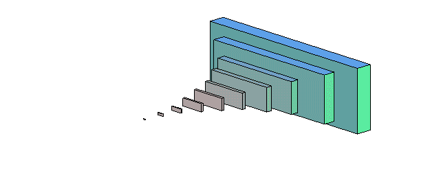

图 5:无限下降法的符号说明([来源](http://www.ms.uky.edu/~carl/ma330/html/bailey21.html))。

我们现在准备处理 FLT 的特殊情况 n T21 = 4。

## n=4 时费马大定理的证明

根据 FLT 的 *n* =4 案例，不存在互质三元组( *x* 、 *y* 、 *z* ) ∈ **N** )这样的情况

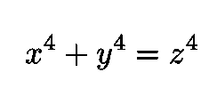

等式 7:FLT 陈述没有( *x* ， *y* ，*z*)∑**N**服从这个关系。

该策略将是上述无限下降方法的应用。

我们首先表明三元组( *x* ， *y* ， *z* )的存在，它服从:

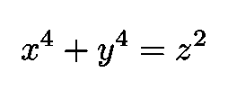

暗示着另一个三元组的存在

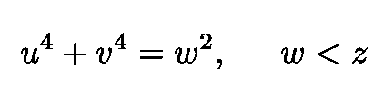

等式 8:如果有一个三元组服从 x⁴+y⁴ = z，那么就有一个三元组服从这两个关系。

(注意 *z* 的指数)。根据我们的辅助定理，我们知道存在这样的相对素数:

等式 9:根据我们的辅助定理，我们知道存在相对素数 m，并且使得上面的(x，y，z)满足等式。3.

现在注意，三元组( *n* ， *y* ， *m* )是互素毕达哥拉斯式的自:

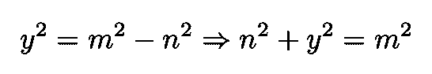

等式 10:三元组( *n* ， *y* ， *m* )互质勾股。

因此，我们可以写，引入新的相对素数:

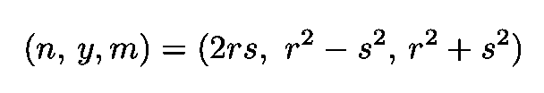

等式 11:由于( *n* ， *y* ， *m* )是互质毕达哥拉斯三元组，所以存在服从上述等式的相对素数。

现在既然( *m，n* /2)和( *r，s)* 是相对质数和的对

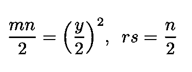

等式 12:对( *m，n* /2)和( *r，s)* 是互质数对。

我们断定 *m* 、 *n* /2、 *r、*s 都是正方形。因此，我们可以写:

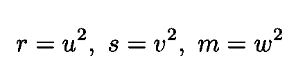

等式 13:由于( *m，n* /2)和( *r，s)* 是互质数对，我们得出结论: *m* ， *n* /2， *r，*s 都是平方数。

方程式中三元组的第三个元素。11 然后给我们:

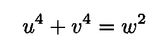

等式 14:等式中定义的结果。11 和 Eq。13.

但是我们知道，通过构造:

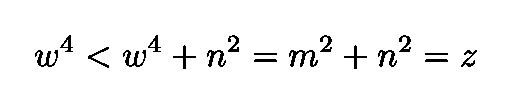

等式 15:这个不等式暗示我们有一个三元组(u，v，w ),其中 w 小于我们之前的 w。

这个过程的重复将会给我们无限多的解，并且这些解中的每一个都有一个新的坐标 *w* 小于上一个*w*因此，使用无限下降的方法我们结束我们的证明。

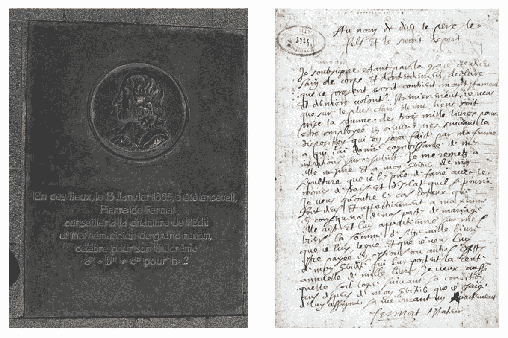

图 6:左边是皮耶·德·费玛的埋葬地。右边是费马在 1660 年 3 月 4 日手写的全息遗嘱([来源](http://oer2go.org/mods/en-wikipedia_for_schools-static/wp/p/Pierre_de_Fermat.htm))。

感谢您的阅读，再见！一如既往，我们随时欢迎建设性的批评和反馈！

我的 Github 和个人网站 [www.marcotavora.me](http://www.marcotavora.me/) 有一些其他有趣的材料，既有关于数学的，也有关于物理、机器学习、深度学习和金融等其他主题的！