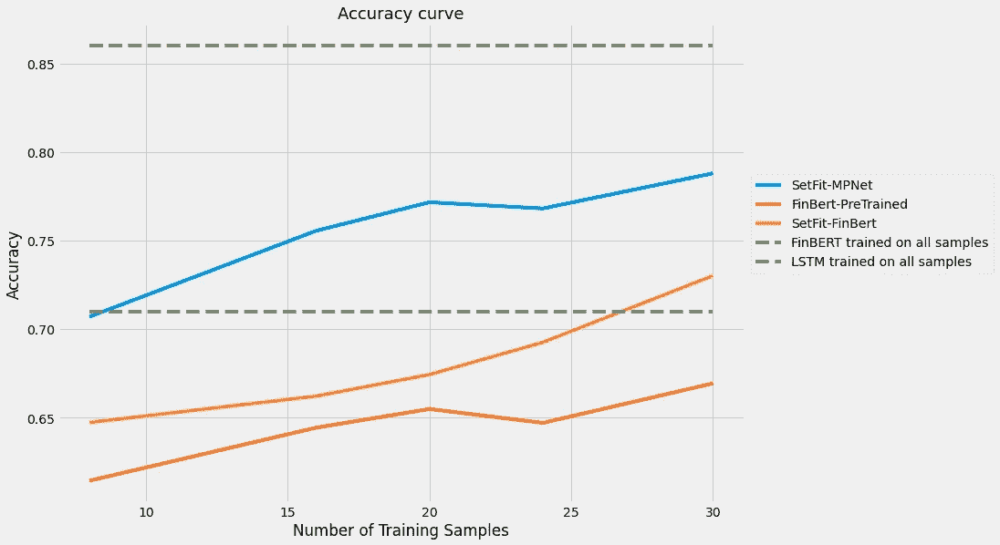
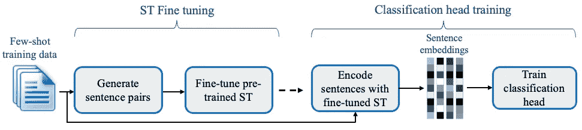
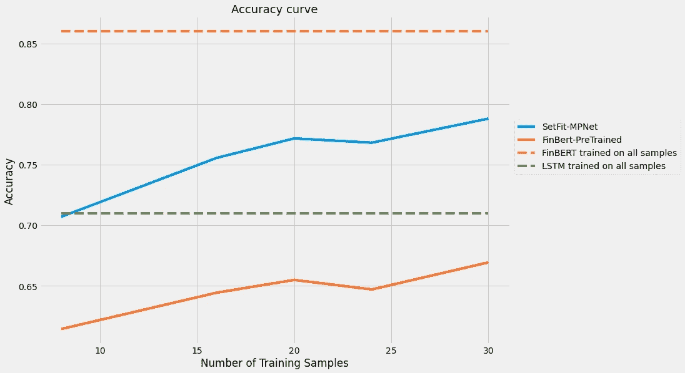

# 少数金融情绪分类——有用吗？

> 原文：<https://pub.towardsai.net/few-shot-financial-sentiment-classification-does-it-work-353cff279afd?source=collection_archive---------1----------------------->

到目前为止，我的数据科学生涯中最困难的事情不是建模，跟上最新的研究，甚至是向非技术人员展示复杂的想法，而是清理数据和正确标记数据——这是一项吃力不讨好的工作，但对模型的训练和工作至关重要。这就是为什么我对了解 [SetFit](https://arxiv.org/abs/2209.11055) 感到兴奋，这是由[抱抱脸](https://huggingface.co/blog/setfit) / [英特尔](https://community.intel.com/t5/Blogs/Tech-Innovation/Artificial-Intelligence-AI/Sentence-Transformer-Fine-Tuning-SetFit/post/1407712) / [UKP 实验室](https://github.com/UKPLab)推出的一种少数镜头文本分类机制。

来源:[https://arxiv.org/abs/2209.11055](https://arxiv.org/abs/2209.11055)

自 BERT 以来，已经有许多创新，但这一个突出的是它的实际优势——在一些拍摄设置中胜过 GPT3，同时体积小 1600 倍，速度快得足以在 CPU 上训练！

少量学习在金融领域至关重要，因为标记的数据通常是训练好模型的瓶颈——准确标记数据可能会很昂贵、棘手和乏味。因此，如果我们只用几个标签就能获得良好的性能，我们就可以节省时间，专注于仔细管理数据，使其准确无误。

我在这里试驾了一下，有 3 个问题我想回答:

1.  **少镜头学习对金融情绪分类有用吗？没有强有力的理由不应该这样做，因为它在 SST-5 等其他情感分类任务中表现很好。我确实想知道我们能否在论文中获得巨大的收益，以及需要多少数据点才能很好地对金融情绪进行分类，由于金融环境/模糊性，这可能很棘手。**
2.  **没有金融句子转换器，那么一个标准的**[**MPnet**](https://huggingface.co/sentence-transformers/all-mpnet-base-v2)**句子转换器会比 FinBERT 工作得更好吗？**这是一个已经在语义相似性上训练过的嵌入和更“理解”金融的金融嵌入之间的权衡问题。我最初的假设是，金融不像医学领域那样深奥，所以一个通用的预先训练的句子转换器可能比使用一个没有在语义相似性上训练过的 FinBERT 更好。
3.  **最后，如果我们用所有可能的数据对 SetFit 进行微调，它能跑赢 FinBERT 吗？**本质上，我们在问:( 1)句子转换器作为情感分类的基础是否优于一般的预训练模型;( 2)两阶段过程是否适用于整个数据集。

# 0.为什么它会起作用呢？

在我们开始实验之前，让我们先想想为什么它会起作用。

**预训练模型**:我们从句子转换器(ST)开始，这是一个坚实的预训练基线，具有基于相似性的句子的良好语义表示。最近[的一篇论文](https://jfds.pm-research.com/content/early/2022/06/10/jfds.2022.1.095)直接针对情绪对 ST 进行了微调，发现它比[芬伯特](https://github.com/ProsusAI/finBERT)略好。

**对比学习**:因为训练数据非常少，我们需要尽可能地从它们身上榨取一切——采样和配对正负数据允许建模过程创建更多的例子，供模型在 ST 微调阶段学习。这种重采样在一定程度上起作用，直到配对本身重复得太频繁，并且模型过拟合(作者推荐 1 个历元和 20 次重采样或迭代)。

# 1.SetFit 是如何对金融情绪进行开箱即用的？

自然地，我遵从的数据集是 Malo 等人的金融短语 bank。事实上，我们看到 SetFit 在少量拍摄的基础上工作得比在少量拍摄的情况下纯粹微调基础 FinBERT 好得多。正如一位作者在[中提到的](https://github.com/huggingface/setfit/issues/86)，20 个样本似乎是一个很好的选择，在此之后，改进速度会有所放缓。也可能是因为设置的迭代次数(也是 20)。肯定是要测试的东西。

也就是说，即使在每个标签上训练 30 个样本后，与完整模型仍有相对较大的差距(~5%)。与论文的例子相比，在 20 个样本后，SetFit 接近完整模型的精度。但这可能是由于数据集中存在潜在的模糊性，因此需要更多的例子来实现体面的结果。

# 2.我们可以通过转向财务骨干来改善 SetFit 吗？

当前句子转换器的局限性之一是没有一个已经在金融/商业领域句子上训练过的。这可能是一个问题，因为金融/商业术语可能具有与典型术语不同的含义。

使用 SetFit 设置运行一个[预训练的 FinBERT](https://huggingface.co/yiyanghkust/finbert-pretrain) ，该 FinBERT 在新闻、分析师报告和文档方面受过训练，产生的结果介于 SetFit 和 FinBERT 之间。两条意见:

(1)set fit 两步训练过程优于低数据状态下的正常微调设置。

(2)金融/业务领域预培训没有嵌入预培训的句子重要。金融词汇可能在预训练语料库中覆盖得足够好，因此专门针对金融文本进行微调不会有太多好处。这也可能是我们的目标语料库的结果，它集中在

# 3.结论

使用 **SetFit-MPNet** 可能是在低数据范围内进行一般金融情绪分类的最佳方法。我喜欢这种方法的简单性，它突出了句子转换器的强大功能，不仅适用于语义任务，还适用于分类。

如果您在自己的数据集上尝试了我的[代码](https://github.com/neoyipeng2018/FinancialPhraseBank-v1.0/blob/main/SetFit.ipynb)，并看到了任何不同，请告诉我。

PS:我没有耐心/计算去做#3，但是[这些人](https://jfds.pm-research.com/content/early/2022/06/10/jfds.2022.1.095)做了类似的事情，发现句子变形金刚更好。