# Tableau 中的数据过滤:Tableau 桌面专家认证之路

> 原文：<https://pub.towardsai.net/filtering-data-in-tableau-a-road-to-tableau-desktop-specialist-certification-2fe0cecad3ff?source=collection_archive---------1----------------------->

## 第 8 章:Tableau 过滤器的综合指南(提取、数据源、上下文、维度、度量、表计算)

欢迎来到第八章，在这一章中，我们将学习 Tableau 中不同类型的滤镜。

> 如果您想浏览其他章节，请访问: **Tableau:这是什么？为什么它是最好的？；Tableau 桌面专家认证之路。**

> 如果你想直接上 Tableau 桌面专家笔记，请在这里访问→[https://dakshtrehan . comment . site/Tableau-Notes-c 13 fceda 97 b 94 BDA 940 edbf 6751 cf 30](https://dakshtrehan.notion.site/Tableau-Notes-c13fceda97b94bda940edbf6751cf303)
> 
> 使用链接访问免费 Tableau 认证转储(有效期至 2022 年 7 月 6 日):
> 
> [https://www . udemy . com/course/tableau-desktop-specialist-certification-dumps-2022/？coupon code = e3f 08189 fa 4 bafae 72 BC](https://www.udemy.com/course/tableau-desktop-specialist-certification-dumps-2022/?couponCode=E3F08189FA4BAFAE72BC)

我们知道 Tableau 可以在实时或提取连接上工作。如果我们想要更快的计算和可视化，提取连接是首选。但有时，我们的摘录中有大量的数据，这导致更慢的可视化和紧张的体验。这就是过滤器可以帮助我们的地方，Tableau 让用户过滤他们的数据，从而最小化语料库并提高效率。

Tableau 允许用户以三种方式过滤视图:

*   **保留/排除数据点**
*   **选择割台**
*   **拖放到过滤器架**

Tableau 滤波器有 6 种类型，按操作顺序分别是:

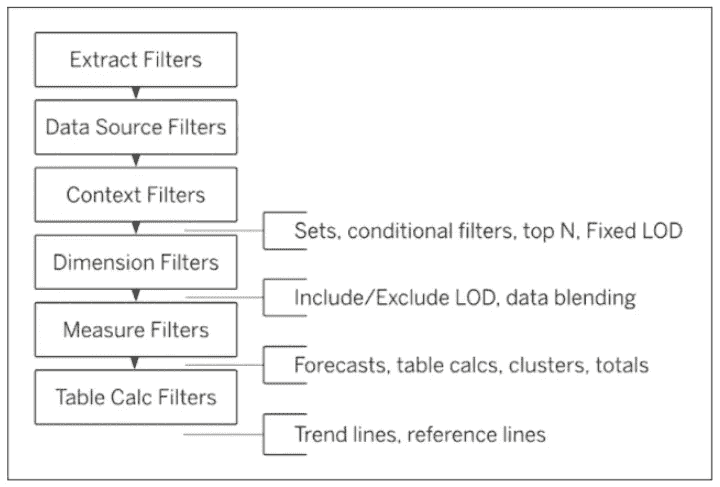

# 目录

*   **过滤方式**
    –保留/排除数据
    –选择标题
    –拖拽&至过滤器架
*   **过滤器类型**
    –提取过滤器
    –数据源过滤器
    –上下文过滤器
    –维度过滤器
    –度量过滤器
    –日期过滤器
    –表计算过滤器
*   **了解过滤卡**
*   **本题的样题**

# 过滤方式

## 保留/排除数据

我们可以通过从视图中选择所需的数据点来简单地过滤数据。

点击“*仅保留*”，将删除所有其他数据点。

选择*排除*，将排除该数据点。

## 选择标题

要从视图中过滤标题，只需点击它们。

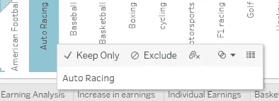

点击“*仅保留*”，将删除所有其他数据点。

选择*排除*，将排除该数据点。

## 拖放到过滤器架

要向我们的视图添加过滤器，只需将维度/度量拖放到过滤器架上。根据数据的类型，会出现一个对话框。

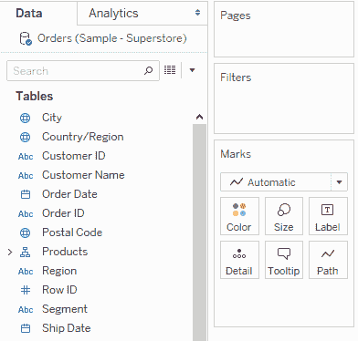

来源:Tableau 文件

# 过滤器的类型

Tableau 目前支持 6 种类型的过滤器:

## 提取过滤器

这些是用户可以访问和使用的第一类过滤器。提取是用于提升性能的实时数据的快照。创建摘录时，我们可以过滤不相关的数据并隐藏所有未使用的列，以减少数据负载。

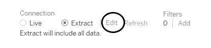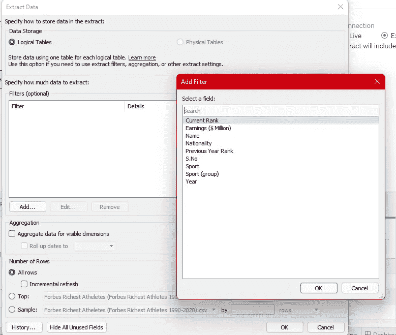

我们可以添加所需的维度/度量作为过滤器，并在其上放置更多的维度/度量过滤器(在本章的后半部分讨论)。

使用这个过滤器，Tableau 将创建一个过滤数据的摘录，可以进一步用于可视化。

**提取过滤器仅适用于单个表格选项。**

## 数据源筛选器

这些过滤器用于在数据源级别过滤出数据。这些过滤器的工作方式与提取过滤器非常相似，可以通过数据窗格进行访问。

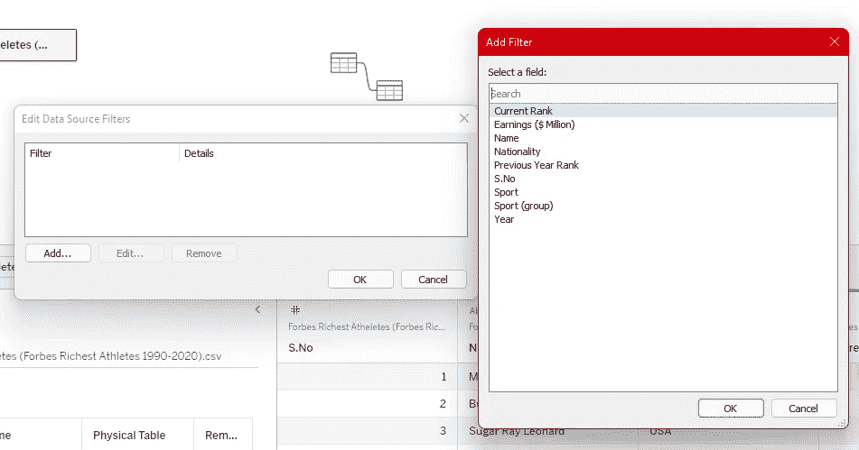

我们可以选择任何维度/度量进行过滤，并会有更多的维度/度量过滤器可供选择(本章稍后讨论)。

**提取过滤器仅适用于提取连接。**

**数据源过滤器适用于两种类型的连接。**

## 上下文过滤器

默认情况下，Tableau 中的每隔一个筛选器应用于所有行，而不考虑任何其他筛选器。简而言之，在我们的工作表中，每个过滤器都是独立工作的，但有时我们需要一个相互依赖的过滤器，也就是说，我们希望将第二个过滤器放在第一个过滤器的结果上，这就是使用上下文过滤器的地方。

上下文过滤器为过滤器创建操作顺序，即给予过滤器优先级。先前独立过滤的数据现在将根据上下文过滤器过滤的数据进行过滤。

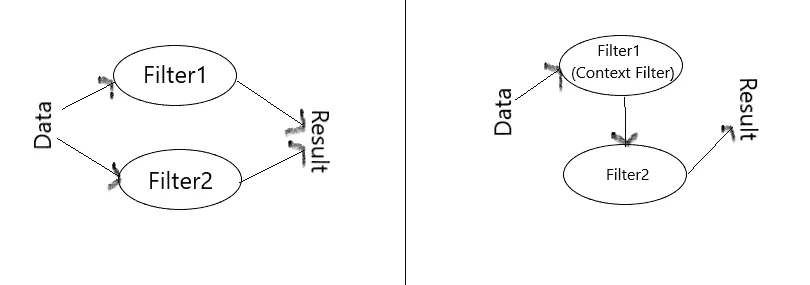

将数据集分成主要部分的一个或多个分类过滤器可以用作上下文过滤器。工作表中使用的所有其他过滤器都基于上下文过滤器过滤的数据。

**上下文过滤器的优点:**

*   提高性能→在大型数据集上使用上下文过滤器可以提高性能，因为它减少了 Tableau 引擎上的数据负载。
*   依赖过滤条件→帮助创建依赖过滤条件，从而为某些场景提供解决方案。

要创建上下文过滤器，只需右击过滤器并选择**“添加到上下文”。**

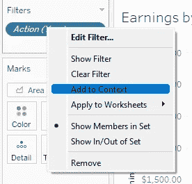

**上下文过滤器将始终以灰色显示。**

**将始终首先应用上下文过滤器，其余过滤器将应用于由上下文过滤器过滤的数据。**

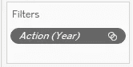

**上下文过滤器只能是维度过滤器。然而，我们可以设置一个或多个分类过滤器作为上下文过滤器。**

**为了加快上下文过滤器的速度:**在过滤之前进行数据建模，对连续日期使用 bin。

## 维度过滤器

这些过滤器可用于非聚集药丸，即蓝色药丸。这些过滤器可应用于维度、集合、箱和组。

要应用这些过滤器，只需将一个蓝色药丸拖到过滤器架上，它会给你四个选项:**、常规、通配符、条件和顶部。**

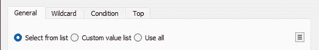

在“常规”选项卡中，我们可以通过简单地勾选“开/关”来手动包括/排除项目。

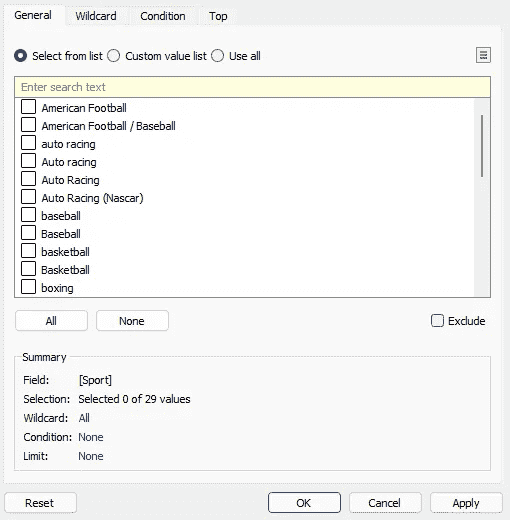

在通配符选项中，我们可以根据某种模式过滤数据。

在条件选项卡中，我们可以放置某些条件或放置自定义公式。

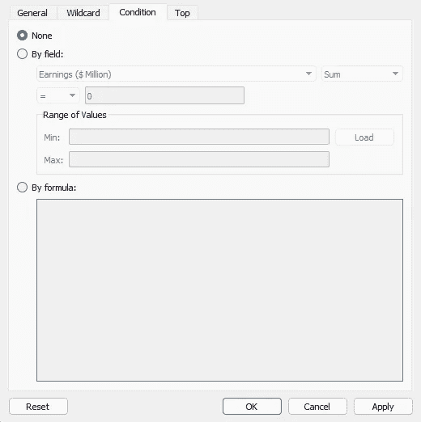

在顶部选项卡中，我们可以基于其他列或自定义公式指定顶部数据。

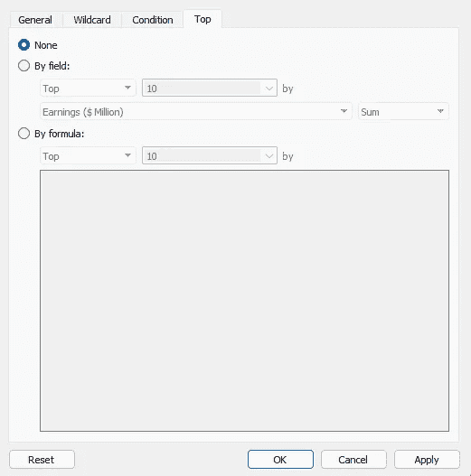

## 测量过滤器

这些过滤器仅用于汇总数据，即绿色药丸。

要应用此过滤器，只需将任何绿色药丸拖到过滤器架上，Tableau 将询问您希望在哪个聚合上应用过滤器。

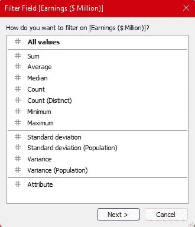

选择聚合后，它会为您提供四个选项:**取值范围，最少，最多，特殊。**

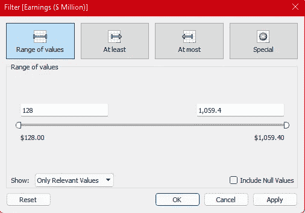

值的范围，至少，最多将让您为您的测量选择指定的范围。

如果您选择特殊，它将允许您过滤空值/非空值。

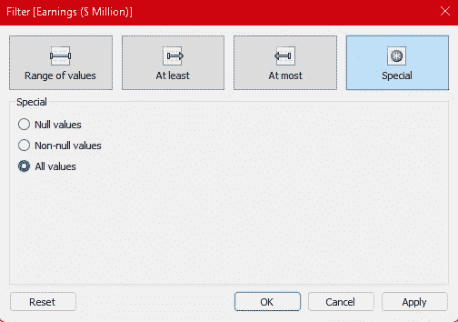

**如果您有一个大型数据源，过滤措施会导致性能显著下降。**

## 日期过滤器

当我们尝试将日期数据类型放在筛选器架上时，我们会得到与维度日期和度量日期的维度和度量筛选器完全相同的选项。

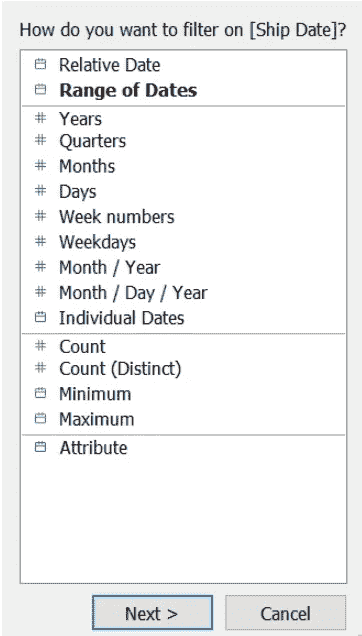

我们可以选择是否要根据相对日期或日期范围过滤数据，然后我们得到五个选项:**相对日期、日期范围、开始日期、结束日期和特殊日期。**

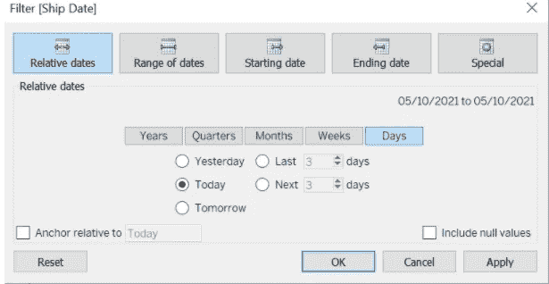

**日期部分与日期值过滤器**

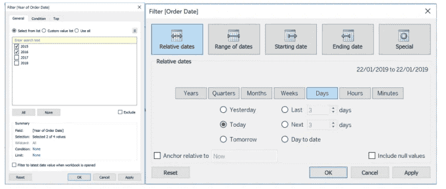

## 表格计算过滤器

要创建表计算过滤器，只需创建一个表计算(将在后面的章节中介绍)并将其拖到过滤器架上。

**表计算过滤器的优先级最低，这些过滤器应用于视图，而不是数据集。**

# 理解过滤卡

Tableau 允许用户改变用户与过滤卡交互的方式。

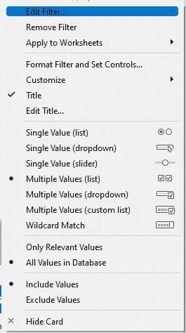

**编辑过滤器→** 通过添加/删除更多的值来编辑过滤器。

**移除过滤器→** 允许您从过滤器架上清除过滤器。

**应用于工作表→** 允许您将过滤器扩展到其他工作表。

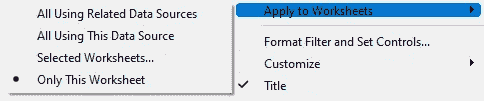

**格式化过滤器和设置控件→** 允许您格式化过滤卡的字体和颜色。

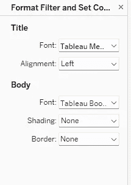

**自定义→** 它允许您控制过滤卡在工作表/仪表板中的显示方式。

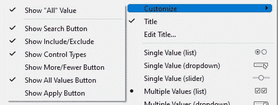

**标题→** 允许添加/删除过滤卡的标题。

**编辑标题→** 允许编辑过滤卡的标题。

**过滤卡模式→** 该选项允许用户格式化他们的过滤卡，即他们与过滤器交互的方式。

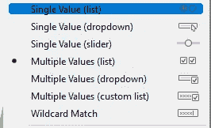

*   单值(列表):将过滤器列表显示为单选按钮，并带有一次只能选择一个的选项。
*   单值(下拉):将过滤器列表显示为下拉列表，并带有一次仅选择一个的选项。
*   单值(滑块):将过滤器显示为滑块，并带有一次仅选择一个过滤器的选项。
*   多个值(列表):将过滤器显示为列表，并带有一次选择多个值的选项。
*   多个值(下拉式):将过滤器显示为下拉式，并带有一次选择多个值的选项。
*   多个值(自定义列表):显示文本框，我们可以在其中一起添加多个过滤器。
*   通配符匹配:显示文本框，我们可以在其中添加*、&等模式来过滤数据。模式匹配不区分大小写。

**仅相关值→** 它允许用户仅显示某些值。这在使用上下文过滤器时非常有用。

**数据库中的所有值→** 它允许用户添加数据库中的每个值进行过滤，而不考虑其他过滤器。

**包含值→** 允许用户在视图中包含所有选择的值。

**排除值→** 允许用户排除视图中所有选中的值。

**隐藏卡片→** 隐藏过滤器卡片，但不要从视图中移除过滤器。

# 本主题的试题示例

**___ 和 ___ 是视图中最简单的过滤器选项。**

a.包含
b .排除
c .仅保留
d .过滤器

**解决方案:**仅保留，排除

**默认情况下，筛选只适用于创建它的工作表？**

a.真
b .假

**解:**真

**___ 是独立滤镜。**

a.上下文
b .提取
c .数据源
d .维度

**解决方案:**上下文

**多重过滤器适用于 ___ 子句。**

a.或
b .与
c .或非
d .与非

**解决方案**:以及

**限制到当前工作表的过滤器被称为？**

a.本地过滤器
b .受限过滤器
c .当前过滤器
d .远程过滤器

**解决方案:**局部过滤

> 使用链接访问免费 Tableau 认证转储(有效期至 2022 年 7 月 6 日):
> 
> [https://www . udemy . com/course/tableau-desktop-specialist-certification-dumps-2022/？coupon code = e3f 08189 fa 4 bafae 72 BC](https://www.udemy.com/course/tableau-desktop-specialist-certification-dumps-2022/?couponCode=E3F08189FA4BAFAE72BC)

# 参考资料:

[1] [Tableau 帮助| Tableau 软件](https://www.tableau.com/support/help)

[2] [个人笔记](https://dakshtrehan.notion.site/Tableau-Notes-c13fceda97b94bda940edbf6751cf303)

[3] [Tableau 桌面专家考试(新花样— 2021) — Apisero](https://apisero.com/tableau-desktop-specialist-exam-new-pattern-2021/)

# 感谢阅读！

请随意鼓掌，这样我就知道这篇文章对你有多有帮助，并在你的社交网络上分享它，这对我很有帮助。

如果你喜欢这篇文章，想了解更多**机器学习，数据科学，Python，BI。请考虑订阅我的时事通讯:**

> [达克什·特雷汉的简讯](https://mailchi.mp/b535943b5fff/daksh-trehan-weekly-newsletter)。

在网上找到我:[www.dakshtrehan.com](http://www.dakshtrehan.com/)

在 LinkedIn 与我联系:[www.linkedin.com/in/dakshtrehan](http://www.linkedin.com/in/dakshtrehan)

阅读我的科技博客:[www.dakshtrehan.medium.com](http://www.dakshtrehan.medium.com/)

在 Instagram 上联系我:[www.instagram.com/_daksh_trehan_](http://www.instagram.com/_daksh_trehan_)

# 想了解更多？

[YouTube 是如何利用 AI 推荐视频的？](/how-is-youtube-using-ai-to-recommend-videos-38a142c2d06d)
[利用深度学习检测新冠肺炎](https://towardsdatascience.com/detecting-covid-19-using-deep-learning-262956b6f981)
[逃不掉的 AI 算法:抖音](https://towardsdatascience.com/the-inescapable-ai-algorithm-tiktok-ad4c6fd981b8)
[GPT-3 向一个 5 岁的孩子解释。](/gpt-3-explained-to-a-5-year-old-1f3cb9fa030b)
[Tinder+AI:一场完美的牵线搭桥？](https://medium.com/towards-artificial-intelligence/tinder-ai-a-perfect-matchmaking-b0a7b916e271)
[一个内部人士的使用机器学习卡通化指南](https://medium.com/towards-artificial-intelligence/an-insiders-guide-to-cartoonization-using-machine-learning-ce3648adfe8)
[谷歌是如何做出“哼哼来搜索？”](/how-google-made-hum-to-search-865f224b70d0)
[一行神奇的代码执行 EDA！](/one-line-magical-code-to-perform-eda-f83a731fbc35)
[给我 5 分钟，我给你深度假！](/give-me-5-minutes-ill-give-you-a-deepfake-ce83a645b0f9)

> *欢呼*