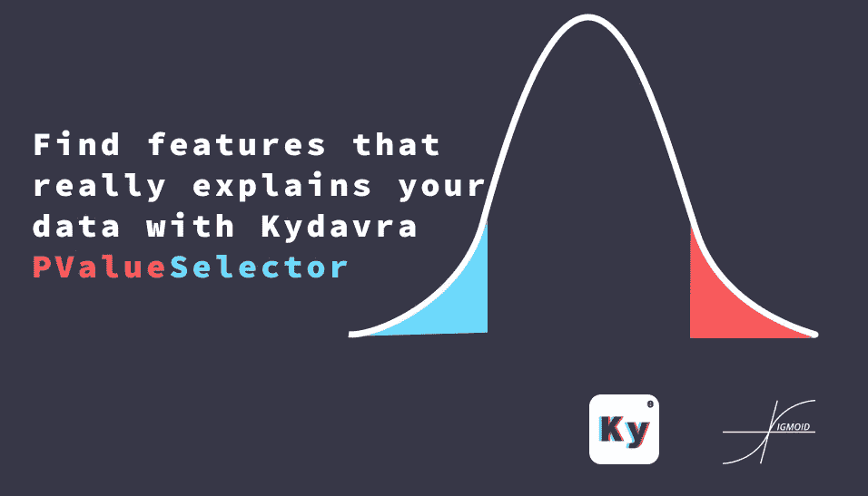
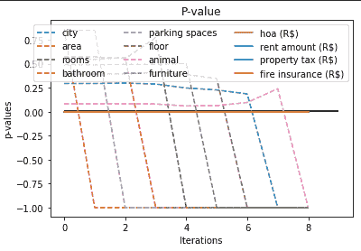

# 使用 Kydavra PValueSelector 查找真正解释您的数据的功能

> 原文：<https://pub.towardsai.net/find-features-that-really-explains-your-data-with-kydavra-pvalueselector-dbb5a1eda783?source=collection_archive---------3----------------------->

## [机器学习](https://towardsai.net/p/category/machine-learning)



Sigmoid 公共协会创建的图像。

特征选择是机器学习开发的一个非常重要的部分，它允许你保持你的模型尽可能简单，同时保持尽可能多的信息。不幸的是，有时它可能需要很高的数学知识和良好的编程实践技能。然而，在 Sigmoid，我们决定建立一个库，使功能选择像在 sci-kit learn 中实现模型一样简单。

## **使用 Kydavra 库中的 PValueSelector。**

对于那些主要是为了解决问题的人来说，这里有命令和代码:

因此，要安装 kydavra，只需在命令行中编写以下内容:

```
pip install kydavra
```

清除数据后，即清除数值插补、剔除外层数据等，您可以应用选择器:

```
from kydavra import PValueSelectorselector = PValueSelector()new_columns = selector.select(df, ‘target’)
```

如果我们在[巴西房屋出租数据集](https://www.kaggle.com/rubenssjr/brasilian-houses-to-rent)上测试 PValueSelector 的结果，我们看不到算法的性能有任何提高。但是 new_columns 只包含 4 列，所以它也可以用于一个已经运行良好的算法，只是为了使它更小。

```
raw_mean_squared_error - 1.0797894705743087
new_mean_sqared_error - 1.0620229254150797
```

## 那么它是如何工作的呢？

因此，在我们深入探讨什么是 p 值之前，我们需要先了解什么是零假设。

**零假设**是两个被测现象之间没有关系的一般陈述(或者也称特征)。

所以为了发现特征是否相关，我们需要看看我们是否能拒绝零假设。为此，我们使用 p 值。

**P 值** —是给定统计模型的概率值，如果零假设为真，一组统计观测值在数量级上大于或等于观测结果。

因此，使用上面的概念，我们可以更容易地将其表达为从我们的数据集中找到这种观察结果的概率。因此，如果 p 值很大，那么在生产模型中使用该功能获得良好结果的可能性很小。这就是为什么它有时不能提高我们的准确性，但它可以减少特征的数量，使我们的模型尽可能简单。

**奖金！**

您可以看到选择要素的过程，您可以绘制它，只需运行:

```
selector.plot_process(title=’P-value’)
```



使用 Kydavra PValueSelector 在巴西出租房屋数据集上创建的地块。

它有以下参数:

*   **标题** ( *默认*=*“P 值图”* )—图的标题。
*   **保存** ( *默认* = *假* )—布尔值，真表示会保存剧情，假则不会。默认情况下，它被设置为 false。
*   **file _ path**(*default*=*None*)—新建图的文件路径。

如果你想更深入地了解零假设和 p 值的概念，或者这个特征选择是如何工作的，下面有一个链接列表。


如果您尝试过 kydavra，我们邀请您通过填写此[表格](https://vpapaluta.typeform.com/to/g1EXxlSf)来分享您的印象。

西格蒙德用❤做的。

有用的链接:

*   [https://en.wikipedia.org/wiki/Null_hypothesis](https://en.wikipedia.org/wiki/Null_hypothesis)
*   [https://en.wikipedia.org/wiki/P-value](https://en.wikipedia.org/wiki/P-value)
*   [https://towards data science . com/feature-selection-correlation-and-p-value-da 8921 BF B3 cf](https://towardsdatascience.com/feature-selection-correlation-and-p-value-da8921bfb3cf)