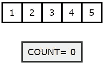
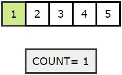
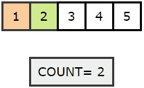
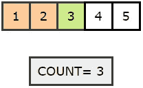
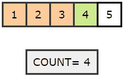
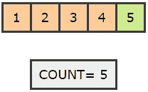
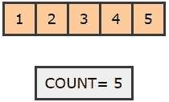

# 在 Python 中求数组的长度

> 原文：<https://pub.towardsai.net/find-the-length-of-an-array-in-python-83511cb611ce?source=collection_archive---------2----------------------->

Diana Polekhina 在 [Unsplash](https://unsplash.com/s/photos/length?utm_source=unsplash&utm_medium=referral&utm_content=creditCopyText) 上拍摄的照片

## [Python](https://towardsai.net/p/category/programming/python) ，[编程](https://towardsai.net/p/category/programming)，[教程](https://towardsai.net/p/category/tutorial)

## Python 编程 101 教程—纯逻辑方法

**作者:** [普拉蒂克舒克拉](https://www.linkedin.com/in/pratik-shukla28/)

在这一系列文章中，我们会用 Python 实现一些基本的练习题。我们的最终目标是**提高逻辑思维**。因此，我们不会在实现中使用任何 Python 库。如果您有任何建议或意见，请告诉我们。

**我们开始吧！**

## 练习题#1:

给你一个 n 元素的数组`arr`。你的目标是找到数组的长度`n`，而不使用任何内置函数，如`len().`。以下面的输入和输出为例。
`Input = [1,2,3,4,5]
Output = 5`

现在，花点时间理解问题，并用 Python 实现它。

## 练习题 1 的解决方案:

## 练习题 1 的解答说明:

*   首先，我们正在创建一个函数`find_len(arr).`，该函数将一个数组`arr`作为参数。我们的目标是找到数组的长度`arr.`
*   接下来，我们定义一个变量`count`并将其值设置为`0.`最后，我们将返回更新后的值`count`作为输入数组的长度。我们用`0`初始化它，因为此时我们不知道输入数组的大小。
*   接下来，我们运行一个`for`循环来遍历数组的所有元素。请注意，`for`循环只有在遍历完输入数组的所有元素后才会终止。
*   当我们遍历数组的元素时，我们将把`count`的值增加`1`来跟踪数组中元素的数量。
*   一旦`for`循环终止，我们返回`count.`的值，这里的`count`变量给出了输入数组`arr.`的长度
*   在下一步中，我们只是调用函数并打印值。

让我们来看看一些图形是如何进行操作的。

> 📚查看我们对最佳[深度学习工作站](https://towardsai.net/p/news/best-workstations-for-deep-learning-data-science-and-machine-learning-ml-4a6e43213b9e)的编辑推荐。📚

**绿色节点代表迭代的当前位置。红色的节点代表访问过的节点。**

*   最初，没有访问任何节点，我们也没有进入 for 循环。

*   `for`循环的第一次迭代。

*   `for`循环的第二次迭代。

*   `for`循环的第三次迭代。

*   `for`循环的第 4 次迭代。

*   `for`循环的第 5 次迭代。

*   因为没有更多的元素需要迭代，我们的 for 循环将终止并返回`count.`的当前值

所以，这就是我们如何不使用 Python 中的任何内置函数就能找到数组长度的方法。我们希望你们能从中学到一些新的东西。如果您有任何建议或意见，请随时发表评论。**感谢阅读！**

给普拉蒂克买杯咖啡！

## 资源:

*   你可以在 [**Google Colab**](https://colab.research.google.com/drive/1upZEdYiEoU_yhNbNRiyuvouGaPCMsGGV?usp=sharing) 和 [**GitHub**](https://github.com/Pratik-Shukla-22/Python-Basic-Programs/blob/main/Array_Length.ipynb) 上访问代码文件。