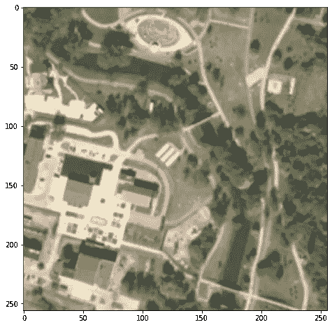
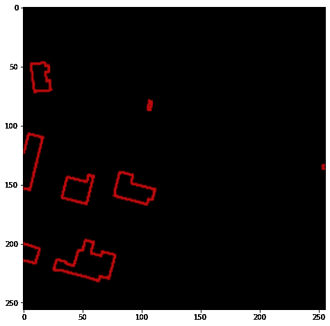
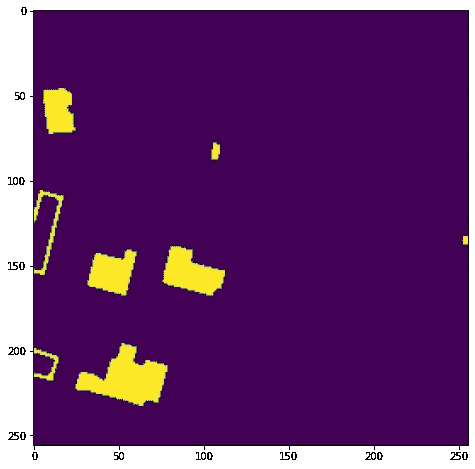
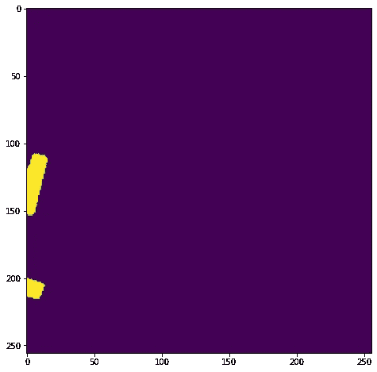
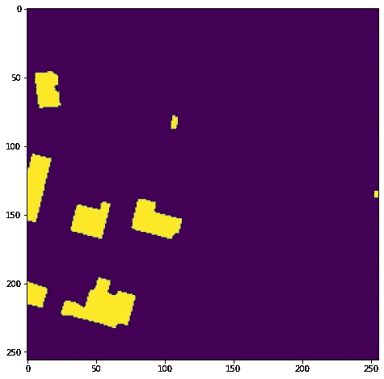

# 使用航拍和代码深度学习发现未经授权的建筑(第 1 部分)

> 原文：<https://pub.towardsai.net/find-unauthorized-constructions-using-aerial-photography-and-deep-learning-with-code-part-1-6d3ca7ff6fa0?source=collection_archive---------0----------------------->

## [深度学习](https://towardsai.net/p/category/machine-learning/deep-learning)


我们探测器的最终结果。

# 目录

1.[简介](#7f0e)
2。[问题陈述](#1bae)
3。[数据采集和预处理](#9d2a)
4。[下一步是什么…？](#e206)
5。[资源和作者](#2639)

# 介绍

在本文中，我们将经历数据收集和预处理阶段。这是我们进入深度学习模型之前需要完成的重要一步。

我们开发了一种独特的(更重要的是自动化的)获取和准备培训数据的方法。利用公开可用的资源，我们收集了超过 **50，000** 个地点的 RGB 照片。

使用 [**土地和建筑物登记**](https://pl.wikipedia.org/wiki/Ewidencja_grunt%C3%B3w_i_budynk%C3%B3w) 信息和一些图像变换，我们为每个位置准备了二进制掩模，划定了所有登记建筑物的区域。

您可以在本文末尾找到讨论笔记本的链接。

# **问题陈述**

建筑许可是建造建筑的第一步。这是每个人都需要经历的必然。尽管有严厉的处罚，许多人还是决定不用它来建造大楼。

这在波兰是个严重的问题吗？2011 年，在格利维采(波兰一个中等大小的城市)拍摄了航拍照片，在这些照片的帮助下，对建筑物进行了法律分析(手动！).结果令人震惊——发现了 1374 个差异[ [链接](https://www.rp.pl/artykul/723617-Zdjecia-lotnicze-ulatwiaja-wykrycie-samowoli-budowlanych.html/) ]。

这个项目的结果清楚地表明，检测到的异常数量和官方数据只是现实的一小部分。

这种差异的主要原因是航空/卫星图像的高成本以及对人工图像分析的需要。此外，技术限制和地方官员缺乏数字能力，使得难以监督建筑的合法性和可能的错误。

# **数据采集和预处理**

我们将使用几个典型的包和 [**栅格**](https://rasterio.readthedocs.io/) 来处理栅格数据——在我们的例子中，是空间(正射影像)图像。

```
**from** **io** **import** BytesIO
**import** **requests**
**import** **logging**
**from** **datetime** **import** datetime

**import** **numpy as** **np**
**import** **matplotlib.pyplot** **as** **plt**

**import** **rasterio**
**from** **scipy** **import** ndimage **as** ndi
**from** **skimage.transform** **import** resize
**from** **skimage.segmentation** **import** watershed
**from** **skimage.morphology** **import** closing

logging.basicConfig(level=logging.INFO)
```

现在我们需要为我们的图像设置参数，包括**大小**和**坐标**。您可以自由试验这些属性，但是您应该遵循一些规则:

1.  x 和 y 坐标必须放置在波兰边界内(我们使用特定的数据源)
2.  坐标基于 EPSG:2180 投影(在波兰用于小比例地图)，而不是通用的 EPSG:4326。你可以在这里 找到合适的转换器 [**。**](https://epsg.io/transform#s_srs=4326&t_srs=2180&x=18.5804469&y=54.4264950)

```
*# image resolution "on the ground"*
meters_by_pixel = 1  
img_side = 256 *# in meters*
img_size = (abs(int(img_side/meters_by_pixel)), abs(int(img_side/meters_by_pixel))) *# for comparing sources*

*# image coordinates*
x_min = 597500
y_min = 657450
x_max = x_min + img_side
y_max = y_min + img_side

logging.info(f"image coordinates: **{**(x_min, y_min), (x_max, y_max)**}**, image size: **{**img_size**}** resolution: **{**img_side**}**/**{**meters_by_pixel**}**")
```

我们将使用 [**官方地理门户服务**](https://mapy.geoportal.gov.pl/) 获取所选位置的当前正射影像。如果你想测试它的能力，这个网站也支持英语。

为了正确地创建请求，我们需要使用来自 WMS 的 **GetMap** 请求( [**Web 地图服务**](https://en.wikipedia.org/wiki/Web_Map_Service) )协议，该协议被广泛用于在互联网上共享地理数据。

然后，BytesIO 帮助我们处理响应的内容，因为它实际上是一个 png 图像，rasterio 以 NumPy 数组的形式检索我们感兴趣的图片。因为我们的原始数据数组具有“通道优先”的形状(4，256，256)，所以我们需要将其转换为(256，256，4)数组，并删除不必要的通道(alpha)。

```
*# GEOPORTAL ORTO*
**def** get_orto_image(aoi, resolution):
    x_min, y_min, x_max, y_max = aoi

    ORTO_WMS_URL = "mapy.geoportal.gov.pl/wss/service/img/guest/ORTO/MapServer/WMSServer"

    layer = 'Raster'
    resolution = resolution
    size = (abs(int((x_min - x_max)/resolution)), abs(int((y_min - y_max)/resolution)))

    params = {
        'request': 'GetMap',
        'service': 'WMS',
        'version': '1.1.1',
        'layers': layer,
        'styles': '',
        'width': size[0],
        'height': size[1],
        'srs': 'EPSG:2180',
        'bbox': ','.join((str(x) **for** x **in** (x_min, y_min, x_max, y_max))),
        'format': 'image/png',
        'transparent': 'TRUE'
    }

    parsed_url = "http://" + ORTO_WMS_URL + "?" + "&".join([f"**{**k.upper()**}**=**{**v**}**" **for** k,v **in** params.items()])

    logging.info(f"Requesting image from get_orto_image(**{**aoi**}**, **{**resolution**}**), img_size: **{**size**}**")
    response = requests.get(parsed_url)

    **if** response.ok:

        img = BytesIO(response.content)
        **with** rasterio.MemoryFile(img) **as** memfile:
             **with** memfile.open() **as** dataset:
                    data_array = dataset.read()
                    data_array = np.moveaxis(data_array, 0, 2)

        **return** data_array[:,:,:3]

    logging.warning(f"Could not get image from get_orto_image(**{**aoi**}**, **{**resolution**}**)")
    **return**
```



图一。所选位置的正射影像(地理门户响应)。

正射影像是我们数据集的第一部分。现在，我们需要使用类似的功能来查找这些位置的官方注册建筑。 [**波兰大地测量与制图办公室**](https://integracja.gugik.gov.pl/cgi-bin/KrajowaIntegracjaEwidencjiGruntow?lang=en) 允许我们获得必要的数据。

```
*# BUILDINGS*
**def** get_building_image(aoi, resolution):
    x_min, y_min, x_max, y_max = aoi
    BUILD_WMS_URL = "integracja.gugik.gov.pl/cgi-bin/KrajowaIntegracjaEwidencjiGruntow"

    layer = 'budynki'
    resolution = resolution
    size = (abs(int((x_min - x_max)/resolution)), abs(int((y_min - y_max)/resolution)))

    params = {
        'request': 'GetMap',
        'service': 'WMS',
        'version': '1.1.1',
        'layers': layer,
        'styles': '',
        'width': size[0],
        'height': size[1],
        'srs': 'EPSG:2180',
        'bbox': ','.join((str(x) **for** x **in** (x_min, y_min, x_max, y_max))),
        'format': 'image/png',
        'transparent': 'TRUE'
    }

    parsed_url = "http://" + BUILD_WMS_URL + "?" + "&".join([f"**{**k.upper()**}**=**{**v**}**" **for** k,v **in** params.items()])

    logging.info(f"Requesting image from get_orto_image(**{**aoi**}**, **{**resolution**}**), img_size: **{**size**}**")
    response = requests.get(parsed_url)

    **if** response.ok:

        img = BytesIO(response.content)
        **with** rasterio.MemoryFile(img) **as** memfile:
             **with** memfile.open() **as** dataset:
                    data_array = dataset.read()
                    data_array = np.moveaxis(data_array, 0, 2)

        **return** data_array[:,:,:3]

    logging.warning(f"Could not get image from get_orto_image(**{**aoi**}**, **{**resolution**}**)")
    **return**
```



图二。相同坐标下的建筑物轮廓(地理门户响应)。

为了有效地比较正射影像和等高线，我们需要通过闭合和填充所有等高线(包括闭合和开放的等高线)来创建一个掩膜。我们将结合 skimage 和 scipy 包提供的一些现有的解决方案。

```
**def** get_building_mask(aoi, resolution):

    logging.info(f"Generating image for get_building_mask(**{**aoi**}**, **{**resolution**}**)")
    data_array = get_building_image((x_min, y_min, x_max, y_max), meters_by_pixel)

    **if** data_array **is** **not** **None**:
        data_array = data_array[:,:,0] > 0

        *# closing contours*
        data_array = closing(data_array)

        *# filling contours*
        data_array = ndi.binary_fill_holes(data_array)

        *# filling open contours with watershed*
        water_mask = watershed(data_array)
        water_mask = water_mask != np.bincount(water_mask.flatten()).argmax()
        data_array = water_mask + data_array

        **return** data_array

    logging.warning(f"Could not get image for get_building_mask(**{**aoi**}**, **{**resolution**}**)")
    **return**
```

首先，我们只提取一个(红色)通道，然后使用[**关闭**](https://scikit-image.org/docs/dev/api/skimage.morphology.html#skimage.morphology.closing) 变换来填充可能会打开轮廓的不可见间隙。我们正在用 [**二进制 _ 填充 _ 孔洞**](https://docs.scipy.org/doc/scipy-0.14.0/reference/generated/scipy.ndimage.morphology.binary_fill_holes.html) **，**填充闭合轮廓，这使我们更接近最终的解决方案。



图三。使用 fill_binary_holes 后遮罩的结果。

现在该用一个 [**分水岭**](https://scikit-image.org/docs/dev/auto_examples/segmentation/plot_watershed.html) 分割算法来耍把戏了。根据这一解释:

*分水岭变换从标记开始泛洪高程图像，以确定这些标记的集水盆地。分水岭线将这些集水盆地分开，并与所需的分割相对应。* [**【链接】**](https://scikit-image.org/docs/dev/user_guide/tutorial_segmentation.html#region-based-segmentation)

在我们的示例中，分水岭将空边识别为与背景重叠的对象，并返回三个实例:背景和两个建筑物。背景作为值 1 返回，所以我们的目标是只获取具有更高数字的实例。



图 4。使用分水岭分割后的掩膜结果。

现在，我们简单地将关闭和分水岭遮罩加在一起，最终的遮罩就可以用于训练目的了。



图 5。注册建筑的最终掩膜。

# 下一步是什么？

在下一篇文章中，我们将重点关注使用 U-Net 架构训练我们的分割模型，以识别正射影像上的建筑物。

# **资源和作者**

[**链接到官方笔记本**](https://github.com/DataWorkshop-Foundation/olsztyn-project-samowola/blob/main/about/notebooks/1_gathering_data.ipynb)

**认识我们的团队:**
[玛尔塔·奥古斯特诺维茨](https://www.linkedin.com/in/martaaugustynowicz/)
[乌卡斯兹·萨瓦尼耶夫斯基](https://www.linkedin.com/in/sawaniewski/)
[达留什·塔纳耶夫斯基](https://www.linkedin.com/in/dtanajewski/)
[伊戈尔·维乔雷克](https://www.linkedin.com/in/igor-wieczorek/)
[马切伊·杰涅维奇](https://www.linkedin.com/in/maciej-zieniewicz/)

该项目在 [**DataWorkshop 基金会**](https://dataworkshop.foundation/) 社区内开展。


> DataWorkshop Foundation 主要是关于机器学习和人。我们专注于亲社会活动，利用机器学习的潜力。DataWorkshop 基金会的目标是通过实践活动传播有关机器学习和人工智能的知识，从而解决当前的重要问题。作为基金会活动的一部分，我们建立了一个知识库并丰富了体验，这得益于我们希望使用现有的机器学习技术和工具来实现创新的解决方案。