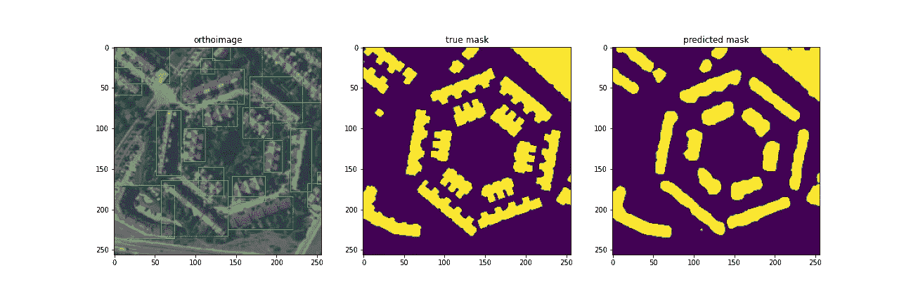
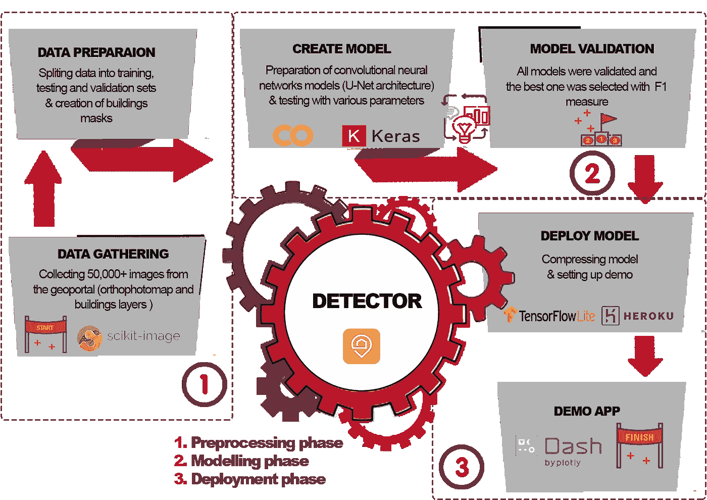
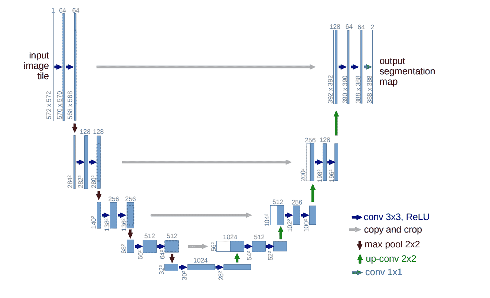
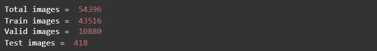
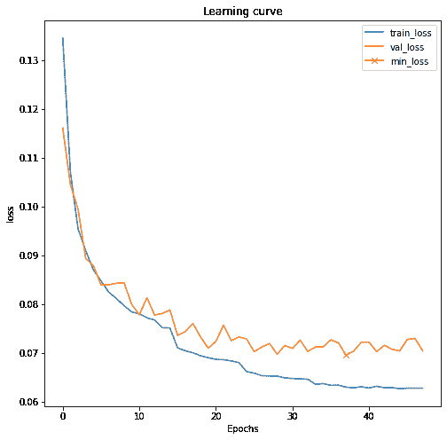
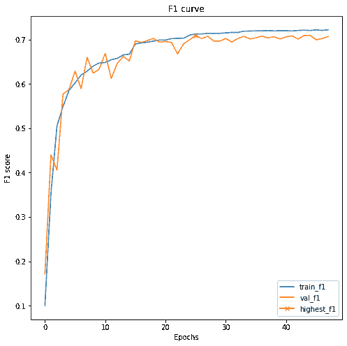
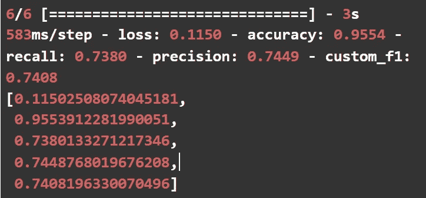
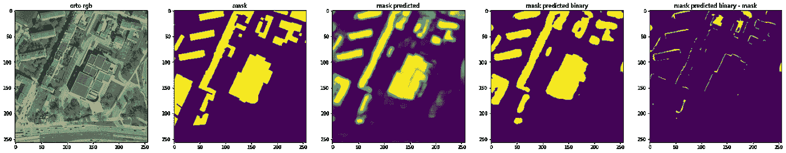
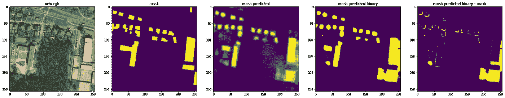
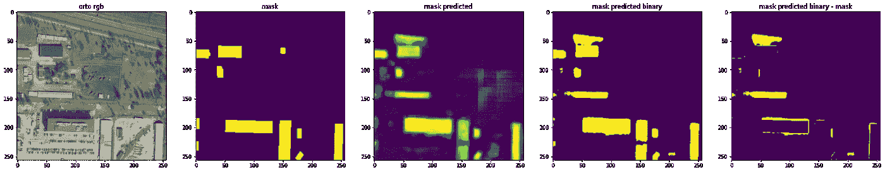

# 使用航拍和代码深度学习发现未经授权的建筑(第 2 部分)

> 原文：<https://pub.towardsai.net/find-unauthorized-constructions-using-aerial-photography-and-deep-learning-with-code-part-2-b56ca80c8c99?source=collection_archive---------1----------------------->

## [深度学习](https://towardsai.net/p/category/machine-learning/deep-learning)



我们探测器的最终结果(图片由作者提供)

# **目录**

1.[简介](#9407)
2。[详细项目工作流程](#ddaa)
3。 [U-Net 分割模型](#d11d)
4。[结果](#b20d)
5。[资源和作者](#19d2)

# 介绍

这个项目旨在寻找缺乏建筑许可的潜在建筑。在我们的 [**上一篇**](https://zieniewicz-m-1992.medium.com/find-unauthorized-constructions-using-aerial-photography-and-deep-learning-with-code-part-1-6d3ca7ff6fa0) 中，我们讨论了问题陈述以及收集和预处理数据的过程。现在，有了 50，000 多张正射影像和相应的掩膜，我们可以专注于项目的第二阶段——识别建筑物的语义分割模型。

要理解这个过程，您应该熟悉在 Keras 中创建深层网络的基础知识和 Python 中的简单数据操作技术。

由于我们希望在透明度和隐私之间做出权衡，我们决定不公布我们的数据集。请尝试使用我们的方法和前一篇文章中提供的代码，并自行收集。

您可以在参考资料和作者部分找到官方笔记本的链接。



项目流程图(图片由作者提供)

# **详细的项目工作流程**

我们将尝试以简单的方式指导您完成训练深度学习模型的各个阶段，包括:

*   将数据集分成训练集和验证集，并使用基本的数据扩充技术创建数据生成器，
*   为我们的模型的质量控制创建一个定制的度量，并为保存学习曲线的历史创建一个定制的回调，
*   使用 Keras 创建模型架构并训练它，
*   使用回调优化培训过程并实时显示进度，
*   对测试集的评估，
*   显示一些示例结果。

所以…让我们把手弄脏吧。:)

# **U-Net 分割模型**

首先，我们将花一点时间关注语义分割的概念。这种方法包括为每个像素分配一个特定类别存在的概率值(范围从 0 到 1)，在我们的例子中是“建筑物”类别。

我们的语义分割模型将在训练期间将正射影像作为输入，而输出将是具有相同高度和宽度的 2D 矩阵，每个像素具有特定类别的概率值(0 或 1)。由于这种解决方案，神经网络学会了如何将图像转换为包含所需类别和背景的遮罩。

事实证明，编码器-解码器深度神经网络非常适合这项任务，因为它们首先试图识别照片中任何建筑物的特征，然后将它们解码到具有给定类别概率值的掩模上。在我们的项目中，我们将使用 U-Net 架构，该架构最初于 2015 年提出，用于医学图像的分割。你可以在这里 找到一篇关于优信网的优秀文章 [**(我们发现它非常有用)，同时我们专注于解决我们问题的实用方法。**](https://towardsdatascience.com/understanding-semantic-segmentation-with-unet-6be4f42d4b47)



U-Net 模型架构(来源:官方 U-Net [出版物](https://arxiv.org/pdf/1505.04597.pdf))

首先，让我们导入所需的工具，尤其是来自 Keras 的各种元素，它们将用于创建模型。此外，我们将使用 [**livelossplot**](https://p.migdal.pl/livelossplot/) 来可视化每个时期后的学习曲线。

```
import os
import random
from datetime import datetime

import numpy as np
import pandas as pd

import matplotlib.pyplot as plt
from tqdm import tqdm
from sklearn.model_selection import train_test_split
from skimage.transform import rotate
from tensorflow import keras

from tensorflow.keras.models import Model, load_model
from tensorflow.keras.layers import Input, BatchNormalization, Activation, Dense, Dropout, MaxPooling2D, GlobalMaxPool2D, Conv2D, Conv2DTranspose
from tensorflow.keras.layers import concatenate, add
from tensorflow.keras.callbacks import EarlyStopping, ModelCheckpoint, ReduceLROnPlateau
from tensorflow.keras.optimizers import Adam
from tensorflow.keras.preprocessing.image import array_to_img, img_to_array, load_img
from tensorflow.keras.metrics import Recall, Precision

import keras.backend as K

from livelossplot import PlotLossesKeras
```

接下来，我们将设置以下参数:带有照片和蒙版的目录的路径、图像形状、训练时期的数量和批量大小。我们建议的设置适应免费的 Google Colab 设置的能力。

```
# images attributes 
img size = 256 

# training attributes
batch_size = 64
epochs = 50

# data paths
project_path ="./"
orto path = "data/geoportal orto/"
masks_path = project_path + "data/geoportal_build_mask/"
test_orto_path = project_path + "test/geoportal_orto/"
test_masks_path = project_path + "test/geoportal_build_mask/"
```

在训练之前，让我们将整个数据集分成一个训练集和一个验证集。在数据收集阶段，测试集被分离为一个选定城市的一组图像和蒙版。

```
# list of names of all images in the given path
ids = sorted(os.listdir(orto_path))
test_ids = sorted(os.listdir(test_orto_path))

# split train and valid
ids_train, ids_valid = train_test_split(ids, test_size=0.2, random_state=123)

print("Total images = ", len(ids))
print("Train images = ", len(ids_train))
print("Valid images = ", len(ids_valid))
print("Test images = ", len(test_ids))
```



现在，我们将着重于创建一个具有简单扩充(旋转 90 度倍数)的数据生成器。可定制的数据生成器帮助我们动态地将一批照片和蒙版加载到模型中，并且根据我们是否需要，使用可选的 **rotate_image()** 函数。在我们的例子中，我们不使用数据扩充进行验证和测试。如果您需要对您的图像集进行更高级的增强，Keras 内置的 ImageDataGenerator 是一种方法。

```
def rotate_image(image, angle=180):
    """Optional augumentation"""
    return rotate(image, angle, resize=True, preserve_range=True)

def data_gen(img_folder, mask_folder, img_ids, img_size, batch_size, random_rotate=True):
    """Function for data generator"""
    c = 0
    random.shuffle(img_ids)

    while True:

        img = np.zeros((batch_size, img_size, img_size, 3)).astype(float)
        mask = np.zeros((batch_size, img_size, img_size, 1)).astype(float)

        for i in range(c, c+batch_size): # initially from 0 to 64, c = 0\. 

            # load image    
            img_data = img_to_array(load_img(img_folder+img_ids[i]))/255.0

            # load mask
            img_mask = img_to_array(load_img(mask_folder+img_ids[i], color_mode="grayscale"))
            img_mask = (img_mask > img_mask.min()).astype(int)
            # add extra dimension for parity with train_img size [img_size * img_size * 3]
            img_mask = img_mask.reshape(img_size, img_size, 1)

            if random_rotate:
                rotate_angle = random.choice((0, 90, 180, 270))
                img_data = rotate_image(img_data, rotate_angle)
                img_mask = rotate_image(img_mask, rotate_angle)             

            # add to array - img[0], img[1], and so on.
            img[i-c] = img_data 
            mask[i-c] = img_mask

        c += batch_size
        if c+batch_size >= len(img_ids):
            c=0
            random.shuffle(img_ids)

        yield img, mask

# preparing data generators
train_gen = data_gen(orto_path, masks_path, ids_train, img_size, batch_size, random_rotate=True)
valid_gen = data_gen(orto_path, masks_path, ids_valid, img_size, batch_size, random_rotate=False)
test_gen = data_gen(test_orto_path, test_masks_path, test_ids, img_size, batch_size, random_rotate=False)
```

最后，让我们创建我们的架构。首先，我们将创建一个辅助函数来构建一个卷积块，它由两个卷积层组成，可以归一化它们的输出。激活功能是 ReLU。

```
def conv2d_block(input_tensor, n_filters, kernel_size = 3, batchnorm = True):
    """Function to add 2 convolutional layers with the parameters passed to it"""
    # first layer
    x = Conv2D(filters = n_filters, kernel_size = (kernel_size, kernel_size), kernel_initializer = 'he_normal', padding = 'same')(input_tensor)
    if batch norm:
        x = BatchNormalization()(x)
    x = Activation('relu')(x)

    # second layer
    x = Conv2D(filters = n_filters, kernel_size = (kernel_size, kernel_size), kernel_initializer = 'he_normal', padding = 'same')(x)
    if batch norm:
        x = BatchNormalization()(x)
    x = Activation('relu')(x)

    return x
```

现在，我们将处理 main 函数，该函数创建一个结合收缩和扩展路径的模型，输出是 0.0–1.0 范围内的分段预测掩码。我们还添加了一个 dropout 来帮助模型更好地概括。

```
def get_unet(input_img, n_filters = 16, dropout = 0.1, batchnorm = True):
    """Function to define the UNET Model"""
    # Contracting Path
    c1 = conv2d_block(input_img, n_filters * 1, kernel_size = 3, batchnorm = batchnorm)
    p1 = MaxPooling2D((2, 2))(c1)
    p1 = Dropout(dropout)(p1)

    c2 = conv2d_block(p1, n_filters * 2, kernel_size = 3, batchnorm = batchnorm)
    p2 = MaxPooling2D((2, 2))(c2)
    p2 = Dropout(dropout)(p2)

    c3 = conv2d_block(p2, n_filters * 4, kernel_size = 3, batchnorm = batchnorm)
    p3 = MaxPooling2D((2, 2))(c3)
    p3 = Dropout(dropout)(p3)

    c4 = conv2d_block(p3, n_filters * 8, kernel_size = 3, batchnorm = batchnorm)
    p4 = MaxPooling2D((2, 2))(c4)
    p4 = Dropout(dropout)(p4)

    c5 = conv2d_block(p4, n_filters = n_filters * 16, kernel_size = 3, batchnorm = batchnorm)

    # Expansive Path
    u6 = Conv2DTranspose(n_filters * 8, (3, 3), strides = (2, 2), padding = 'same')(c5)
    u6 = concatenate([u6, c4])
    u6 = Dropout(dropout)(u6)
    c6 = conv2d_block(u6, n_filters * 8, kernel_size = 3, batchnorm = batchnorm)

    u7 = Conv2DTranspose(n_filters * 4, (3, 3), strides = (2, 2), padding = 'same')(c6)
    u7 = concatenate([u7, c3])
    u7 = Dropout(dropout)(u7)
    c7 = conv2d_block(u7, n_filters * 4, kernel_size = 3, batchnorm = batchnorm)

    u8 = Conv2DTranspose(n_filters * 2, (3, 3), strides = (2, 2), padding = 'same')(c7)
    u8 = concatenate([u8, c2])
    u8 = Dropout(dropout)(u8)
    c8 = conv2d_block(u8, n_filters * 2, kernel_size = 3, batchnorm = batchnorm)

    u9 = Conv2DTranspose(n_filters * 1, (3, 3), strides = (2, 2), padding = 'same')(c8)
    u9 = concatenate([u9, c1])
    u9 = Dropout(dropout)(u9)
    c9 = conv2d_block(u9, n_filters * 1, kernel_size = 3, batchnorm = batchnorm)

    outputs = Conv2D(1, (1, 1), activation='sigmoid')(c9)
    model = Model(inputs=[input_img], outputs=[outputs])
    return model
```

**custom_f1** 指标是使用张量运算创建的，如下文[出版物](https://medium.com/@aakashgoel12/how-to-add-user-defined-function-get-f1-score-in-keras-metrics-3013f979ce0d)所述。它将允许我们通过 F1 分数来控制模型的质量，F1 分数是精确度和召回率的调和平均值。通过这种方式，我们试图避免模型通过预测实际上整个数据集的 0 或 1 值而走向极值的情况，这种情况通常在这种不平衡的数据中发生。

```
def custom_f1(y_true, y_pred): 
    """Function to calculate F1-score"""
    true_positives = K.sum(K.round(K.clip(y_true * y_pred, 0, 1)))
    possible_positives = K.sum(K.round(K.clip(y_true, 0, 1)))
    predicted_positives = K.sum(K.round(K.clip(y_pred, 0, 1)))
    precision = true_positives / (predicted_positives + K.epsilon())
    recall = true_positives / (possible_positives + K.epsilon())
    f1_val = 2*(precision*recall)/(precision+recall+K.epsilon())
    return f1 val
```

是时候编译我们的模型并检查它的摘要了。我们使用 Adam optimizer、BCE(二进制交叉熵)作为损失函数，并将准确度、召回率、精确度和 custom_f1 作为我们将在训练期间监控的指标。

```
input_img = Input((img_size, img_size, 3), name='img')
model = get_unet(input_img, n_filters=16, dropout=0.05, batchnorm=False)
model.compile(optimizer=Adam(lr=0.001), 
              loss="binary_crossentropy", 
              metrics=[ "accuracy", Recall(), Precision(), custom_f1])
model.summary()
```

下一步是创建一个定制的回调类，以便能够将我们的培训历史保存为一个单独的文件。在我们的例子中，在每个时期之后，我们简单地用当前的损失和度量值创建 pandas DataFrame，并将其保存为 Google Drive 上的. csv 文件。

```
class HistoryCallback(keras.callbacks.Callback):
    def on_epoch_end(self, epoch, logs=None):
        """Callback function at the end of each epoch"""      
        history_path = checkpoints_path + "history/"
        if not os.path.exists(history_path): 
          os.makedirs(history_path)

        filename = history_path + model_name + "_history.csv"
        keys = list(logs.keys())
        values = np.array(list(logs.values()))
        df = pd.DataFrame(data= [values], columns=keys)
        df['epoch'] = epoch
        df.reset_index(drop=True)
        with open(filename, 'a') as f: 
          df.to_csv(f, header=f.tell()==0)

        print(f"Saved history after epoch {epoch} to: {filename}")
```

现在，我们可以创建一个回调列表，包括:

*   提前停止(如果训练在一定时间内没有进展)，
*   当验证丢失卡住时，降低优化器的学习率，
*   使用验证集上的最佳 custom_f1()保存模型(如果您监视自定义指标，请记住设置最小/最大模式)，
*   在培训过程中实时绘图以查看学习曲线。

```
callbacks = [
    EarlyStopping(patience=10, verbose=1),
    ReduceLROnPlateau(factor=0.33, patience=4, min_lr=0.000001, verbose=1),
    ModelCheckpoint(checkpoints_path + model_name + ".h5", 
                    verbose=1, 
                    save_best_only=True, 
                    save_weights_only=False,
                    monitor='val_custom_f1',
                    mode = "max"),
    PlotLossesKeras(),
    HistoryCallback()
]
```

现在，我们终于可以拟合我们的模型，并在几个小时内欣赏所有按照预期方向绘制的美丽图表，当 F1 分数上升时(大多数时间)，损失越来越低。

```
results = model.fit(
    train_gen, 
    steps_per_epoch=len(ids_train)//batch_size,
    epochs=epochs, 
    callbacks=callbacks,
    validation_data=valid_gen,
    validation_steps=len(ids_valid)//batch_size, 
    verbose=1
)
```

# 结果

在验证期间，基本模型似乎显示出 F1 分数高达 0.71 的有希望的结果(参见基准测试结果[此处](https://www.diva-portal.org/smash/get/diva2:1417200/FULLTEXT01.pdf)，第 42 页)，所以让我们来看看它能提供什么。当您检查学习曲线时，您可以看到 val_loss 值减少的停滞导致在 epochs 限制之前提前停止，而验证集的最大 F1 分数是在训练的后半部分开始时获得的。



对测试集的评估显示结果略好于验证集，获得 0.74 的 F1 分数。

```
model.evaluate(
    test_gen, 
    steps=len(test_ids)//batch_size,
    verbose=1
)
```



测试集结果

现在，让我们来看看我们的细分模型实际上是如何工作的。我们将并排绘制正射影像、真实遮罩、预测遮罩以及阈值预测和真实遮罩之间的差异。

```
def plot_sample(img_folder, mask_folder, img_ids, thresh=0.5, i=None):
    """Function to plot the results"""
    if i is None:
        i = random.randint(0, len(img_ids))

    img = np.zeros((1, img_size, img_size, 3)).astype(float)
    mask = np.zeros((1, img_size, img_size, 1)).astype(float)

    # load image    
    img_data = img_to_array(load_img(img_folder+img_ids[i]))/255.0

    # load mask
    img_mask = img_to_array(load_img(mask_folder+img_ids[i], color_mode="grayscale"))
    img_mask = (img_mask > img_mask.min()).astype(int)
    # add extra dimension for parity with train_img size [img_size * img_size * 3]
    img_mask = img_mask.reshape(img_size, img_size, 1)             

    # add to array
    img[0] = img_data 
    mask[0] = img_mask

    # print file id for reference
    print(img_ids[i])

    # mask prediction
    mask_pred = model.predict(img)[0]
    mask_pred_t = (mask_pred > thresh).astype(np.uint8)

    # mask diff
    mask_diff = mask_pred_t * (img_mask<1)

    fig, ax = plt.subplots(1, 5, figsize=(30, 10))
    ax[0].imshow(img[0])
    ax[0].set_title('orto rgb')

    ax[1].imshow(mask.squeeze())
    ax[1].set_title('mask')

    ax[2].imshow(mask_pred.squeeze())
    ax[2].set_title('mask predicted')

    ax[3].imshow(mask_pred_t.squeeze())
    ax[3].set_title('mask predicted binary')

    ax[4].imshow(mask_diff.squeeze())
    ax[4].set_title('mask predicted binary - mask');plot_sample(test_orto_path, test_masks_path, img_ids=test_ids, thresh=0.5)
```



而且……模型工作正常。😁

[**链接到官方笔记本**](https://github.com/DataWorkshop-Foundation/olsztyn-project-samowola/blob/main/about/notebooks/2_building_unet_model.ipynb)

认识一下我们的团队:
[玛尔塔·奥古斯特诺维奇](https://www.linkedin.com/in/martaaugustynowicz/)
[茹卡斯兹·萨瓦尼耶夫斯基](https://www.linkedin.com/in/sawaniewski/)
[达留什·塔纳耶夫斯基](https://www.linkedin.com/in/dtanajewski/)
[伊戈尔·维乔雷克](https://www.linkedin.com/in/igor-wieczorek/)
[马切伊·杰涅维奇](https://www.linkedin.com/in/maciej-zieniewicz/)

本项目在 [**DataWorkshop 基金会**](https://dataworkshop.foundation/) 社区内进行。


> DataWorkshop Foundation 主要是关于机器学习和人。我们专注于亲社会活动，利用机器学习的潜力。DataWorkshop 基金会的目标是通过实践活动传播有关机器学习和人工智能的知识，从而解决当前的重要问题。