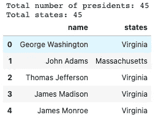
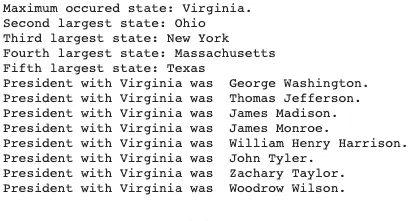
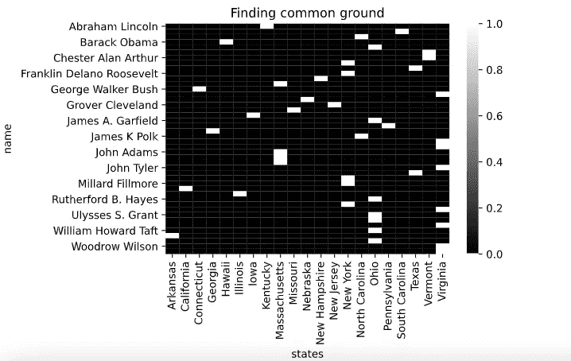
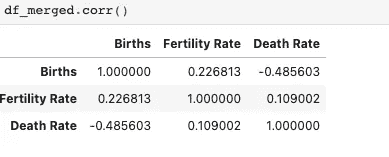
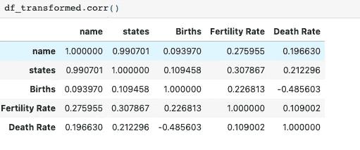
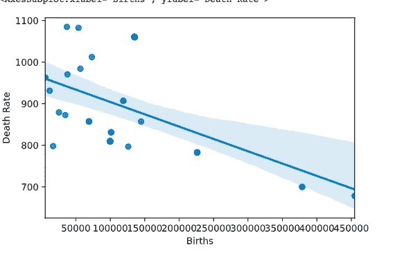
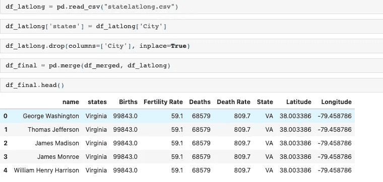
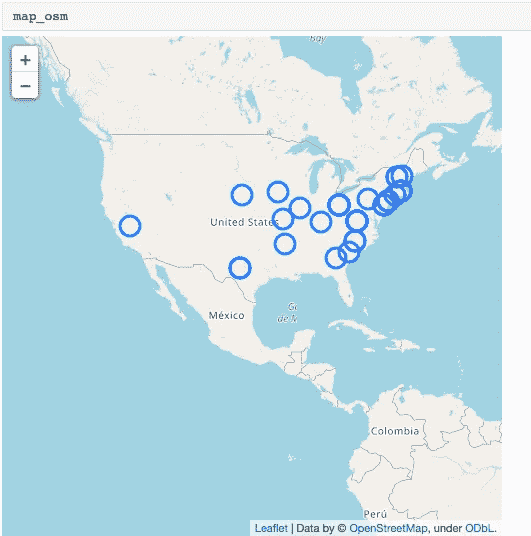

# 寻找共同点:美国总统的国家分析

> 原文：<https://pub.towardsai.net/finding-common-ground-us-presidents-state-analysis-cdd20cc22086?source=collection_archive---------5----------------------->

## [数据科学](https://towardsai.net/p/category/data-science)，[数据可视化](https://towardsai.net/p/category/data-visualization)

## 寻找共同点:美国总统的国家分析


【https://unsplash.com/photos/zfKlCKK-Ql0 

# 介绍

我们的目标是找出一位美国总统和他所在州与其他总统之间的任何关联。我们使用来自不同来源的数据来形成一个数据集，该数据集包括不同的美国总统及其所在的州，以及关于该州的其他事实。我们从多个来源提取数据，并将其组合成一个全面的数据集。我们还会找到最常见的州，并最终将结果绘制在实时交互式地图上。

# 要求

*   Python 3.8
*   熊猫
*   NumPy
*   薄层
*   海生的

# 数据准备和预处理

我们首先准备数据，梳理来自不同来源的数据集，并对其执行一些基本的预处理。

*   我们改变类型
*   删除了引号和空格
*   更改了列并合并了两个 CSV 文件

```
**def** load_data(path:str**=**"/"):
    """
        Loads the specified data using the path

        Args
        -------
        path: str (where president_timelines.csv and president_states.csv reside)

        Returns
        --------
        The combined dataframe
    """
    df_time **=** pd**.**read_csv("president_timelines.csv")
    df_states **=** pd**.**read_csv("president_states.csv")
    *# Setting columns as specified by the dataframe*
    df_time**.**columns **=** ["Index", "Name", "Birth", "Death", "TermBegin", "TermEnd"]
    df_states**.**columns **=** ["Name", "Birth State"]
    president_names **=** df_time**.**Name
    print(f"Total number of presidents: {len(president_names)}")
    president_states **=** df_states["Birth State"]
    print(f"Total states: {len(president_states)}")
    df **=** pd**.**DataFrame({"name":president_names, "states":president_states})
    *# changing type*
    df**.**name **=** df**.**name**.**astype(str)
    df**.**states **=** df**.**states**.**astype(str)
    *# removing whitespaces*
    df['states'] **=** df['states']**.**apply(**lambda** x: x**.**strip())
    *# removing quotes*
    df**.**states **=** df**.**states**.**apply(**lambda** x: x**.**replace('"',""))
    df**.**name **=** df**.**name**.**apply(**lambda** x: x**.**replace('"',""))

    **return** df
```

> 我们还更改了列的类型，以便以后能够使用它。



试映

# 寻找共同点

现在，我们开始写一个函数，它可以找到所有的公共状态。

*   我们首先创建一个州名图
*   我们还创建了一个反向索引
*   我们使用集合。计数器类获取最常见的计数，并使用反向查找索引查找状态
*   我们找到前 5 个州并打印出来

```
**def** common(show_counter**=False**, show_prez**=False**):
    """
    Find the common data points in the dataset
    """
    **from** collections **import** Counter
    mapping_state_name **=** {state:name **for** state,name **in** zip(df['states']**.**unique(), df['name']**.**unique())}
    df['states'] **=** df['states']
    counter **=** Counter(df['states']**.**values)
    counter_vice_versa **=** {counter[key]: key **for** key **in** counter**.**keys()}
    max_counter **=** max(counter)
    count **=** sorted(counter**.**values())
    second_largest_count **=** count[**-**2]
    print(f"Maximum occured state: {max_counter}.")
    print(f"Second largest state: {counter_vice_versa[second_largest_count]}")
    print(f"Third largest state: {counter_vice_versa[count[**-**3]]}")
    print(f"Fourth largest state: {counter_vice_versa[count[**-**4]]}")
    print(f"Fifth largest state: {counter_vice_versa[count[**-**5]]}")
    *# presidents with the max_counter*
    **if** show_prez:
        **for** name, state **in** zip(df['name'], df['states']):
            **if** state **==** max_counter:
                print(f"President with {max_counter} was {name}.")
    **if** show_counter:
        print(counter**.**keys())
common(**False**, **True**)
```



输出预览

# 使用基于矩阵的方法找到共同点的另一种方法

我们还使用不同的技术来获得公共状态。我们绘制了一个热图，以视觉上吸引人的方式获得结果。

```
matrix_based **=** df**.**groupby("name")['states']**.**value_counts()**.**unstack()**.**fillna(0)
sns**.**heatmap(matrix_based, vmax**=**1, vmin**=**0, cmap**=**"gray")
plt**.**title("Finding common ground")
```



试映

*   这里你可以看到，在一个特定的州，每一位总统，我们有 1.0，如果一位总统被重复，那么我们在一列中有 2 或 1
*   这很好地展示了总统在全州的分布情况
*   该热图显示， **0 的值为黑色**，白色表示 1.0

# 使用其他来源的数据进行进一步分析

我们将利用每个州的疾病预防控制中心的数据来发现一些有趣的见解。

```
**def** load_data_from_cdc(save**=False**):
    """
    Load data from CDC
    """
    *# reading the html table at index 0*
    df_states_fact **=** pd**.**read_html("https://www.cdc.gov/nchs/fastats/state-and-territorial-data.htm")[0]
    *# changing column (for join)*
    df_states_fact['states'] **=** df_states_fact['State/Territory']
    *# removing old column*
    df_states_fact**.**drop(columns**=**['State/Territory'], inplace**=True**)
    merged **=** pd**.**merge(df, df_states_fact)
    *# Save the csv*
    **if** save:
        merged**.**to_csv(index**=False**)
    merged**.**Births **=** merged**.**Births**.**astype(float)
    merged['Fertility Rate'] **=** merged['Fertility Rate']**.**astype(float)
    merged['Death Rate'] **=** merged['Death Rate']**.**astype(float)
    **return** merged

df_merged **=** load_data_from_cdc()
```



相关矩阵

*   相关矩阵没有显示数据点之间的关系。
*   让我们尝试将名称和状态转换成数值，然后尝试执行关联

```
**def** apply_transformations(df: pd**.**DataFrame):
    """
    Apply transformation on states and name
    """
    *# mapping of states and names*
    mapping_states **=** {state: index **for** index, state **in** enumerate(df['states'])}
    mapping_name **=** {name: index **for** index, name **in** enumerate(df['name'])}

    df**.**states **=** df**.**states**.**apply(**lambda** x: mapping_states[x])
    df**.**name **=** df**.**name**.**apply(**lambda** x: mapping_name[x])
    **return** df

df_transformed **=** apply_transformations(df_merged)
```


转换数据集



新结果

# 一些有趣的情节

让我们绘制一些有趣的数据点



死亡率和出生率

# 绘制地图

为了更好地理解这些数据，让我们用所有被标记的总统来绘制一张地图。为了解决这个问题，我们将纬度和经度数据集与美国总统数据集相结合。



组合数据集

```
map_osm **=** folium**.**Map(width**=**500,height**=**500,location**=**[37.0902, **-**95.7129], zoom_start**=**3)
df_final**.**apply(**lambda** row:folium**.**CircleMarker(location**=**[row["Latitude"], 
                                                  row["Longitude"]])**.**add_to(map_osm),
         axis**=**1)
```

> 然后我们用叶子绘制地图



我们的地图

# 结论

*   在分析数据时，我们发现了一些非常有趣的见解
*   我们试图把不同来源的数据结合起来以得到我们的答案
*   我们用不同的方法来可视化我们的数据
*   我们找到了最常见的状态
*   如果我们能够获得各种各样的国家数据，如教育、收入等，我们本可以做得更好

在这里访问笔记本:[https://aaditkapoor.github.io/president_analysis.html](https://aaditkapoor.github.io/president_analysis.html)