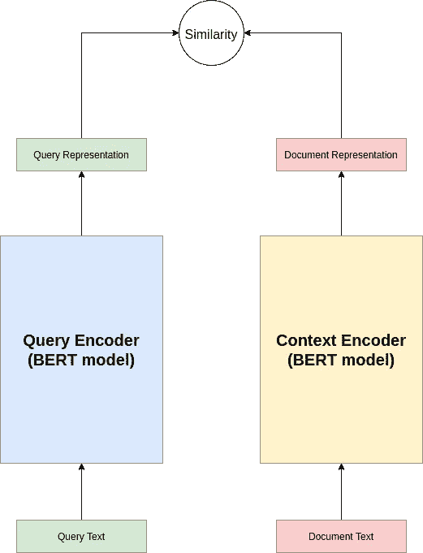

# 大海捞针:如何训练密集通道检索器

> 原文：<https://pub.towardsai.net/finding-the-needle-in-the-haystack-how-to-use-the-dense-passage-retriever-adc6a5527ff4?source=collection_archive---------0----------------------->

## [自然语言处理](https://towardsai.net/p/category/nlp)

## 让我们看看如何使用简单的 Transformer 训练一个模型来执行 Transformer 模型的密集通道检索。


照片由[马修·费尼](https://unsplash.com/@matt__feeney?utm_source=medium&utm_medium=referral)在 [Unsplash](https://unsplash.com?utm_source=medium&utm_medium=referral) 上拍摄

# 段落检索导论

段落检索是一个概念上简单的任务，其中系统必须*检索*给定输入*查询*的最相关段落。开放领域问答是段落检索的常见用例。这里，系统可以访问候选*上下文(可能包含问题答案的段落)*的大型语料库，并且任务是检索与问题最相关的一个或多个段落——最相关的一个或多个段落是最有可能包含回答问题所必需的信息的段落。

> 例如，考虑一个检索系统，其中段落语料库包含大量维基百科文章。如果你问这个系统*“魔戒是谁写的？”*，最相关的文章(在这种情况下无疑会包含答案)是维基百科关于“指环王”的文章。

概括地说，段落检索设置可用于任何需要将某个输入查询与段落集合中最相关或最相似的段落(该段落可以是任何类型的文本序列)进行匹配的情况。这种匹配或相似性计算是通过为输入查询生成向量表示并将其与段落语料库的向量表示进行比较来执行的。通常，语料库的向量表示是为了效率而预先计算的，因为语料库通常是段落的静态集合。

用于段落检索的模型可以分为两个主要阵营，传统的*稀疏*方法(例如 BM25 [1])和最近的*密集*方法，它们使用神经网络来生成密集向量表示。直到最近，传统的*稀疏*方法通常在检索准确性和训练/预测速度方面都优于*密集*方法。然而，变压器模型生成密集表示的适应性已经使得*密集*方法超过了传统技术，至少在检索准确性方面。训练和预测速度仍然坚定地支持*稀疏*方法，但准确性的提高通常足以忽略这一点！

# 密集通道检索器

成功利用变压器的电力进行*密集*段落检索的首批型号之一是被恰当命名为**密集段落检索器(DPR)**【2】。该模型的架构非常简单，使用两个编码器模型，一个用于嵌入(生成向量表示)段落，另一个用于嵌入输入查询。这种设置称为双编码器架构，使用两个独立的并行训练的 BERT 模型。

*请注意，术语段落、上下文和文档经常互换使用。*



DPR 双编码器架构(图表由作者创建)

在训练过程中，每个训练实例由一个输入查询、一个相关(肯定)段落和 *n* 个不相关(否定)段落组成。该模型被训练来增加相关的查询和段落对之间的点积相似度，即，减小由查询编码器生成的查询表示和由上下文编码器生成的段落表示之间的距离。

在检索数据集中，肯定段落通常是显式可用的，但是否定段落需要被选择。DPR 使用*批量否定*技术为每个问题选择否定段落。这里，对于每个查询，给定批次(在训练期间)的所有其他查询的*正*段落被用作特定查询的*负*段落。

接下来，我们将看看如何用简单的变形金刚训练一个 DPR 模型！

# 数据集

DPR 论文在五个标准基准数据集上展示了其模型的性能。在本文中，我们将使用其中一个数据集，特别是来自 Google 的自然问题数据集。

原始数据集在这里是可用的，但是我们将使用 DPR 作者发布的预处理版本。按照以下步骤下载数据集。

1.  从 DPR 回购下载/复制[数据下载脚本](https://github.com/facebookresearch/DPR/blob/main/dpr/data/download_data.py)。

```
wget https://raw.githubusercontent.com/facebookresearch/DPR/main/dpr/data/download_data.py
```

2.从包含下载脚本的目录中运行以下命令。

```
python download_data.py --resource data.retriever.nq-train
python download_data.py --resource data.retriever.nq-dev
```

3.这应该将两个 JSON 文件(`nq-train.json`和`nq-dev.json`)下载到`downloads/data/`中。让我们清理一下。

```
mv downloads/data .
mv data/retriever/* datarm -r data/retriever
rm -r download
```

该目录最终应该如下所示:

```
**.** 
├── **data** 
│   ├── LICENSE 
│   ├── nq-dev.json 
│   ├── nq-train.json 
│   └── README 
└── download_data.py
```

# 设置

现在，我们将安装简单的转换器和我们需要的其他库。

1.  从[这里](https://www.anaconda.com/distribution/)安装 Anaconda 或 Miniconda 包管理器。
2.  创建新的虚拟环境并安装软件包。
    `conda create -n simpletransformers python pandas tqdm wandb`
    `conda activate simpletransformers`
    `conda install pytorch>=1.6 cudatoolkit=11.0 -c pytorch` *注意:选择您系统上安装的 Cuda 工具包版本。*
3.  安装简单的变压器。
    `pip install simpletransformers`

# 数据准备

Simple Transformers 本身支持 DPR 回购协议中使用的数据格式，因此我们不需要对下载的文件进行预处理。

但是，简单转换器还支持其他输入格式，这对于您自己的数据集来说可能更方便。查看[文件](https://simpletransformers.ai/docs/retrieval-data-formats/)了解更多详情。

# 训练模型

随着数据集的下载和环境的设置，我们现在准备开始训练一个 DPR 模型！根据本文，我们将设置查询编码器和上下文编码器作为`bert-base-uncased`模型。

*`*train_batch_size*`*设置为* `*40*` *，这需要 24 GB 内存的 GPU。如果你的 GPU 内存少，可能需要减少* `*train_batch_size*` *。您还可以减少* `*num_train_epochs*` *来更快地完成训练，但这可能会降低模型的最终性能。**

**这里* *可以看到用权重&偏差* [*可视化的训练进度。*](https://wandb.ai/thilina/Training%20DPR%20on%20NQ?workspace=user-thilina)*

# *评估模型*

*接下来，我们加载训练好的模型并评估它的性能(我们也可以在`train_model()`之后调用`eval_model()`)。*

**加载用简单转换器训练的 DPR 模型时，不需要分别指定查询编码器和上下文编码器。我们只需要提供模型文件夹的路径(本例中为* `*outputs*` *)作为* `*model_name*` *。**

*让我们看看结果吧！*

## *快速了解一下指标*

*[平均倒数排名(MRR)](https://en.wikipedia.org/wiki/Mean_reciprocal_rank) 是用于评估诸如文档检索之类的排名任务的有用度量。MRR 分数取决于相关段落是否被检索到(如果没有，分数为 0)以及相关段落在检索列表中的排名(在列表上的位置)。*

*Top *k* 精度只是检查 top *k* 检索到的段落是否包含相关段落。如果是，分数为 1，否则为 0。*

*对评估数据中的所有查询的分数进行平均。*

# *包裹*

*段落检索是开放领域问答等任务的重要组成部分。本文演示了如何使用简单的转换器训练和使用密集通道检索模型。*

**更多技术细节，可以参考简单的变形金刚文档* [*这里*](https://simpletransformers.ai/docs/retrieval-specifics/) *。**

# *参考*

1.  *s .罗伯逊和 h .萨拉戈萨，2009 年。*概率相关性框架:BM25 及以后*。现在出版公司。*
2.  *Karpukhin，v .，ouz，b .，Min，s .，Lewis，p .，Wu，l .，Edunov，s .，Chen，d .和 Yih，W.T .，2020 年。面向开放领域问答的密集段落检索。arXiv 预印本 arXiv:2004.04906*