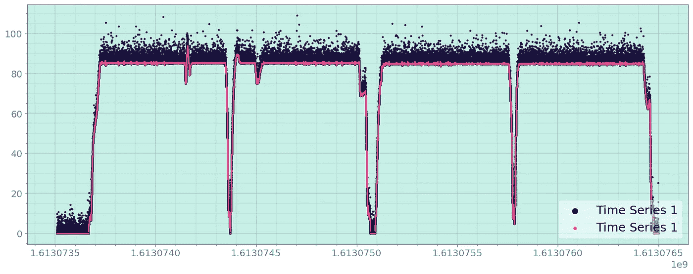
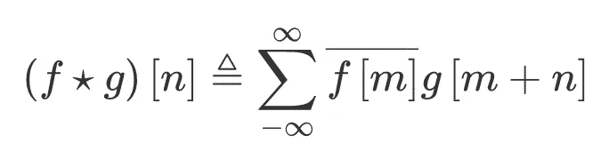
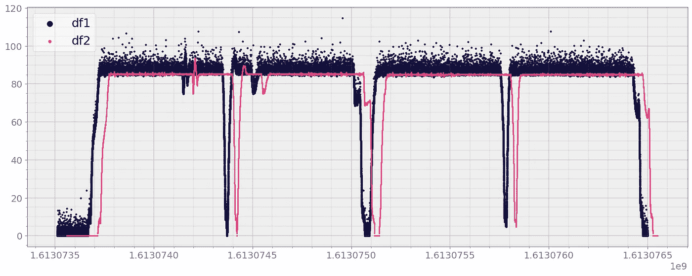
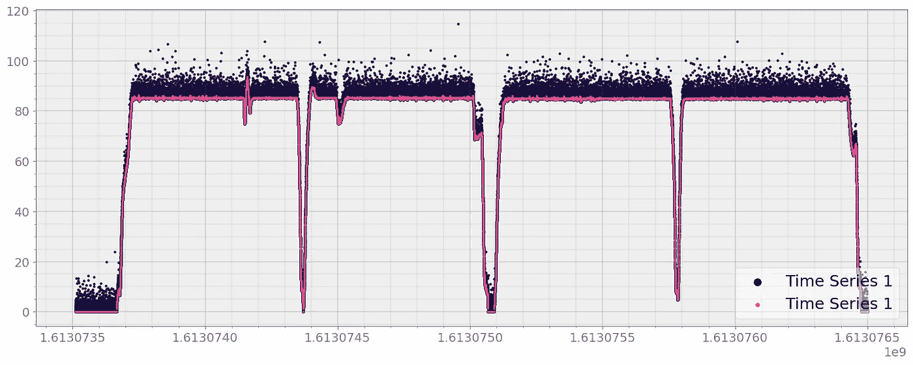

# 寻找两个时间序列之间的时移以获得最大相关性

> 原文：<https://pub.towardsai.net/finding-time-shift-between-two-timeseries-for-maximum-correlation-fc3010f1344e?source=collection_archive---------3----------------------->

## [数据科学](https://towardsai.net/p/category/data-science)、[数据可视化](https://towardsai.net/p/category/data-visualization)、[统计](https://towardsai.net/p/category/statistics)

## 只需几行代码就可以通过检索适当的时移找到两个时间序列之间的最大相关性



由作者生成的图像

一些工程和科学应用程序处理时间序列数据。例如，在自动驾驶的情况下，几个增强的车载传感器收集关于速度、加速度、燃料使用等信息。以时间序列数据的形式。

通常，从涉及某种传感器融合的多个传感器收集同类信息，以围绕收集的数据集建立可信度。然而，由于这些传感器背后固有的物理特性，从各种传感器收集的数据总是存在某种滞后。

统计科学为寻找两个时间序列之间的时移提供了丰富的工具。对于时间轴上均匀分布的时间序列数据，P **earson 和 Spearman 相关性**或**互相关性**函数提供了计算滞后并最终确定正确时移的方法。

然而，当两个时间序列不是等间距的，并且两个时间序列的采样时间不同时，事情就不那么简单了。例如，考虑我们正在使用两种传感器从一辆汽车测量领头车辆的速度:雷达和激光雷达。实际上，两个传感器将具有不同的采样时间，并且一个特定传感器本身的采样时间也不会相同。

在寻找两个时间序列之间的正确时移方面，不一致的采样时间增加了额外的困难。

# 重采样和互相关

处理非均匀采样时间的一种方法是以相等的间隔对数据集进行重新采样。

一旦我们对时间序列进行了统一采样，我们就可以使用互相关来找出一个时间序列中相对于另一个时间序列滞后的样本数量。滞后的样本数量可用于计算时移。

数学上，

**离散数据集 *f* 和 *g* 的互相关**定义为:



互相关函数

其中 *n* 为滞后。

下面是寻找两个时间序列`df1`和`df2:`之间最大相关性的时移的函数

```
def time_shift(df1, df2, time_col1 = 'Time', time_col2='Time', msg_col1 = 'Message', msg_col2= 'Message'):
    """
    Compute the time shift specified by `time_col2` of df2 with respect to 
    time of df1 specified by `time_col1`. Once we get time shift we will add it to 
    time axis of second dataframe

    """
    resample_time = np.max([np.median(np.diff(df1[time_col1])), np.median(np.diff(df2[time_col1]))])

    df1_re = strymread.resample(df1, rate = 1./resample_time, cont_method= 'nearest')
    df2_re = strymread.resample(df2, rate = 1./resample_time, cont_method= 'nearest')

    initial_time_gap = df1_re[time_col1][0] - df2_re[time_col2][0]

    x = df1_re[msg_col1].values
    y = df2_re[msg_col2].valuescorrelation = signal.correlate(x, y, mode="full")
    lags = signal.correlation_lags(x.size, y.size, mode="full")
    lag = lags[np.argmax(correlation)]

    lag_in_time_units = lag*resample_time

    total_time_shift = initial_time_gap + lag_in_time_units
    return total_time_shift
```

# **例子**

我已经将上述功能包含在一个 python 包`strym`中，我正在积极开发这个包，用于分析车辆的传感器数据，以方便使用。

如果数据帧至少有两列，列名分别为**时间**和**消息**，Strym 会将任何 pandas 数据帧识别为时间序列数据。

我们可以使用 pip 安装`strym`

```
pip install strym
```

下面，我将展示一个使用模拟数据集的示例，以展示 timeshift 的一个使用案例:

```
import strym
from strym import strymread
from scipy import signalprint(strym.__version__)
import pandas as pd
import matplotlib.pyplot as plt
import numpy as np
```

## 让我们为这个例子加载数据集

```
speed = pd.read_csv('../data/non_uniform_speed.csv')
```

这个例子的数据集可以从我的 GitHub repo 下载:[https://github.com/rahulbhadani/medium.com](https://github.com/rahulbhadani/medium.com)

现在，我们可以生成两个时间序列，其中一个相对于另一个发生了偏移，但同时也向其中一个时间序列添加了一些噪声(本例中为伽马噪声)

```
df1 = speed.copy(deep=True)
df2 = speed.copy(deep=True)
df2['Time'] = df2['Time'] + 50.242212
df1['Message'] = df1['Message'] +np.random.gamma(0.2, 2.94, len(df1['Message']))
```

让我们先将数据可视化:

```
fig, ax = strymread.create_fig(1)
ax[0].scatter(x = df1['Time'], y = df1['Message'], s=4, label='df1', c= '#131342')
ax[0].scatter(x = df2['Time'], y = df2['Message'],  s=1, label = 'df2', c= '#f34283')
ax[0].legend()
fig.show()
```



现在，我们可以使用`strym`包中`strymread`的`time_shift`函数来找出最佳的时间偏移

```
time_shift = strymread.time_shift(df1, df2)
print(time_shift)
```

这给了

```
*-50.24221205711365*
```

最后，我们可以在时移后可视化数据:

```
fig, ax = strymread.create_fig(1)
ax[0].scatter(x = df1['Time'], y = df1['Message'], s=4, label='Time Series 1', c= '#131342')
ax[0].scatter(x = df2['Time']+time_shift, y = df2['Message'],  s=1, label = 'Time Series 2', c= '#f34283')
ax[0].legend(loc='lower right')
fig.show()
```



正如我们所见，`time_shift`函数即使在有噪声的情况下也能确定正确的时移。

## 警告

但是，请注意，当两个时间序列之间的初始和最终数据点存在显著差异时，此方法可能不起作用。

此外，当两个时间序列之间没有显著的结构相似性时，基于互相关的方法失败。我们真的不能比较苹果和橘子。然而，两个不同种类的苹果(来自两个不同传感器的相同数据)是可以比较的。

**参考**

[https://docs . scipy . org/doc/scipy/reference/generated/scipy . signal . correlate . html](https://docs.scipy.org/doc/scipy/reference/generated/scipy.signal.correlate.html)

## 承认

这篇文章是我在国家科学基金会和能源部资助下的研究的副产品。