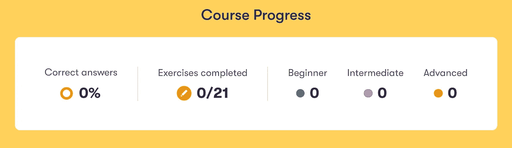

# 芬兰新的免费人工智能课程

> 原文：<https://pub.towardsai.net/finlands-new-free-ai-courses-b75c1d53ac84?source=collection_archive---------1----------------------->

## [新闻](https://towardsai.net/p/category/news)

## 如何通过 Elements AI 获得证书并利用课程？

照片由[Arttu pivinen](https://unsplash.com/@arttupaivinen?utm_source=medium&utm_medium=referral)在 [Unsplash](https://unsplash.com?utm_source=medium&utm_medium=referral) 拍摄

根据联合国开发计划署的数据，芬兰不仅是圣诞老人的故乡，也是科技领先的国家，甚至领先于美国。事实上，科技业务构成了“超过 50%的芬兰出口”。

我们甚至把像 Linux 和第一个网络浏览器这样的技术归功于芬兰。如今，芬兰通过其免费的人工智能在线课程 [**元素来延续其科技遗产。**](https://www.elementsofai.com/)

# 概观

Elements of AI 是由 Reaktor 和赫尔辛基大学制作的一套两个在线课程，将理论和实践相结合，并向尽可能多的人教授人工智能。这两门课程的名称是`Introduction to AI`和`Building AI`。

该课程正在实现其让人工智能变得可访问的使命，截至撰写本文时，已有超过 55 万人注册。

## 人工智能导论

第一门课程分为六章:

*   AI 是什么？
*   人工智能问题解决
*   真实世界的人工智能
*   机器学习
*   神经网络
*   含义

《AI 的元素》课程进度板块截图，作者抓拍。

课程设计得非常好，有简单的解释，很好的可视化，并且在大多数章节的底部有练习来巩固你的学习。

这两个课程都有一个“课程进度”功能区，向您显示您的课程进度，并让您保持动力。

## 建筑人工智能

第二部分大约需要 50 个小时，分为五章:

*   人工智能入门
*   处理不确定性
*   机器学习
*   神经网络
*   结论

这一次，练习更加深入和实用，因此它们将比以前更具挑战性。如果你卡住了，一定要看看下面的社区。

# 社区

《人工智能元素》在****有一个令人敬畏的、高度活跃的社区，在那里你可以讨论和询问关于每个章节的问题。****

****截至发稿时，该社区已有近 8000 名成员，您可以向他们提问和学习。我发现这是确保我真正理解材料的无价资源。最棒的是，它是免费的！****

# ****证书****

****完成后，你可以花 50 欧元购买每门课程的证书。这将是一个可共享的证书，将为任何简历或 LinkedIn 增添一大亮点，尽管它完全是可选的，而且课程通常是免费的。****

# ****最终项目****

****对于期末项目，你需要展示你的技能和创造力。虽然这不是必需的，但这是一个实践你的技能并与成千上万的其他学习者分享的好机会。****

****《人工智能元素》为最终项目提供了许多灵感和想法，例如“来源检查器”——一个在线检查新闻文章来源的机器人。****

****其他想法包括噪音污染预测，预测股票标准，如增长和可靠性，匹配想法和实干家，自动应用到相关工作，提出专家建议，评估金融风险，推荐健康饮食，等等。****

****也许我最喜欢的想法是“社会借贷的人工智能信用风险管理”项目，该项目使用人工智能来预测信用风险。像这样的模型已经在现实世界中使用了。****

****例如，小额贷款公司 Creditt 明显使用了 [**。人工智能的**](http://obviously.ai) API 对客户档案进行评分，并找出给用户多少钱。****

****简而言之，这是一个与成千上万的学习者一起学习实用人工智能技能的惊人的免费机会。****