# 使用 CCTV 图像的火灾探测— Monk 库应用程序

> 原文：<https://pub.towardsai.net/fire-detection-using-cctv-images-monk-library-application-242df1fca2b9?source=collection_archive---------1----------------------->

## [计算机视觉](https://towardsai.net/p/category/computer-vision)，[深度学习](https://towardsai.net/p/category/deep-learning)

## 关于如何在火灾探测等现实应用中使用 Monk 库的文章。

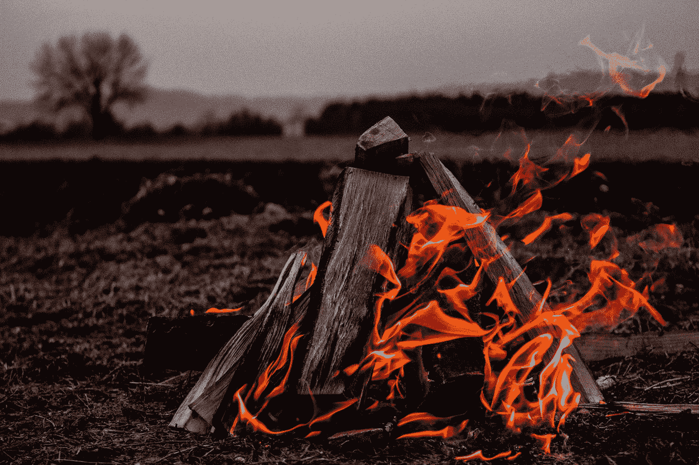

照片由[马尔科·霍尔瓦特](https://unsplash.com/@lemondyt?utm_source=medium&utm_medium=referral)在 [Unsplash](https://unsplash.com?utm_source=medium&utm_medium=referral) 拍摄

# 目标

*   用[僧库](https://github.com/Tessellate-Imaging/monk_v1)做一个探火深度学习模型，转移学习。
*   比较 [mobilenet-v2](https://keras.io/api/applications/mobilenet/#mobilenetv2-function) 、 [densenet121](https://keras.io/api/applications/densenet/#densenet121-function) 和 [densenet201](https://keras.io/api/applications/densenet/) 。

详细的教程可以在 [GitHub](https://github.com/Tessellate-Imaging/monk_v1/blob/master/study_roadmaps/4_image_classification_zoo/Classifier%20-%20Fire%20presence%20recognition%20in%20cctv-images.ipynb) 上找到。

## 关于数据集。

*   因为闭路电视图像的数据集非常少。因此，我从 Kaggle 获取了 2 个数据集。
*   第一个[包含火灾和非火灾图像，第二个](https://www.kaggle.com/phylake1337/fire-dataset)[包含 CCTV 火灾和非火灾图像。](https://www.kaggle.com/ritupande/fire-detection-from-cctv)
*   然后我合并了这两个数据集以获得更高的准确性。

## 关于 Monk 库和 Monk 如何让图像分类变得简单

*   编写更少的代码，创建端到端的应用程序。
*   只学习一种语法，使用任何深度学习库——py torch、mxnet、Keras、TensorFlow 等，创建应用。
*   通过多个实验轻松管理您的整个项目。

## 这座图书馆是为谁而建的

*   学生:使用我们的综合学习路线图无缝学习计算机视觉。
*   研究人员和开发人员:创建和管理多个深度学习项目。
*   Kaggle、Codalab、HackerEarth、AiCrowd 等上的比赛参与者。

## 目录

1.  安装 Monk
2.  使用预先训练的火灾探测模型
3.  从头开始训练分类器

*   *加载数据集*
*   *导入 Keras 后端*
*   *使用 mobilenet_v2 作为迁移学习架构的培训模型*
*   *使用 desnenet121 作为迁移学习架构的培训模式*
*   *使用 densenet201 作为迁移学习架构的培训模式*
*   *比较所有型号。*

4.结论

# 1.安装 Monk

```
#using cuda10.0 download monk using following command
pip install -U monk-cuda100
```

更多安装方法请访问 [Monk 库](https://github.com/Tessellate-Imaging/monk_v1#installation)。

# 2.使用预先训练好的模型进行演示

首先，从 google drive 下载预先训练好的模型。

```
#download the pre-trained models! wget --load-cookies /tmp/cookies.txt "[https://docs.google.com/uc?export=download&confirm=$(wget](https://docs.google.com/uc?export=download&confirm=$(wget) --save-cookies /tmp/cookies.txt --keep-session-cookies --no-check-certificate '[https://docs.google.com/uc?export=download&id=1tTJ6KEkzv1GIRsvo_-wI6YQh7iztbDCW'](https://docs.google.com/uc?export=download&id=1tTJ6KEkzv1GIRsvo_-wI6YQh7iztbDCW') -O- | sed -rn 's/.*confirm=([0-9A-Za-z_]+).*/\1\n/p')&id=1tTJ6KEkzv1GIRsvo_-wI6YQh7iztbDCW" -O cls_fire_trained.zip && rm -rf /tmp/cookies.txt
```

上面会下载预训练模型的 zip 文件，命名为 cls_fire_trained.zip，现在我们要解压文件了。

```
! unzip -qq cls_fire_trained.zip
```

导入***monk . keras _ prototype****用于使用 monk 库。*

```
**#Using keras backend**# When installed using pip*
**from** **monk.keras_prototype** **import** **prototype***
```

*以推断模式加载模型。*

```
*keras_gtf = prototype(verbose=1);
keras_gtf.Prototype("Fire-detection", "mobilenet_v2", eval_infer=**True**);

*#uncomment to use these model*
*#keras_gtf.Prototype("Fire-detection", "densenet121", eval_infer=True);*
*#keras_gtf.Prototype("Fire-detection", "densenet201", eval_infer=True);**
```

## *根据一些样本推断*

```
*img_name = "workspace/Fire-detection/test/1.jpg"
predictions = gtf.Infer(img_name=img_name);
from IPython.display import Image
Image(filename=img_name, height=300, width=300)*
```

*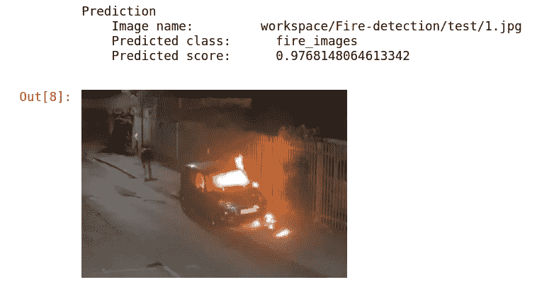*

```
*img_name = "workspace/Fire-detection/test/9.jpg"
predictions = keras_gtf.Infer(img_name=img_name)
*#Display* 
**from** **IPython.display** **import** Image
Image(filename=img_name, height=300, width=300)*
```

*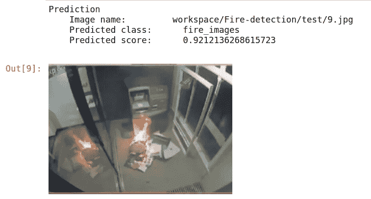*

```
*img_name = "workspace/Fire-detection/test/11.jpg"
predictions = keras_gtf.Infer(img_name=img_name)
*#Display* 
**from** **IPython.display** **import** Image
Image(filename=img_name, height=300, width=300)*
```

*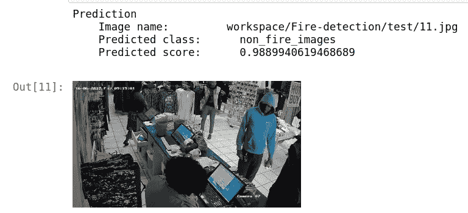*

```
*img_name = "workspace/Fire-detection/test/5.jpg"
predictions = keras_gtf.Infer(img_name=img_name)
*#Display* 
**from** **IPython.display** **import** Image
Image(filename=img_name, height=300, width=300)*
```

*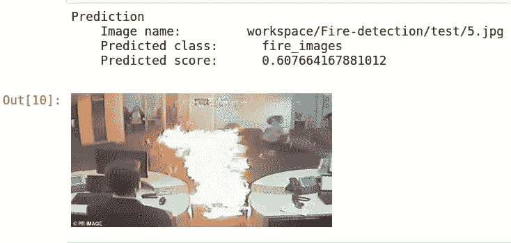**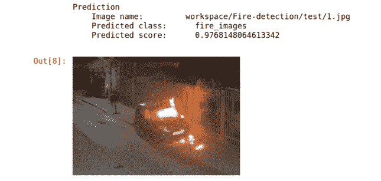*

*输出*

*如需更多示例，请访问笔记本。*

# *3.从头开始训练分类器*

## *近期内容*

*   *加载数据集*
*   *正在导入 Keras 后端*
*   *使用 mobilenet_v2 作为迁移学习架构的训练模型*
*   *使用 desnenet121 作为迁移学习架构的训练模型*
*   *使用 densenet201 作为迁移学习架构的训练模型*
*   *比较所有的模型。*

## *加载数据集*

*数据集配额:*

1.  *[https://www.kaggle.com/phylake1337/fire-dataset](https://www.kaggle.com/phylake1337/fire-dataset)*
2.  *[https://www.kaggle.com/ritupande/fire-detection-from-cctv](https://www.kaggle.com/ritupande/fire-detection-from-cctv)*

```
**#since dataset is from kaggle we have to install it*
! pip install -q kaggle

! mkdir ~/.kaggle
! cp kaggle.json ~/.kaggle/ 
! chmod 600 ~/.kaggle/kaggle.json! kaggle datasets download -d ritupande/fire-detection-from-cctv

! unzip -qq fire-detection-from-cctv.zip -d fire-dataset*
```

## *正在导入 Keras 后端*

```
**#Using keras backend*
*#when installed using pip*
**from** **monk.keras_prototype** **import** prototype

*# When installed manually (Uncomment the following)*
*#import os*
*#import sys*
*#sys.path.append("monk_v1/");*
*#sys.path.append("monk_v1/monk/");*
*#from monk.keras_prototype import prototype**
```

## *使用 mobilenet_v2 作为迁移学习架构的训练模型*

*步骤 1:加载实验并插入数据。更多详情请访问。*

```
**# Load experiment*
keras_gtf = prototype(verbose=1);
keras_gtf.Prototype("Fire-detection", "mobilenet_v2");

*# Insert data and set params in default mode*
keras_gtf.Default(dataset_path="fire-dataset/fire_dataset", 
                  model_name="mobilenet_v2", 
                  freeze_base_network=**False**,
                  num_epochs=15)*
```

*步骤 2:训练模型。*

```
**#Start Training*
keras_gtf.Train();

*#Read the training summary generated once you run the cell and training is completed**
```

*步骤 3:在推断模式下加载模型，检查它的工作情况。*

```
**# Load for test*
keras_gtf = prototype(verbose=1);
keras_gtf.Prototype("Fire-detection", "mobilenet_v2", eval_infer=**True**);*
```

*步骤 4:给出测试图像的路径。*

```
*img_name = "workspace/Fire-detection/test/1.jpg"
predictions = keras_gtf.Infer(img_name=img_name)
*#Display* 
**from** **IPython.display** **import** Image
Image(filename=img_name, height=300, width=300)*
```

*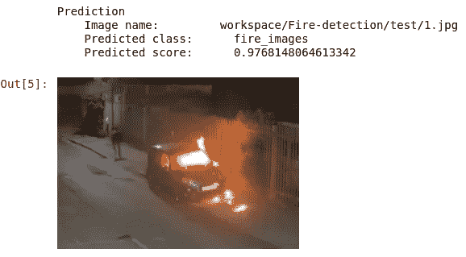*

*上面代码的输出*

*欲了解更多详情和结果，请访问[笔记本](https://github.com/Tessellate-Imaging/monk_v1/blob/master/study_roadmaps/4_image_classification_zoo/Classifier%20-%20Fire%20presence%20recognition%20in%20cctv-images.ipynb)。*

## *使用 desnenet121 作为迁移学习架构的训练模型*

*步骤 1:加载实验并插入数据。更多详情请访问。*

```
**# Load experiment*
keras_gtf = prototype(verbose=1);
keras_gtf.Prototype("Fire-detection", "densenet121");

*# Insert data and set params in default mode*
keras_gtf.Default(dataset_path="fire-dataset/fire_dataset", 
                  model_name="densenet121", 
                  freeze_base_network=**False**, 
                  num_epochs=15)*
```

*步骤 2:训练模型。*

```
**#Start Training*
keras_gtf.Train();

*#Read the training summary generated once you run the cell and training is completed**
```

*步骤 3:在推断模式下加载模型，检查它的工作情况。*

```
**# Load for test*
keras_gtf = prototype(verbose=1);
keras_gtf.Prototype("Fire-detection", "densenet121", eval_infer=**True**);*
```

*步骤 4:给出测试图像的路径。*

```
*img_name = "workspace/Fire-detection/test/1.jpg"
predictions = keras_gtf.Infer(img_name=img_name)
*#Display* 
**from** **IPython.display** **import** Image
Image(filename=img_name, height=300, width=300)*
```

*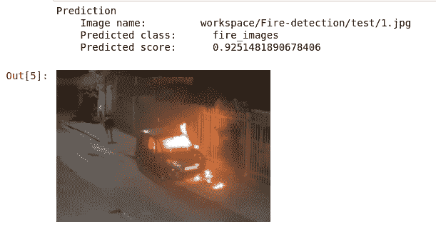*

*上面代码的输出*

*欲了解更多详情和结果，请访问[笔记本](https://github.com/Tessellate-Imaging/monk_v1/blob/master/study_roadmaps/4_image_classification_zoo/Classifier%20-%20Fire%20presence%20recognition%20in%20cctv-images.ipynb)。*

## *以 desnenet201 为迁移学习架构的训练模型*

*步骤 1:加载实验并插入数据。更多详情请访问[。](https://clever-noyce-f9d43f.netlify.app/#/quick_mode/quickmode_keras)*

```
**#Load experiment*
keras_gtf = prototype(verbose=1);
keras_gtf.Prototype("Fire-detection", "densenet201");

*# Insert data and set params in default mode*
keras_gtf.Default(dataset_path="fire-dataset/fire_dataset", 
                  model_name="densenet201", 
                  freeze_base_network=**False**, 
                  num_epochs=15)*
```

*步骤 2:训练模型。*

```
**#Start Training*
keras_gtf.Train();

*#Read the training summary generated once you run the cell and training is completed**
```

*步骤 3:在推断模式下加载模型，检查它的工作情况。*

```
**# Load for test*
keras_gtf = prototype(verbose=1);
keras_gtf.Prototype("Fire-detection", "densenet201", eval_infer=**True**);*
```

*步骤 4:给出测试图像的路径。*

```
*img_name = "workspace/Fire-detection/test/1.jpg"
predictions = keras_gtf.Infer(img_name=img_name)
*#Display* 
**from** **IPython.display** **import** Image
Image(filename=img_name, height=300, width=300)*
```

**

*上面代码的输出*

*更多详情和结果，请访问[笔记本](https://github.com/Tessellate-Imaging/monk_v1/blob/master/study_roadmaps/4_image_classification_zoo/Classifier%20-%20Fire%20presence%20recognition%20in%20cctv-images.ipynb)。*

## *比较所有的模型。*

*步骤 1:使用 Monk 库的比较类。更多详情[请访问](https://clever-noyce-f9d43f.netlify.app/#/compare_experiment)。*

```
**# Invoke the comparison class*
from monk.compare_prototype import compare*
```

*步骤 2:创建和管理比较实验。提供项目名称。*

```
*gtf = compare(verbose=1);
gtf.Comparison("Comparison-fire-detector");*
```

*这将按照以下结构创建文件和目录*

```
*workspace
    |
    |--------comparison
                    |
                    |
                    |-----Compare-fire-detection
                                |
                                |------stats_best_val_acc.png
                                |------stats_max_gpu_usage.png
                                |------stats_training_time.png
                                |------train_accuracy.png
                                |------train_loss.png
                                |------val_accuracy.png
                                |------val_loss.png                    
                    |-----comparison.csv (Contains necessary details of all experiments)*
```

*步骤 3:步骤 3:将实验添加到比较对象中。*

*   *第一个参数—项目名称。*
*   *第二个参数—实验名称。*

```
*#Add the trained models
gtf.Add_Experiment("Fire-detection", "mobilenet_v2");
gtf.Add_Experiment("Fire-detection", "densenet121");
gtf.Add_Experiment("Fire-detection", "densenet201");*
```

*步骤 4:运行分析。该步骤生成七幅图像。*

```
*gtf.Generate_Statistics();*
```

*步骤 5:可视化研究比较指标。*

*   *训练准确度曲线*

*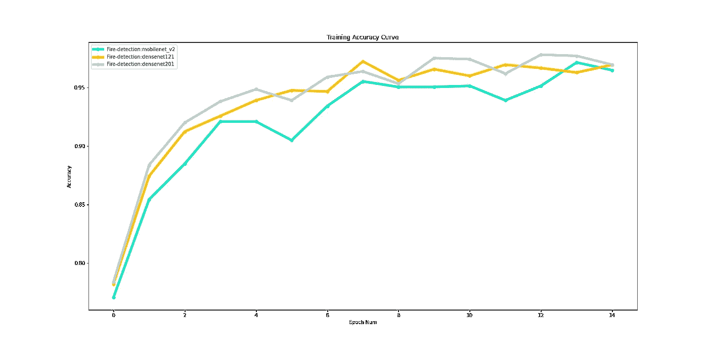*

*   *训练损失曲线*

*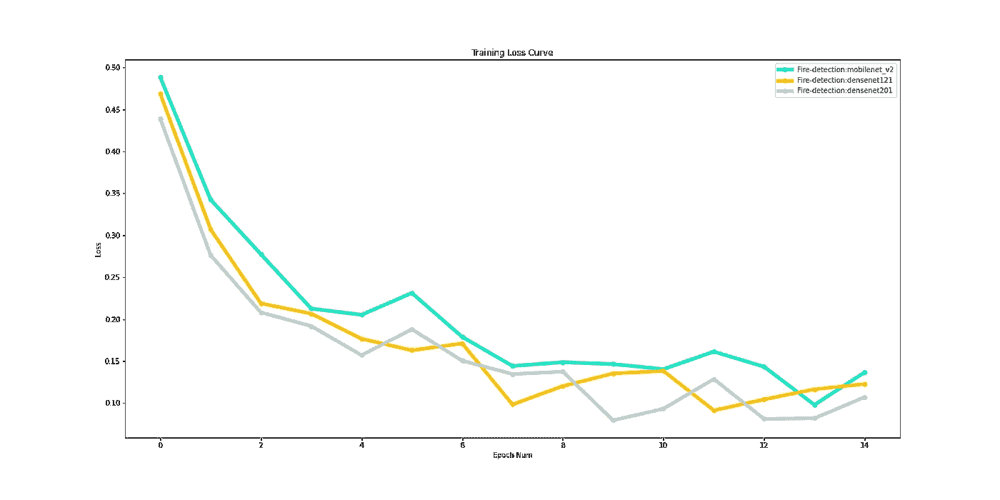*

*   *验证准确度曲线*

*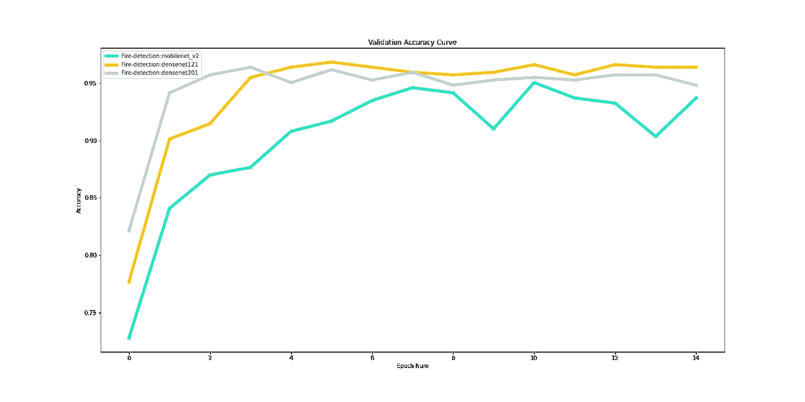*

*   *验证损失曲线*

*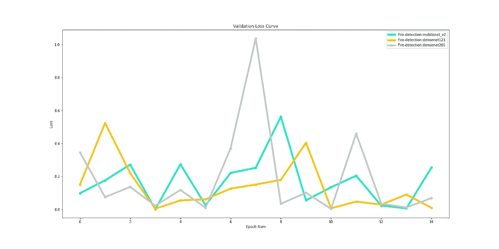*

*   *花费的培训时间。*

*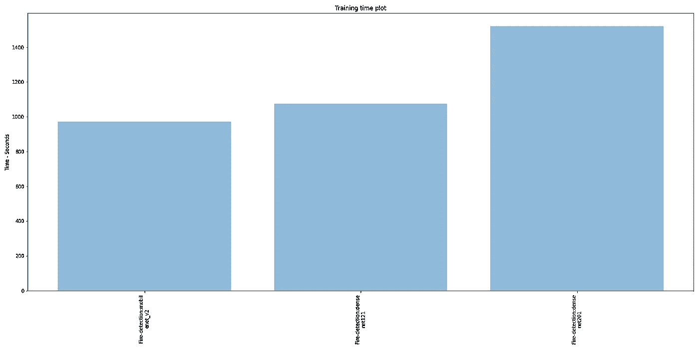*

*   *最佳验证准确性。*

**

# *4.结论*

1.  *Monk library 让学生、研究人员和竞争对手可以非常轻松地创建深度学习模型，并尝试不同的超参数调整来提高模型的准确性。*
2.  *预先训练的模型可以直接下载使用，而无需进入模型创建部分。*
3.  *从上面的图表中，我们可以看到，在这个数据集中，densenet121 优于其他模型。*
4.  *densenet201 型号所用的时间约为 1500 秒，比 densenet121 多 50%,比 mobilenet_v2 多 60%。*
5.  *训练时间的不同是由于训练层数的不同。*

## *感谢阅读。*

*再举一个例子*

*[https://towards data science . com/image-classifier-house-room-type-class ification-using-monk-library-d 633795 a 42 ef](https://towardsdatascience.com/image-classifier-house-room-type-classification-using-monk-library-d633795a42ef)*

**

*嗨，我是 Rohit，我是 BTech。最后一年学生。我有机器学习和深度学习的知识。我有兴趣在人工智能和人工智能领域工作。目前，我在 Tessellate Imaging 公司做计算机视觉实习生。在 [LinkedIn](https://www.linkedin.com/in/rohit96/) 上与我联系。*