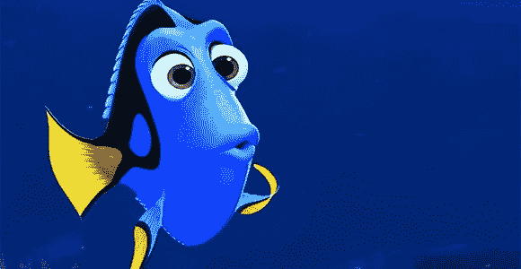
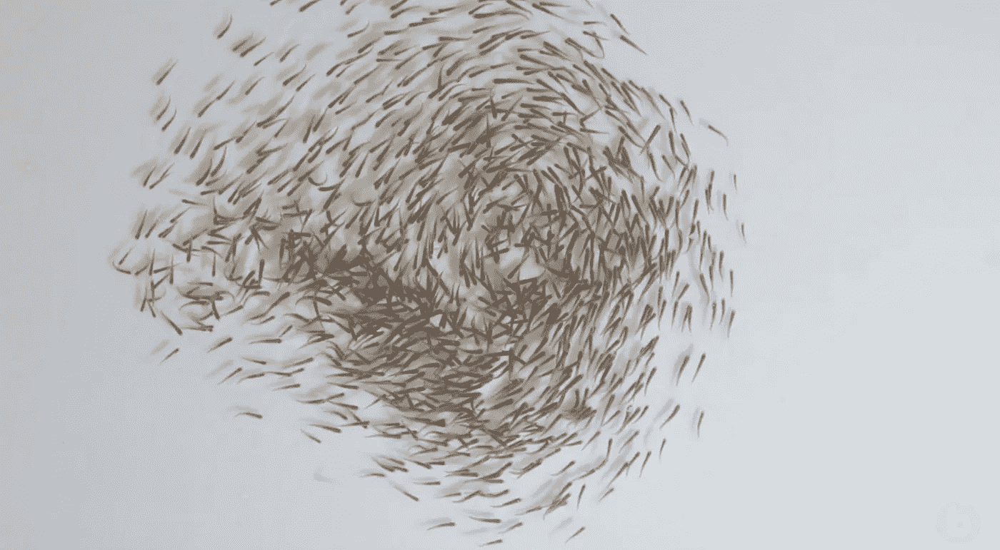
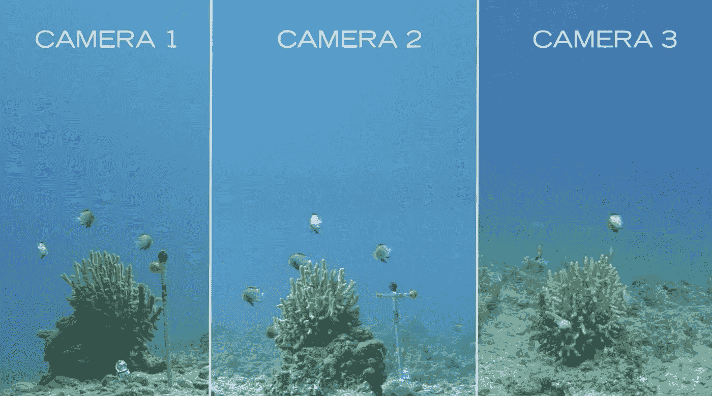
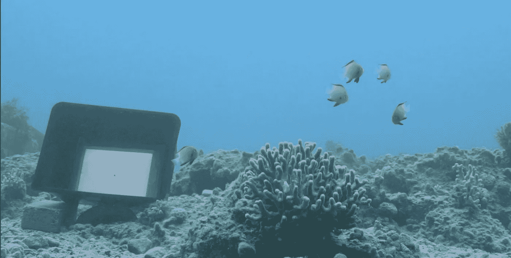

# 寻求洞察力

> 原文：<https://pub.towardsai.net/fishing-for-insight-2eb2b7527948?source=collection_archive---------2----------------------->

## 集体行为| [对艾](https://towardsai.net)

[集体行为在我们周围随处可见。真正定义集体行为模型的是，不存在指挥任何力量的全球指挥者，而是许多个体代理人在本地相互通信或交互，这允许他们与群体同步或协调。](http://bit.ly/2IcSpdI)

集体行为可以用两种模式建模，拉格朗日模式或欧拉模式。对于拉格朗日模型，建模策略是基于个体的，其中每个个体的运动是基于他们相互作用的简单规则来模拟的:群体成员之间的距离。这就允许观察正在出现的集体运动。过去对鱼类迁徙和运动的研究，集中在基因固定的模式上，受到这种模型形式的很大影响。几乎地球上的每个环境都有严重依赖其物理环境的居民；易受不同程度变化影响的环境，强烈倾向于有学习能力的个人。

聚合的欧拉建模方法，结合投影模拟([之前的博文都是关于这个](http://A.I. with Behaviors))，被用来研究蝗虫的运动。这主要集中在使用类似于统计力学或流体动力学的方程来研究动物密度的进化。蝗虫研究结果表明，当种群密度达到临界值时，蝗虫的独居状态变得不稳定。这对于理解如何处理像昆虫入侵这样的入侵物种非常有益。

# 但是为什么呢？

> [“理解社会影响如何塑造生物过程是一个核心挑战，对于从细胞或动物之间协调集体行动的组织和进化到人类社会信息交换的动态等各种领域取得进展至关重要。”](http://collectivebehaviour.com/about-us/)

[“在瘟疫期间，沙漠蝗虫有可能破坏世界十分之一人口的生计。”](http://www.fao.org/food-chain-crisis/how-we-work/plant-protection/locusts/en/))(联合国粮食及农业组织)

采用新人工智能技术的统计建模在阐明集体行为背后的隐藏机制方面具有巨大的潜力。它们允许经验研究的扩展，这有助于并且已经导致了新数学的发展和数值模拟算法的改进。

本博客的其余部分将重点介绍德国南部康斯坦茨大学马克斯·普朗克集体行为研究所的研究。他们目前有三个实验室，分别由部门主任*伊恩·库津*、*达米恩·法林*和*姚尔丹*领导。快速伸缩为他们的声誉，“马克斯·普朗克学会拥有世界领先的声誉，有 33 个诺贝尔奖授予他们的科学家*”*

*我将重点介绍伊恩·库津博士的工作和他的团队对鱼群的研究:“他的工作旨在揭示进化的集体行为背后的基本原则。”*

## *鱼群*

*有用的研究系统，因为:*

*   *他们必须在不可预测的环境中解决许多挑战。*
*   *每个个体接受感觉数据，并以与群体一致的特定动作做出反应。*

*动物作为一个整体一起协调运动来躲避捕食者。集体行为很难预测，因为有许多新兴的属性。一些或大多数可能是单个组件的意外属性。这就是为什么鱼群这种简单的组织对我们来说仍然如此神秘。*

# *他们用什么规则来翻译感官提示？*

## ***挑战和实验室设置***

**

*当试图追踪以不到一秒的速度移动的鱼时变得相当困难！现代技术允许他们用非常高帧频的摄像机每秒钟跟踪每个人数百次的运动。*

*这是在一个装满鱼的室内大水槽中进行的。他们使用了四个安装在屋顶上的时间同步的摄像机，然后用图形将水流拼接成一个大的坦克视图。*

***的目标**是利用数学和计算技术找出个人如何接受复杂的感官信息并在几分之一秒内将其转化为运动。*

## *实验室洞察*

*[第一次定量地证明和揭示了新兴的集体行为是如何从系统内个体运动的相互作用中产生的。通过对来自 9 个家族的鱼类进行的数百次试验，Couzin 博士的团队设法表明，鱼类的逃跑决定是由一套保守的决策规则 *所控制的。*](https://www.pnas.org/content/115/48/12224#sec-4)*

# *个体的行为如何影响群体的行为？*

## ***收集和测试真实世界的数据***

*这项研究在红海进行，特别关注豆娘鱼。*

**

*由 3-4 只个体组成的群体，最多可达 20-30 只，因为追踪野生动物的数据很困难，加上集体行为会增加复杂性。小组越小，细节和视觉效果越好。*

*在豆娘鱼生活的珊瑚头周围设置了三个摄像头。相机拍摄 120 帧/秒，因为鱼可以在 5 到 6 帧内回到珊瑚中。*

*   *然后每个个体鱼的特征被应用，像是雄性还是雌性，小的还是大的，优势还是劣势…*

*这些特征如何影响群体对刺激做出反应时的行为？*

**

1.  *闪光的 Ipad(刺激)*
2.  *世卫组织第一反应，第二反应，第三反应？*
3.  *世卫组织对刺激有视觉通路？*
4.  *世卫组织看到哪些其他个人(社会信息)？*

*一旦技术足够先进，该团队的目标是研究成千上万个这样的个体，同时准确地知道哪个个体是哪个。*

## *真实世界的洞察力*

*看看动物集体，无知和不知情其实是一件很积极的事情。不知情的个人，在某种程度上，通过阻止极端分子对群体产生不相称的影响，成功地使群体的行为民主化。*

## *误报*

*媒体，同样的信息被传播给数百万人。*

1.  *本质上侵蚀了集体智慧的能力，集体智慧依赖于不被告知要思考什么，而是依赖于每个个体找到的证据来解决问题。*
2.  *我们在动物群体中一次又一次地发现，它们已经进化出避免拥有过度相关信息的策略。*

*但是在人类社会中，我们可能过度依赖信息吗？*

## *引用的作品*

* [## 地球数学

### 我们的星球面临许多挑战。2013 年，一个由 140 多个科学团体、研究…

books.google.com](https://books.google.com/books?hl=en&lr=&id=wia9BwAAQBAJ&oi=fnd&pg=PA100&dq=Ian+couzin+fish+study&ots=SuJ7IFRJsV&sig=v2jt5fHr1HtpdwdOy5xUdEIx-lo#v=onepage&q&f=false)  [## 关于我们

### 我们是马克斯·普朗克集体行为系，总部设在德国康斯坦茨大学…

collectivebehaviour.com](http://collectivebehaviour.com/about-us/)  [## 传记的

### 传记是由加州科学院，一个著名的科学和教育机构…

www.biographic.com](https://www.biographic.com/posts/sto/lens-of-time-secrets-of-schooling)  [## 在野生鱼群中，保守的行为回路控制着高速决策

### 为了生存，动物必须快速发现并应对捕食者。然而，野生动物用来翻译的规则…

www.pnas.org](https://www.pnas.org/content/115/48/12224#sec-4)*