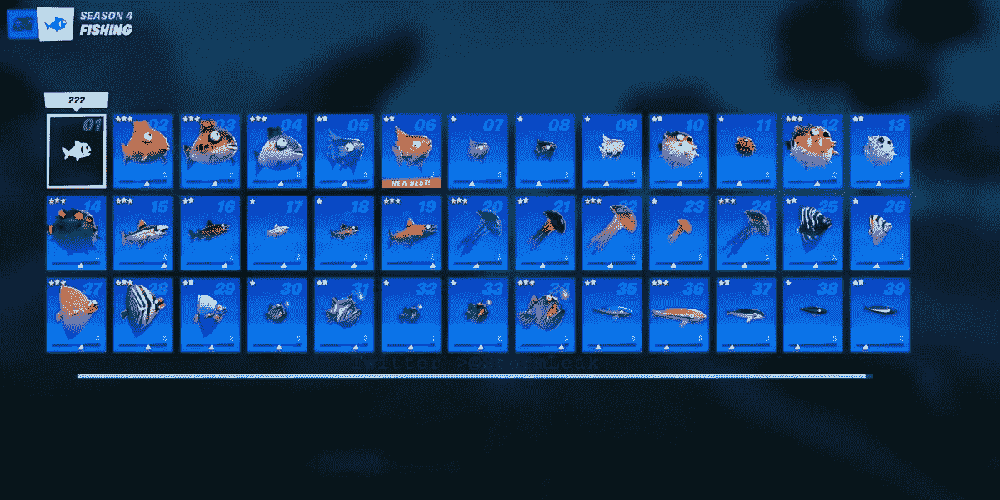
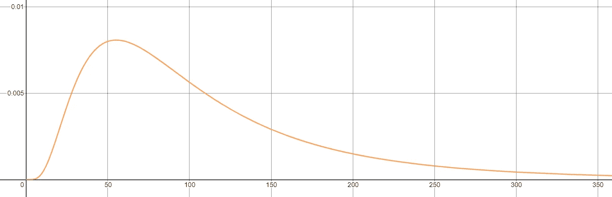
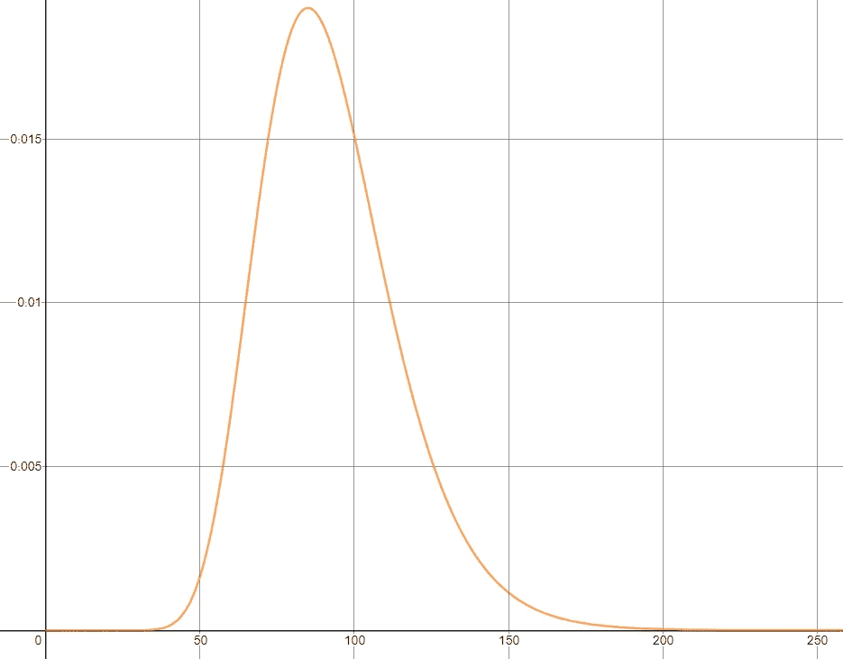
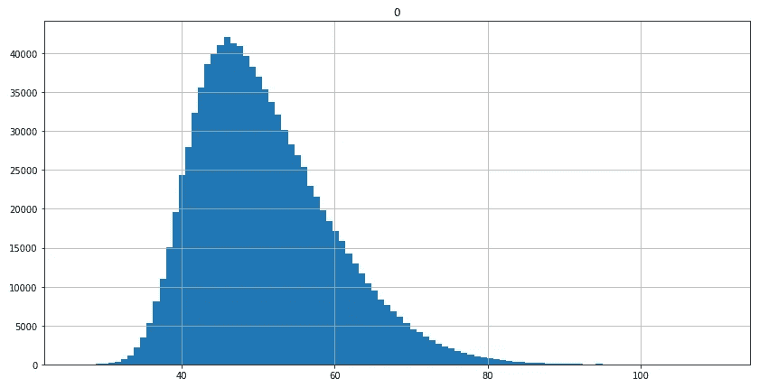
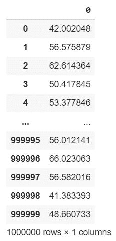

# 在堡垒之夜钓鱼:解码算法

> 原文：<https://pub.towardsai.net/fishing-in-fortnite-decoding-the-algorithm-e7084691c29b?source=collection_archive---------4----------------------->

## [概率](https://towardsai.net/p/category/probability)，[编程](https://towardsai.net/p/category/programming)

## 我能破解堡垒之夜钓鱼机制背后的算法吗？全部代码可在我的 Github repo 获得[。](https://github.com/arditoibryan/Projects/tree/master/20200915_Fishing_Fortnite)

《堡垒之夜》是这一代最具竞争力的在线游戏之一，它有一个有趣的功能，可以让玩家在游戏内部钓鱼。有几类鱼可以在河流中(或海洋中)被捕获，每一类都在有限的时间内携带不同的力量。


传说中的迈达斯鱼

例如，热带鱼给玩家一个短暂的竞争优势，让他们有一个热感视野，可以发现周围的其他玩家，甚至在建筑物后面。


其中一种鱼的统计数据

## 估计概率分布

为了理解堡垒之夜如何生成鱼，我需要估计用于生成鱼的正确概率分布函数，然后将其转换成代码来模拟相同的鱼生成器。



你能在堡垒之夜买到的鱼的列表

## 对数正态分布

* * *因为我使用对数正态分布失败，如果您不感兴趣，请跳到下一节

我对鱼类分布的第一个选择是对数正态分布。大多数鱼的大小都聚集在平均大小附近。



使用图形计算器的[www.desmos.com、](http://www.desmos.com,)对数正态分布截图

然而，找到创建峰值为 35/40、上限为 100 的对数正态分布的最佳调优已经被证明是具有挑战性的:我对参数进行的调整越多，该分布就越接近正态分布。



第二次尝试创建对数正态分布

从上面的图表中可以看出，分布的上限越接近 100，分布的平均值就越大，越远离 35/40 的目标。

## 非对称正态分布

当使用偏斜的正态分布时，结果看起来更有希望。

```
def simulate_normal(sd, mean, alfa, size):
  #simulated probability distribution of one stock
  import pandas as pd
  from scipy.stats import skewnorm
  import matplotlib.pyplot as plt#invertire il segno di alfa
  x = skewnorm.rvs(-alfa, size=size) 
  def calc(k, sd, mean):
    return (k*sd)+mean
  x = calc(x, sd, mean) #standard distributionfig = plt.figure(figsize = (14,7))
  ax = fig.gca()
  pd.DataFrame(x).hist(ax=ax, bins=100)
  return pd.DataFrame(x)#pick one random number from the distribution
  #formally I would use cdf, but I just have to pick randomly from the 1000000 samples
x = simulate_normal(14, 40, -4, 1000000)
x
```



偏斜概率分布



分布的输出，100k 个样本

## 随机鱼群生成器

我现在可以把所有的东西放在一起:因为有不同类型的鱼，我也必须随机选择物种。一种方法是生成一个介于 0 和 1 之间的随机数，然后选择对应于某个值范围的鱼(例如，如果该数字介于[0，0.1]之间，则选择一个 Midas，否则选择一个 Flopper)。相反，我只是决定把鱼添加到列表中

```
import random#given that you wish to separate the list from the function
fishes = list()def add_multiple(fish, number):
  #a fish should be an object
  fishes.extend([fish for i in range(number)])add_multiple('flopper', 10)
add_multiple('midas', 1)
#and many others[print(random.choice(fishes)) for x in range(10)]output:
flopper
flopper
midas
flopper
flopper
flopper
midas
flopper
flopper
flopper
```

## 创建一个鱼类

为了使事情正常进行，我们可以创建一个 Fish 类，它将允许我们实例化我们想要的鱼的数量:

```
fish_list = list()
class Fish():
  def __init__(self):
    self.species = random.choice(fishes)
    self.size = random.choice(x[0])
    fish_list.append(self)def print_data(self):
    print(self.species, self.size)def cheat(self, species, size):
    self.species = species
    self.size = size
```

我还可以用下面的代码创建一个预制鱼的列表:

```
[Fish() for _ in range(10)]
fish_list
[<__main__.Fish at 0x7f55cf837780>,  
<__main__.Fish at 0x7f55cf8377b8>,  
<__main__.Fish at 0x7f55c7bdc048>,  
<__main__.Fish at 0x7f55c7bdc080>,  
<__main__.Fish at 0x7f55c7bdc0f0>,  
<__main__.Fish at 0x7f55c7bdc160>,  
<__main__.Fish at 0x7f55c7bdc198>,  
<__main__.Fish at 0x7f55c7bdc1d0>,  
<__main__.Fish at 0x7f55c7bdc208>,  
<__main__.Fish at 0x7f55c7bdc240>]
```

## 挑选鱼

如果我们想挑一条鱼，也许在运动中，我可以

```
new = Fish()
new.print_data()flopper 39.91704213919765
```

## 用数据作弊

如果你真的想使用 cheatcodes，我给这个类添加了一个小后门:一个叫 cheat 的函数，它允许我手动输入鱼的统计数据:

```
new.cheat(‘midas’, 100)
new.print_data()midas 100
```