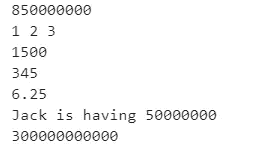
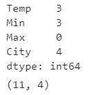
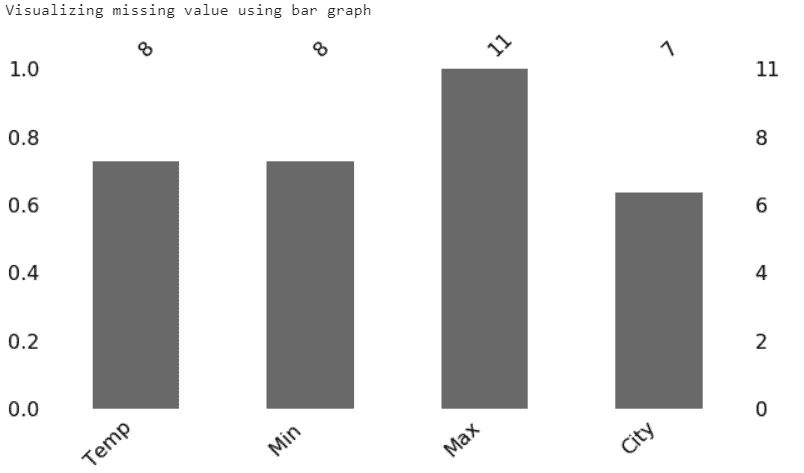
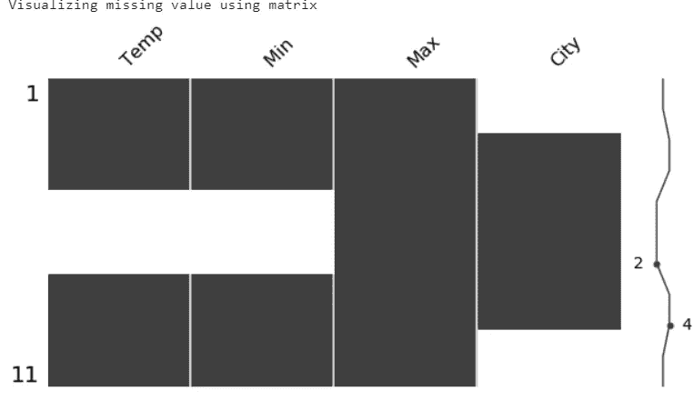
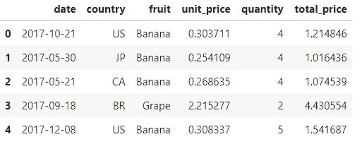
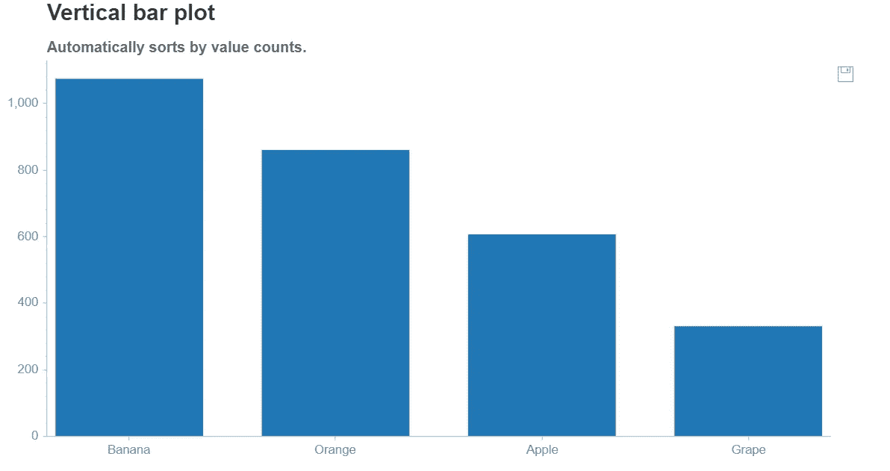

# 用于数据科学的五个很酷的 Python 库

> 原文：<https://pub.towardsai.net/five-cool-python-libraries-for-data-science-7f1fce402b90?source=collection_archive---------0----------------------->


图片由来自 [Pixabay](https://pixabay.com/?utm_source=link-attribution&utm_medium=referral&utm_campaign=image&utm_content=664432) 的 [Ryan McGuire](https://pixabay.com/users/RyanMcGuire-123690/?utm_source=link-attribution&utm_medium=referral&utm_campaign=image&utm_content=664432) 拍摄

## [数据科学](https://towardsai.net/p/category/data-science)， [Python](https://towardsai.net/p/category/programming/python)

## 数据科学的便捷 Python 库

Python 是大多数数据科学家最好的朋友。图书馆让他们的生活更简单。在从事我的 NLP 项目时，我遇到了五个很酷的 Python 库。这对我帮助很大，我想在这篇文章中分享。

# 1.数字计算器

惊人的库转换成整数和浮点文本数字。NLP 项目的有用库。更多详情请查看 PyPI 和这个 [github repo](https://github.com/jaidevd/numerizer) 。

## 装置

```
!pip install numerizer
```

## 例子

```
#importing numerize library
from numerizer import numerize#examplesprint(numerize(‘Eight fifty million’))
print(numerize(‘one two three’))
print(numerize(‘Fifteen hundred’))
print(numerize(‘Three hundred and Forty five’))
print(numerize(‘Six and one quarter’))
print(numerize(‘Jack is having fifty million’))
print(numerize(‘Three hundred billion’))
```

## 输出



# 2.米辛戈

在现实世界的数据集中寻找缺失值是很普遍的。我们需要在输入前了解缺失值。Missingo 提供了一种快速而有用的方法来可视化缺失的值。

## 装置

```
!pip install missingno
```

## 使用

```
# importing necessary libraries
import pandas as pd 
import missingno as mi# reading the dummy dataset
data = pd.read_excel(“dummy.xlsx”)# checking missing values
data.isnull().sum()
```



虚拟数据集有 11 行和 4 列。Min、Temp 和 city 变量中缺少值。我们可以用条形图和矩阵来形象化。它还支持热图，树状图。更多细节请查看这个 [Github 库](https://github.com/ResidentMario/missingno)。

```
#Visualizing using missingoprint(“Visualizing missing value using bar graph”)
mi.bar(data, figsize = (10,5))print(“Visualizing missing value using matrix”)
mi.matrix(data, figsize = (10,5) )
```

## 输出



我们可以从上面的条形图和矩阵中看到 temp、min 和 city 中缺少的值。

# 3.骗子

我们可能会遇到这样的情况，我们需要生成一些测试数据或者在我们的分析中使用一些虚拟数据。获得虚拟数据的一种方法是使用 Faker 库。这将在你需要的时候很快为你生成假数据。

## 装置

```
!pip install faker
```

## 例子

```
**# Generating fake email**
print (fake.email()) 
**# Generating fake country name**
print(fake.country()) 
**# Generating fake name**
print(fake.name()) 
**# Generating fake text**
print(fake.text()) 
**# Generating fake lat and lon**
print(fake.latitude(), fake.longitude())
**# Generating fake url**
print(fake.url()) 
**# Generating fake profile**
print(fake.profile())
**# Generating random number**
print(fake.random_number())
```

## 输出


它为各种类别生成虚假数据，请查看此链接了解更多[详情](https://faker.readthedocs.io/en/latest/providers/faker.providers.geo.html)。

# 4.情感

收集和分析表情符号以及表情符号的数据可以提供有用的见解，特别是在情感分析方面。表情符号是一个足够小的图像，可以插入到文本中来表达情感或想法。一个**表情符号**是一种人类面部表情的表示，只使用键盘字符，如字母、数字和标点符号。

表情符号帮助我们将表情符号和表情符号转换成文字。关于这个库的更多细节，请查看这个 [Github repo](https://github.com/NeelShah18/emot) 。它有一个很好的表情符号和相应单词的集合。

## 装置

```
!pip install emot
```

## 使用

```
**#Importing libraries**
import re
from emot.emo_unicode import UNICODE_EMO, EMOTICONS**# Function for converting emojis into word**
def convert_emojis(text):
    for emot in UNICODE_EMO:
        text = text.replace(emot, "_".join(UNICODE_EMO[emot].replace(",","").replace(":","").split()))
    return text**# Example**
text1 = "Hilarious 😂. The feeling of making a sale 😎, The feeling of actually fulfilling orders 😒"
convert_emojis(text1)
```

## 输出

```
‘Hilarious **face_with_tears_of_joy**. The feeling of making a sale **smiling_face_with_sunglasses**, The feeling of actually fulfilling orders **unamused_face**’
```

# 表情符号转换成文字形式

## 使用

```
**# Function for converting emoticons into word**
def convert_emoticons(text):
    for emot in EMOTICONS:
        text = re.sub(u'('+emot+')', "_".join(EMOTICONS[emot].replace(",","").split()), text)
    return text**# Example**
text = "Hello :-) :-)"
convert_emoticons(text)
```

**输出**

```
'Hello **Happy_face_smiley** **Happy_face_smiley'**
```

# 5.图表化

Chartify 是一个可视化库，旨在让数据科学家尽可能容易地创建图表。与其他工具相比，它具有用户友好的语法和一致的数据格式。创建漂亮快速的图表花费的时间更少。这是由 Spotify 实验室开发的。

这里，我只展示条形图。**更多详情和图表，请查看本** [**文档**](https://chartify.readthedocs.io/en/latest/) **和** [**笔记本**](https://github.com/spotify/chartify/blob/master/examples/Examples.ipynb)

## 装置

```
!pip install chartify
```

## 使用

```
# importing necessary libraryimport numpy as np
import pandas as pd
import chartify#loading example dataset from chartify
data = chartify.examples.example_data()
data.head()
```



```
# Calculating total quanity for each fruits
quantity_by_fruit = (data.groupby(‘fruit’)[‘quantity’].sum().reset_index())
ch = chartify.Chart(blank_labels=True, x_axis_type=’categorical’)
ch.set_title(“Vertical bar plot”)
ch.set_subtitle(“Automatically sorts by value counts.”)
ch.plot.bar(
 data_frame=quantity_by_fruit,
 categorical_columns=’fruit’,
 numeric_column=’quantity’)
ch.show()
```

## 输出



您可以通过单击图表右上角的保存图标来保存图表。

感谢阅读。如果你有什么要补充的，欢迎随时留言评论！

你也可以在 [KDnuggets](https://www.kdnuggets.com/2020/04/five-cool-python-libraries-data-science.html) 上阅读这篇文章。