# 使用 Python 的 Flask Web 应用程序

> 原文：<https://pub.towardsai.net/flask-web-application-with-python-4a290c952ba2?source=collection_archive---------0----------------------->

## [深度学习](https://towardsai.net/p/category/deep-learning)、[计算机视觉](https://towardsai.net/p/category/computer-vision)、[编程](https://towardsai.net/p/category/programming)

## 开发一个卷积神经网络模型，并使用 Flask 将其部署为 web 应用程序

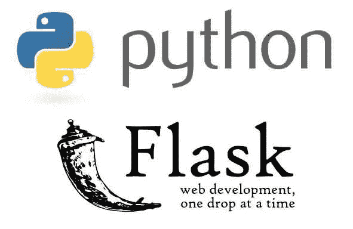

来源: [Fiverr](https://www.fiverr.com/bhishan/build-api-in-python-flask)

W 随着深度学习模型的训练，我们如何将训练好的模型部署为 web 应用？进入**Flask**——Python 最流行的 web 应用框架。通过利用 Flask 的功能，我们可以为全栈应用程序建立一个强大的基础，为更广泛和功能丰富的网站探索新的领域。它使用户能够完全控制网页服务和内部数据流。

我们将处理下面的问题陈述，并探索迁移学习和 flask web 应用程序在深度学习项目中的使用。

# 问题陈述:

## (I)利用迁移学习开发一个用于鸟类分类的卷积神经网络(CNN)模型。

## (ii)使用用户界面部署经训练的模型以接受图像用于分类。

让我们不要从零开始建立一个 CNN 模型，而是通过建立迁移学习思想来解决问题陈述，正如我在之前的帖子中所讨论的:

 [## 使用预先训练的模型进行迁移学习

### 探索 VGG16 在图像分类中的应用

medium.com](https://medium.com/towards-artificial-intelligence/transfer-learning-using-a-pre-trained-model-c599e353bbe3) 

计算机视觉任务是计算密集型和重复的，它们通常超过 CPU 的实时能力，几乎没有时间用于更高级别的任务。与 CPU 相比，GPU 旨在同时快速渲染高分辨率图像和视频。

GPU 最大的**优势是能够对多组数据执行并行操作。GPU 采用数千个处理器内核同时运行的设计，支持大规模并行处理，每个内核都专注于高效计算。**

要免费访问现成的 GPU，您可以利用 [Colab](https://colab.research.google.com/notebooks/intro.ipynb#) ，这是一个 Python 开发环境，使用谷歌云在浏览器中运行。然而，请记住它的[资源限制](https://research.google.com/colaboratory/faq.html#resource-limits)。另一个选择是在你的笔记本电脑上安装 CUDA 工具包。在继续下一步之前，请检查您的 NVIDIA GPU 的计算能力。

这里有一些资源可以帮助您开始:

*   [GPU 计算能力](https://developer.nvidia.com/cuda-gpus)
*   [CUDA 工具包文档版本 11.0.3](https://docs.nvidia.com/cuda/index.html)
*   [在 Windows 10 上安装支持 CUDA、cuDNN 和 GPU 的 Tensorflow】](https://towardsdatascience.com/installing-tensorflow-with-cuda-cudnn-and-gpu-support-on-windows-10-60693e46e781)

一旦你安装了 CUDA 工具包，在命令行输入 **nvidia-smi** 来报告安装的 GPU 统计数据。如果安装成功，您应该能够看到类似的 GPU 统计输出，如下所示。

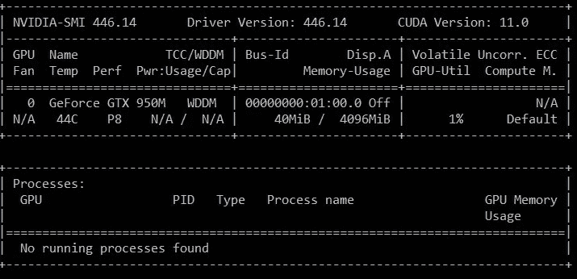

# 既然 GPU 已经可以使用了，我们就来编码吧！

# 数据准备

读取包含数据集标签的 CSV 文件，并显示前 5 行。

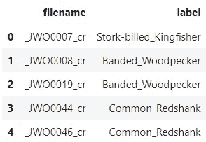

绘制一个条形图，了解图像在数据集中的分布情况。

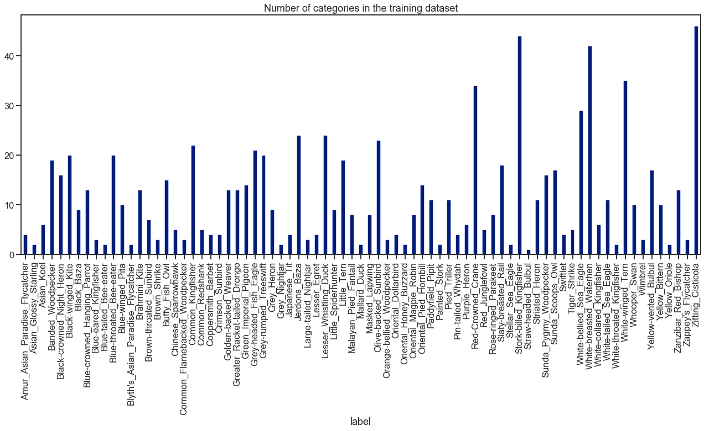

观察到不平衡的数据集，其中没有足够的数据来训练网络。一开始，有些班级甚至只有不到 10 张图片。

# 数据扩充

数据扩充可以通过改变图像的大小、方向等从现有图像中人工创建更多图像来解决不平衡数据集的问题。这可以通过使用[**imagedata generator**](https://www.tensorflow.org/api_docs/python/tf/keras/preprocessing/image/ImageDataGenerator)实例在 Keras 中完成。它包括旋转图像、将图像向左/右/上/下移动一定量、水平或垂直翻转图像、剪切或缩放图像等。

根据 CSV 文件中的标签，将图像加载到每个鸟类分类的相应文件夹中。

使用控制台终端，在命令行运行***generate _ images . py***为每个鸟类分类执行数据扩充。

目标是确保每个类包含总共 100 幅图像。因此，选择用于执行数据扩充的图像数量取决于每个类别的要求。

# 使用增强功能加载数据集

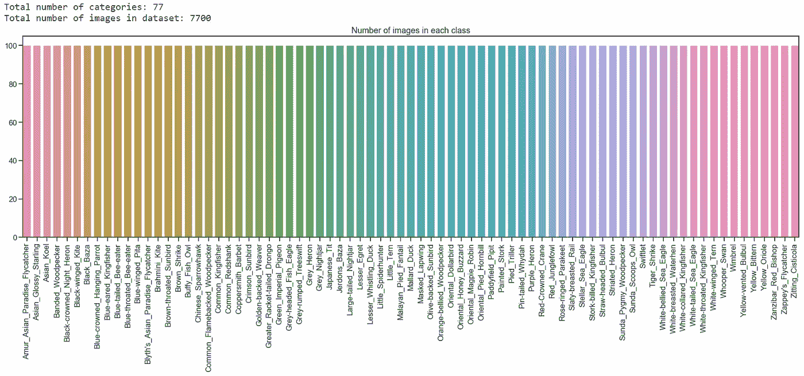

很明显，我对图形绘制很感兴趣，但是谁说当 [Seaborn](https://seaborn.pydata.org/) 出现在画面中时，图形绘制就一定很无聊呢？我们现在已经实现了每班 100 张图片的同等数量，以启动模型培训。

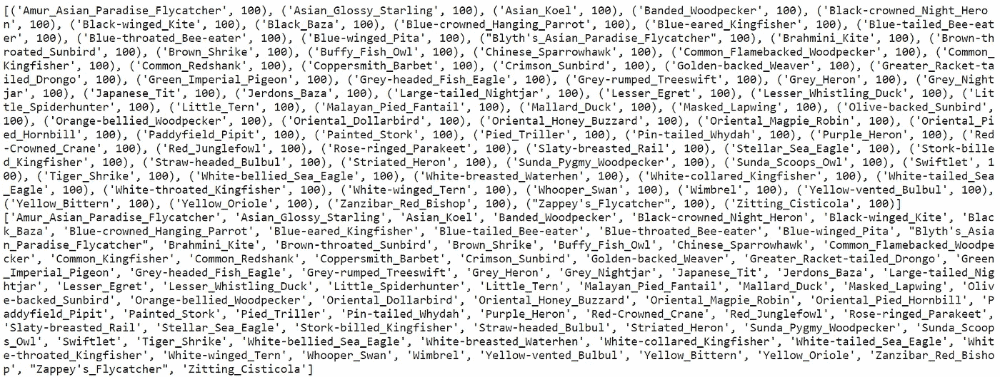

由于硬件限制，我们将使用 128 X 128 的输入图像尺寸，而不是 VGG16 模型中使用的原始 224 X 224。我们将继续阅读、调整和缩放这些图像用于训练。

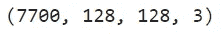

总共 7，700 张图像，输入尺寸为 128 X 128 X 3

加载并拆分数据集，用于 CNN 模型的训练和测试。使用了 0.2 的**测试规模，这意味着数据集的 80%将用于训练目的，而剩余的 20%用作测试组件。然后，我们使用标签 y *、*作为类别标签，以**分层**的方式分割数据集。在分割之前，数据集也被**混洗**，以增强概率采样的随机性。**随机状态**控制在应用分割之前应用于数据的混洗。此参数中传递了一个整数，以便在多个函数调用中进行可再现的输出。**

# 利用迁移学习创建 CNN 模型

通过冻结模型的“深层”并仅重新训练分类层来应用迁移学习。

我们选择使用 [**Adam 优化**](https://www.tensorflow.org/api_docs/python/tf/keras/optimizers/Adam) ，这是一种基于一阶和二阶矩自适应估计的随机梯度下降方法。

根据 [Kingma et al .，2014](http://arxiv.org/abs/1412.6980) ，该方法为

> *“计算效率高，内存需求小，对梯度的对角线重定标不变，非常适合数据/参数较大的问题。”*

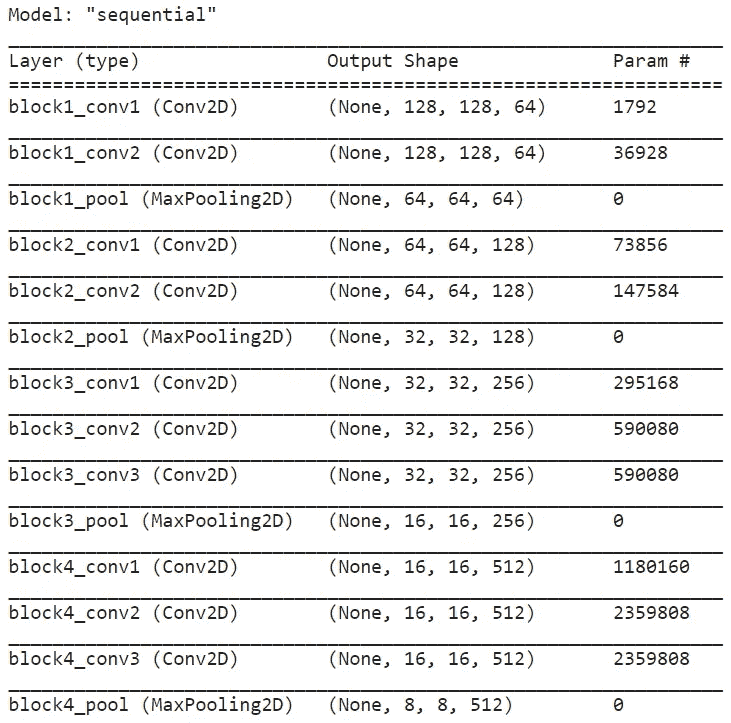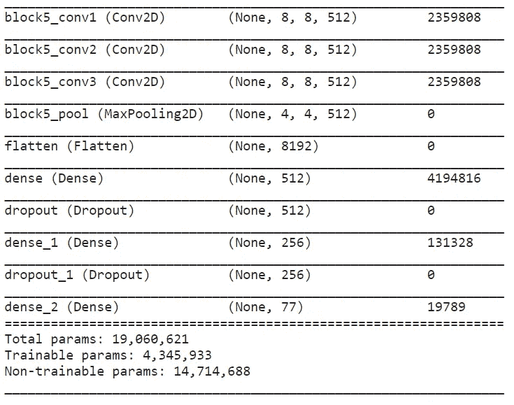

# 模特培训

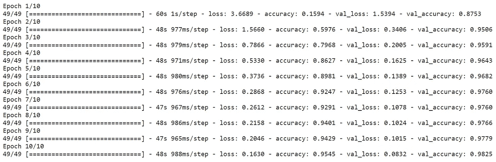

# 学习曲线

学习曲线是模型学习性能随经验或时间变化的曲线图。学习曲线是机器学习中广泛使用的诊断工具，用于从训练数据集增量学习的算法。在训练期间的每次更新之后，可以在训练数据集和验证数据集上评估该模型，并且创建测量的性能的图以反映学习曲线。

在训练期间检查模型的学习曲线可用于诊断学习的问题，例如欠拟合或过拟合模型，以及训练和验证数据集是否具有适当的代表性。

*   **训练学习曲线**:从训练数据集中计算出的学习曲线，给出了模型学习情况的概念。
*   **验证学习曲线**:从验证数据集中计算出的学习曲线，给出了模型泛化能力的概念。

让我们绘制训练和验证准确性/损失的学习曲线。

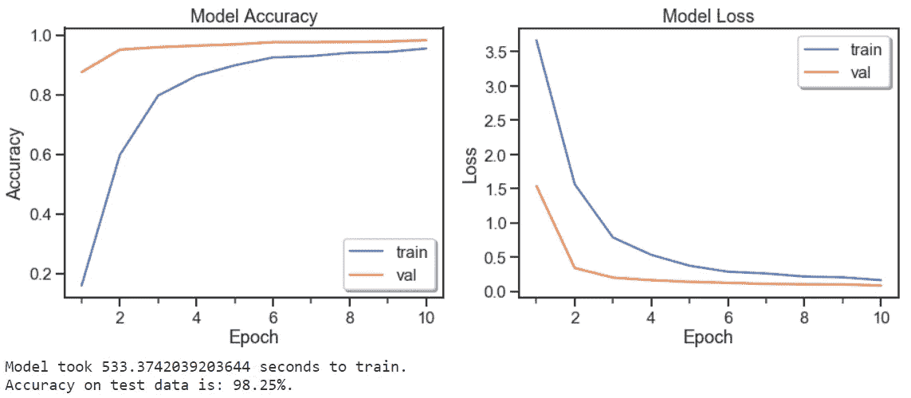

从上述学习曲线中，观察到学习算法的良好拟合。一个**良好拟合**通过**一个训练和验证精度/损失来识别，该精度/损失降低到一个稳定点，在两个最终精度/损失值之间有一个最小的** [**泛化间隙**](https://ai.googleblog.com/2019/07/predicting-generalization-gap-in-deep.html) **。**然而，任何良好体能的持续训练都可能导致过度体能。

# 使用 Flask 的模型部署

使用训练好的模型定义一个函数来预测图像，其中包含模型要预测的类名列表。

# 定义烧瓶应用程序

对于 HTML 模板的想法，一定要看看 [HTML5 UP](https://html5up.net/) 为你的项目准备的一些漂亮的用户界面模板。

# 运行烧瓶应用程序

我们将在本地主机上运行 flask 应用程序，并从互联网上输入一个随机的鸟图像的 URL。出于演示目的，我们选择了以下鸟类图像:

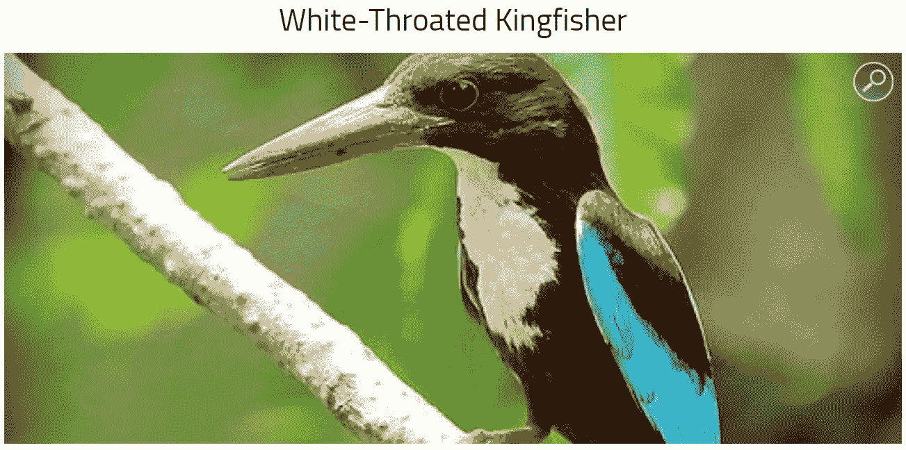

资料来源:[巴里帕拉基金会](https://baliparafoundation.com/en/blog/white-throated-kingfisher)

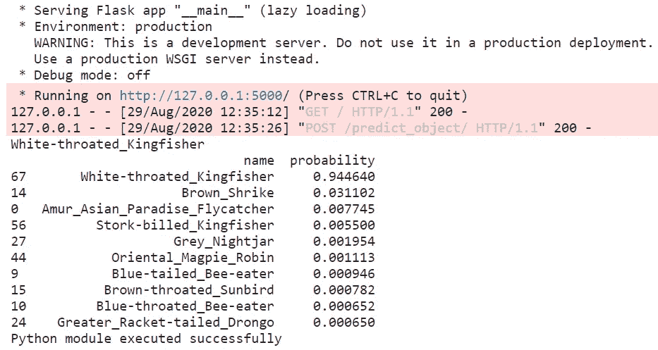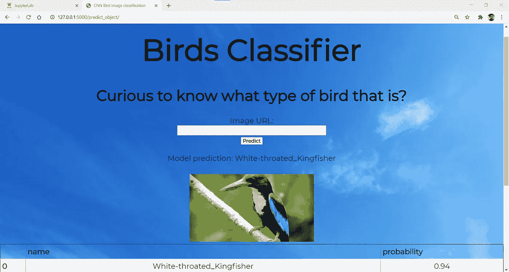

在本地主机上输出结果

以上结果是以 0.94 的高概率为白喉翠鸟获得的。这表明在正确地将所讨论的鸟识别到其各自的类别方面，训练的模型表现良好。

# 结论

总的来说，使用迁移学习已经成功地建立了用于鸟类分类的 CNN 模型。flask 应用程序是一个非常有用的工具，可以部署训练好的模型来获取一张鸟的图像进行分类。

为了进一步提高除了 77 个种类之外的鸟类品种多样性的准确性水平，可以在用足够大和一般的数据集训练 CNN 模型的地方进行改进。迁移学习的使用使人们能够利用先前学习的特征图，而不必通过在大数据集上训练大模型而从头开始。

# 参考

1.  [Keras 图像数据生成器和数据扩充](https://www.pyimagesearch.com/2019/07/08/keras-imagedatagenerator-and-data-augmentation/)
2.  [Scikit 学习—训练、测试、分割](https://scikit-learn.org/stable/modules/generated/sklearn.model_selection.train_test_split.html)
3.  [tensor flow 中的亚当优化器](https://www.tensorflow.org/api_docs/python/tf/keras/optimizers/Adam)
4.  [如何利用学习曲线诊断机器学习模型性能](https://machinelearningmastery.com/learning-curves-for-diagnosing-machine-learning-model-performance/)
5.  [将你的深度学习模型训练到 web app 之后的一切](https://towardsdatascience.com/everything-from-your-deep-learning-model-to-a-web-app-279cd733f3d4)