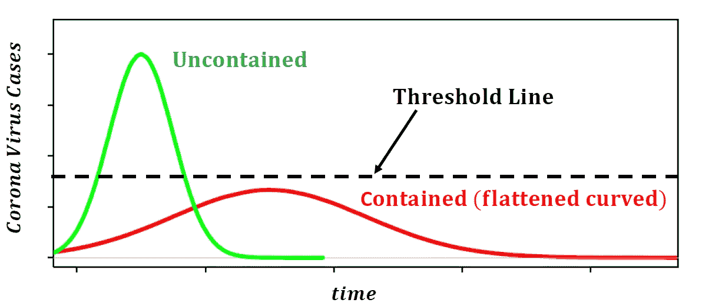
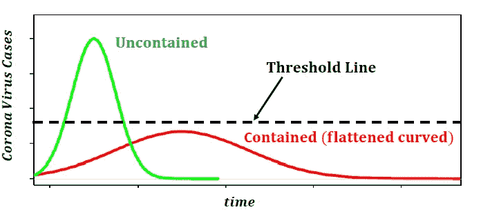

# 拉平冠状病毒曲线

> 原文：<https://pub.towardsai.net/flattening-the-corona-virus-curve-1d34ba5661c4?source=collection_archive---------1----------------------->

由 Benjamin O. Tayo 模拟的图像

## 这意味着什么，我们能做些什么来减缓这种传播

"*留在家里救人。这是一个共同为国家做出牺牲的时刻，但也是一个珍惜我们所爱的人和评估什么是最重要的时刻。*——**白宫**

冠状病毒，也被称为新冠肺炎，是一种新型的高传染性病毒，它已经造成了全球性的疫情，并成为全世界的头条新闻。据世界卫生组织新冠肺炎 [**情况报告**](https://www.who.int/docs/default-source/coronaviruse/situation-reports/20200321-sitrep-61-covid-19.pdf?sfvrsn=f201f85c_2) 显示，截至 2020 年 3 月 20 日，全球确诊病例 266073 例，死亡 11184 人。根据同一份报告，共有 182 个国家、领土或地区报告了实验室确认的新冠肺炎病例和死亡。根据[美国疾病控制中心(CDC)](https://www.cdc.gov/) 的数据，冠状病毒的阳性检测率约为 10%。这意味着任何 100，000 次检测都会出现 10，000 个新病例。这些是非常严峻的统计数字。如果不迅速采取行动，这种病毒有可能在全球夺去成千上万人的生命。

谈到冠状病毒的发病率和传播，有 3 个重要术语需要很好地理解，即:**不可控制的传播**、**阈值线**和**可控制的传播(曲线变平)、如下图所示的**:

**冠状病毒病例数随时间的变化。绿色曲线表示未得到控制的情况，即新病例数量在相对较短的时间内急剧增加。红色曲线表示新病例数量较低且持续时间较长的情况得到控制或缓解。黑色虚线表示阈值线。阈值线以上，病毒未被遏制，阈值线以下，病毒被遏制(冠状病毒曲线变平)。Benjamin O. Tayo 模拟的图像**。

我们现在将在下面更详细地讨论这 3 个概念。

## 1.无约束传播

当一个地区或地区的冠状病毒病例数量在相对较短的时间内急剧增加时，就会出现这种情况。当这种情况发生时，该地区的卫生保健系统不堪重负，以至于出现症状并需要住院治疗的患者数量远远超出了卫生保健系统的处理能力。当这种情况发生时，将会有大量的病人无法得到充分的医疗护理，死亡人数将会激增，正如在意大利这样的地区或国家所观察到的那样。

## 2.阈值线

阈值线表示新病例的数量，低于这一数字，病毒可以得到控制。如果感染率得到控制，新病例的数量将会减少，这将有助于防止卫生保健系统不堪重负。

## 3.包含分布(平坦曲线)

当一个地区或地区的新冠状病毒病例数在相对较长的时间内缓慢增加时，就会出现这种情况。通过将新增病例数量保持在阈值线以下，它将防止医疗保健系统不堪重负。在这种情况下，需要住院的个人可以针对症状进行治疗，这将有助于减少伤亡和传播。此外，通过使曲线变平，这将为研究人员和科学家提供足够的时间来开发最终可用于治疗和预防疾病的药物和疫苗。

# 如何使曲线变平

每个人都有责任采取必要的措施来帮助拉平新冠肺炎曲线。以下引自白宫的话很好地概括了这一点:

*呆在家里救人。这是一个共同为国家做出牺牲的时刻，但也是一个珍惜我们所爱的人和评估什么是最重要的时刻。*——**白宫**

这里有一些来自世界卫生组织的指导方针，可以帮助减少新冠肺炎的传播。

## ㈠经常洗手

定期用含酒精的洗手液彻底清洁双手，或者用肥皂和水清洗双手。用肥皂和水洗手或者用酒精擦手可以杀死手上的病毒。

## ㈡保持社交距离

与咳嗽或打喷嚏的人保持至少 1 米(3 英尺)的距离。当有人咳嗽或打喷嚏时，他们会从鼻子或嘴里喷出可能含有病毒的小液滴。如果你靠得太近，你可能会吸入飞沫，包括新冠肺炎病毒，如果咳嗽的人患有这种疾病。

## (iii)避免触摸眼睛、鼻子和嘴巴

手接触许多表面，可以携带病毒。一旦被污染，手可以将病毒转移到你的眼睛、鼻子或嘴里。从那里，病毒可以进入你的身体，使你生病。

## (四)实行呼吸卫生

确保你和你周围的人遵循良好的呼吸卫生。这意味着当你咳嗽或打喷嚏时，用弯曲的手肘或纸巾捂住嘴和鼻子。然后立即处理用过的纸巾。飞沫传播病毒。通过遵循良好的呼吸卫生，你可以保护你周围的人免受诸如感冒、流感和新冠肺炎病毒的侵害。

## (v)如果你发烧、咳嗽和呼吸困难，应及早就医

如果你感到不舒服，就呆在家里。如果你发烧、咳嗽和呼吸困难，请就医并提前打电话。遵循当地卫生部门的指示。国家和地方当局将会掌握你所在地区的最新信息。提前打电话可以让您的医疗保健提供者快速指引您到正确的医疗机构。这也将保护你，并有助于防止病毒和其他感染的传播。

## (vi)了解最新信息，并遵循医务人员的建议

随时了解新冠肺炎的最新发展。遵循您的医疗保健提供者、您的国家和地方公共卫生机构或您的雇主提供的关于如何保护自己和他人免受新冠肺炎病毒感染的建议。国家和地方当局将掌握新冠肺炎病毒是否在你所在地区传播的最新信息。他们最适合就你所在地区的人们应该如何保护自己提出建议。

每个国家、地区或领地都必须采取措施来帮助拉平新冠肺炎曲线。在美国，特朗普总统已经制定了减少传播和遏制病毒的指导方针:[特朗普总统的美国冠状病毒指导方针。](https://www.whitehouse.gov/wp-content/uploads/2020/03/03.16.20_coronavirus-guidance_8.5x11_315PM.pdf)

## 摘要

总之，我们已经讨论了 3 个用于描述新冠肺炎感染率的重要术语。每个人都有责任采取必要的预防措施，帮助拉平新冠肺炎曲线。拉平新冠肺炎曲线不仅有助于遏制病毒，还能让我们的研究人员和科学家有时间开发治疗和预防疾病的药物和疫苗。

## 参考资料:

1.  [世卫组织形势报告。](https://www.who.int/docs/default-source/coronaviruse/situation-reports/20200321-sitrep-61-covid-19.pdf?sfvrsn=f201f85c_2)
2.  [世卫组织拉平新冠肺炎曲线的指导方针](https://www.who.int/emergencies/diseases/novel-coronavirus-2019/advice-for-public)。
3.  特朗普总统的美国冠状病毒指导方针。
4.  [美国疾病控制中心。](https://www.cdc.gov/)