# 航班延误预测

> 原文：<https://pub.towardsai.net/flight-delay-prediction-7cba01b0b0ab?source=collection_archive---------3----------------------->

## [编程](https://towardsai.net/p/category/programming)

## 端到端项目

图片由[扬·瓦塞克](https://pixabay.com/users/jeshoots-com-264599/?utm_source=link-attribution&utm_medium=referral&utm_campaign=image&utm_content=2373727)从[皮克斯拜](https://pixabay.com/?utm_source=link-attribution&utm_medium=referral&utm_campaign=image&utm_content=2373727)拍摄

# 介绍

航班延误预测是 Kaggle 最受关注的项目之一。在这篇文章中，我将解释我是如何设法对整个航班延误预测数据集进行一些分析的。之后，我执行了一些预处理步骤，比如清理数据、替换空值，然后根据需要执行规范化。后来，数据被分成训练集和测试集，我们建立了一个决策树模型。我们用该模型获得了大约 99.9%的准确度。模型建立后，我们使用 HTML 创建了一个静态页面来获取用户的详细信息，同时，我们使用经过训练的模型来获取基于输入特征的航班是否会延误的结果。我们使用 Flask 将静态页面与模型集成在一起，向用户显示航班延误预测的结果。

# 导入库

我们通过导入构建模型所需的库来开始分析。

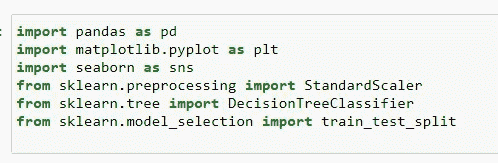

作者图片

# 数据集

我们有三个数据集可用于建模和分析目的。第一个数据集是航班详细信息，由有关航班计划、航班到达详细信息、航班延误因素、航班来源和目的地详细信息的要素组成。

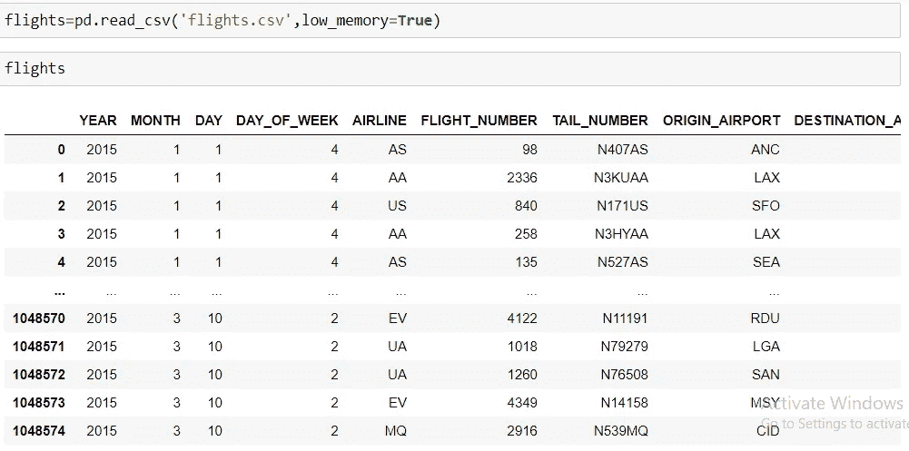

作者图片

第二个数据集包含机场详细信息，如机场位置、州和城市。

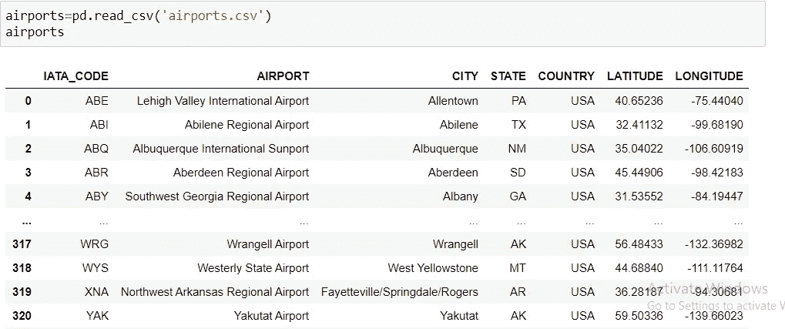

作者图片

第三个数据集包含关于航空公司的详细信息。

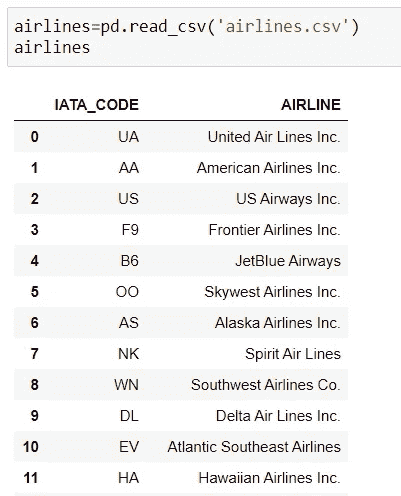

作者图片

接下来，我决定在谷歌地图上找到各个机场的位置。所以我使用 gmplot 根据经度和纬度值来定位机场。在下图中，我没有使用谷歌 API，所以它没有正确加载。人们可以搜索并找到使用 API 和与 gmplot 集成的方法。

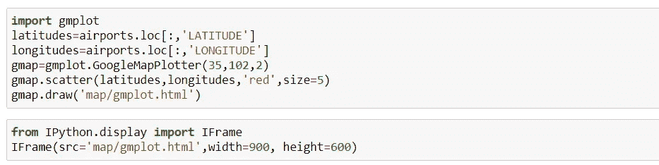

作者图片

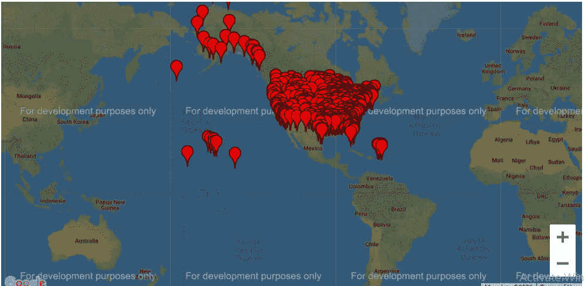

作者图片

接下来，我们获取每月的航班详细信息，并分析每月起飞的航班数量。因此，我们用月份名来映射月份号。之后，我们使用 plot 函数来可视化每月的航班细节。

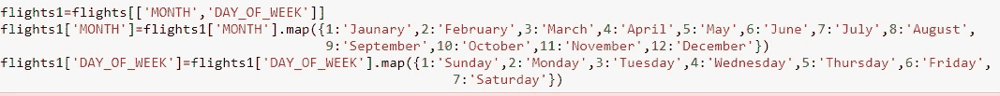

作者图片

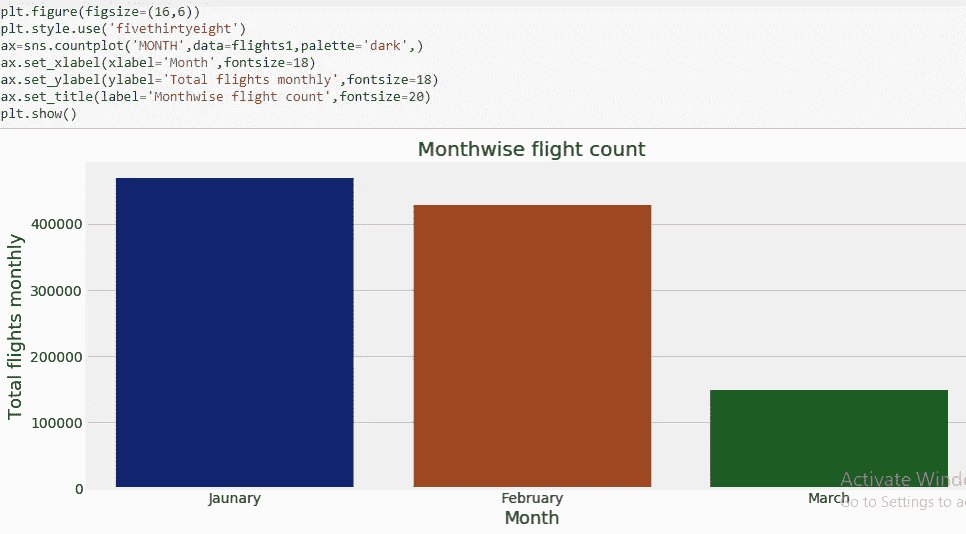

作者图片

接下来，我们获取当天的航班详细信息，并分析每天有多少航班起飞。因此，我们用工作日名称映射工作日编号。之后，我们使用 plot 函数来可视化每日的航班细节。

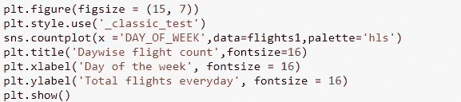

作者图片

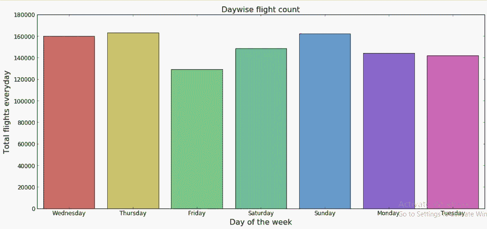

作者图片

# 清理数据

作为清理数据的第一步，我们可以从删除数据集中可忽略的要素开始。

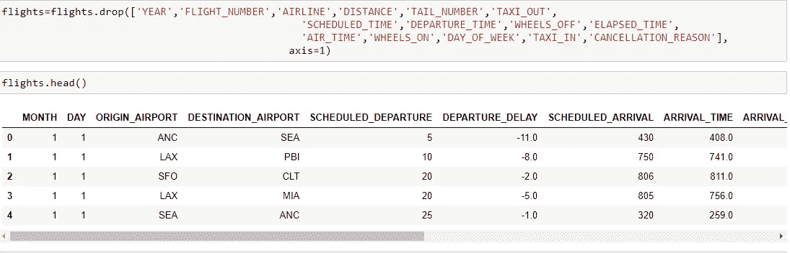

作者形象

第二步，我们将用各个特征的平均值替换空值。

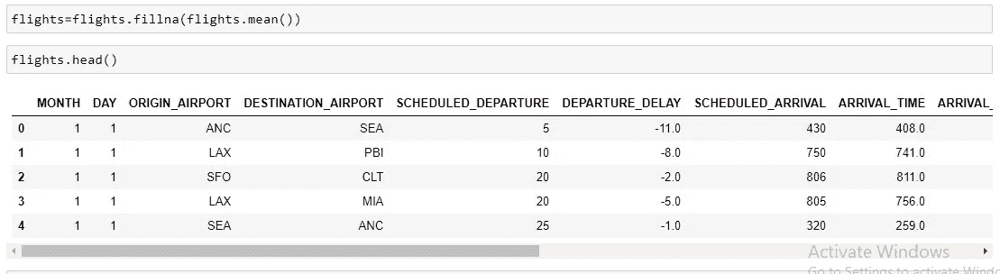

作者图片

第三步，我们将创建一个名为 result 的相关特征，该特征将根据到达延迟是小于还是大于 15 分钟来对航班延迟与否进行分类。

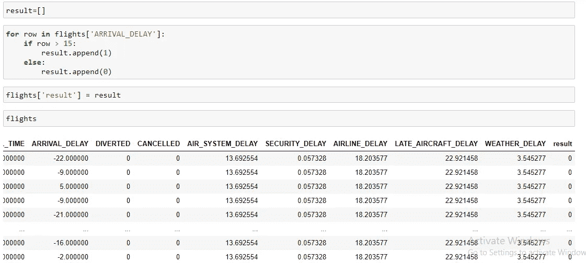

作者图片

第四步，我们将从数据帧中移除一些不起作用的特征。

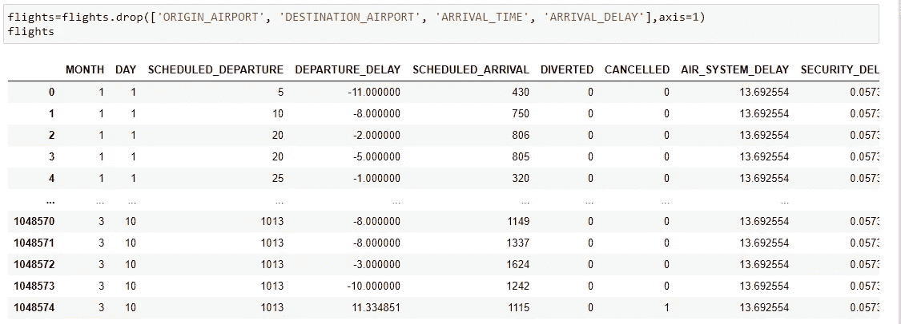

作者图片

第五步，我们将通过删除输出列来规范化输入要素。

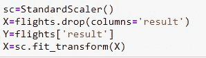

作者图片

# 模型创建

我们将数据分成训练集和测试集，然后使用决策树分类器训练数据。

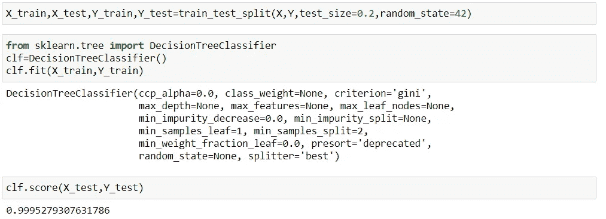

作者图片

# 超参数调谐

我们使用 GridSearchCV 函数来调整参数，并试图找到最佳的组合，使我们在模型中获得最大的准确性。因此，我们首先将训练数据拟合到各种参数值上，并尝试找到参数的最佳组合。一旦获得了最佳参数的组合，我们就可以基于它训练决策树模型。一旦模型准备就绪，我们就将其应用于测试数据集。

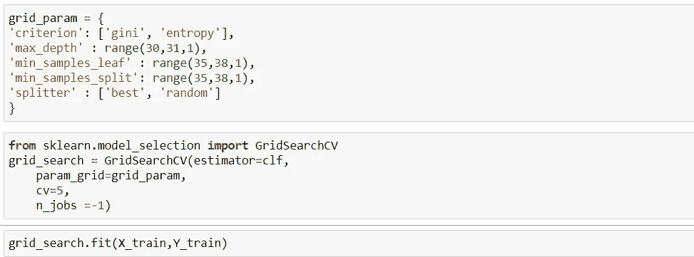

作者图片

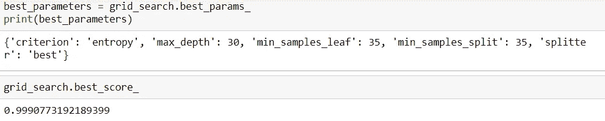

作者图片

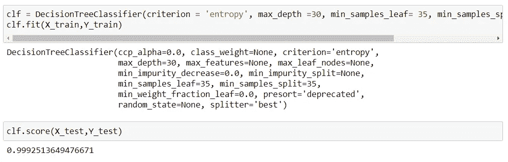

作者图片

# 保存模型

一旦模型被设计出来，我们就把它保存在一个文件中，这个文件以一种不可读的格式出现。稍后，当我们想要将模型应用于一个不可见的数据集时，我们可以直接调用保存在文件中的模型，并生成输出 0 或 1，根据输入要素指示航班是否会延迟。

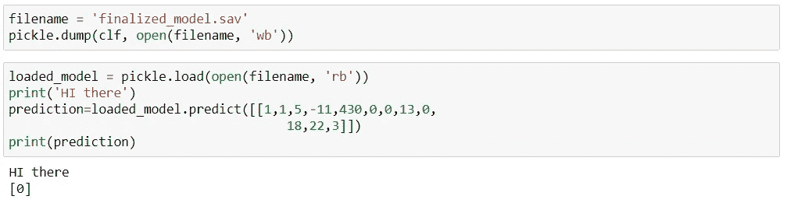

作者图片

# 创建静态 HTML 模板

我们创建一个包含两个 HTML 文件的模板文件夹。其中之一是显示作为用户输入提交的字段的页面。另一个页面是 Results.html 页面，包含从模型输出中获得的结果。

注册 HTML 页面包括诸如月份、航班预定到达和离开时间、航班延误原因、航班是否取消等信息。

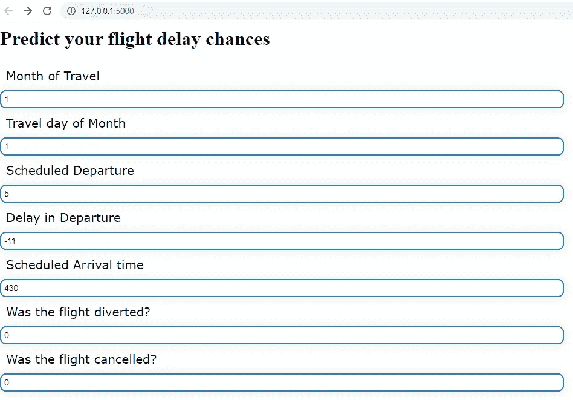

作者图片

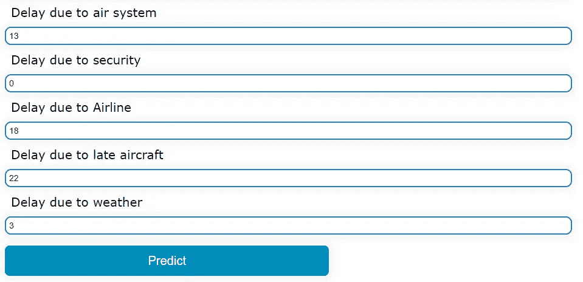

作者图片

结果 HTML 页面如下所示:

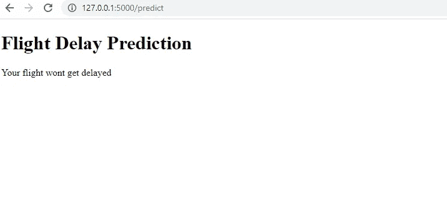

作者图片

# 使用 Flask 集成模型和模板

我们使用 flask 来集成 HTML 模板和后端的模型。使用 Flask 中的 POST 方法将用户输入的值重定向到模型。然后，模型将生成输出，并将其作为输入值传递给结果 HTML 页面。GET 方法将调用结果模板并推送从模型输出中获得的预测。

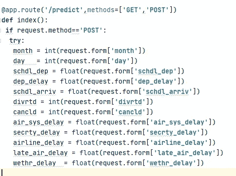

作者图片

作者图片

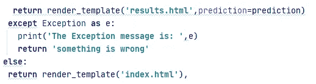

作者图片

感谢您阅读文章！！

Github 链接

 [## charan Raj 2411/航班延误预测

### 通过在 GitHub 上创建一个帐户，为 charan Raj 2411/航班延误预测开发做出贡献。

github.com](https://github.com/charanraj2411/Flight-Delay-Prediction/tree/main/Flight%20Prediction) 

商务化人际关系网

 [## Charanraj Shetty -技术作家-走向人工智能| LinkedIn

### Pilani BITS 软件系统(数据科学)在职硕士综合学习计划。正在寻找…

www.linkedin.com](https://www.linkedin.com/in/charanraj-shetty-a74831b2/)