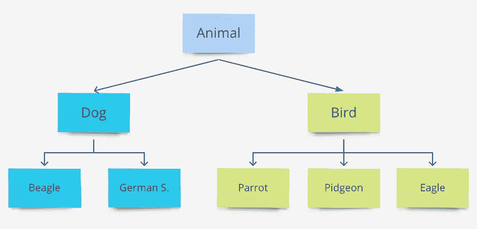
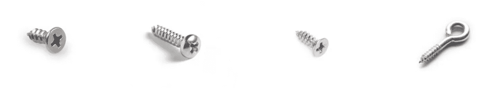
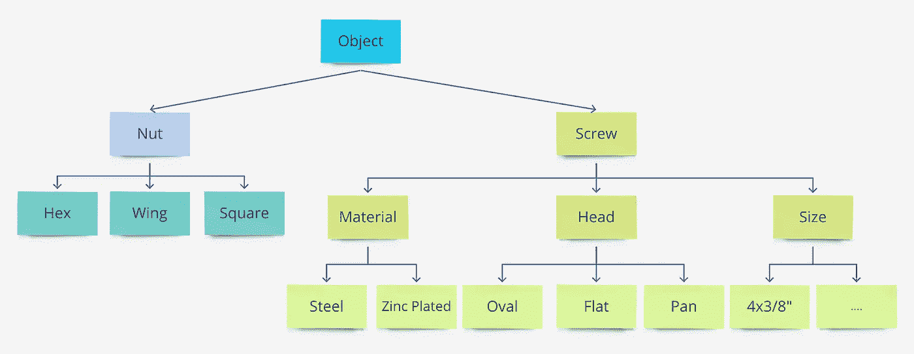
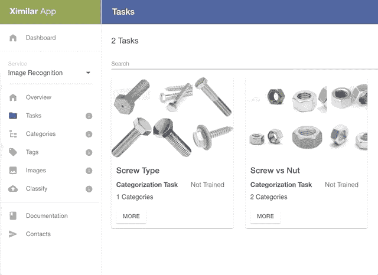
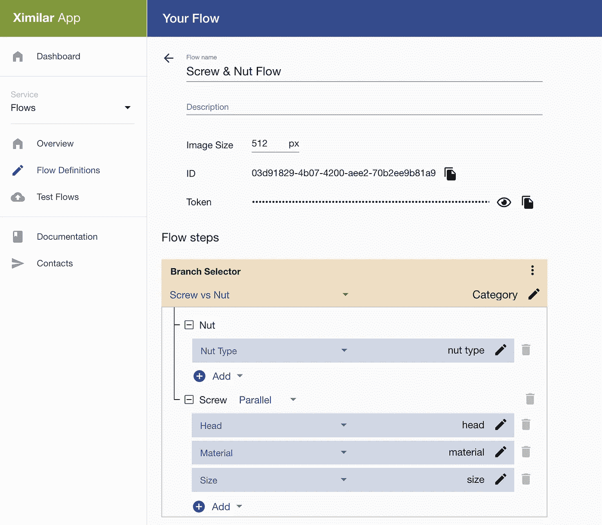
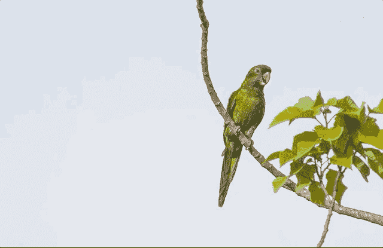

# 如何为图像识别建立层次分类

> 原文：<https://pub.towardsai.net/flows-for-image-recognition-evolution-of-building-complex-ai-vision-220b49d611f9?source=collection_archive---------1----------------------->

## 改变游戏规则的功能，使深度学习更容易实现。用层次分类法解决螺钉螺母识别的计算机视觉问题。

照片由[JESHOOTS.com](https://www.pexels.com/@jeshoots-com-147458?utm_content=attributionCopyText&utm_medium=referral&utm_source=pexels)从[派克斯](https://www.pexels.com/photo/person-playing-chess-1040157/?utm_content=attributionCopyText&utm_medium=referral&utm_source=pexels)拍摄

现在，有很多公司在做人工智能/机器学习。例如，许多蓝筹公司正在将自己的机器学习解决方案集成到他们的云环境中。使用他们的云变得越来越复杂，为了使用它，人们开始成为 XYZ 云服务**认证** **专家**。

> **“一切都应该尽可能简单，但不能再简单了。”**
> 
> **阿尔伯特·爱因斯坦**

有时候，你或你的团队需要建立精确和更复杂的机器学习系统。但在使用 AWS、Azure 或 AutoML 控制台时，这是非常困难的。大公司的云解决方案有太多的按钮、页面和设置，很难使用。如果你自己用 PyTorch 和 TensorFlow 之类的框架编码，从头开始构建一个模型就更难了，因为你需要一些编码和机器学习技能…

> *人们喜欢使用苹果产品，因为苹果将复杂的东西放入易于使用的设备中。*

那么，如果我在做一件复杂的事情，我应该怎么做呢？

我的简单建议是，每一个复杂的问题都可以分成更简单的子问题。然而，将简单的问题与工作解决方案联系起来的步骤可能是棘手的，昂贵的，并且花费大量的时间。

**今天，我想介绍一个改变游戏规则的功能，用 Ximilar 流构建分层机器学习系统**。我们用它为时尚和医疗保健制造了许多成功的产品。

**而现在你也可以在另一个或同一个域中了！**

今天，我们将讨论一个更侧重于图像识别的用例。如果你从未通过 [Ximilar 应用](https://app.ximilar.com)训练过人工智能视觉模型，那么我推荐你阅读我之前的帖子:

 [## 如何检测图像上的缺陷

### 建立一个可视化的质量控制系统，通过卷积神经网络和…

medium.com](https://medium.com/swlh/how-to-detect-defects-on-images-16d6cf3ddc1a) 

# 什么是等级分类？

> 想象一下把图像分类成几千类的问题…

分级分类的想法非常古老和简单。不要用一个模型预测所有的事情，你可以利用更多的模型，并把它们连接起来，这样你就会得到想要的结果。

一个简单的动物等级体系…

因此，层次结构中的第一个模型可以识别狗、鸟……如果模型预测图片上的是鸟，则用于鸟亚型的单独模型被调用来区分鹦鹉、皮江鸟或鹰。当然，这只是一个简单的层次结构，但你可以想象它可以更广更深。

狗图像层次分类的简单用例。来自 [Pexels](https://www.pexels.com/photo/puppy-on-white-surface-1741235/?utm_content=attributionCopyText&utm_medium=referral&utm_source=pexels) 的 [Lina Kivaka](https://www.pexels.com/@lina-kivaka-593836?utm_content=attributionCopyText&utm_medium=referral&utm_source=pexels) 摄影

**更高级的使用案例…**

有数以千计的螺钉和螺母，不同的尺寸，头部类型，材料。建立一个系统，正确地将一幅图像分配到数以千计的类别中，可能是难以置信的困难。这可能会花费你大量的时间和精力。我们还需要大量的图像/样本和高质量的标签来训练这样一个模型。

只是来自成千上万种可能性的一些螺丝例子…

我们可以创建第一个识别螺母和螺钉的模型，而不是一个模型。如果我们识别了 Nut，那么我们可以调用模型来获取 Nut 的类型=> **六角形、翼状、方形**。如果检测到螺钉，则确定材料、头部类型和尺寸。材料的型号会告诉你螺丝是钢的还是锌的。系统的概观可以这样来显示:

螺钉和螺母识别系统概述

我们将通过 [Ximilar 应用程序平台](https://www.ximilar.com/how-to-train-custom-image-classifier-in-5-minutes/)创建我们的 5 个图像识别任务/模型。只需将图像上传到标签，创建任务并将标签连接到任务。最后，你需要训练他们！

您在 Ximilar 应用程序中的识别任务

**现在是激动人心的部分！**

我们将通过流连接所有的任务。作为第一步，我们创建一个分支选择器操作，并将分支任务设置为“Screw vs Nut”。当查询 API 端点时，该任务的查询图像输出存储在 JSON 的“Category”字段中。基于来自分支的结果，系统将选择一个分支并调用其他任务。

我们的螺钉和螺母流经 https://app.ximilar.com

现在您可以通过测试流页面或者调用 [API 端点](https://docs.ximilar.com/services/flows/)来测试它。你的心流可能会复杂得多。我们的一些内部流包含嵌套的分支，有数百个任务和标签。

# 更多示例…

以下是一些如何使用流程的示例:

*   房地产——识别房间类型，然后了解房屋的特点和整体状况
*   工业和制造业——识别一个物体，判断它是否是缺陷，如果是，物体的哪一部分有缺陷
*   显微镜成像——识别复杂的细菌层次…
*   x 射线牙齿图像-检测牙齿和识别问题，修复，…

# 总结

[Ximilar flow](https://www.ximilar.com/flows-the-game-changer-for-next-generation-ai-systems/)系统非常灵活，可扩展到所有其他领域(房地产、制造业、医疗保健……)。我们认为这将有助于您的企业更快地**创造机器学习产品**。不管你是自由职业者、创业者还是大公司。

检测对象的确切位置，然后识别子类别。即将上线 Ximilar App！照片由 [Pexels](https://www.pexels.com/photo/green-parrot-perched-on-branch-2575708/?utm_content=attributionCopyText&utm_medium=referral&utm_source=pexels) 的[卢卡斯·佩泽塔](https://www.pexels.com/@lucaspezeta?utm_content=attributionCopyText&utm_medium=referral&utm_source=pexels)拍摄

我们很快会有更多的集成目标检测和分割的流程计划！因此，您将能够检测一个对象(确切位置),例如一只鸟，然后对这个对象调用您的分类任务来判断它是哪种鸟。

**没有一行代码，我们正在让机器学习变得更容易为每个人所用！**

更多新闻和提示->关注我们的 [Twitter](https://twitter.com/Ximilar_com) 或 [LinkedIn](https://www.linkedin.com/company/ximilar) ！