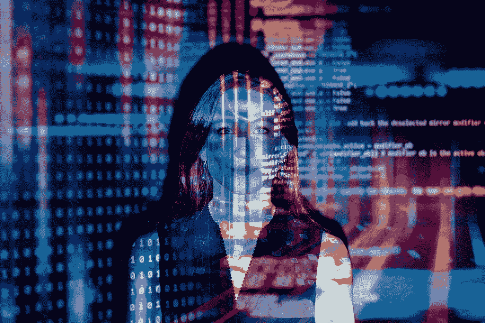

# 为什么我会在 2021 年关注保护隐私的机器学习

> 原文：<https://pub.towardsai.net/focus-on-privacy-preserving-machine-learning-in-2021-92c6f3dba2ad?source=collection_archive---------2----------------------->

## [机器学习](https://towardsai.net/p/category/machine-learning)，[隐私和安全](https://towardsai.net/p/category/privacy-and-security)

## 没有它，我们将永远无法解决任何现实世界的问题。

来自[像素](https://www.pexels.com/photo/code-projected-over-woman-3861969/?utm_content=attributionCopyText&utm_medium=referral&utm_source=pexels)的[摄影](https://www.pexels.com/@thisisengineering?utm_content=attributionCopyText&utm_medium=referral&utm_source=pexels)

我有挑选今年重点关注的事情的传统。在数据科学和机器学习这样一个广泛且不断发展的领域，专注于特定领域而不被快速发展所淹没是至关重要的。

话虽如此，但它从未限制我从事其他工作。不压倒自己，有方向，只是一种技术。但是当我好奇的时候，没有人能阻止我掉进一个新的兔子洞。

去年我专注于生产中的机器学习。我致力于理解[端到端管道](https://medium.com/towards-artificial-intelligence/how-i-build-machine-learning-apps-in-hours-a1b1eaa642ed)、[容器化](https://towardsdatascience.com/how-to-dockerize-any-machine-learning-application-f78db654c601)、[部署](https://towardsdatascience.com/deploying-your-machine-learning-apps-in-2021-a3471c049507)、软件最佳实践和云。回想起来，在过去的一年里，我已经学习和进步了很多。

今年，将会是保护隐私的机器学习。

下面是我对这个领域是什么的想法，为什么我认为它很重要，最后，你如何开始(你会被说服)。

我很兴奋。我们走吧。

# 什么是保护隐私的机器学习？

有时我担心每次提起这个话题都要解释，因为我相信这是数据科学领域的每个人都应该知道的事情。

我们今天想用数据科学解决的许多问题都需要敏感的个人信息，从病历到财务记录的任何信息。大家心中的疑问，*我们还能在不损害用户隐私的情况下，对这些敏感数据进行机器学习吗？*

这个问题的答案是保护隐私的机器学习。

我喜欢称之为从你看不见(或不拥有)的数据中得出有意义的解决方案的领域。我会给你一些真实世界的场景，这样你会得到一个更好的画面。

*   基于您过去使用过的单词的个性化键盘。苹果和谷歌做到了这一点，而你的键盘数据从未离开过你的手机(联合学习)。
*   看起来像真实数据但确保没有隐私信息泄漏的合成数据(差分隐私)。
*   机器学习即服务，其中供应商对客户端的加密数据进行预测(同态加密)。

现在，我们对保护隐私的机器学习有了一个简单的了解(我将在未来深入讨论它)，让我们回答为什么你和我应该致力于它的 4 个原因。是的，我认为你也应该努力！

# 1.没有隐私保护技术，就没有数据。

没有数据，我们无法解决任何现实世界的问题。

重读那一行，让它深入人心。

现实世界就是这样的。我们有如此多的人工智能研究进展，但只有少数应用于现实世界。为什么？因为我们没有足够的数据将这项研究应用到现实世界中。

每天，像你我这样的人都会在我们的智能手机、电子设备或医疗设备上产生大量数据。但由于隐私或所有权问题，用于解决有意义问题的数据很难获得。

没有人想公开他们的私人信息，即使是为了人工智能研究的进步或有意义的解决方案。连我都不会那么做。这取决于我们来调整隐私保护技术，找到不损害任何人隐私的解决问题的方法。

我们需要双赢。

# 2.这不再仅仅是一种道德义务。

几年前，在机器学习中保护隐私只是一种道德义务。

对用户和客户的道德义务，我们用他们的数据训练庞大的模型。对分享其疾病相关报告的患者、填写调查的住院医师等负有道德义务。对你我的道德义务。

不仅如此。

输入规则。

GDPR 和 CCPA 有类似的法规，如果不遵守这些法规，我们会受到重罚。越来越多的规章制度将永远存在于这个世界上。

脸书和谷歌等大型科技公司已经面临罚款。在过去的几年里，你肯定会在所有的新闻中看到它。我们需要比以往更加关注数据隐私，并在为时已晚之前遵守法规。

作为数据专业人员，我们需要更加警惕在不损害用户隐私的情况下执行机器学习。

# 3.我们需要更多的人来做这件事。

该领域仍处于初始阶段。

我们有研究论文和概念证明可用，但只有非常小的一部分为行业做好了准备。

我们需要更多的人。更多的人来开拓这些技术的进步。更多的人为更多的人打破障碍。

这就是为什么今年，我更加认真地对待这个领域。我们需要重新学习机器学习，重新学习深度学习的正确方法。私人方式。我们需要尽可能地做出贡献。

# 4.入门比以往任何时候都容易。

我如何开始？我听到你问了。

还有其他资源，但我是从一个叫做 OpenMined 的开源组织开始的。OpenMined 专注于降低进入门槛，并更加认真地对待这一领域。

当我加入的时候，这个社区是热情的，乐于助人的。这个团队提供了大量的知识。我目前是 OpenMined 的导师，帮助开发者和爱好者从保护隐私的人工智能开始，同时向社区学习。

## 您现在可以做的是:

首先，你可以从这里加入有用的 OpenMined 社区[。OpenMined 在 Udacity](https://www.openmined.org/) 上有[的免费课程，还有新推出的](https://www.udacity.com/course/secure-and-private-ai--ud185)[《私人 AI》系列](https://courses.openmined.org/)。

介绍私人 AI 系列

这些课程是免费的，由来自知名大学和公司的专家人工智能研究人员进行，慢慢来，慢慢学习基础知识。我希望看到你们中的一些人加入开源社区，让世界变得更加隐私。

# 2021 年你能从我这里期待什么。

我将花一些时间研究所使用的技术。当好奇心和目标同时袭来时，你就知道要掉进兔子洞了。

你了解我，我一定会和你们分享一切。您可以期待一系列关于数据隐私的新项目、解释性教程和文章。[敬请期待和我一起学习！](https://friends.arunnthevapalan.com/)