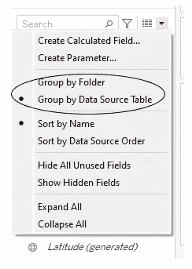
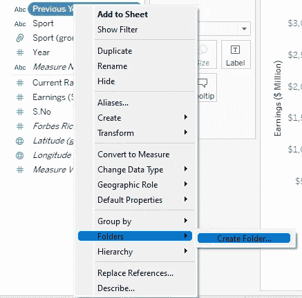
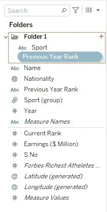
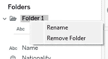
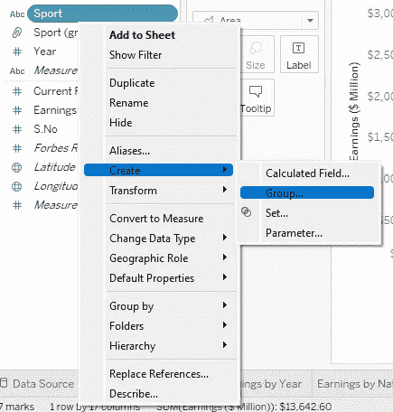
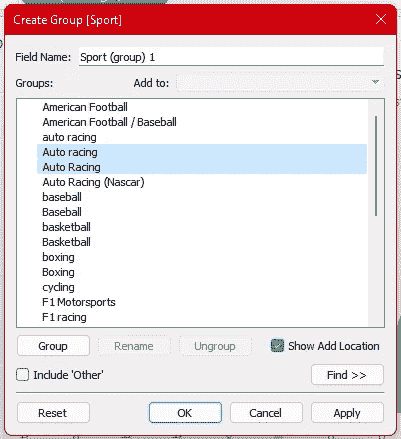
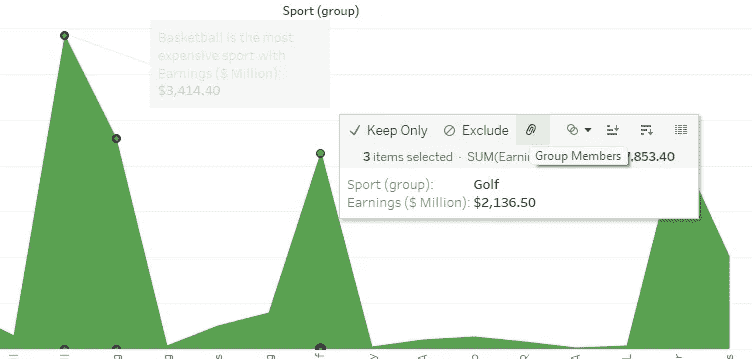
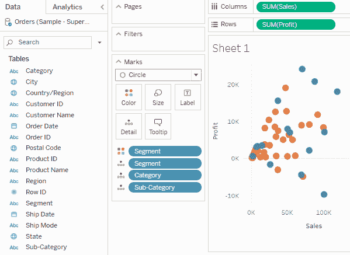
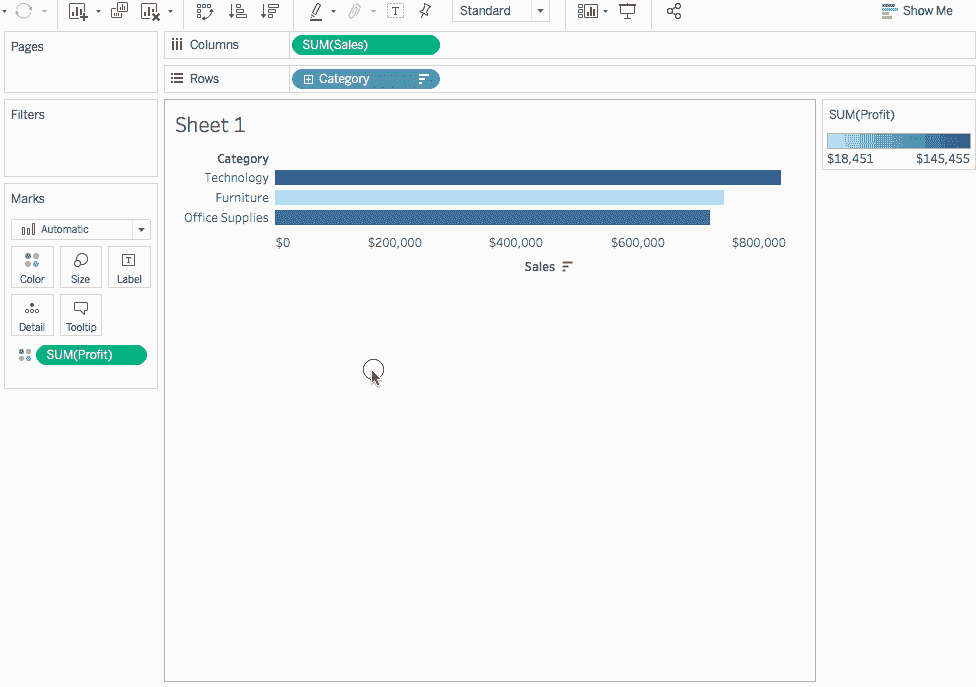

# 文件夹、组和层次结构:Tableau 桌面专家认证之路

> 原文：<https://pub.towardsai.net/folders-groups-hierarchies-a-road-to-tableau-desktop-specialist-certification-5eb97989829e?source=collection_archive---------3----------------------->

## **第 7 章:在 Tableau 中创建文件夹、组和层次结构的综合指南，包括考试中的示例问题**

**欢迎来到第七章，在这一章中，我们将学习 Tableau 中的文件夹、组和层次结构。**

> **如果你想浏览其他章节，请访问:** [**Tableau**](https://medium.com/u/fcbe60d0bf8b?source=post_page-----5eb97989829e--------------------------------) **:这是什么？为什么它是最好的？；Tableau 桌面专家认证之路。**

> **如果您想直接访问 Tableau 桌面专家笔记，请在此处访问它们→**[**https://dakshtrehan . comment . site/Tableau-Notes-c 13 fceda 97 b 94 BDA 940 edbf 6751 cf 30**](https://dakshtrehan.notion.site/Tableau-Notes-c13fceda97b94bda940edbf6751cf303)
> 
> 使用链接访问免费 Tableau 认证转储(有效期至 2022 年 7 月 6 日):
> 
> [https://www . udemy . com/course/tableau-desktop-specialist-certification-dumps-2022/？coupon code = e3f 08189 fa 4 bafae 72 BC](https://www.udemy.com/course/tableau-desktop-specialist-certification-dumps-2022/?couponCode=E3F08189FA4BAFAE72BC)

# **目录**

*   **创建文件夹**
*   **创建组** –从数据面板创建组
    –从视图创建组
*   **等级制度**
*   **本题的样题**

# 创建文件夹

我们可以根据数据源或文件夹对数据进行分组。

当您有大量数据，并且希望通过将不同的字段分组到文件夹中来清除混乱时，文件夹是非常有用的选项。

要创建文件夹，只需选择“按文件夹分组”,右键单击任何维度/度量即可创建文件夹。

**可以为维度和度量创建文件夹。**

要在文件夹中添加/删除更多字段，只需从数据窗格中拖放即可。

我们也可以删除/重命名我们的文件夹，只需右键单击数据窗格中的文件夹名称。

# 创建组

Tableau 中的组由回形针表示。

组在对传达相同含义但以不同名称表示的数据进行分组时非常有用。例如，我们的国家/地区字段包含两行，一行代表“美国”,另一行代表“美国”,这两行代表相同的含义，但增加了数据的冗余，因此我们将这两行归为一组，并给它们一个名称。

**通过分组，您可以将单个维度的几个成员组合成一个数据点或类别类型，从而创建一个原来不存在于您的数据中的新维度字段。**

**分组可以在两个维度上进行&测量。**

**我们可以在一个群体中创造一个群体。**

可以通过以下方式进行分组:

## 从数据窗格→

第一步:右键单击维度/度量并选择“组> >创建”。

第二步:选择所有你想分组的字段，点击“分组”。

## 从视图→

步骤 1:要从视图中创建一个组，请选择所需的数据标记。

第二步:点击回形针图标(小组成员)。

**在视图中创建组时，新的组字段会立即在视图中使用。**

**如果我们在视图中使用标签进行分组，则会创建一个新的合并标记。(如果包含其他未选中)**

**分组时，我们可以选择将其他成员视为“其他”或按标签查看，也就是说，我们可以将所有其他成员添加到“其他”组，也可以保持不变。**

当我们第一次在标记中创建一个组时(如果选中了包括其他人):

*   **视图中的标记颜色被更新。**
*   **创建了一个名为“其他人”的群组。**
*   **在数据窗格中创建一个分组字段。**
*   **选择一个组合了所有选定标记的组。**

# 创建层次结构

Tableau 中的层次结构是在我们想要表示“上面”和“下面”结构时创建的。层次保留了顺序，在可视化中创建了钻取功能，并且可以反复使用。任何类型的数据都可以组织成层次结构。

我们可以有一个以上的字段到一个以上的层次结构。

要创建层次结构，只需将一个字段放在另一个字段上。

[创建层次结构—表格](https://help.tableau.com/current/pro/desktop/en-us/qs_hierarchies.htm)

可以通过行/列架上的“+”或“-”图标访问层次结构。

[创建层次结构—表格](https://help.tableau.com/current/pro/desktop/en-us/qs_hierarchies.htm)

**日期字段自动转换为 Tableau 中的层次结构。**

# 本主题的示例问题

**维度下有哪些默认层次结构？**

a.地区>国家>州>城市..
乙年>季>月..c .没有默认的层次结构。
d .主管>经理>副经理>..

**解:**年>季>月..

**群组使用高级合并低级类别？**

a.真
b .假

**解:**假

**当我们使用视图中的标签和视图中的标签来创建组时，Tableau 的行为会有所不同？**

a.真的
b .假的

**解:**真

**以下哪一项用于数据下钻:**

a.日期
b .层级
c .组
d .集合

**解决方案:**层次结构

**Tableau 中的组由？** a .回形针
b .双缸
c .维恩图
d .单缸

**解决方法:**回形针

> 使用链接访问免费 Tableau 认证转储(有效期至 2022 年 7 月 6 日):
> 
> [https://www . udemy . com/course/tableau-desktop-specialist-certification-dumps-2022/？coupon code = e3f 08189 fa 4 bafae 72 BC](https://www.udemy.com/course/tableau-desktop-specialist-certification-dumps-2022/?couponCode=E3F08189FA4BAFAE72BC)

# 参考资料:

[1] [Tableau 帮助| Tableau 软件](https://www.tableau.com/support/help)

[2] [个人笔记](https://dakshtrehan.notion.site/Tableau-Notes-c13fceda97b94bda940edbf6751cf303)

[3] [Tableau 桌面专家考试(新花样— 2021) — Apisero](https://apisero.com/tableau-desktop-specialist-exam-new-pattern-2021/)

# 感谢阅读！

请随意鼓掌，这样我就知道这篇文章对你有多有帮助，并在你的社交网络上分享它，这对我会很有帮助。

如果你喜欢这篇文章，想了解更多关于**机器学习，数据科学，Python，BI。请考虑订阅我的时事通讯:**

> [达克什·特雷汉的简讯](https://mailchi.mp/b535943b5fff/daksh-trehan-weekly-newsletter)。

在网上找到我:[www.dakshtrehan.com](http://www.dakshtrehan.com/)

在 LinkedIn 与我联系:[www.linkedin.com/in/dakshtrehan](http://www.linkedin.com/in/dakshtrehan)

阅读我的科技博客:[www.dakshtrehan.medium.com](http://www.dakshtrehan.medium.com/)

在 Instagram 和我联系:【www.instagram.com/_daksh_trehan_ 

# 想了解更多？

[YouTube 是如何利用 AI 推荐视频的？](/how-is-youtube-using-ai-to-recommend-videos-38a142c2d06d)
[利用深度学习检测新冠肺炎](https://towardsdatascience.com/detecting-covid-19-using-deep-learning-262956b6f981)
[逃不掉的 AI 算法:抖音](https://towardsdatascience.com/the-inescapable-ai-algorithm-tiktok-ad4c6fd981b8)
[GPT-3 向一个 5 岁的孩子解释。](/gpt-3-explained-to-a-5-year-old-1f3cb9fa030b)
[Tinder+AI:一场完美的牵线搭桥？](https://medium.com/towards-artificial-intelligence/tinder-ai-a-perfect-matchmaking-b0a7b916e271)
[一个内部人士的使用机器学习卡通化指南](https://medium.com/towards-artificial-intelligence/an-insiders-guide-to-cartoonization-using-machine-learning-ce3648adfe8)
[谷歌是如何做出“哼哼来搜索？”](/how-google-made-hum-to-search-865f224b70d0)
[一行神奇的代码执行 EDA！](/one-line-magical-code-to-perform-eda-f83a731fbc35)
[给我 5 分钟，我给你深度假！](/give-me-5-minutes-ill-give-you-a-deepfake-ce83a645b0f9)

> *欢呼*