# 雅加达周围的食物(第一部分):佐马托网刮硒

> 原文：<https://pub.towardsai.net/foods-around-jakarta-part-1-zomato-web-scraping-with-selenium-8a96b0547466?source=collection_archive---------0----------------------->

## [编程](https://towardsai.net/p/category/programming)，[网页抓取](https://towardsai.net/p/category/web-scraping)

## 想知道大榴莲有什么样的食物(和饮料)吗？还是用硒刮吧！


Soto 和 Nasi Uduk，印度尼西亚最好的美食|照片由[拉斐尔·阿尔法里兹](https://unsplash.com/@raphiella?utm_source=medium&utm_medium=referral)在 [Unsplash](https://unsplash.com?utm_source=medium&utm_medium=referral) 上拍摄

***免责声明:*** *本文仅出于教育目的。我们不鼓励任何人抓取网站，尤其是那些可能有条款和条件反对此类行为的网站。*

阿卡塔现在进入了新冠肺炎疫情的第八个月，从目前的情况来看，情况并没有好转。我们的政府正在这个城市实施断断续续的社会限制。

建议人们呆在家里和在家工作，非必需品行业建议暂时关闭，是的，这包括你喜欢的餐馆或甜品店！

去年每个周末我都在我家附近的商场闲逛，探索那里的餐厅，现在不行了。有趣的事实是，印尼人喜欢聚集到餐馆，和他们的家人、朋友出去吃饭或约会。这是我们文化的一部分。现在，疫情彻底改变了我们的外出就餐文化。

> 做饭，还是不做饭，这是个问题。

当社会限制条例开启时，*外出就餐*被扔出窗外。我们可以买食材，然后自己做饭，因此有了'*到* *做饭'*的选项。

“不做饭”的选择:买外卖食品，或者更安全的，在网上订餐。作为一名雅加达人，我努力避免在这座城市出现新的 COVID 病例，由于印度尼西亚食品配送技术的兴起，我有时会在网上订餐

我发现自己一遍又一遍地通过 *GoFood* 在同一家餐厅点同样的食物。当我渴望鸡肉时，我发现自己从*肯德基*和*麦当劳*点菜(是的，*麦当劳*在印度尼西亚供应鸡肉)。当我渴望索托的时候，我发现自己在索托·库杜斯·布洛克·米·特贝特等店点餐。

雅加达有数千家餐馆，在 8 个月的疫情中，我只在雅加达不到 20 家餐馆点过菜。

意识到这一点，并阅读 [Regita H. Zakia](https://medium.com/u/10e15784e2a?source=post_page-----8a96b0547466--------------------------------) 的“[我身边的食物:用 Python 抓取谷歌地图数据&Google Colab“](https://towardsdatascience.com/foods-around-me-google-maps-data-scraping-with-python-google-colab-588986c63db3)**，**我被吸引着将她所做的扩展到更大的范围。

这座城市实际上提供多少种食物？有多少家餐厅提供我最喜欢的印尼食物，Soto，和 Rendang？这么多问题。

所以这一次，我不打算从谷歌上搜集食品服务行业的数据，而是从 Zomato 上搜集。为什么？这是 Jakartan 美食家评分和撰写评论的地方。这是食物参考的可靠来源。

为了做到这一点，我将使用 Selenium 库编写一个 Python 脚本，通过成千上万的餐馆页面自动执行抓取过程，然后使用熊猫构建数据集。

# 我们要搜集什么数据？

首先，由于 Zomato 中有大量的数据，我们必须列出我们的小研究中需要的数据。检查完 [Zomato 页面](https://www.zomato.com/id/jakarta)后，我决定我将刮:

## 从搜索页面中:

1.  雅加达地区所有餐馆的网址
2.  雅加达地区提供送货服务的餐馆的网址

## 从(个人)餐厅页面:

1.  餐馆名称
2.  餐厅类型
3.  餐厅区
4.  餐馆等级
5.  餐馆评论
6.  餐厅的平均价格为 2
7.  餐厅地址
8.  餐厅的附加信息/设施
9.  餐厅纬度和经度

# 基本准备

既然我们要使用 Selenium，当然，第一步是确保我们有必要的库 Selenium。因为 Selenium 最初是一个在 web 浏览器中自动执行该过程的库，所以我们需要在您的计算机上安装一个真正的浏览器，以及一个控制它的浏览器驱动程序。

这次我会用 Google Chrome，你可以在这里下载浏览器驱动[。](https://chromedriver.chromium.org/downloads/version-selection)

从 Selenium 开始，将此放在代码的顶部！

# 检查搜索页面

## 雅加达地区所有餐馆的网址列表

Selenium 是一个非常方便的库，可以使用各种方式来查找 HTML 元素，如 *id* 、*类名*、*标记名*、*链接文本*、 *XPath* 或 *CSS 选择器*。有了这个指南，我还将介绍我在抓取 Zomato Page 时发现的各种问题，然后解释如何解决它们。

让我们看看下面的搜索页面。如果我们将我们的位置锁定在雅加达，目前有 1002 页，每页包含大约 15 家餐馆。这可能意味着雅加达大约有 15000 家餐馆！哇，太不可思议了！

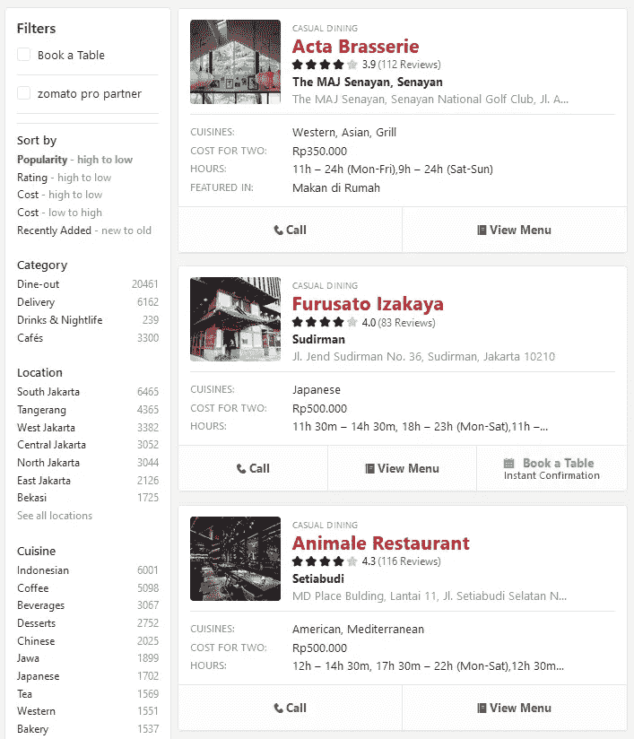

Zomato 搜索第 1 页

现在我们要刮的只是每个搜索页面上的**网址**，以后可以单独打开。想象一下手动打开 1000 多页，那肯定会很累(老实说，也很无聊)。硒来拯救！

在写 Python 代码之前，我们必须知道 2 Selenium*“Find Element”*工具的区别:

*   *查找元素*:查找一个**单个**元素，通过声明**特定的** HTML 元素定位器来定位
*   *查找元素*:查找元素的**列表**，通过在您想要查找的元素中声明一个**公共** HTML 元素定位器来定位

在我们的例子中，由于我们想要抓取每个搜索页面上的所有网站地址，我们将使用 *find elements* 工具。好的，酷，那么如何识别这些餐馆列表中的网址呢？

我们必须检查页面的 HTML，然后在每个搜索页面的所有网址中找到共同的 HTML 元素。

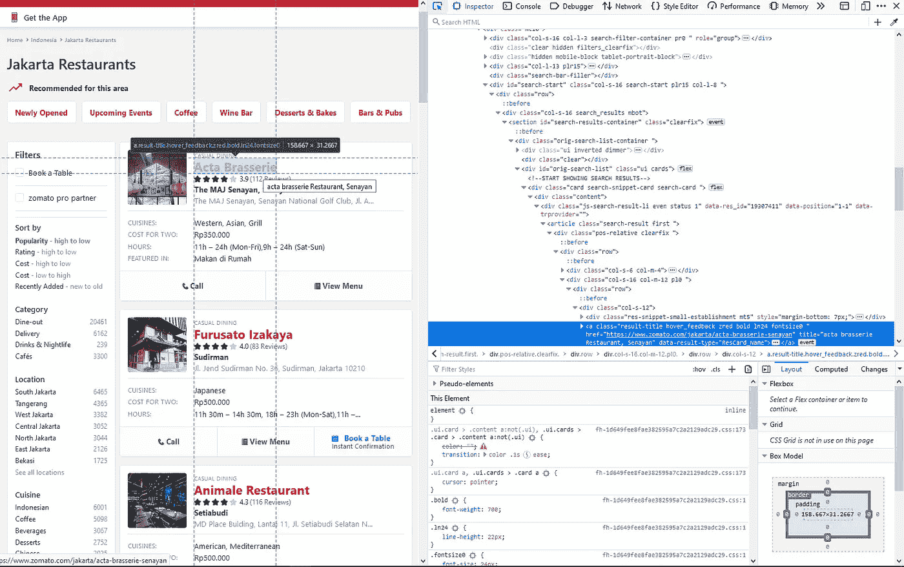

在我检查了这个搜索页面上的所有网址后，我得出结论，网址的一个常见 HTML 元素是它们的*类名*。

现在，我们可以通过编写如下代码来获得 *Selenium Web 元素*的列表:

```
url_elt = driver.find_elements_by_class_name("result-title")
```

看起来很简单，但是我们的目标是网站地址，对吗？我们只需要编写额外的代码，通过遍历列表，从每个 *Web 元素*中提取 URL 页面的**属性(href)** 。

使用上面的代码，我们将能够创建一个 web 地址列表。现在，让我们将它与代码结合起来，在 Zomato 中循环搜索所有 1002 个页面。

我们已经编写了抓取网址的基本代码，但是我们可以通过编写代码来显示网页抓取的进度来进一步改进它，就像这样。

通过添加两个简单的打印代码，我们可以在每次成功遍历搜索页面时获得信息通知。

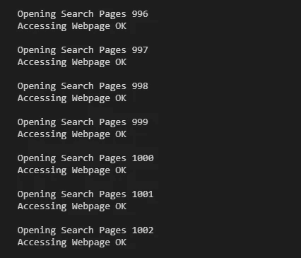

简单而丰富的是我们所需要的

不要忘记将列表转换成熊猫数据帧，这样我们就可以使数据排列整齐。

```
out_df = pd.DataFrame(out_lst, columns=['Website'])
```

结果:

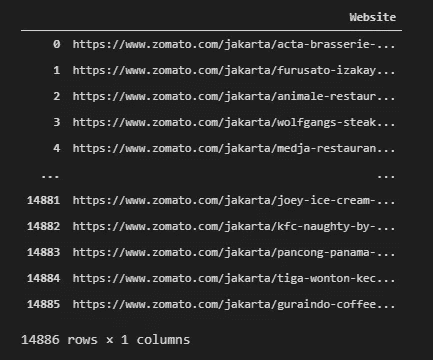

## 雅加达地区提供外卖服务的所有餐厅的网址列表

接下来，我们要做完全相同的事情来获取雅加达地区提供外卖服务的餐馆列表。唯一的区别是搜索页面的 URL 和我们想要循环的搜索页面的数量。

结果:

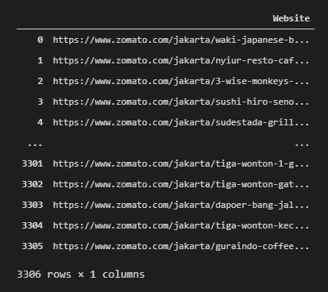

## 删除重复的 Web 地址

现在，雅加达地区有 14886 家餐馆，其中 3306 家提供外卖服务。在深入研究 web 抓取之前，我们必须确保没有重复的条目，因为搜索页面结果有时会包含重复的条目。

我们可以很容易地发现，使用一个非常简单的熊猫法，*复制。*

```
# Observe whether we have duplicate websites or notout_df[out_df.duplicated(['Website'], keep='first')]
```

使用上面的代码，我们将看到数据帧中重复的网址列表，除了重复的第一个条目的**。**

让我们创建一个没有重复值的新数据框架，既包括所有餐馆的数据框架，也包括外卖餐馆的数据框架。

```
# Make A New DataFrame - without duplicated valuesout_df_nd = out_df[~out_df.duplicated(['Website'], keep='first')]
outdlv_df_nd = outdlv_df[~outdlv_df.duplicated(['Website'], keep='first')]
```

# 检查单个餐馆页面

我们现在拥有全雅加达约 14500 家餐厅的唯一网址。通过使用这个，我们可以遍历每个 web 地址并收集我们需要的信息。让我们继续写更多的代码！

## 餐馆名称

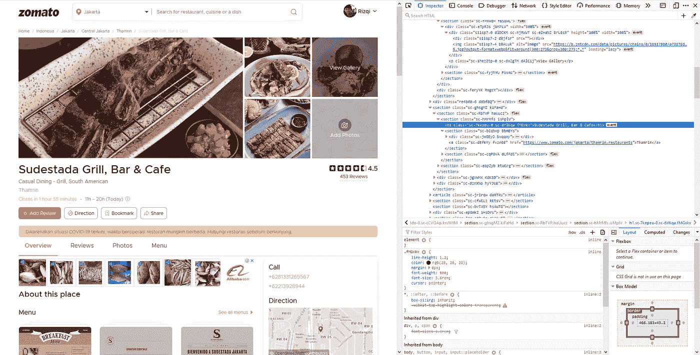

从上图中可以很明显地看出，在 HTML 代码中，餐馆名称被标记为 *h1* 。以前，我们使用*类名*在 HTML 代码中查找元素，现在我们将使用*标记名*来查找。

```
name_anchor = driver.find_element_by_tag_name('h1')
```

不要忘记 find 元素返回一个 *Selenium Web 元素*，所以我们必须进一步提取它以获得我们需要的数据。在我们的例子中，我们可以通过使用这段代码来实现。

```
name = name_anchor.text
```

下面是抓取**餐馆名称**的完整代码:

抓取餐馆页面几分钟或几小时后，您的程序可能会停止，显示一条错误消息，因为某些页面的 *h1* 元素无法抓取。在 Zomato 案例中，有这样的页面:

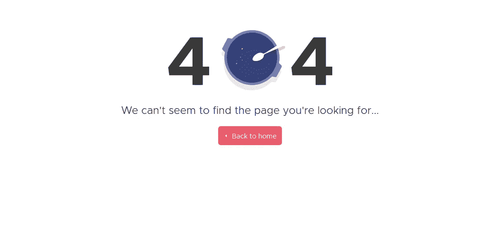

404 错误

如果我们的浏览器点击了这个页面，程序就会停止，因为它无法抓取它的 h1。我们可以通过使用 Selenium 库中的另一个函数轻松解决这个问题: *NoSuchElementException。*如果我们没有找到我们想要的 web 元素，结合 *if* 语句，我们可以重新路由程序，让它通过。首先，我们必须在代码的开头导入这个函数。

```
from selenium.common.exceptions import NoSuchElementException
```

之后，我们将使用一个 *try-except* 语句来实现程序的逻辑。如果我们没有找到任何 h1 元素，只需将“404 错误”写入**餐厅名称**，然后传递到下一页。

此外，像我们之前所做的一样，让我们编写一些 *print* 代码来显示网页抓取的进度。

结果:

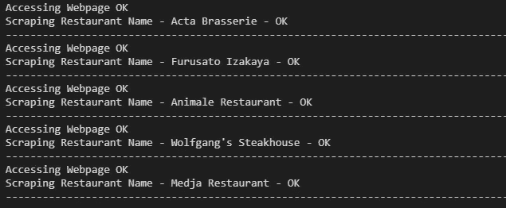

## 餐厅类型

下一步，我们要收集雅加达每个餐馆的类型。

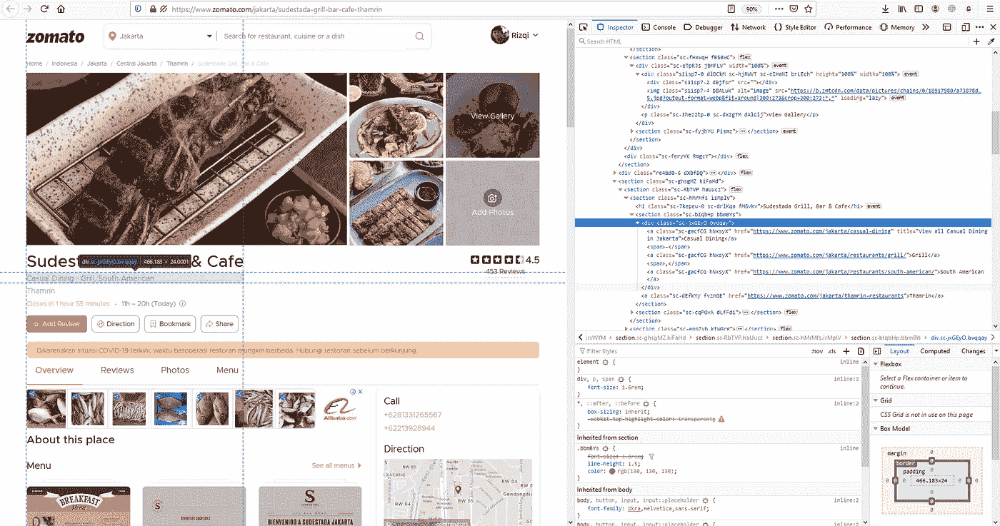

像 Web 地址一样，我们将使用 *find 元素*,因为我们想要抓取多个元素。问题是，我们最好用什么定位器来找到这个元素？如果我们仔细观察，*标签名* ( *div* )不够唯一，而*类名* ( *sc-jxGEy0* )在一些餐厅页面中可以不同。这就是为什么我们不能这两个定位器。

这就是 XPath 变得非常方便的地方。然而什么是 *XPath* ？它代表 *XML 路径语言*，我们可以用它来定位我们想要抓取的元素，因为 Zomato 的餐馆页面的结构大部分是相同的。

我们如何获得这个有用的 XPath 呢？只需右键单击您想要的 HTML 代码，然后单击 *Copy - > XPath* 。

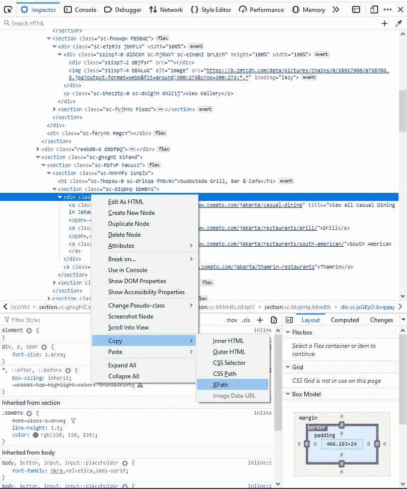

放松点。

现在我们已经有了 *XPath* ，只需将它粘贴到您的编码程序中，并添加这段代码。请注意，就像 *rest_name* 一样，我们也要做一个空单: *rest_type* 在最上面。

## 餐厅区域和地址

接下来，我们需要刮**餐厅区域**和**地址**。这更容易，因为我们只需要抓取 1 个元素，就像之前一样，我们将通过 *XPath* 抓取它。

## 餐厅评论和评级

在我们完成了姓名、地区和地址之后，让我们转到稍微复杂一点的信息:评论和评级。随着你的深入，你会发现并不是所有的餐馆都有这些信息。就像餐馆名称一样，我们将利用 *NoSuchElementException* 。

## 餐厅的平均价格为 2

到目前为止， *XPath* 方法非常方便地收集我们需要的数据。现在，对于这些数据，我们必须用几个 *if-else* 语句来修改我们的*“通过 XPath 查找元素”*。原因是，对于这个特定的数据，在每个餐馆页面中的位置是不同的。

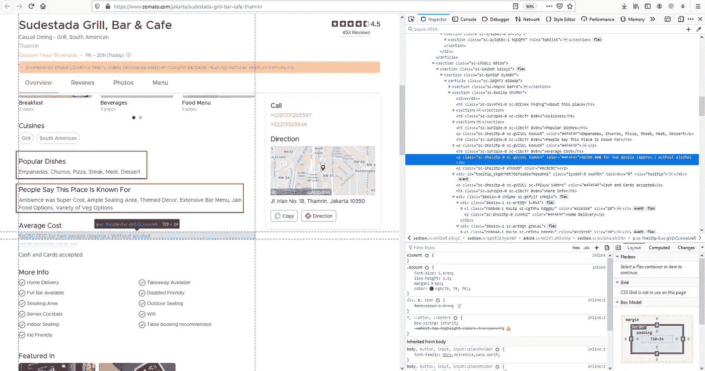

红框显示了使基本 XPath 方法不能很好工作的信息

上图中，*【平均成本】*位于*【大众菜】**“人们说这个地方以*闻名。在大多数 Zomato 页面中，这两条信息是不显示的，这就是为什么在有这两条信息的页面中平均成本的位置不同。

我们将使用一个字符串切片函数来检查我们抓取的数据是否以“Rp”/“No”开头。如果不是以这两个字符串开始，我们将刮另一个 *XPath* 。

让我们在代码中实现这个逻辑。

## 餐厅附加信息

我们已经通过各种定位器抓取了单个 web 元素，具有相同*类名*的多个 web 元素，一个 *XPath* 中的多个 web 元素，现在我们将学习抓取一个更加独特的东西！

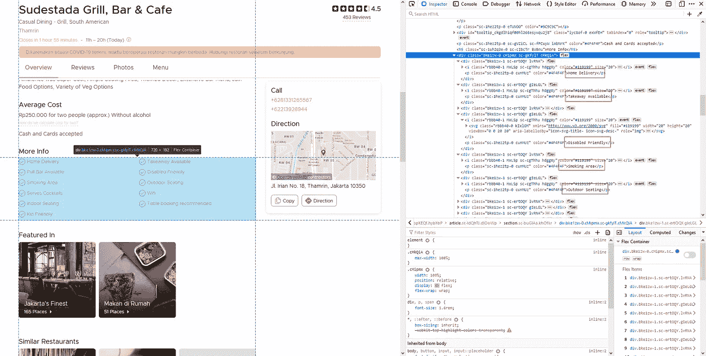

正如你在上面的图片中看到的，我们想要抓取包含在蓝框中的所有文本信息。如果我们看到左边的 HTML 代码，信息分散在不同的代码中。

为了有效地抓取，我们将做的是:通过 *XPath* 找到蓝框的元素，然后通过使用结果，我们通过标签名 *p.* 找到文本的多个元素。这里是该逻辑的代码版本*。*

## 餐厅纬度和经度

这种信息搜集和以前一样棘手。为了知道为什么让我们来看看。

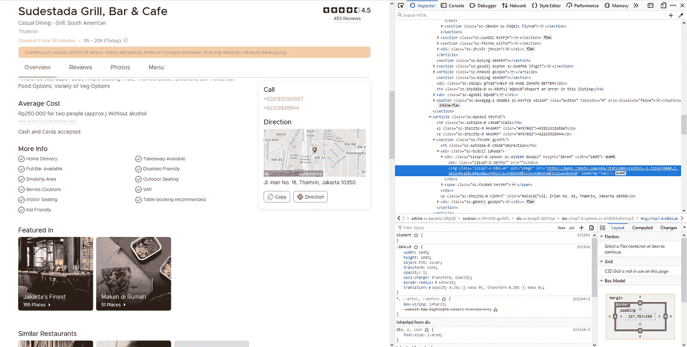

如您所见，每个餐馆的纬度和经度都位于地图的网址中。我们不需要打开地图的网址来获取经纬度。

我们可以简单地从 web 元素中提取 web 地址，然后使用 python 中可用的字符串函数对其进行切分。瞧啊。

## 另一个旁注

既然我们为想要抓取的每个数据编写了代码，我们就可以将它们组合在一起，从每个页面中抓取所有这些信息。

但在此之前，我们最好导入另一个重要的库，我们将使用它来暂停程序的执行。

为什么？因为，根据您的互联网连接速度，以及我们想要抓取的信息的数量/类型，我们可能需要等待浏览器完全加载页面。

```
import time# To delay the execution of next coding line
time.sleep(8)
```

## 收集所有餐厅数据

编织所有上述代码，当我们运行代码时，我们会得到这个。我们可以清楚地看到网页抓取过程的进展(你也可以看到抓取过程中是否有一些错误！).

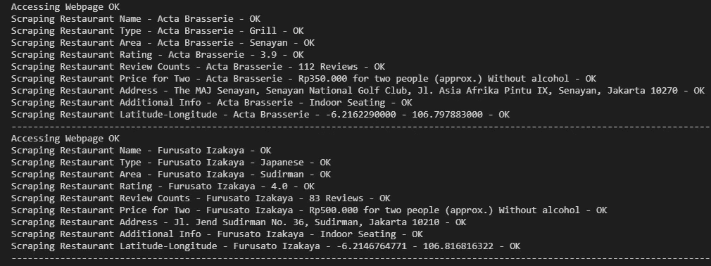

别忘了我们抓取的结果是一个列表的集合。我们需要将它们组合在一起，创建一个紧凑、整洁的数据集。

```
rdf = pd.DataFrame({"Restaurant Name" : rest_name[:], "Restaurant Type" : rest_type[:], "Restaurant Area" : rest_area[:], "Restaurant Rating" : rest_rating[:], "Restaurant Review" : rest_review[:], "Price for 2" : price_for_2[:], "Restaurant Address" : rest_address[:], "Additional Info" : rest_info[:], "Latitude" : rest_lat[:], "Longitude" : rest_long[:]})
```

结果:

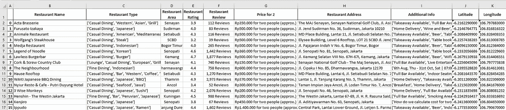

你可以在 [Github](https://github.com/RizqiEka/ZomatoWebScraping) 上看到抓取个人餐厅页面的完整代码。

# 结论

好了，电子表格结束了！我们现在从 Zomato 那里获得了雅加达食品服务行业的数据。在第 2 部分中，我将带您完成下一步，用反向地理编码来完成这些数据！

也是为了你，我想说**恭喜**！您刚刚学习了如何从 Zomato 获取餐馆数据。在这个过程中，您还学会了使用各种技术来面对不同种类的 HTML 代码。

此外，还要注意 Zomato 也可能改变它的 HTML 结构，所以如果有这样的变化，你可能要进一步适应。每个网站都是不同的，这就是为什么调整技术/代码来抓取它是很重要的。

在疫情期间保持健康，祝你刮网愉快！

# 感谢阅读

我真的希望你喜欢这篇文章！我真的希望你能从中学到一些新的有用的东西。如果你真的这样做，请在下面鼓掌，如果你有任何反馈，请在下面留下你的想法！

## 保持联系

*   请关注我的下一篇文章
*   一起讨论还是想合作？让我们在 [LinkedIn](https://www.linkedin.com/in/rizqiekamaulana/) 上连线