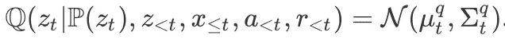
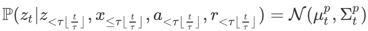
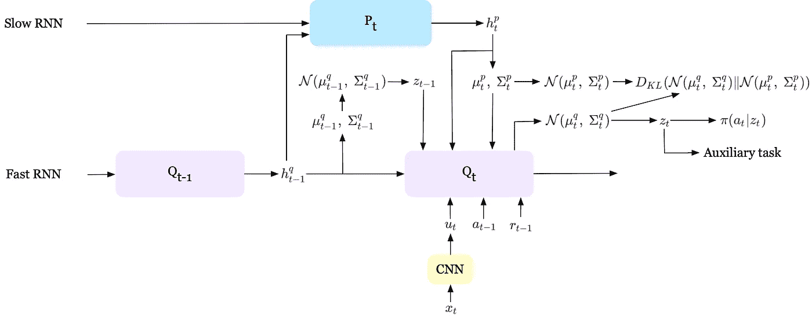
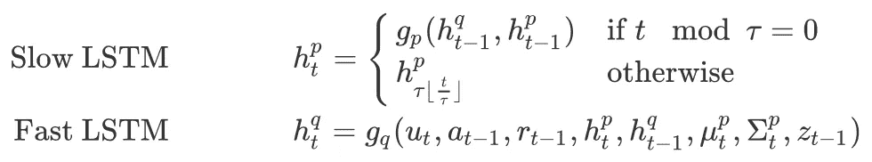
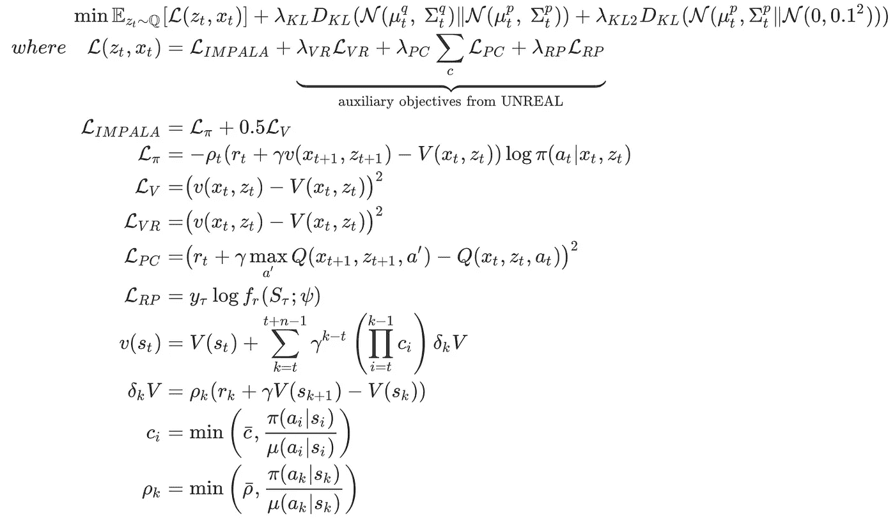
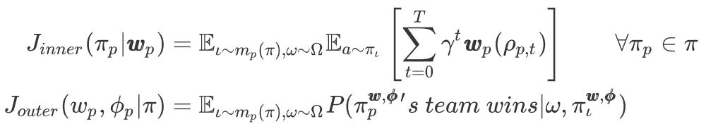
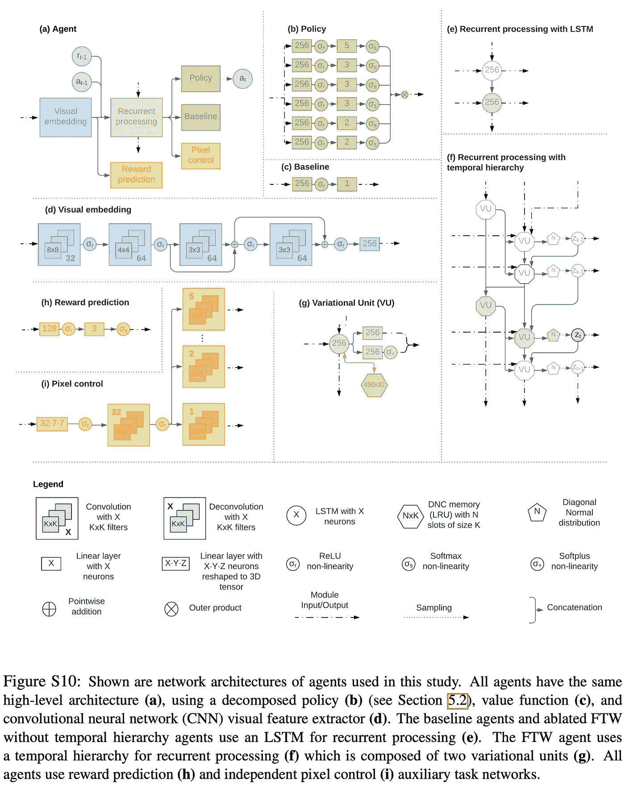
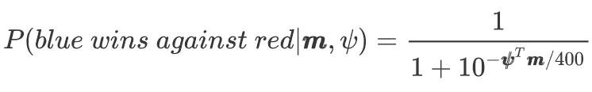
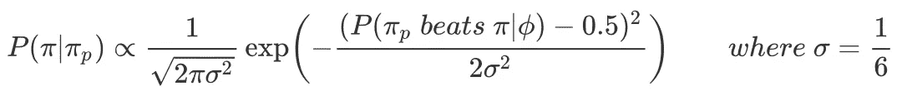

# 获奖理由:人工智能代理在 3D 视频游戏中实现了人类水平的性能

> 原文：<https://pub.towardsai.net/for-the-win-an-ai-agent-achieves-human-level-performance-in-a-3d-video-game-3971277ea3d4?source=collection_archive---------0----------------------->

来源:https://deepmind.com/blog/article/capture-the-flag-science

## DeepMind 对 FTW 代理的详细解释

# 介绍

在本文中，我们将讨论来自 DeepMind 的 Win(FTW)代理，它在一款流行的基于团队的多人第一人称视频游戏中实现了人类级别的性能。FTW 代理使用一种新颖的两层优化过程，在该过程中，一群独立的 RL 代理从成千上万的平行比赛中同时被训练，代理在随机生成的环境中一起组队比赛并彼此对抗。群体中的每个代理学习其内部奖励信号，以补充来自获胜的稀疏延迟奖励，并使用新颖的时间分层表示来选择动作，这使得代理能够在多个时间尺度上进行推理。

# 任务描述

FTW 代理在“捕捉旗帜”( CTF)环境中接受训练，在该环境中，由多个单独玩家组成的两个对立团队(他们只进行 2 对 2 游戏的训练，但发现代理可以推广到不同的团队规模)通过战略性导航、标记和躲避对手来竞争捕捉对方的旗帜。五分钟后获得最多旗帜的队伍获胜。

## 环境观察

该观察由 *84 个⨉ 84 个*像素组成。每个像素由三个字节组成的三元组表示，我们通过 *1/255* 对其进行缩放，以产生一个观察值 *x ∈ [0，1]^{84 ⨉ 84 ⨉ 3}* ，就像我们在雅达利游戏上所做的那样。此外，某些游戏点信号 *𝜌_t* ，如“我捡起了旗子”，也是可用的。

## 行为空间

动作空间由六种离散的部分动作组成:

*   五个值的偏航旋转变化 *(-60，-10，0，10，60)*
*   三个值的音高变化 *(-5，0，5)*
*   向左或向右扫射(三元)
*   向前或向后移动(三元)
*   标记与否(二进制)
*   跳跃与否(二进制)

这给了我们一个代理可以产生的 *5⨉3⨉3⨉3⨉2⨉2=540* 复合动作的总数。

## 记号

为了便于参考，我们在这里列出了一些稍后使用的符号

*   𝜙:超参数
*   𝜋:代理政策
*   𝛺: CTF 地图空间
*   *r =****w****【𝜌_t】*:内在奖励
*   *p* :玩家 *p*
*   *m_p(𝜋)* :一种随机配对方案，使合作者偏向于与玩家 *p* 具有相似技能，请参见补充材料中的 Elo 分数，了解评分代理的表现详情
*   *𝜄≁m_p(𝜋)*:p*的合作者*

# FTW 代理

## 全部的

夺旗(CTF)提出了三个挑战:

1.CTF 游戏需要高水平策略的记忆和长期时间推理。

2.奖励很少——只有在游戏结束时才会给予奖励。因此，信用分配问题是一个难题。

3.环境设置因比赛而异。除了不同的地图，可能还有不同数量的玩家，不同等级的队友等等。

FTW 代理通过引入一种架构来满足第一个要求，该架构具有多时间尺度表示，这让人想起在灵长类动物大脑皮层中观察到的情况，以及外部工作记忆模块，该模块主要受人类情景记忆的启发。通过使代理能够基于游戏点数信号 *𝜌_t* 发展内部奖励信号，信用分配问题得以缓解。最后，为了开发对不同环境设置具有鲁棒性的多样化概括技能，我们同时培训了大量多样化的代理人，他们通过在不同的地图中相互游戏来学习。这种多样化的代理群体也为执行基于群体的内部奖励和超参数优化培训铺平了道路。

在本节的其余部分，我们首先讨论 FTW 使用的体系结构和目标。然后，我们讨论内在奖励和基于群体的训练。

## 时间分层强化学习

**建筑**

FTW 代理使用分层 RNN，其中两个 LSTMs 在不同的时间尺度上运行(尽管该架构可以扩展到更多层，但作者发现实际上两层以上对任务几乎没有影响)。在每个时间步长上进化的快速跳动的 LSTM 输出变化的后验概率

从快速跳动的 LSTM 变分后验概率

从 *N(* 𝜇 *_t^q,𝛴_t^q)* 采样的 *z_t* 然后被用作策略、价值函数和辅助任务的潜在变量。慢速时标 LSTM，更新每个𝜏时间步长，输出潜在先验

来自慢滴答的 LSTM 的潜在先验

这个先验分布，正如我们将很快解释的，然后作为变分后验的正则化。直观地说，慢速 LSTM 在 *z，*上生成先验，该先验为后续的𝜏步骤预测 *z* 的演变，而快速 LSTM 在 *z* 上生成变分后验，该变分后验结合了新的观察结果，但坚持了先验做出的预测。下图总结了在时间步 *t* 的这一过程，我们将在补充材料中附加一个来自论文的更详细的图。

等级 RNN 结构

我们还将快速和慢速 rnn 的隐藏状态的演化数学表达如下

慢和快 LSTM。其中 g_p、g_q 分别是慢速和快速时间尺度的 LSTM 核。

**目标**

FTW 使用与 [UNREAL](https://arxiv.org/abs/1611.05397) 几乎相同的目标，V-trace 用于偏离策略校正，附加 KL 项用于正则化。

等式 1。FTW 的损失函数

物体的大部分先前已经被[虚幻](https://arxiv.org/abs/1611.05397)和[黑斑羚](https://arxiv.org/abs/1802.01561)覆盖。第一个新引入的 KL 项按照 RL 作为概率推理的思想，对照先前的策略 *P* 来正则化策略 *Q* 。与直接正则化策略的传统概率 RL 方法不同，等式 1 引入了中间潜在变量 *z* ，其对过去观察的依赖性进行建模。通过调整潜在变量，策略和先验现在的区别仅在于对过去观察的依赖性的建模方式。第二个 KL 惩罚针对具有平均值 *0* 和标准偏差 *0.1* 的多变量高斯调整先前的策略 *P* (参见论文中的*第 5.4 节*

与先前方法的另一个细微差别在于像素控制策略，在等式 1 中表示为 *L_{PC}* 。鉴于动作空间的复合性质，作者建议为六个动作组中的每一个训练独立的像素控制策略(详见补充材料中的*图 S10(i)* )。

等式 1 中使用的所有系数𝝀s 首先从某个范围采样，然后通过基于群体的训练进行优化。

## 内在奖励

外在奖励只在比赛结束时给出，表示赢(+1)、输(-1)或平(0)。这种延迟的奖励给学习带来了极其困难的学分分配问题。为了缓解这个问题，基于游戏点信号 *𝜌_t* 定义了密集的内在奖励。具体来说，对于每个游戏点信号，代理的内在报酬映射***w****(𝜌_t)*最初独立于 *Uniform(-1，1)* 进行采样。然后，使用基于群体的训练(PBT)过程以及其他超参数(如等式 1 中的𝝀s 和学习率)来进化这些内部奖励。

## 基于人口的培训

基于群体的训练(PBT)是一种进化方法，它并行训练模型群体，并不断用更好的模型加上微小的修改来替换更差的模型。对于我们的 FTW 代理，PBT 可以通过重复以下步骤来总结

1.**步骤**:在 *P=30* 的群体中的每个模型都用其超参数进行一些步骤的训练(例如 *1K* 游戏)。对于每场比赛，我们首先随机抽取一名代理人 *𝜋_p* ，然后我们根据他们的 Elo 分数选择其队友和对手——关于 Elo 分数的简要介绍，请参见补充材料。

2. **Eval** :满足 step 要求后，我们对每个模型的性能进行评估。在 FTW 的情况下，我们让就绪代理与另一个随机抽样的代理竞争，并估计 Elo 分数。

3.**利用**:如果发现代理的估计获胜概率小于 *70%* ，那么失败的代理复制策略、内部奖励转换和更好代理的超参数。

4.**探索**:我们用 *20* 以 *5%* 的概率扰动继承的内部报酬和超参数，除了慢速 LSTM 时标𝜏，从整数范围*【5，20】*均匀采样。

# 摘要

我们可以将政策培训和 PBT 总结为以下目标的联合优化

这可以看作是一个两层的强化学习问题。用时间分层 RL 求解的内部优化最大化 *J_{inner}* ，代理的预期未来贴现内部报酬。用 PBT 求解的 *J_{outer}* 的外部优化可以看作是一个元博弈，其中获胜的元奖励通过内部奖励变换 ***w*** 和超参数𝜙最大化，内部优化提供元转换动力学。

# 结束

就是这样。这是一次长途旅行；希望你喜欢。如果你遇到一些错误或者有一些担心，欢迎在下面留言或者评论。感谢阅读:-)

# 参考

Max Jaderberg，Wojciech M. Czarnecki，Iain Dunning，Luke Marris，Guy Lever，Antonio Garcia Castañ eda，Charles Beattie，等人 2019。"基于群体强化学习的 3D 多人游戏中人类水平的表现."*理科*364(6443):859–65。[https://doi.org/10.1126/science.aau6249.](https://doi.org/10.1126/science.aau6249.)

Espeholt，Lasse，Hubert Soyer，Remi Munos，卡伦·西蒙扬，Volodymyr Mnih，汤姆·沃德，Boron Yotam 等人，2018 年。" IMPALA:具有重要性加权的行动者-学习者架构的可扩展分布式深度学习."在*2018 ICML 第 35 届国际机器学习大会上*。

Max Jaderberg，Volodymyr Mnih 等人，2018 年。“无监督辅助任务的强化学习”，1–9。[https://doi.org/10.1051/0004-6361/201527329.](https://doi.org/10.1051/0004-6361/201527329.)

# 补充材料

## 网络体系结构

其中 [DNC](https://medium.com/towards-artificial-intelligence/dnc-differential-neural-network-3cfd82d0d99e?source=friends_link&sk=b0aee4af647f583267676b9171c6cbc7) 已经在我们之前的帖子中解释过了。

## Elo 分数

给定一群 *M* 代理，让可训练变量 *𝜓_i∈R* 成为代理 *i* 的等级。我们用向量***m****∈z^m*来描述两个玩家【T10(I，j)】在蓝色和红色上的给定匹配，其中 *m_i* 是代理人 I 出现在蓝色团队中的次数减去代理人出现在红色团队中的次数——在 PBT 的评估步骤中，我们使用两个在蓝色团队中有 *𝜋_i* 的玩家和两个有 *𝜋_j 的玩家标准的 Elo 公式是*

其中，我们优化评级*以最大化数据的可能性(我们将数据标记为 *y_i=1* 表示‘蓝击败红’， *y_i=1/2* 表示平局，而 *y_i=0* 表示‘红击败蓝’)。由于获胜概率仅取决于评分的绝对差异，为了便于解释，我们通常将特定代理的评分固定在 *1000* 的水平。*

*特定代理的队友和对手抽样分布定义为*

**

*这是基于 Elo 的获胜概率的正态分布，以具有相同 skill(𝜇 *=0.5* 的代理为中心。*