# 用时间序列分析预测未来

> 原文：<https://pub.towardsai.net/forecast-the-future-with-time-series-analysis-e7793368d879?source=collection_archive---------1----------------------->

使用 example…✈进行单变量时间序列分析的详细说明


# 介绍

时间序列分析是一种分析以数据-时间格式排序的数据的方法。简单来说，我们可以说数据帧的索引是时间戳的形式(日期格式)。单变量时间序列分析只包含一个变量，目标变量是基于时间预测的。我用一个例子来解释一下单变量时间序列分析的所有概念。

# 入门指南

在本文中，我将处理来自 Kaggle 网站的"[](https://www.kaggle.com/search?q=air+passengers+in%3Adatasets)**"*航空乘客数据集。该数据集包含从 1949 年 1 月到 1960 年 12 月通过航空公司旅行的乘客的每月 wise 记录。*

**

## *导入包*

*首先，我会通过导入 **warnings** 包，调用 **filterwarnings** 方法，使警告不在 python 记事本中显示。*

***代码:***

```
*import warnings
warnings.filterwarnings(“ignore”)*
```

*然后，在 Import 命令的帮助下，将所需的库导入 python 笔记本。在这里， **Pandas** 库用于我们玩数据集。而 **NumPy** 库用于我们对数据帧进行数值运算，而 **Matplotlib** 用于绘制数据帧。*

***代码:***

```
*import pandas as pd
import numpy as np
import matplotlib.pyplot as plt
%matplotlib inline*
```

## *读取数据集*

*借助熊猫包中的 **read_csv** 方法读取数据集(airline_passengers.csv ),并使用 **head** 方法显示前 5 行。*

***代码:***

```
*df=pd.read_csv(“airline_passengers.csv”)
df.head()*
```

*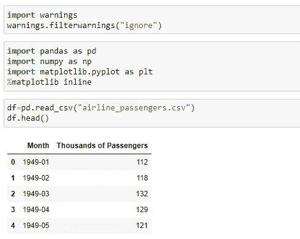*

## *探索数据*

*借助 Pandas 包的内置方法探索数据集。*

***代码:***

```
*df.info()df.describe()*
```

*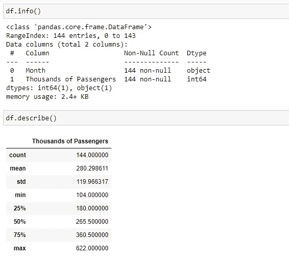*

*正如我们所看到的，月份列是对象格式的。我们需要使用 **to_datetime** 方法将其转换为日期-时间格式，然后使用 **set_index** 方法将其指定为数据帧的索引。*

*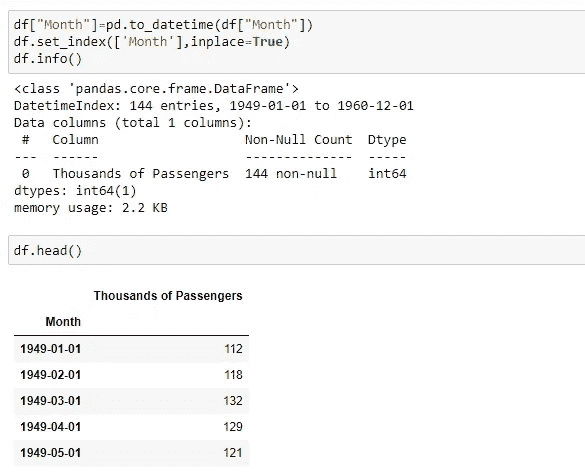*

*这里，**原位**值为真意味着数据帧本身基于所应用的操作而被修改。*

*使用 **freq** 属性将日期-时间索引的频率设置为“MS ”,因为索引的日期在月初。*

***代码:***

```
*df.index.freq = ‘MS’*
```

## *检查空值*

*让我们通过使用 **isnull** 方法来检查数据帧是否包含空值。*

***代码:***

```
*df.isnull().sum()*
```

*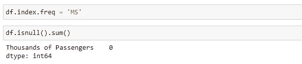*

*数据集中不存在空值。否则，我们会使用一些技术来处理缺失值，如**前向填充**、**后向填充**、**插值**等。*

## *绘制数据*

*使用 **matplotlib** 库中的 **plot** 方法绘制数据框，查看数据随时间的变化情况。这里，**图**方法用于设置绘图的参数。*

***代码:***

```
*plt.figure(figsize=(12,6))
plt.plot(df[‘Thousands of Passengers’])
plt.title(“Monthly total of Airline Passengers”)
plt.ylabel(“In Thousands”)
plt.xlabel(“year”)
plt.show()*
```

*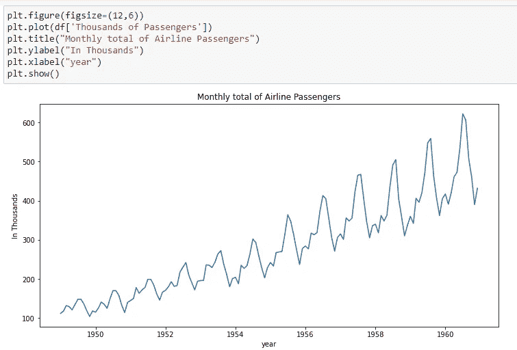*

*从上面的图像中，我们可以说数据有一个**上升趋势**，这意味着数值随着时间的推移逐渐增加，并且在图表中有一些**季节性**。*

## *检查季节性*

*季节性是一种数据模式，其中数据每年定期变化。可以是每周、每月和每季度。为了理解清楚，根据季节性划分地块。在这里，我们可以从上图中看出这是以年度为基础的。*

***代码:***

```
*plt.figure(figsize=(12,5))
plt.plot(df[‘Thousands of Passengers’])
plt.title(“Monthly total of Airline Passengers”)
plt.ylabel(“In Thousands”)
plt.xlabel(“year”)
for x in df.index[df.index.month==12]:
 plt.axvline(x=x, color=’red’);
plt.show();*
```

*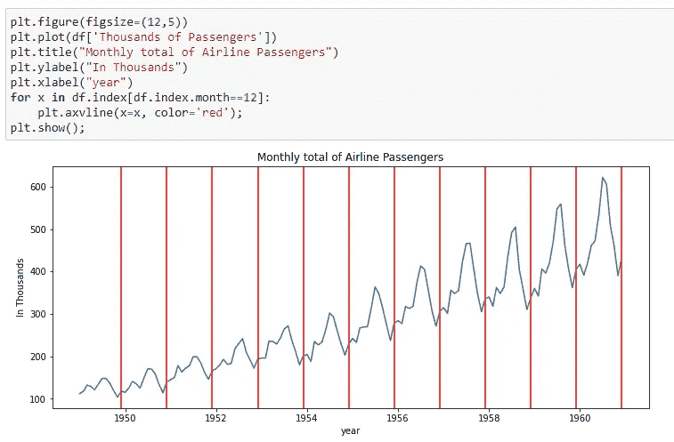*

## *分解信号(数据)*

*为了更加清晰，让我们通过使用 **statsmodels** 库中的**季节性分解**方法，将图分解为三个部分(趋势、季节性、残差图)。*

*这里，**模型**属性被给定为**相加**，因为图形相对于时间逐渐增加(趋势分量)。如果它呈指数增长，那么我们可以将其指定为乘法。*

***代码:***

```
*from statsmodels.tsa.seasonal import seasonal_decompose
result = seasonal_decompose(df[‘Thousands of Passengers’], model=’additive’)
fig, axs = plt.subplots(2, 2,figsize=(15,8))
axs[0, 0].plot(result.observed)
axs[0, 0].autoscale(axis=’x’,tight=True)
axs[0, 0].set_title(‘Observed’)
axs[0, 1].plot(result.trend,’tab:orange’)
axs[0, 1].autoscale(axis=’x’,tight=True)
axs[0, 1].set_title(‘Trend’)
axs[1, 0].plot(result.seasonal, ‘tab:green’)
axs[1, 0].autoscale(axis=’x’,tight=True)
axs[1, 0].set_title(‘Seasonal’)
axs[1, 1].plot(result.resid, ‘tab:red’)
axs[1, 1].autoscale(axis=’x’,tight=True)
axs[1, 1].set_title(‘Residuals’)
plt.show()*
```

*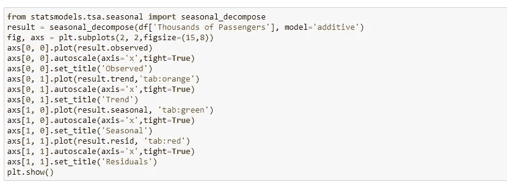**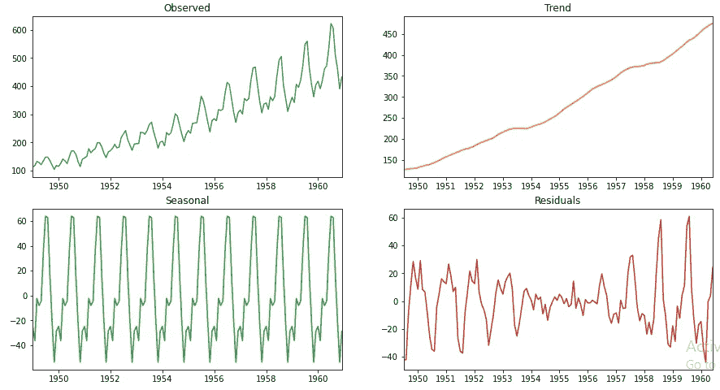*

## *S **平稳性的统计测试***

*让我们在训练模型之前做最后一步。即检查数据的**平稳性**。平稳性意味着数据的**均值**和**方差**在整个 x 轴(时间戳)上不变。为了检查它，我们需要执行一个叫做**增强 Dickey-Fuller 测试**的统计技术。*

*   *在这个测试中，如果 p 值比显著性水平(0.05 或 5%)小**，那么就有强有力的证据反对零假设。因此，我们拒绝零假设，并得出结论，数据是**平稳的**，没有单位根。***
*   ***如果 p 值比显著性水平(0.05 或 5%)大**或大**，则没有足够的证据反对零假设。因此，我们接受零假设，并得出结论，数据是**非平稳的**并且有一个单位根。***

***从 **statsmodels** 库中导入 **adfuller** 方法来实现 ADF 测试。为 ADF 测试定义了一个自定义函数，以便可以根据我们的要求多次调用它。***

*****代号:*****

```
***from statsmodels.tsa.stattools import adfuller
def adf_test(df):
    result=adfuller(df)
    print("P Value: ",result[1])
    if result[1]<=0.05:
        print("Strong evidence aganist Null Hypothesis. So, reject Null Hypothesis and conclude data is stationary.")
        return(Tr)
    else:
        print("Weak evidence aganist Null Hypothesis. So, accept Null Hypothesis and conclude data is non-stationary.")
        return(False)
adf_test(df)***
```

***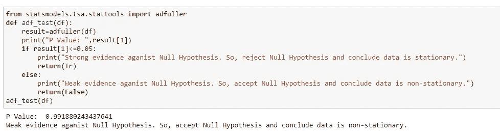***

***如果我们的数据是非平稳的，那么我们需要使它平稳来预测未来，然后将它应用到模型中。将非平稳数据转换为平稳数据可以通过将**数据**与其**时间延迟**进行**差分**来实现。***

## ***从非平稳数据到平稳数据的自动转换***

***让我定义一个**自定义函数**来**自动将非平稳数据转换为平稳数据**并显示 **d 值**(数据被差分多少次)。***

*****代码:*****

```
***def convert_non_stationary_to_stationary(df):
    d=0
    new_df=df
    while True:
        new_df=new_df-new_df.shift()
        new_df.dropna(inplace=True)
        d=d+1
        if adf_test(new_df):
            print("d-value is",d)
            break
convert_non_stationary_to_stationary(df)***
```

***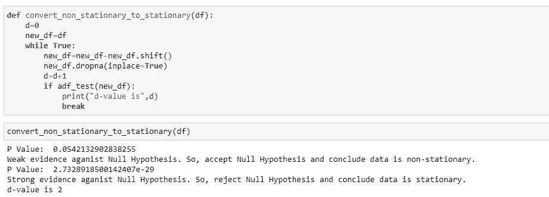***

## ***时间序列预测模型***

***现在，根据数据选择模型。在此之前，让我简单介绍一下每个模型及其意义。***

*   *****自动回归**—它是变量对自身的回归(其滞后版本)。这里，滞后的顺序由 **p 表示。**我们从 **PACF** 图中获得 **p 值**。​***
*   *****移动平均** —它取决于当前的观察值和数据的滞后残差。这里，滞后的顺序由 **q 表示。**我们从 **ACF** 图中获得 **q 值**。​***
*   *****ARMA(AR+MA)**—它是自回归模型和移动平均模型的组合**。**它只分析两个多项式方程形式的平稳时间序列数据，没有差分。它的顺序由( **p，q** )组件定义。***
*   *****【AR+I+MA】**—是自回归模型和移动平均模型**的结合。**它仅分析两个多项式方程形式的时间序列数据，通过差分将平稳数据从非平稳数据转换。它的顺序由( **p，d，q** )组件定义。***
*   *****SARIMAX(S+AR+I+MA+X)**—它是季节成分与 ARIMA 成分和外生变量的组合。它用于预测季节性时间序列数据。其顺序由( **p，D，q** )分量和季节分量( **P，D，Q** )定义。***

## *****外生变量*****

*****外生变量**是一个可能会影响数据集中的变量，但不会受任何其他变量影响的变量。***

*****例如**，天气会影响农作物的产量，但反之则不可能。***

## ***选择模型的顺序***

***现在，预测未来最关键的部分。一般来说，你可以从上面提到的模型中选择一个模型，并从 ACF 和 PACF 图中找出 p、d、q 分量。之后，您将训练模型并测试它，然后预测未来。大多数情况下，这种遵循步骤的特殊方式可能会很混乱。***

## ***汽车 ARIMA 模型***

***与其采用这种方法，不如采用自动化方法，这可以使用 **auto_arima** 方法，也可以使用 **GridSearchCV** 方法(超参数调优)。***

***将数据拆分为定型数据集和测试数据集，并使数据集符合 auto_arima 方法。***

*****代码:*****

```
***train = df.iloc[:len(df)-30]
test = df.iloc[len(df)-30:]
from statsmodels.tsa.statespace.sarimax import SARIMAX
from statsmodels.graphics.tsaplots import plot_acf,plot_pacf
from pmdarima import auto_arima
auto_arima(df['Thousands of Passengers'],seasonal=True,m=12).summary()***
```

***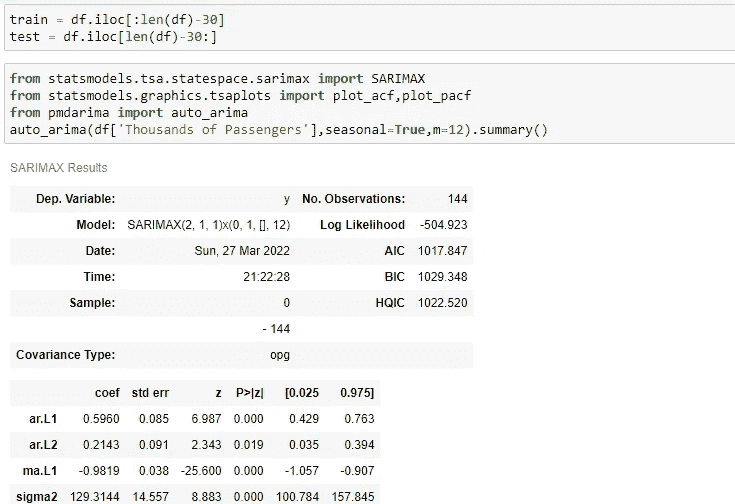***

## ***观察结果:***

***这里的 **m 值**是基于季节性的。月度数据为 **12** ，季度数据为 **4** ，年度数据为 **1** 。从上图可以看出，最好的预测是由 **SARIMAX(2，1，1)x(0，1，[]，12)** 模型完成的。***

## ***用训练数据集拟合模型***

***让我们接下订单，通过用训练数据拟合模型来实现模型，并用测试数据进行预测。***

*****代号:*****

```
***model = SARIMAX(train[‘Thousands of Passengers’],order=(2, 1, 1),seasonal_order=(0, 1, [], 12))
results = model.fit()
results.summary()***
```

***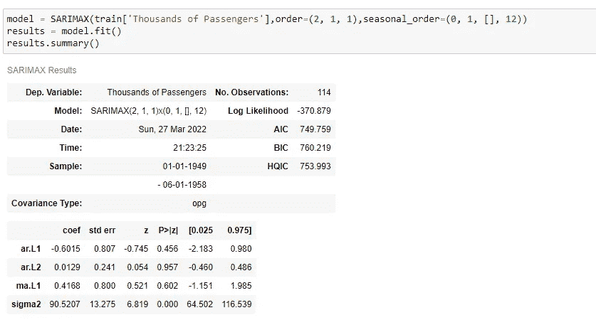***

## ***用测试数据集预测模型***

*****代码:*****

```
***start=len(train)
end=len(train)+len(test)-1
predicted_values = results.predict(start=start, end=end)
ax = test[‘Thousands of Passengers’].plot(figsize=(12,5))
predicted_values.plot()
plt.legend()
ax.autoscale(axis=’x’,tight=True)***
```

***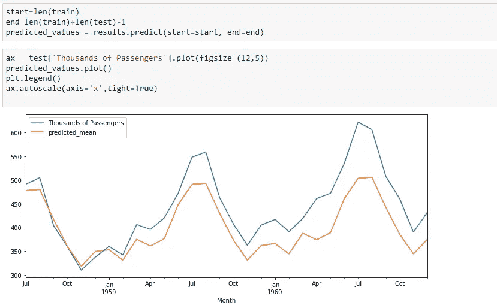***

***从上图可以看出，该车型表现不错。几乎符合数据。***

## ***评估模型***

***现在，用测试数据集评估模型，找出 **RMSE** 、 **MSE** 、 **MAE** 和 **MAPE** 。从 **sklearn** 库中导入这些参数。***

*****代码:*****

```
***import sklearn as sk
from sklearn.metrics import mean_squared_error
from sklearn.metrics import mean_absolute_error
from sklearn.metrics import mean_absolute_percentage_error
print("mean_squared_error :",mean_squared_error(test['Thousands of Passengers'],predicted_values ))
print("root_mean_squared_error :",mean_squared_error(test['Thousands of Passengers'],predicted_values, squared=False))
print("mean_absolute_error :",mean_absolute_error(test['Thousands of Passengers'],predicted_values))
print("mean_absolute_percentage_error :",mean_absolute_percentage_error(test['Thousands of Passengers'],predicted_values))***
```

***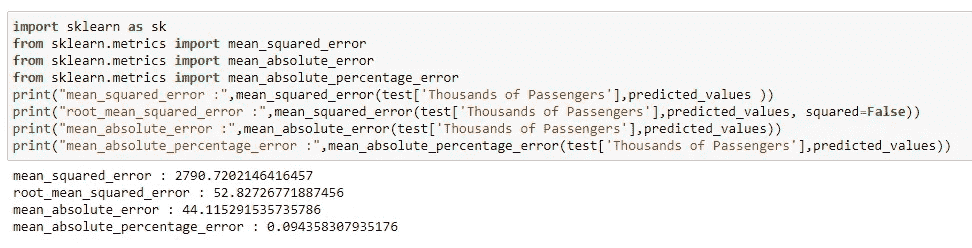***

***从上图中，我们可以看到误差值变小了。因此，我们可以得出结论，我们的模型对测试数据表现良好。***

## ***预测未来…😎***

***用全部数据重新训练同阶模型，预测未来。***

*****代码:*****

```
***model = SARIMAX(df['Thousands of Passengers'],order=(2, 1, 1),seasonal_order=(0, 1, [], 12))
results = model.fit()
results.summary()predicted_values = results.predict(start=len(df), end=len(df)+30)
df['Thousands of Passengers'].plot(figsize=(12,6))
predicted_values.plot()
plt.legend()
plt.show()***
```

***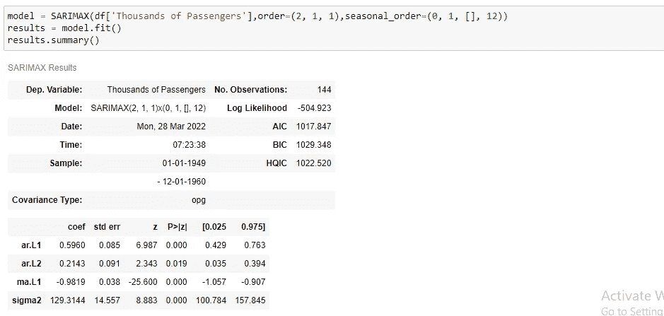******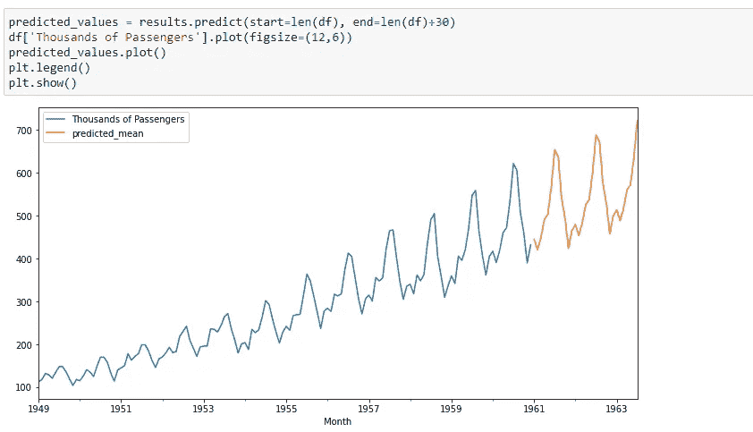***

## ***源代码***

***[](https://github.com/balupeddireddy08/Univariate_Time_Series_Analysis) [## GitHub-balupeddireddy 08/单变量 _ 时间序列 _ 分析](https://github.com/balupeddireddy08/Univariate_Time_Series_Analysis) 

# 结论

我建议您按照相同的流程对数据进行时间序列分析。希望你喜欢阅读这篇文章，并对你有所帮助…🤝🏻🤝🏻🤝🏻

如果你有任何疑问，请告诉我，如果这篇文章有任何错误，请纠正我。所有的建议都是 accepted…✌️

## 快乐学习😎***