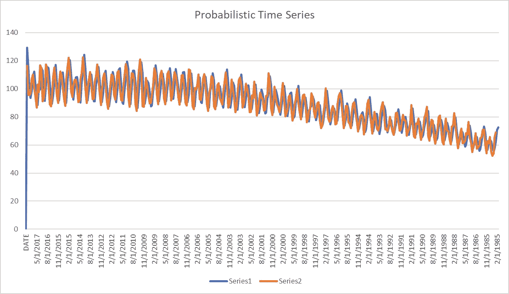
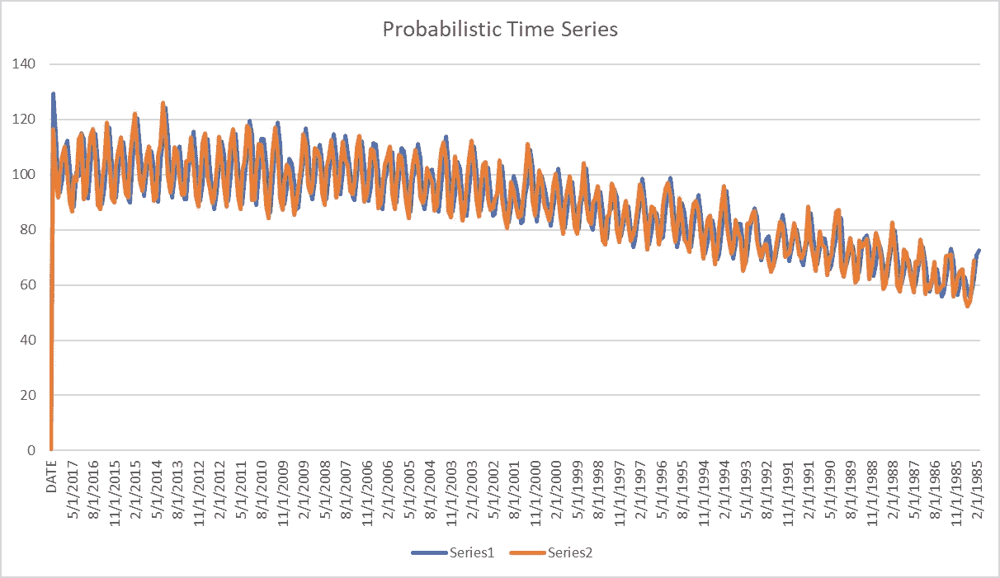

# 预测发电量-从零开始的概率时间序列算法

> 原文：<https://pub.towardsai.net/forecasting-electricity-production-probabilistic-time-series-algorithm-from-scratch-2449eed70ace?source=collection_archive---------2----------------------->



这是一个随机时间序列算法，我从头开始创建的。

## 一.获取数据

## 二。重要

## 三。方向

## 四。把它放在一起

## 动词 （verb 的缩写）平均绝对百分比误差(MAPE)

## 一.获取数据

我去了这个链接:[https://www . ka ggle . com/datasets/八神/time-series-datasets？select = Electric _ production . CSV](https://www.kaggle.com/datasets/shenba/time-series-datasets?select=Electric_Production.csv)

然后我下载了电动生产 CSV。

下载这个 CSV 文件后，我将它放入 excel 中，并对数据进行排序，使最新的数据位于顶部。

**二世。变化幅度**

为了使用时间序列进行预测，我们需要计算变化的幅度。变化的幅度是公正的

当天值—前一天的值。

**请注意，当我们使用震级进行预测时，我们将不会使用当天的震级，而是使用之前震级的调和平均值。**

如上所述，我们现在将计算前几天的调和平均值。

```
=HARMEAN(ABS($D396:D$397))
```

这个公式基本上锁定在单元格 397，这是我们数据的最后一行。但是，当我们将公式一直拖动到第一行时，公式的第一部分将继续向上移动。这里的基本情况是，我们正在计算前 n 天发生的变化幅度绝对值的调和平均值。这个量级就是我们在预测中使用的步长。

## 三。方向

现在我们需要理解方向。

方向是概率性的。首先，让我们编写一个 up/down 变量

```
=IF(B396-B397>0,"up","down")
```

我们可以把这个公式一直拖到今天。这告诉我们一天是比前一天上涨还是下跌。

现在，我们需要在上涨/下跌的先验分布中计算上涨和下跌的概率:

```
=COUNTIF($E397:E$398,"up")/COUNT($B397:B$398)
```

接下来，我们将编写一个随机函数，根据概率给出符号的大小。这意味着，如果我们在 0 和 1 之间的随机数大于公式中所示的上概率，那么我们将有一个负号，否则，我们将有一个正号，用于我们之前确定的步长。

```
=IF(RAND()>=G395,-1,1)
```

## 四。把它放在一起

我们会把它和这个公式一起一路拖上来。

```
=B397+(F396*H396)
```

这个公式转化为:

```
=previous known actual value + (harmonic mean of previous magnitude of known change * probability that this step size will positive or negative) 
```

当我们绘制时间序列时，我们得到这个:



## 动词 （verb 的缩写）平均绝对百分比误差(MAPE)

我们可以计算 MAPE:

```
=abs(B396-C396)/B396
```

**MAPE 是以下各项的平均值→实际值与预测值之差的绝对值与实际值的百分比之间的误差。**

在这种情况下，当我平均所有的百分比误差时，误差是-.19%，这是相当低的。MAPE 为 7.65%。

数据参考:

1.  [https://www . ka ggle . com/datasets/八神/时间序列-数据集？select = Electric _ production . CSV](https://www.kaggle.com/datasets/shenba/time-series-datasets?select=Electric_Production.csv)