# 用神经网络和时间序列模型预测股票价格

> 原文：<https://pub.towardsai.net/forecasting-stock-prices-using-neural-networks-time-series-models-816f59e5b036?source=collection_archive---------1----------------------->

## [数据可视化](https://towardsai.net/p/category/data-visualization)，[深度学习](https://towardsai.net/p/category/machine-learning/deep-learning)

## 理解金融时间序列预测模型的实用指南

照片由[陶黎黄](https://unsplash.com/@h4x0r3?utm_source=unsplash&utm_medium=referral&utm_content=creditCopyText)在 [Unsplash](https://unsplash.com/s/photos/martial-arts?utm_source=unsplash&utm_medium=referral&utm_content=creditCopyText) 上拍摄

***免责声明:本文中的分析旨在对金融时间序列数据实施时间序列模型，仅用于教育目的，因此不构成金融和/或投资建议。我没有这篇文章中提到的任何股票的头寸，也没有与这篇文章中提到的股票的任何公司有业务关系。***

## 摘要

T 在过去的十年里，随着技术的不断发展和功能的不断增强，科技行业取得了巨大的增长。Nvidia 是这个行业的主要参与者之一。Nvidia 以推广术语“图形处理单元”(GPU)而闻名，通过生产当今市场上一些最强大的 GPU，它彻底改变了 PC 游戏、计算机图形和汽车行业。在 Nvidia 于 2006 年开始销售它们之后，它们的股票呈指数级增长，并且一直在稳步增长，这是因为人们对 GPU 在深度学习和人工智能中执行困难任务的能力越来越感兴趣。该报告的目标是对 Nvidia 股票的回报和对数回报进行时间序列分析，并使用这些模型预测股票的未来回报。

## 介绍

人工智能是计算的未来。仅仅在过去的十年里，我们已经取得了巨大的进步，这在很大程度上要归功于最近计算速度和能力的普遍增长。领导这场运动的公司之一是 Nvidia，它通过制造 3D 显卡彻底改变了这个领域，但 Nvidia 并不总是像今天这样庞大。Nvidia 最初是一家专注于生产 3D 视频图形适配器的小型初创公司。他们的重大突破出现在 2000 年，当时微软与他们签约，为他们的新视频游戏系统 Xbox 制造图形芯片。这使他们处于游戏行业的最前沿，在 2000 年的大部分时间里，他们的工作主要集中在为图形和游戏公司提供服务。直到最近，人们才开始为他们的芯片找到另一种用途。

Nvidia 的显卡工作得如此之好，是因为它们令人难以置信的并行处理能力。并行处理允许同时执行多个操作，允许某些计算量大的问题在几分之一秒内得到解决。神经网络和深度学习近年来变得很受欢迎，因为它们对几乎任何问题都有近似最优解的惊人能力。然而，有时训练这些网络可能很困难，因为输入的数量(因此权重和偏差)可能相当大。并行处理使这些计算变得轻而易举，因此 Nvidia 的显卡突然成为世界上每个计算机科学家的必备之物。英伟达的芯片已经被谷歌、IBM 和特斯拉用于生产最先进的机器学习软件。

由于他们新获得的成功，Nvidia(NVDA)的股票在过去几年里经历了一次极端的增长。5 年前，NVDA 的市值约为每股 31 美元。如今，它的价值约为每股 530 美元，而且还在不断增长。就在最近，Nvidia 推出了三款新的显卡，旨在为笔记本电脑提供桌面级的性能，以跟上脸书的虚拟现实耳机 Oculus Rift。我们只能期待 NVDA 会因此增加，并想看看时间序列模型是否会预测同样的结果。

在本报告中，我们分析了 NVDA 的不同对数收益，并根据收集的数据和拟合的模型进行了预测。通过 ACF、PACF 和 AIC 的分析，我们确定 AR(1)、ARIMA(3，1，1)和 ARIMA(8，1，8)是可能的模型。我们还尝试用非线性神经网络拟合数据，并使用 MSE 分析将其与线性模型进行比较。

## 财务数据

我们获得了 NVIDIA 从 2017 年 5 月 14 日到 2017 年 11 月 14 日的每日价格，共对应 127 个数据点。股价的 50 天移动平均线的附加图显示了明显的上升趋势。

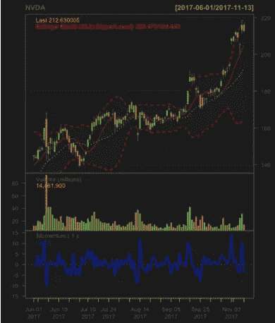

作者图片

## 数据分析

NVDA 的 127 个每日调整回报分为两部分，115 个数据点和 12 个数据点用于测试时间序列模型的预测准确性。训练数据范围为 2017 年 5 月 14 日至 2017 年 10 月 25 日，预测数据范围为 2017 年 10 月 26 日至 2017 年 11 月 10 日。训练数据的自相关函数(ACF)和偏自相关函数(PACF)如下图所示:

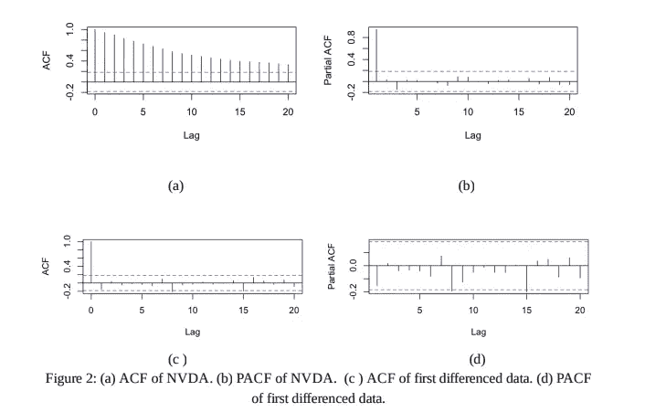

作者图片

图 2(a)中时间序列的对数收益的 ACF 图显示了从滞后 0 开始递减的滞后，这表明时间序列具有单位根(非平稳性)。因此，我们必须考虑对数收益的差异。差分对数收益的 ACF 图迅速崩溃，表明单位根被移除。

## 模型 1: ARIMA(3，1，1)

一个 ARIMA 模型被用来模拟差分序列。我们尝试了一个 p≤5，q≤5 的 ARIMA(p，1，q)模型，方法是运行两个“for 循环”, p=1，2，…5，q=1，2，…，5。ARIMA(3，1，1)似乎具有最小的阿凯克信息标准(AIC)为-536.27。我们的模型选择通过应用 Ljung-Box 检验得到证实，该检验给出 Q(10) = 6.03，p 值为 0.811。从下图可以看出，残差似乎正态分布，均值为零，并且在残差图(白噪声序列)和 ACF 图中分别没有描述性模式或序列自相关。因此，当前模型是有效的。拟合模型的方程为:

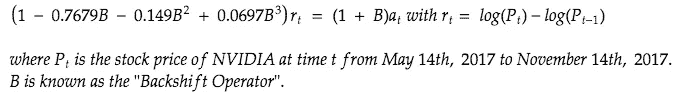

拟合模型的方程

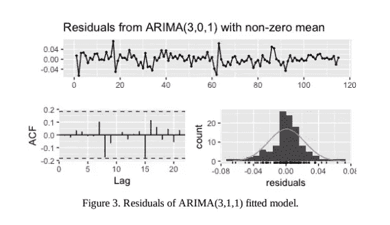

作者图片

## 模型 2: GARCH(1，1) + ARIMA(1，1，1)与学生创新

如图 4 所示，平方对数收益的 ACF 并不表明数据中存在 ARCH 效应。还进行了 Ljung-Box 测试，返回的 p 值为 0.1621，进一步表明没有拱形效应。然而，我们构建了一个 GARCH(1，1)+ARIMA(1，1，1)模型来与其他模型进行比较。除了这个模型，我们还测试了一个具有正态分布的 GARCH(1，1)模型和一个具有 Student-t 创新的 GARCH(1，1)模型。具有 Student-t 创新的 GARCH(1，1)+ARIMA(1，1，1)模型具有最低的 AIC 值，拟合的模型如下:

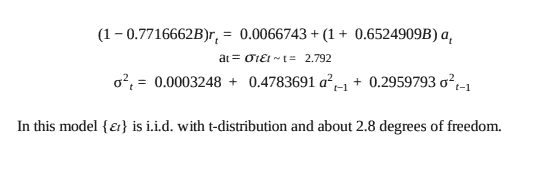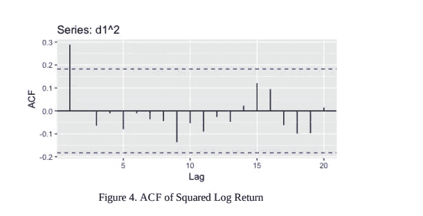

为了验证均值方程的适当性，对残差进行了 Ljung- Box 检验，得出 p 值为 0.5149。为了验证波动性方程的有效性，对残差平方进行了 Ljung-Box 检验，返回的 p 值为 0.9437。这些高 p 值表明拟合模型的均值方程的充分性和波动率方程的有效性。

## 模型 3: SETAR

为了将以前的模型与非线性时间序列模型进行比较，我们构建了一个具有滞后 12 的自激阈值自回归(SETAR)模型。然后使用 Ljung-Box 测试对拟合模型的残差进行测试，返回的 p 值为 0.9987，表明残差呈正态分布，可以视为白噪声。图 5 中的残差图和 ACF 图进一步展示了残差的正态分布。

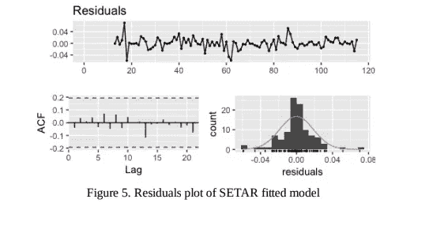

## 模型 4:12–4–1 神经网络

作为比较方法，我们决定构建一个神经网络来拟合我们的数据。为了构建我们的模型，我们首先需要确定最适合我们问题的隐藏节点的数量。首先，我们从差异日志返回数据集中取出前 115 个值，并将其作为训练样本。然后，我们将最后 12 个数据点作为我们的测试集。为了选择一个合适的模型，我们通过层大小 1 到 10 运行了一个 for 循环，然后对于每个层大小，我们将种子值设置为 1 到 10。使用这些值，我们将神经网络拟合到训练数据，然后使用该模型预测接下来的 12 个数据点。因为我们对每个层大小做了 10 次(每个种子值一次)，所以每个层大小有 120 个数据点。然后，我们使用 MSE 分析来确定哪个模型是最好的。该测试的结果如下:

[1]“大小= 1，MSE = 0.000407”

[1]“大小= 2，MSE = 0.000409”

[1]“大小= 3，MSE = 0.000408”

[1]“大小= 4，MSE = 0.000407”

[1]“大小= 5，MSE = 0.000411”

[1]“大小= 6，MSE = 0.000410”

[1]“大小= 7，MSE = 0.000410”

[1]“大小= 8，MSE = 0.000412”

[1]“大小= 9，MSE = 0.000410”

[1]“大小= 10，MSE = 0.000411”

正如你所看到的，最好的结果来自于我们的层大小为 1 和 4 的时候，尽管这种情况并不多见。我们选择使用大小为 4 的层，因为我们不关心线性可分性，这是大小为 1 的神经网络的优势所在。这使我们的网络形成了 12–4–1 的形状。然后，我们决定将我们的结果与一般的线性模型进行比较，再次使用前 115 个数据点，并使用 MSE 作为我们的分析工具。该测试的结果如下所示:

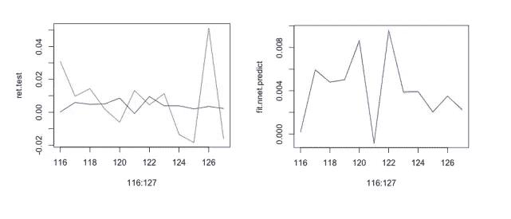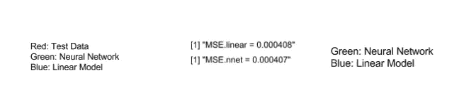

如您所见，神经网络和线性模型表现几乎相同，具有非常相似的形状和 MSE 值，以至于绿线在蓝线后面几乎不可见。这让我们有理由相信，神经网络可能适合为这只股票建模。然而，当利用这样的模型时，有许多事情要考虑。这种分析的一个问题是缺乏数据。我们的数据集很小，可能出现了过度拟合。虽然我们的低 MSE 值似乎表明，如果我们进一步预测，我们的模型误差率可能会大大增加。为了准确地确定这个模型是否可行，需要更多的测试数据。训练神经网络的另一个问题是如何选择网络的初始权重和偏差。对于上面的分析，我们使用了命令 set.seed(9)作为我们的初始化基础。选择这个数字仅仅是因为在实践中它产生了与我们上述平均 MSE 相同的 MSE。在尝试拟合模型时，我们注意到 MSE 仅随种子变化 0.00002，这很好，因为这意味着局部最优值可能都相当接近全局最优值。

## 预测

对于每个模型，我们执行了 12 步预测，以与我们的测试数据进行比较。每个预测的结果都用测试值绘制在图 6 中。为了进一步比较，在表 1 中报告了每种方法的均方预测误差(MSPE)。

GARCH(1，1)+ARIMA(1，1，1)模型产生最低的 MSPE:

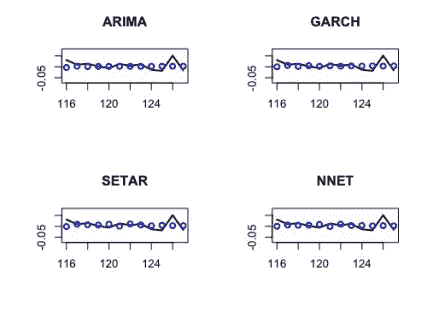

图 6。每个模型的 12 步预测

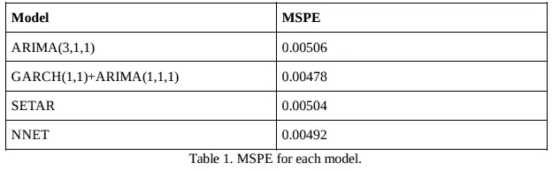

## 讨论

为 Nvidia 的对数收益构建了四种不同的时间序列模型。ARIMA(3，1，1)模型被证明是对数收益的充分线性模型，但它在四个模型中具有最高的 MSPE。发现 SETAR 拟合模型是一个充分的非线性模型，但是它对于测试数据具有第二高的 MSPE。最好的结果是由 GARCH(1，1)+ARIMA(3，1，1)结合 Student-T 新息模型和神经网络给出的。然而，所有的 MSPE 值都非常接近，预测值也相对相似。根据对所有四种型号的预测，Nvidia 预计将有稳定的未来回报。对于想要低风险股票的人来说，这可能是一个不错的投资。在我们的分析中，一个可能的错误可能源于缺乏用于训练模型的初始数据。只有 100 多个数据点，我们的模型可能只是简单地记住了手头的数据，如果我们展望未来 12 年以上的预测，我们的模型就不会准确。但是，我们没有理由认为这是事实，因为我们每个型号的 MSPE 值都相当低。

## 自定义时间序列预测 Web 应用程序(使用 Shiny R 从头开始构建)

下面的 web 应用程序(我将其命名为“未来就是现在”)是我从头开始构建的，它使用自回归移动平均模型(ARIMA)的不同变体，提供了四家知名科技公司(AMD、NVIDIA、SNAP 和网飞)的实时股价预测。正如你所看到的，web 应用程序仍然需要大量的工作。

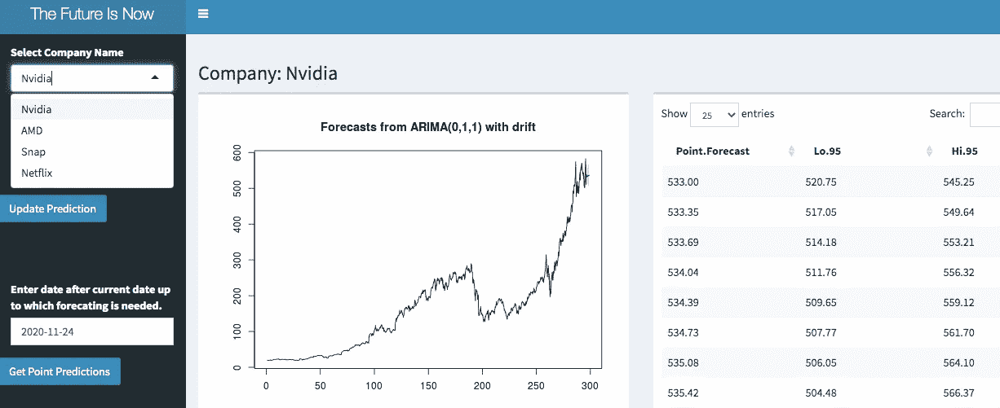

# 下一步是什么？

查看我的一些其他文章，了解更多关于量化金融的重要概念(期权定价理论、模拟、投资组合优化理论…):

*   [量化交易 101](https://jkevin2010-kj.medium.com/quantitative-trading-101-e6e555ae2474?sk=cd810b03332abf3380a5e52d0c7e8c5a)
*   [从零开始的投资组合优化](https://medium.com/swlh/portfolio-optimization-from-scratch-925f66c4020d?sk=1cff25e548dc80a7b8b85c0b491fe1df)
*   [使用蒙特卡罗模拟的期权定价](https://jkevin2010-kj.medium.com/option-pricing-using-monte-carlo-simulations-41d9e4ad95f6?sk=8fd2a29b2bf9599d21013767ad22fbec)
*   [理解隐含波动率的实用指南](https://jkevin2010-kj.medium.com/practical-guide-to-understanding-implied-volatilities-85a400093351?sk=de67294797a4ee35b546d3e10e841d77)

## 参考资料:

[1] K. Mekulu，G. Clarke，G. Glen，英伟达(NVDA)股票的时间序列分析(2018)，金融时间序列分析

[2] K. Mekulu，未来就在现在(2018)，金融时间序列演示文稿