# 预测时间序列数据:网飞股票价格预测

> 原文：<https://pub.towardsai.net/forecasting-time-series-data-netflix-stock-price-prediction-a941fa2c4893?source=collection_archive---------2----------------------->

## ARIMA-(G)带有 MiniTab 和 R 的 ARCH 模型


杰克·希尔斯在 [Unsplash](https://unsplash.com?utm_source=medium&utm_medium=referral) 上的照片

网飞股票价格最近相当不稳定，这使得时间序列数据的预测非常有趣。在这篇博客中，我将使用 ARIMA(G)ARCH 模型进行预测，Minitab 用于绘图，R 用于模型选择。(因为这个班级项目的说明，我将不得不遵守一些限制。)

阅读本博客前的一些先验知识包括:

*   [ARIMA 车型](https://en.wikipedia.org/wiki/Autoregressive_integrated_moving_average)
*   [ARCH](https://www.youtube.com/watch?v=Li95a2biFCU) 和 [GARCH](https://www.youtube.com/watch?v=inoBpq1UEn4) 车型

# 数据描述

该项目使用网飞从 2002 年 5 月 23 日到 2022 年 3 月 18 日的每日股票价格(4991 次观察)进行时间序列预测。2022 年 3 月 18 日的数据是我获得数据集时来自雅虎财经的最新数据。表格的标题如下所示:

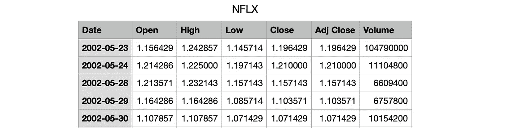

作者图片

我将省略最后一个数据点，这是 2022 年 3 月 18 日 ARIMA(G)拱门模型的数据。因此，n = 4991–1 = 4990，我将使用 2002 年 5 月 23 日至 2022 年 3 月 17 日的*调整关闭*数据。

# ARIMA 造型

网飞股价(Adj Close)、DifNetflix、LogNetflix 和 DifLogNetflix 的时间序列图如下:

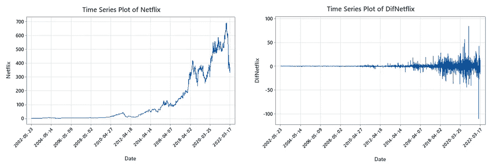

作者图片

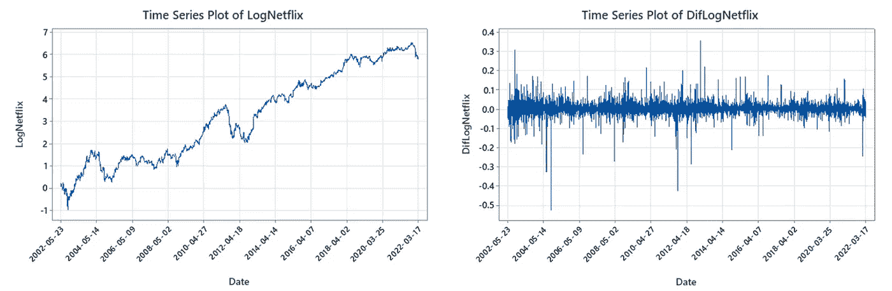

作者图片

有强有力的证据表明，网飞存在水平相关的波动。近年来，网飞股票价格更加不稳定。**取 log 可以帮助我们减轻依赖于级别的波动性，并使曲线线性化**，因为 DifLogNetflix 的波动性似乎不再依赖于级别。

为了选择 ARIMA(p，d，q)模型，我们需要**首先确定 d 的值，看看我们需要对数据求多少次差才能使其稳定**。LogNetflix 的 ACF 和 PACF 剧情如下:

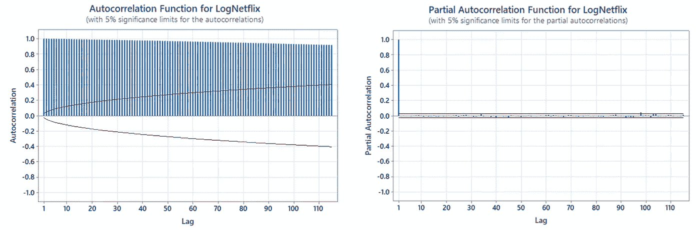

作者图片

LogNetflix 的 ACF 图指示悬挂行为，并且 LogNetflix 的 PACF 图在滞后 1 之后截止，因此 LogNetflix 是非平稳的。我们需要对数据进行差分。

DifLogNetflix 的 ACF 和 PACF 图显示，差异一度似乎使数据稳定，因为没有统计上的显著滞后。

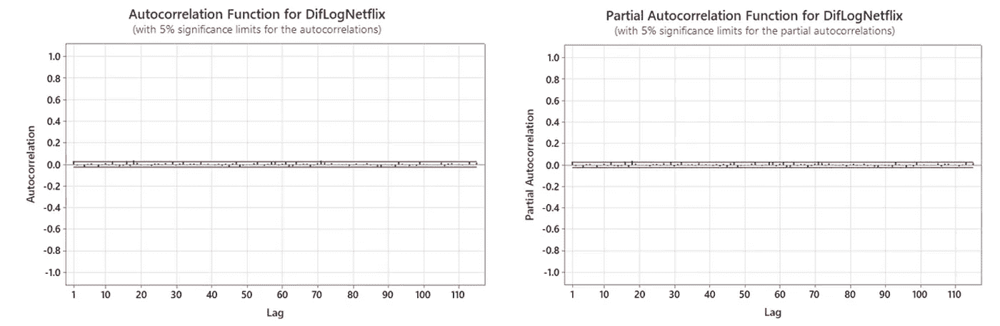

作者图片

为了再次检查 d=1，我们可以再次对数据求差，并寻找过度求差的迹象。

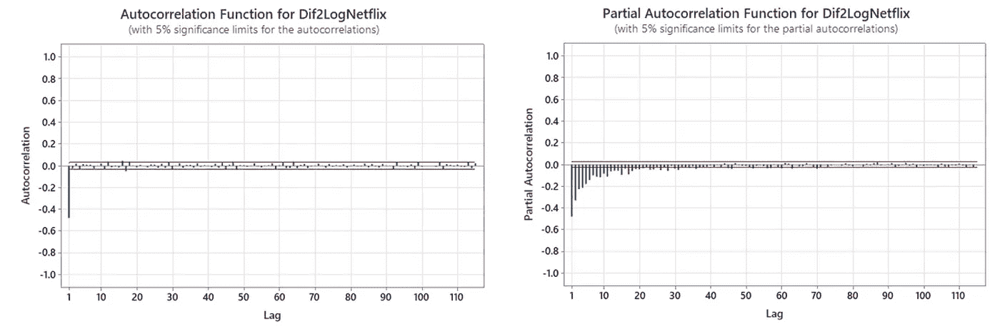

作者图片

事实上，两次差异显示了**过度差异的有力证据，因为 Dif2LogNetflix 的 PCF 在滞后 1 时统计上显著为负，接近-0.5** 。因此，我们得出结论，在 ARIMA 模型中 d=1。DifLogNetflix 的 ACF 图建议采用 ARIMA(0，1，4)模型，而 DifLogNetflix 的 PACF 建议采用 ARIMA(4，1，0)模型。

现在，我们需要选择 ARIMA 模型中的 p 和 q。我们任意挑 p，q = 0，1，2(因为节俭原则)比较一下 AICc。AICc 的公式如下:

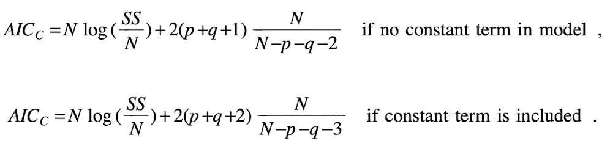

作者图片

SS 表示误差平方和，可以从 Minitab 输出中获得。我们知道 N = N–d = 4990–1 = 4989。

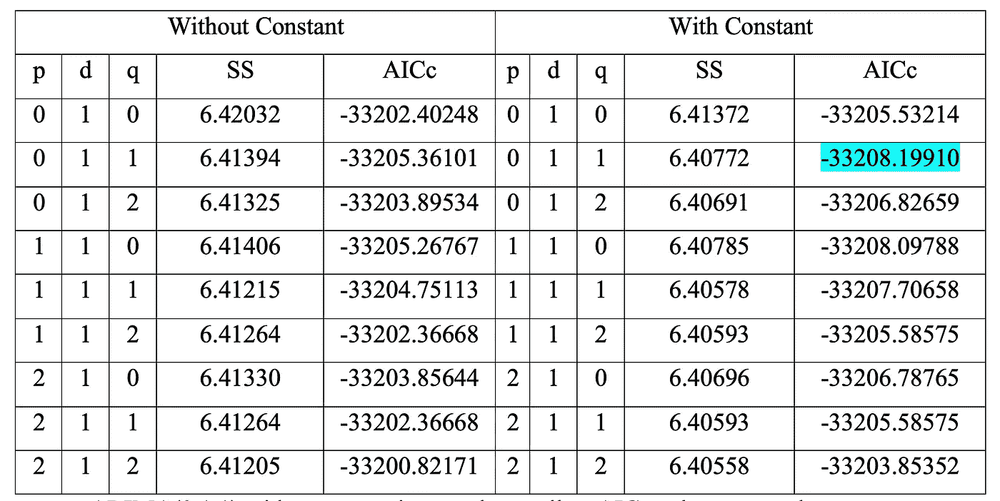

作者图片

常数为的 ARIMA(0，1，1)给出了最小的 AICc 值，所以我们选择常数为的 ARIMA(0，1，1)。常数为的 ARIMA(0，1，1)的 Minitab 输出为:

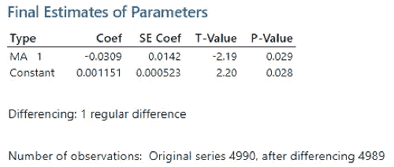

作者图片

MA1 系数和常数都具有统计学意义，p 值小于 0.05。因此，如果我们将{x_t}表示为网飞的时间序列，{y_t}表示为 LogNetflix，{z_t}表示为 DifLogNetflix。MA1 系数的最佳估计值为-0.0309，常数的最佳估计值为 0.001151。因此，拟合模型为


作者图片

其中 z _ t = y _ t-y _ { t-1 } = log(x _ t)-log(x _ { t-1 })。

提前一步预测和 95%预测间隔如下:

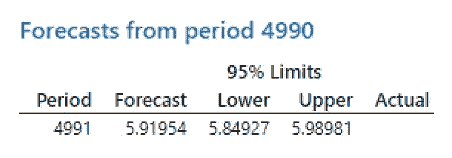

作者图片

*残差*的时间序列图为:

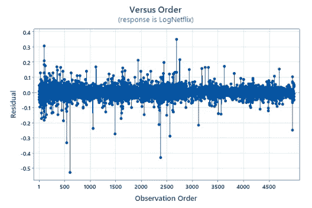

作者图片

残差看起来相对随机，只有少数绝对值超过 0.3。残差的 ACF 和 PACF 图如下:

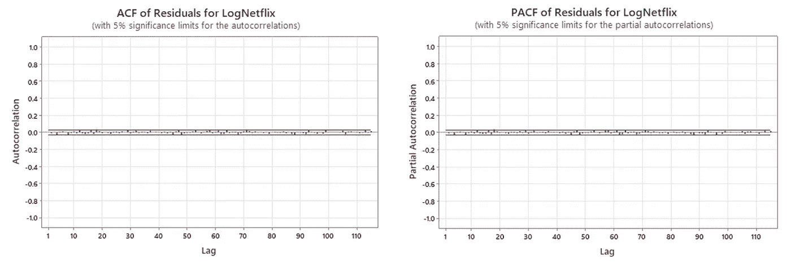

作者图片

残差中没有很多统计上显著的滞后，这意味着残差看起来不相关。*平方残差*的 ACF 和 PACF 为:

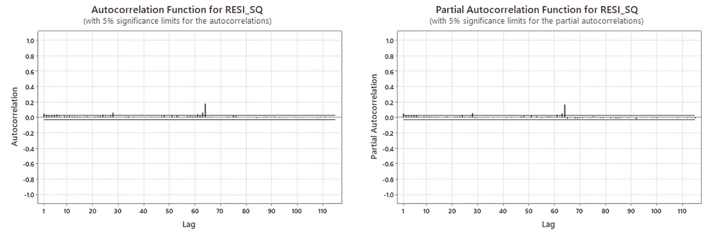

作者图片

然而，平方残差具有多个具有统计显著性的滞后，这意味着残差不是独立的。此外，我们可以从残差的时间序列图中看到，方差不是常数。存在条件异方差的证据。

在进行(G)ARCH 建模之前，我们需要将 Minitab 中的残差信息保存到一个 txt 文件中，并将其导入到 r。

```
# read file & check head
res = scan("RES.txt", what="list")
head(res)# clean up data & convert data type
res = res[-c(1,2)]
res = as.numeric(res)
head(res)
```

# (G)拱形建模

## 拱门(q)

为了选择 q 从 0 到 10 的 ARCH(q)模型，我们可以计算 AICc。AICc 的公式在这里发生了变化:

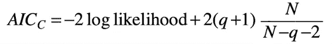

作者图片

logLik 的值可以从 r 中获得。

```
library(tseries)# check different ARCH models
for (i in 1:10){
  print(paste0('model ARCH(', i, ')'))
  model = garch(res, c(0,i), trace=F)
  print(summary(model))
  print(logLik(model))
}# ARCH(0) model has to be manually calculated
# model = garch(res, c(0,0), trace=F) is going to give an error
N = 4989
print(paste0('log Lik.', -0.5*N*(1+log(2*pi*mean(res^2)))))
```

同样，我们知道 N = N–d = 4990–1 = 4989，因此我们有:

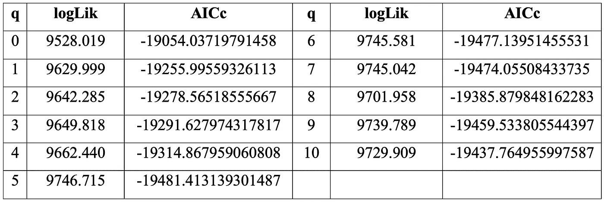

作者图片

## GARCH(1，1)

由于节俭原则，我们还可以考虑 GARCH(1，1)模型。我们有 logLik = 9799.593 (q=2)，对应的 AICc 是-1993 . 546656566666GARCH(1，1)产生最小的 AICc，所以我们选择 GARCH(1，1)。

```
# compared with GARCH(1,1) model
model=garch(res,c(1,1), trace=F)
print(summary(model))
print(logLik(model))
```

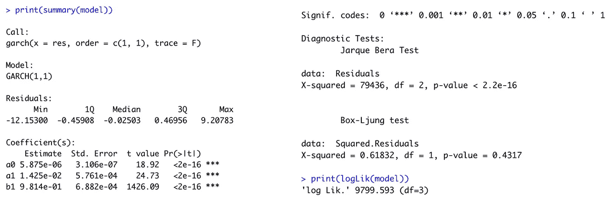

作者图片

p 值不正确，因为它们用于双尾检验。我们应该查看所给出的 p 值的一半，但是它们是如此之小，以至于这些 p 值的一半在统计学上是非常显著的。因此，a0、a1 和 b1 都具有统计显著性。然而，Jarque Bera 检验的 p 值小于 0.05，这表明 GARCH 残差的条件分布不是正态分布。Ljung-Box 检验的 p 值大于 0.05，这意味着 GARCH 残差不相关。但总的来说，模型是不充分的。

为了写出所选 GARCH(1，1)模型的完整形式，我们有ω=0.000005875，α=0.01425，β=0.9814。因此，完整的形式是

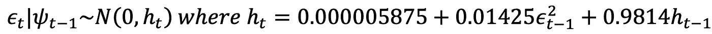

作者图片

无条件方差是


作者图片

我们从剩余数据中得知ϵ_4990=0.035765.我们还知道 h_4990=0.00138539642318183。因此，
h _ 4991 = 0.000005875+0.01425×0.035765+0.9814×0.00138539642318183 = 0.001383731。

从 ARIMA(0，1，1)模型中，我们知道 f_4990，1=5.91954。因此，ARIMA-GARCH 模型的 95%预测区间为:


作者图片

与 95%预测区间为(5.84927，5.98981)的 ARIMA(0，1，1)模型相比，ARIMA-GARCH 模型的预测区间更宽。

下期对数汇率条件分布的第 5 个百分位数为:


作者图片

现在我们计算*条件方差* ht:

```
# calculate ht
ht = model$fit[,1]^2
ht[1:5] # has NA
write(c('ht', '*', ht), '../htfile.txt', 1)
```

ht 的时间序列图为:

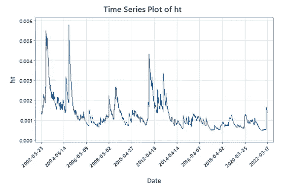

作者图片

从 2002 年 5 月 23 日到 2014 年 4 月 14 日的高温比后期高温更不稳定。2002 年 5 月 23 日至 2014 年 4 月 14 日是波动性最大的时期，2022 年 5 月 23 日至 2005 年 5 月 9 日是波动性最大的时期。

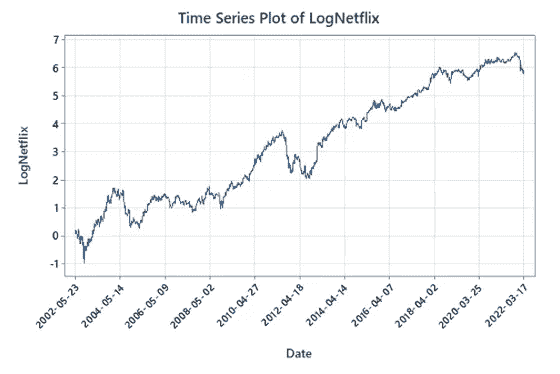

作者图片

与 LogNetflix 的时间序列图相比，这些高波动性的爆发似乎确实与对数汇率本身的时间序列图的研究结果一致。

logNetflix 和提前一步 95%预测区间的时间序列图如下:

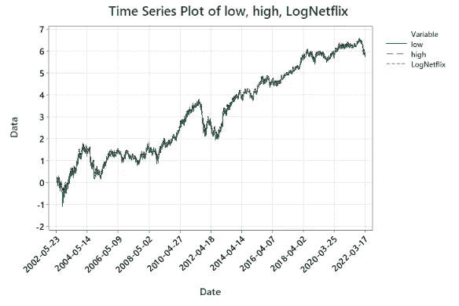

作者图片

根据剧情来看，LogNetflix 多在低和高之间，所以预测区间还是挺准的。然而，由于 ARIMA-GARCH 参数是从整个数据集估计的，而不仅仅是从构建预测时的观测值估计的，因此这里的性能可能比实际预测环境中的性能好一些，因此对于 x_1 到 x_4990 的实际有用性有些问题。然而，x_4991 没有被用于建立 ARIMA-GARCH 模型，因此对 x_4991 的预测更有实际意义。

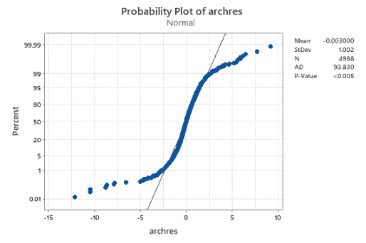

作者图片

测试告诉我们 p 值小于 0.005，所以 *archres* 不是正态分布。s 形图表明尾部较重，这意味着模型似乎没有充分描述数据中的尖峰值。

预测区间有 209 次失败，约为所有区间的 209/4988 = 4.19%。

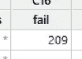

作者图片

# 性能检查

对于 LogNetflix，ARIMA 模型的 95%预测区间为(5.84927，5.98981)，对应于网飞的区间为(347.89，399.339)。x_4991=380.6 在预测区间内。

ARIMA-GARCH 模型的 95%预测区间是(5.846631，5.992449)，这对应于网飞的区间(346.0665，400.39398)。x_4991=380.6 在预测区间内。

ARIMA 区间和 ARIMA-GARCH 区间非常相似。这两个预测区间似乎既不太宽也不太窄。ARIMA-GARCH 区间稍微宽一点，以适应最近较高的波动性，因为 ARIMA-GARCH 是适应性的，但 ARIMA 不是。