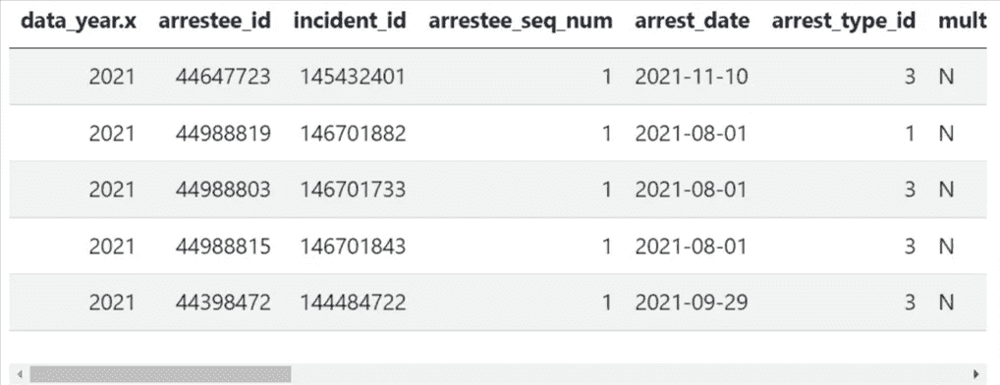
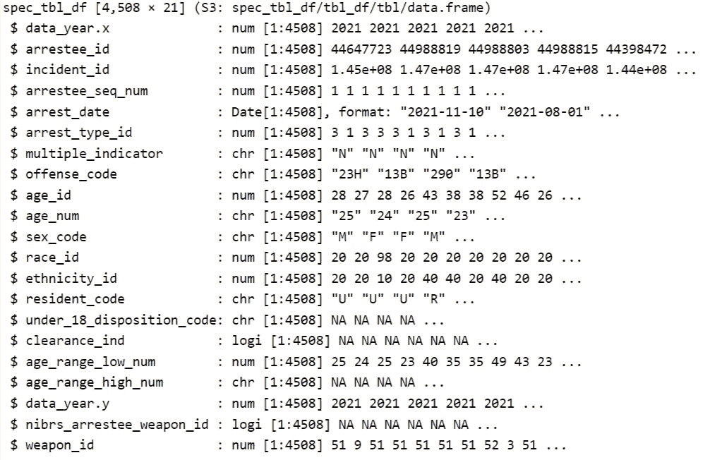
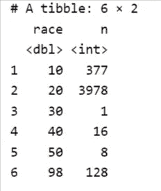
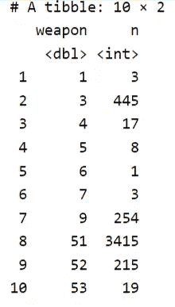
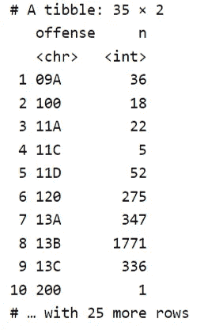
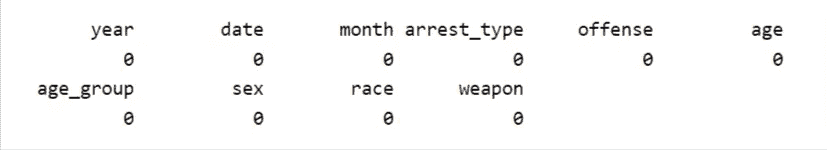
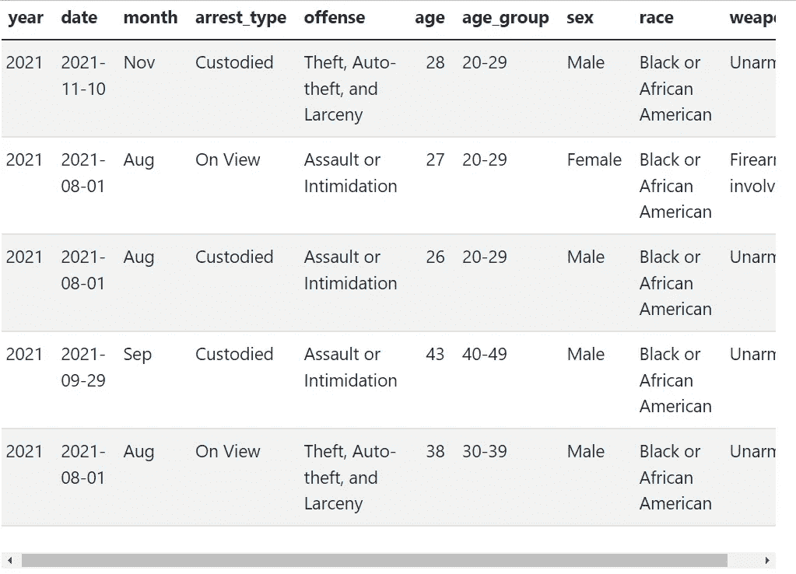
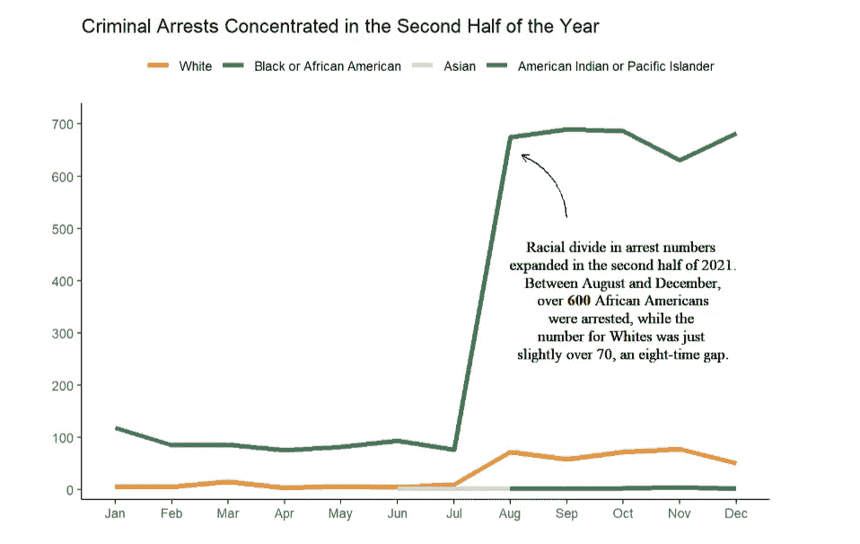

# (第一部分)用数据科学促进刑事司法

> 原文：<https://pub.towardsai.net/fostering-criminal-justice-with-data-science-part-i-be4cabdeb0a1?source=collection_archive---------4----------------------->

## 统一犯罪报告 2021 DC 逮捕数据的数据驱动分析


来源:【NIBRS 官方网站

作为一名犯罪研究人员，我总是对一年内发生多少起犯罪以及在这些犯罪中，有多少是由警察逮捕的这类问题感兴趣。我在这里明确提到逮捕，因为这两个概念是不同的，因为不是所有的犯罪都会导致逮捕。大多数案件根本达不到批准逮捕所需的严重程度，因此我们应该关注执法人员的行为偏差(警务中的种族歧视)，逮捕通常是一个更好的衡量标准。

在这篇文章中，我将使用统一犯罪报告(UCR)系统的数据来讲述一个关于 2021 年在美国首都和政治中心 DC 被捕的人的故事。我特别关心这三个问题:

*   哪个种族、性别或年龄组被大都会警察局的警察逮捕的最重？
*   这些逮捕是如何按犯罪类型和武器使用分类的
*   某个种族或社会经济群体是否更有可能因某些类型的违法行为而被捕？

在回答这些问题的同时，我也将展示我一直倡导的:用数据科学作为理解领域知识的工具。我来自社会科学背景，我对社会科学的兴趣先于我对数据科学的兴趣。因此，我认为数据科学的重要性在于它为研究科学家、决策者和公司提供了工具。数据科学领域的许多人更关心数据算法，而不是数据本身。我认为它们同等重要。

# 什么是 UCR，为什么是 UCR 犯罪数据？

我选择 UCR 作为我的数据来源是有原因的。当我在明尼苏达大学双城分校读法律社会学、犯罪学和越轨学生时，统一犯罪报告(UCR)数据是我许多主要课程中的常见“客人”，我们许多人将其称为“犯罪研究的圣经”。这并不是说 UCR 是最好的来源，而是说它是最权威的来源。它的权威性体现在两点:它来自一个高度可信的来源(由 FBI 收集)，而且它非常全面(包含了无数关于犯罪的信息)。无论研究人员是否关心他们所在州的具体犯罪或逮捕数字，或者过去十年的犯罪趋势，UCR 都是他们的首选数据集。

UCR 指的不是单一的数据，而是联邦调查局使用的数据报告系统，由五个以上不同的数据库组成。一些比较著名的数据包括国家基于事件的报告系统、仇恨犯罪统计数据、执法人员被杀和被袭击的数据以及最近的国家使用武力数据收集。UCR 系统中的数据来自 18，000 多个不同级别的学术机构和执法机构，它们自愿报告犯罪信息。

现在，让我们来看看我们的数据。

# 获取数据和设置:提高热度

2021 年 DC 逮捕数据来自国家基于事件的报告系统(NIBRS)数据库，可以在联邦调查局的[犯罪数据浏览器门户](https://crime-data-explorer.app.cloud.gov/pages/downloads)上访问。要下载数据，请转到“各州基于犯罪事件的数据”部分，在下拉列表中选择“DC”和“2021”，然后按“下载”。这会以压缩的形式给你一组相关的数据集和它们的码本，抓捕数据就在其中！

在进行真正的数据科学任务之前，先加载库总是一个好习惯。

```
library(dplyr) # for easy data cleaning and wrangling
library(forcats) # dealing with factor variables
library(stringr) # string manipulations
library(ggplot2) # data visualizations
library(GGally) # an extension of the ggplot2 library
library(lubridate) # dealing with dates and times
library(readr) # reading data
library(kableExtra) # beautiful formatting of tables
```

我们需要两个数据集:*逮捕*数据和*用武器逮捕*数据。前者记录逮捕的时间和性质，后者补充前者，增加关于罪犯使用武器的信息。为了连接它们，我们做了一个左连接，在连接过程中保留数据 *x* 中的所有行(语法: *left_join(x，y，by = " "*)。我将连接的数据集命名为 *dc21_arrests_weapon* 。

```
dc21_arrests <- read_csv("data/DC2021_NIBRS_ARRESTEE.csv")
dc21_weapon <- read_csv("data/DC2021_NIBRS_ARRESTEE_WEAPON.csv")dc21_arrests_weapon <- dc21_arrests %>%
  left_join(
  dc21_weapon, 
  by = "arrestee_id")
```

请注意， *dc21_weapon* 中的某些行出现了不止一次，对于这些行，无论连接类型如何，都将在结果数据集中包含重复的行。这可以很容易地用下面的方法来测试(没有警告消息意味着测试通过，即两种情况下呈现相同的输出)。

```
testthat::expect_equal(dc21_arrests %>% count(arrestee_id) %>% nrow(),
                       dc21_weapon %>% count(arrestee_id) %>% nrow())
```

我们来看看数据里有什么。我们通过检查前五行和浏览变量类型来做到这一点。

```
dc21_arrests_weapon %>%
  head(5) %>% 
  kbl(format="html") %>%
  kable_styling(bootstrap_options = c("striped", 
                                      "hover", 
                                      "condensed"))
```



我们合并数据框架的一瞥

有很多方法可以检查变量类型。许多人喜欢使用 *glimpse()* ，因为它与 *tidyverse* 系统集成得很好。在这里，我使用了 base R 的 *str()* 方法，因为我非常喜欢它的布局。这两种方法做的事情非常相似，所以这里没有权衡。你喜欢哪个就用哪个。

```
str(dc21_arrests_weapon)
#dc21_arrests_weapon %>% glimpse() # alternative way
```



输出的屏幕截图

这里我们看到数据有 4，508 行和 21 列。前者表明在 2021 年，DC 总共有 4508 起逮捕，而后者告诉我们这个数据中包含了 21 个变量。大多数是数字，一些是字符串，还有一些是布尔值( *logi* )和数据类型。检查变量类型有助于我们更好地理解我们的数据，并使我们的数据清理更容易。

# 清理和争论数据:弄脏手

让我们进入数据清理阶段。我认为我真正喜欢数据清理的一个原因是它非常有逻辑性和系统性。当我们发现未使用的变量时，我们丢弃它们，如果有什么不对，我们用尽可能多的步骤和尽可能少的步骤操纵和操作它们。我们也一步一步地清理数据，在一步之后，我们回头看看我们做得对不对。事实上，我们需要不断回头看，并对我们以前的代码进行更改，以确保我们不会偏离正确的轨道。这种思维模式还将帮助我们(新兴或有经验的)数据科学家更熟悉并更好地理解我们的数据。

对我来说，数据清洗实际上让我进入了数据科学领域。当我在本科学习 R 编程作为一个统计专业(我追求两个专业)时，没有关于 *dplyr* 或 *ggplot2* 的课，我在从事一个数据科学项目时，在两周内学会了如何自己清理数据。一开始并不容易，因为 *tidyverse* 语法与 base R 非常不同，然而，我用得越多，就越发现自己对它上瘾。正如我所说，我来自一个研究背景，所以 tidyverse 框架内部的问题驱动思维模式对我来说是如此自然和直观，这让我几乎瞬间爱上了做数据清理。

## 选择感兴趣的变量

回到我们的数据，在最激动人心的部分——探索性数据分析之前，我们需要做一些事情。我们需要去掉不必要的变量，这样我们的数据就只抓住了我们分析的要点。如果我们的数据有几百列，这一点尤其重要，这在公共和非营利部门很常见。对于我们正在分析的这个，有 21 个变量，这是一个适中的数字，所以数据选择是不必要的，但这样做也无妨。然而，我们必须小心，确保我们没有过滤掉我们实际需要的变量。要做到这一点，通常需要查找代码簿或在线代码文档页面，以确保我们不会主观地解释变量。NIBRS 数据集的密码本可以在我们下载数据的同一页面上找到，或者在这里访问。

在这 21 个变量中，我们发现*逮捕 _id，事件 _id，被逮捕者 _sql_num* 都用于识别逮捕/被逮捕者，变量*年龄 _id，年龄 _num，18 岁以下 _ 处置 _ 代码，年龄 _ 范围 _ 低 _ 数量，年龄 _ 范围 _ 高 _ 数量*都代表被逮捕者的年龄(我们在这里有变量变化，因为青少年经过不同的起诉系统，并且通常与成年人分开编码以保护他们的隐私)。此外，还有一些变量与我们的主题无关，因此被过滤掉了。

结果是我们只保留了 8 个变量。我还重命名了这些变量，使它们的名称更能反映它们的含义。

```
dc21 <- dc21_arrests_weapon %>%
  select(data_year.x, arrest_date, arrest_type_id, offense_code, 
         age_id, sex_code, race_id, weapon_id) %>%
  rename(year = data_year.x, 
         date = arrest_date,
         arrest_type = arrest_type_id,
         offense = offense_code, 
         age = age_id,
         sex = sex_code,
         race = race_id,
         weapon = weapon_id)
```

## 变量操作

现在，注意到*种族*、*逮捕 _ 类型*和*武器*都用数字标注，这是数据输入中的常见做法。但是，如果不参考码本，很难知道每个数字是什么意思。因此，让我们做一些重新编码，从变量 *race* 开始。

通过一些简单的操作，我们发现种族有 6 个类别，其中类别 30、40 和 50 有 20 个以下的逮捕案例。因为与其他种族群体相比，他们的数量很少，所以我们可以将他们结合在一起。第 98 类代表种族信息未知的被捕者，要么是因为警官忘记写下来(这种情况时有发生！)或其他原因而被退学。

我使用**预测**包中的函数来简化任务

```
dc21 %>%
  count(race) # see what racial groups we have
```



count()是执行 group_by()和 summarise()的快捷方式

```
dc21 <- dc21 %>%
  filter(!race == "98") %>%
  mutate(race = factor(race)) %>%
  mutate(race = fct_collapse(race,
    White = "10",
    `Black or African American` = "20",
    `Asian` = "40",
    `American Indian or Pacific Islander` = c("30","50")
  )) %>%
  mutate(race = fct_relevel(race,  # relevel
                            "Black or African American",
                            after = 1)) %>%
   mutate(race = fct_relevel(race,  # relevel
                            "Asian",
                            after = 2))
```

对变量*武器*和*性别*重复上述过程。对于*性*，我们需要的只是重命名因子。

```
dc21 %>%
  count(weapon)
```



```
dc21 <- dc21 %>%
  mutate(weapon = factor(weapon)) %>%
  mutate(weapon = fct_collapse(weapon,
    Unarmed = "51",
    `Firearm-involved` = c("1", "3", "4", "5", "6", "7", "9"),
    `Weapon with a blade` = c("52", "53")
  )) %>%
  mutate(weapon = fct_relevel(weapon,  
                            "Firearm-involved",
                            after = 1))
```

*fct_recode* 函数提供了一个重新编码因子等级的简单解决方案。或者，您可以使用 base R 的 *recode* 函数来做同样的事情。

```
dc21$sex = fct_recode(dc21$sex, Male = "M", Female = "F")
```

对于*进攻*，我们需要有一些额外的考虑。我注意到大多数犯罪类别由两部分组成:一个两位数的数字和一个字母。这两个部分分别代表第一组和第二组罪行。例如，13 代表殴打，13 后面的 A、B 和 C 指定殴打的类型和程度，因此 13A 代表严重殴打，而 13B 代表简单殴打。这种分类方法具有重要的法律和政策意义。我们还可以利用这种分类方法来减少我们的工作量。

```
dc21 %>%
  count(offense)
```



```
dc21 <- dc21 %>%
  mutate(offense = factor(offense)) %>%
  mutate(offense = fct_collapse(offense,
    `Murder and Nonnegligent Manslaughter` = "09A",
    `Aggravated Assault` = "13A",
    `Assault or Intimidation` = c("13B", "13C"),
    `Sexual Assault or Rape` = c("11A", "11C", "11D"),
    `Robbery` = c("120"),
    `Arson and Kidnapping/Abduction` = c("100", "200"),
   `Burglary or Trespassing` = c("220", "90J"),
   `Theft, Auto-theft, and Larceny` = c("23A", "23B", "23C", "23D", "23F", 
                                        "23G","23H", "240"),
   `Fraud` = c("26A", "26C", "26D", "26E", "26F", "26G"),
   `Drug-related` = c("35A", "35B"),
   `Property Destruction` = c("250", "280", "290"),
   `Crime against sociey` = c("370","39A", "520", "90Z")
  ))
```

根据犯罪对象，上述 12 种犯罪类型可以大致分为四类:暴力犯罪(或对人犯罪)、财产犯罪(对财产犯罪)和其他犯罪(毒品犯罪和危害社会犯罪)。这种分类方法遵循刑法中对犯罪的定义，是执法机构常用的方法。为了重新衡量，我们把这个新变量作为一个因素。

```
Violent_crimes <- c("Murder and Nonnegligent Manslaughter",
    "Aggravated Assault",
    "Assault or Intimidation",
    "Sexual Assault or Rape",
    "Robbery",
    "Arson and Kidnapping/Abduction")

Property_crimes <- c("Burglary or Trespassing", 
                      "Theft, Auto-theft, and Larceny", 
                      "Fraud", 
                      "Property Destruction")Drug_crimes = c("Drug-related")
Crime_sociey = c("Crime against sociey")dc21 <- dc21 %>%
  mutate(offense_group = case_when(
    offense %in% Violent_crimes ~ "Violent Crimes",
    offense %in% Property_crimes ~ "Property Crimes",
    offense %in% Drug_crimes ~ "Drug Crimes",
    offense %in% Crime_sociey ~ "Crime Against Society"
  )) %>%
  mutate(offense_group = fct_relevel(offense_group,
                                     c("Violent Crimes",
                                       "Property Crimes",
                                       "Drug Crimes",
                                       "Crime Against Society")
                                     ))
```

剩下的几个变量有点棘手。对于*日期*，知道逮捕发生在哪一天没有什么意义，相反，知道月份可以提供一些见解。由于*日期*属于自己的类型(默认情况下，R 将所有与日期/时间相关的变量都设为 POSIXIt 格式)，我们使用 *lubridate* 包中的函数来进行转换。

```
dc21 <- dc21 %>%
  mutate(month = month(date, label = TRUE), 
         .after = date) # add label = T makes month a ordered factor
```

对于 *arrest_type* ，该变量代表被捕者处于逮捕的哪个阶段。具体来说，有些人被逮捕了，有些人在等待法院的传唤，有些人被拘留了(用专业术语来说，这些都是“刑事司法漏斗”中的阶段)。因为它代表三个停止阶段，我们需要使它成为一个分类变量。

```
dc21 <- dc21 %>%
  mutate(arrest_type = factor(arrest_type)) %>%
  mutate(arrest_type = fct_recode(arrest_type, 
                                `On View`  = "1", 
                                `Summoned/Cited` = "2",
                                `Custodied` = "3"))
#On View: arresting based on observations in lieu of written probable cause
```

最后，对于*年龄*，我们可以保留它(适用于柱状图或面积图)或使用它来创建一个新的变量 age_group(适用于柱状图、折线图等)。)，具体取决于数据科学家的偏好和/或分析目的。这里，我采用后一种方法。

```
dc21 <- dc21 %>%
  mutate(age_group = case_when(
    age < 20 ~ "Under 20",
    age < 30 & age >=20 ~ "20-29",
    age >=30 & age <40 ~ "30-39",
    age >= 40 & age < 50 ~ "40-49",
    age >= 50 ~ "50 or above"
  )) %>%
  mutate(age_group = factor(age_group, 
                            levels = c("Under 20", "20-29", "30-39",
                                       "40-49", "50 or above"))) %>%
  relocate(age_group, .after = age)
```

## 最终检查:操作后是否出现任何丢失的数据？

现在我们已经完成了数据争论，但是在我们进入数据探索之前，让我们确保我们没有遗漏任何值。我们可以通过检查没有丢失数据来做到这一点。

```
colSums(is.na(dc21))
```



按列列出的缺失值的概要表

看起来我们在前面的步骤中没有犯错误。干得好！这是我们最终的数据。你觉得怎么样？



最终数据

# 接下来

在下一节中，我们将重点关注使用探索性数据分析(EDA)工具来检查我们的数据，并回答我在本文开始时提出的问题。我们还将讨论数据讲故事——使用数据讲述故事的艺术。敬请期待！



我们下一部分的额外津贴！

***注:*** *博客原创使用 Quarto，新时代 Rmarkdown，所有代码可在* [*我的 GitHub 资源库*](https://github.com/jcvincentliu/data-blogging/blob/main/UCR%202021%20DC%20Arrest%20Data%20Analysis.qmd) *找到。*

关于我自己的更多信息，请随时查看我的 [LinkedIn 页面](https://www.linkedin.com/in/jcvincentliu/)或我的[个人网站](https://jcvincentliu.netlify.app)。