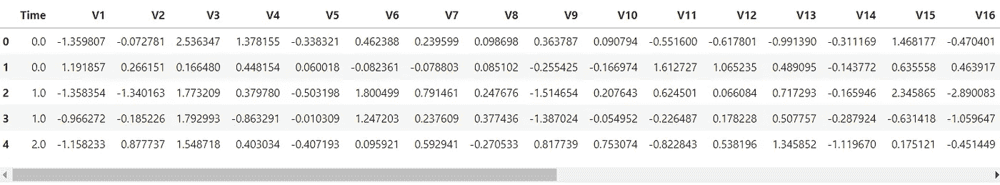
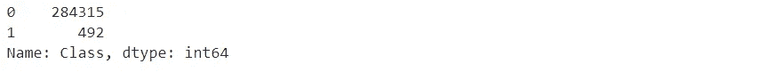
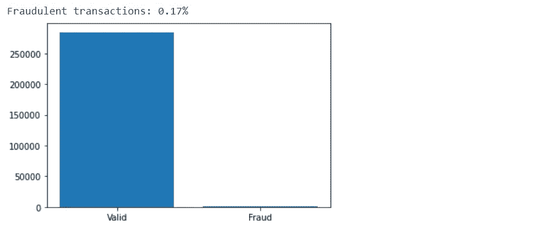
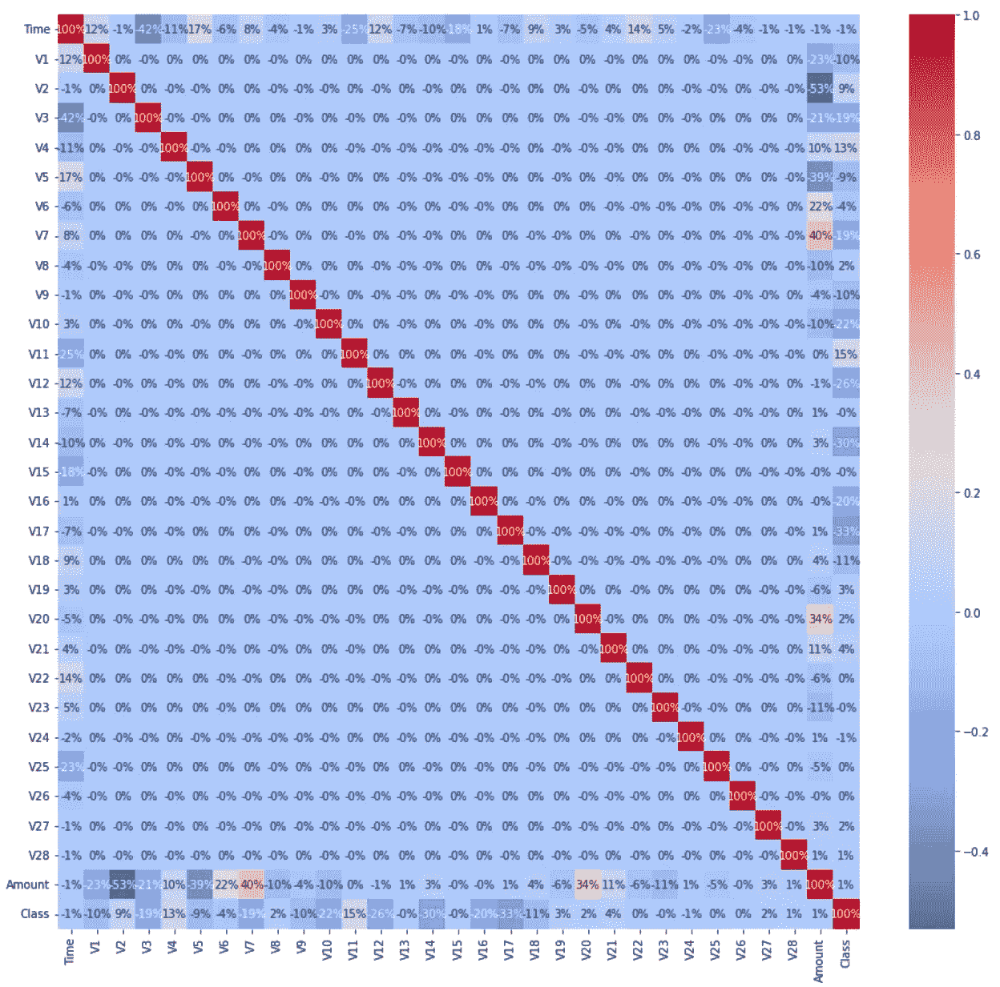
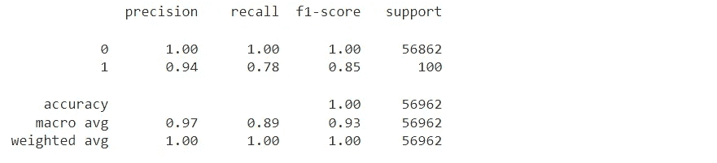
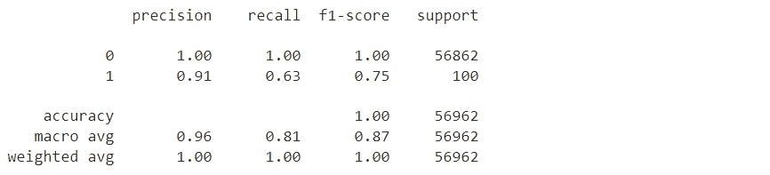
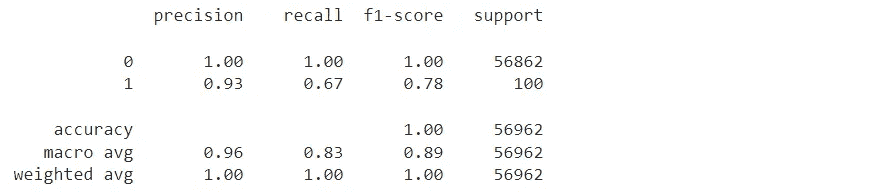
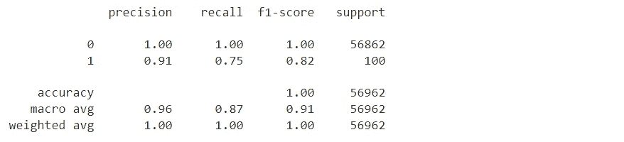
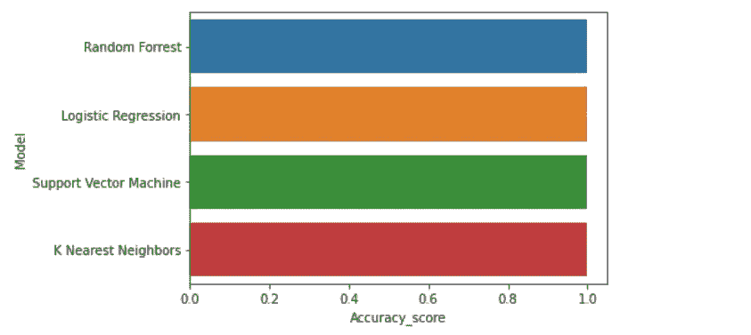

# 使用机器学习的欺诈检测

> 原文：<https://pub.towardsai.net/fraud-detection-using-machine-learning-eae93f6c1bec?source=collection_archive---------0----------------------->

## [机器学习](https://towardsai.net/p/category/machine-learning)

“人类在识别欺诈方面糟糕得惊人。研究表明，即使当我们在寻找欺骗的迹象时，我们的准确性也不比运气好多少。

—玛丽亚·孔尼科娃


罗德尼制片公司在[的照片](https://www.pexels.com/photo/man-people-woman-coffee-7821901/)

# 问题

越来越多的公司和消费者一直在转向在线和非接触式支付方式。数以百万计的美国人成为信用卡诈骗的受害者，最终花费他们数千美元，并对他们的信用评分产生负面影响。华尔街日报报告称，2019 年，欺诈损失，包括与信用卡和借记卡相关的损失，给银行、商家以及某些情况下的持卡人造成了 169 亿美元的损失。最近，在 2020 年 12 月，尼尔森报告将全球信用卡欺诈损失量化为 286.5 亿美元。

# 解决办法

在欺诈交易被批准和处理之前，开发一种实时检测和拒绝欺诈交易的方法。这可以通过访问与交易相关的数据来实现，例如物理位置、购买的项目、金额以及与持卡人先前购买的一致性。

# 路标

我们需要预测信用卡交易是合法交易还是欺诈交易。以下步骤将使用机器学习和 Python 来执行。

1.导入所需的软件库。

2.访问并导入数据集。

3.数据分析和探索。

4.数据清理和规范化。

5.将数据分为训练数据集和测试数据集。

6.根据训练数据训练模型。

7.根据测试数据进行预测。

8.评估模型的性能。

9.从评估中得出结论。

**程序**

目的:使用机器学习模型预测交易是有效交易还是欺诈交易。

**导入所需的软件库**

```
**import** pandas **as** pd 
**import** numpy **as** np
**import** matplotlib.pyplot **as** plt
**import** seaborn **as** sns
**from** sklearn.model_selection **import** train_test_split
**from** sklearn.ensemble **import** RandomForestClassifier
**from** sklearn.linear_model **import** LogisticRegression
**from** sklearn.svm **import** SVC
**from** sklearn.neighbors **import** KNeighborsClassifier
**from** sklearn.metrics **import** accuracy_score, classification_report
```

**访问并导入数据集**

```
#Load the data on Google Colab 
**from** **google.colab** **import** files                                         uploaded = files.upload() # Import the data set into a dataframe.
credit_data = pd.read_csv('creditcard.csv')
```

信用卡数据集包含 2013 年欧洲信用卡持卡人的真实银行交易。点击[链接](https://www.kaggle.com/mlg-ulb/creditcardfraud)可以找到信用卡数据集。为了安全起见，没有包括实际的变量名，除了 amount 和 class 之外，变量名都标为 V，后跟一个数字。有 30 个特性列和 1 个名为 Class 的目标列。

**数据分析与探索**

```
# Print the first 5 rows. 
credit_data.head()
```



显示有关数据列的信息。

```
credit_data**.**info()<class 'pandas.core.frame.DataFrame'>
RangeIndex: 284807 entries, 0 to 284806
Data columns (total 31 columns):
 #   Column  Non-Null Count   Dtype  
---  ------  --------------   -----  
 0   Time    284807 non-null  float64
 1   V1      284807 non-null  float64
 2   V2      284807 non-null  float64
 3   V3      284807 non-null  float64
 4   V4      284807 non-null  float64
 5   V5      284807 non-null  float64
 6   V6      284807 non-null  float64
 7   V7      284807 non-null  float64
 8   V8      284807 non-null  float64
 9   V9      284807 non-null  float64
 10  V10     284807 non-null  float64
 11  V11     284807 non-null  float64
 12  V12     284807 non-null  float64
 13  V13     284807 non-null  float64
 14  V14     284807 non-null  float64
 15  V15     284807 non-null  float64
 16  V16     284807 non-null  float64
 17  V17     284807 non-null  float64
 18  V18     284807 non-null  float64
 19  V19     284807 non-null  float64
 20  V20     284807 non-null  float64
 21  V21     284807 non-null  float64
 22  V22     284807 non-null  float64
 23  V23     284807 non-null  float64
 24  V24     284807 non-null  float64
 25  V25     284807 non-null  float64
 26  V26     284807 non-null  float64
 27  V27     284807 non-null  float64
 28  V28     284807 non-null  float64
 29  Amount  284807 non-null  float64
 30  Class   284807 non-null  int64  
dtypes: float64(30), int64(1)
memory usage: 67.4 MB
```

有 284，807 个交易，包含 31 个变量。信用交易没有任何缺失值，所有列都包含数字变量。

显示类中的类类型和计数。

```
credit_data['Class'].value_counts()
```



可视化有效和欺诈交易，并显示欺诈的百分比。

```
plt.bar(['Valid','Fraud'],list(credit_data['Class'].value_counts()))print("Fraudulent transactions: ", end='') 
frauds= credit_data['Class'].value_counts()[1]/sum(credit_data['Class'].value_counts())print(round(frauds*100,2), end='%')
plt.show()
```



我们有一个高度不平衡的数据集。大多数交易显然是有效的，只有少数欺诈案例。

可视化特征和目标变量类之间的相关性。我们将使用皮尔逊相关法。

```
plt.figure(figsize=(16,15)) sns.heatmap(credit_data.corr(), annot=**True**, fmt='.0%', cmap='coolwarm')
```



预测值列之间没有高相关值。没有预测值列与类列具有高相关值。然而，V2 与数量之间存在负相关，V7 与数量特征之间存在正相关。

**数据清理和规范化**

检查“金额”列中的数据是否存在值差异。

```
min(credit_data.Amount), max(credit_data.Amount)
```

(0.0, 25691.16)

使用标准缩放器缩放金额变量，以校正金额中的较大差异。

```
sc = StandardScaler() 
amount = credit_data['Amount'].values 
credit_data['Amount'] = sc.fit_transform(amount.reshape(-1, 1))
```

删除时间变量，因为此分析不需要它。

```
credit_data.drop(['Time'], axis=1, inplace=**True**)
```

**将数据分成训练和测试数据集**

首先，我们需要将数据分为 x 值(我们将用来进行预测的数据)和 y 值(我们试图预测的数据)。

```
x = credit_data.drop('Class', axis = 1)
y = credit_data['Class']
```

使用 train_test_split 函数生成训练数据和测试数据。测试数据集将是原始数据集的 20%。

```
x_training_data, x_test_data, y_training_data, y_test_data = train_test_split(x, y, test_size = 0.2)
```

**我们现在将训练模型，进行预测，并评估四种不同机器学习模型的性能。**

**随机福里斯特模型**

```
# Create model object.model_rf **=** RandomForestClassifier()# Train the model on the training data.
model_rf**.**fit(x_training_data, y_training_data)# Make predictions on the test data.
predictions_rf **=** model_rf**.**predict(x_test_data)
```

计算准确度分数。

```
rf **=** accuracy_score(y_test_data, predictions_rf)
print(f'Accuracy: {round(rf*****100,2)}%')
```

准确率:99.95%

评估模型的性能。

```
print(classification_report(y_test_data, predictions_rf))
```



随机森林模型准确预测了 99.95%的交易是有效的或欺诈的。

100%正确预测有效交易。

94%正确预测欺诈交易。

**逻辑回归模型**

```
# Create model object.model_lr **=** LogisticRegression(max_iter**=**150)# Train the model on the training data. model_lr**.**fit(x_training_data, y_training_data)# Make predictions on the test data. 
predictions_lr **=** model_lr**.**predict(x_test_data)
```

计算准确度分数。

```
lr **=** accuracy_score(y_test_data, predictions_lr)
print(f'Accuracy: {round(lr*****100,2)}%')
```

准确率:99.92%

评估模型的性能。

```
print(classification_report(y_test_data, predictions_lr))
```



逻辑回归模型准确预测了 99.92%的交易是有效的或欺诈的。

100%正确预测有效交易。

91%正确预测欺诈交易。

**支持向量机模型**

```
# Create model object.model_sv **=** SVC()# Train the model on the training data. model_sv**.**fit(x_training_data, y_training_data)# Make predictions on the test data. 
predictions_sv **=** model_sv**.**predict(x_test_data)
```

计算准确度分数。

```
sv **=** accuracy_score(y_test_data, predictions_sv)
print(f'Accuracy: {round(sv*****100,2)}%')
```

准确率:99.93%

评估模型的性能。

```
print(classification_report(y_test_data, predictions_sv))
```



支持向量机模型准确预测了 99.93%的交易是有效的或欺诈的。

100%正确预测有效交易。

93%正确预测欺诈交易。

**K 个最近邻居**

```
# Create model object. 
model_kn **=** KNeighborsClassifier(n_neighbors**=**9, leaf_size**=**20) *# (n_neighbors = 5, metric = 'minkowski', p = 2)* # Train the model on the training data. model_kn**.**fit(x_training_data, y_training_data)# Make predictions on the test data. 
predictions_kn **=** model_kn**.**predict(x_test_data)
```

计算准确度分数。

```
kn **=** accuracy_score(y_test_data, predictions_kn) 
print(f'Accuracy: {round(kn*****100,2)}%')
```

准确率:99.94%

评估模型的性能。

```
print(classification_report(y_test_data, predictions_kn))
```



k 近邻模型准确地预测了 99.94%的交易是有效的或欺诈的。

100%正确预测有效交易。

91%正确预测欺诈交易。

按型号显示准确度分数。

```
models **=** pd**.**DataFrame({
    'Model':['Random Forrest', 'Logistic Regression', 'Support Vector Machine', 'K Nearest Neighbors'],
    'Accuracy_score' :[rf, lr, sv, kn]
})modelssns**.**barplot(x**=**'Accuracy_score', y**=**'Model', data**=**models)models**.**sort_values(by**=**'Accuracy_score', ascending**=False**)
```



结论:所有模型在预测有效交易和欺诈交易方面都做得很好，准确率达到 99%以上。随机森林模型的准确度最高。该模型正确预测了 99.95%的交易为有效或欺诈交易。这些数据对有效交易非常重要。通过在合法交易和欺诈交易之间建立更加平衡的数据集，可以改进该研究。

感谢阅读我的文章！如果您有任何意见或反馈，请在下面添加。

如果你喜欢阅读这样的故事，并想支持我成为一名作家，可以考虑报名成为一名媒体成员。会员资格让你可以无限制地接触媒体上的故事。你可以使用此链接[https://medium.com/@dniggl/membership](https://medium.com/@dniggl/membership)注册