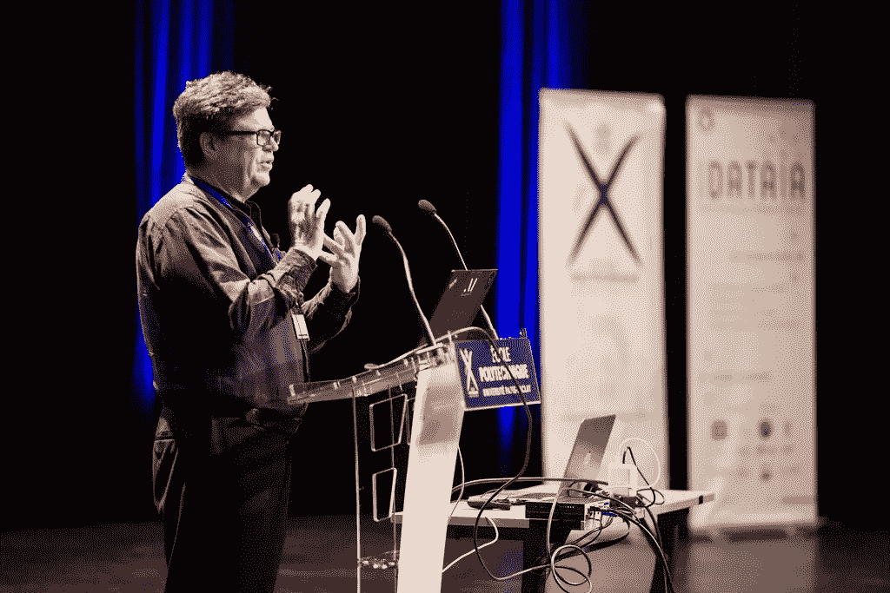
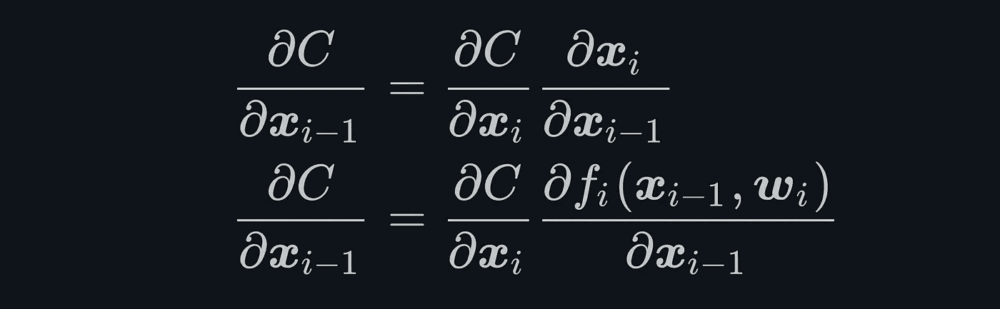

# “AI 教父”免费深度学习课程

> 原文：<https://pub.towardsai.net/free-deep-learning-course-from-the-godfather-of-ai-1543b14b3a1e?source=collection_archive---------2----------------------->

## [教育](https://towardsai.net/p/category/education)

## 一个难以置信的机会。

[巴黎综合理工学院](https://www.flickr.com/photos/117994717@N06)的【CMAP —数据科学学院暑期学校】在 [CC BY-SA 2.0](https://creativecommons.org/licenses/by-sa/2.0/?ref=ccsearch&atype=rich) 下获得许可

Yann LeCun 经常被称为“人工智能教父”之一，因为他在 30 年的时间里奠定了深度学习的基础。

LeCun 的贡献包括从发明卷积神经网络到加速反向传播。他现在的工作包括在脸书担任副总裁和首席人工智能科学家，以及在 NYU 担任教授。

# 课程

LeCun 的 NYU 课程之一，深度学习 DS-GA 1008，在网上对所有人免费开放。

虽然你不需要这些技能来部署人工智能，但显然像 [**这样的无代码人工智能工具。AI**](http://obviously.ai/) 如果你最终想获得一个技术职位，这门课将是你的救命稻草。

 [## 深度学习

### DS-GA 1008 2020 年春季 NYU 数据科学中心本课程关注深度学习和…

atcold.github.io](https://atcold.github.io/pytorch-Deep-Learning/) 

本课程由一系列讲座和实践组成，历时 15 周，包括幻灯片、Jupyter 笔记本和 YouTube 视频。课程描述如下:

> “本课程关注深度学习和表示学习的最新技术，重点关注有监督和无监督的深度学习、嵌入方法、度量学习、卷积和递归网络，以及对计算机视觉、自然语言理解和语音识别的应用。”

简而言之，你会从深度学习之父本人那里学到深度学习的前沿。你还将从另一位导师那里学到东西，他是 NYU 大学计算机系的助理教授。

世界各地的志愿者一直在努力将课程材料翻译成阿拉伯语、日语、韩语、中文、法语、意大利语、西班牙语、土耳其语、波斯语、俄语等语言。

# 先决条件

有一个先修， [**DS-GA 1001 数据科学导论**](https://cds.nyu.edu/academics/ms-curriculum/) 或者研究生水平的机器学习课程。

这一点不能掉以轻心，您需要确保自己具备必备的知识。例如，在第一周第一课，你会遇到这个输入梯度的反向传播方程。

输入梯度的反向传播方程。

# 证书

另一个常见的问题是该课程是否提供结业证书。因为这是 GitHub 上的无人监管课程，而不是由 Coursera 或 edX 这样的课程提供商提供的，所以你不会收到证书。

也就是说，证书不是万能的。任何学生的主要目标都应该是学习并将所学付诸实践——而不是获得证书。

 [## 该不该考个数据科学证书？流程图。

### 简单指南。

medium.com](https://medium.com/datadriveninvestor/should-you-get-a-data-science-certificate-a-flowchart-3e349cc7c43a) 

如果你确实想要 AI 证书来充实你的简历，还有很多其他选择，包括:

*   [**谷歌的专业机器学习工程师证书**](https://towardsdatascience.com/why-you-should-get-googles-new-machine-learning-certificate-56af4204744f) **。**
*   [**LinkedIn 学习数据科学证书**](https://medium.com/dataseries/top-10-linkedin-learning-data-science-certificates-f6e945f4e4cd) **。**
*   [**远程数据科学实习证书**](https://blog.usejournal.com/remote-data-science-internships-for-everyone-with-certificates-d4eebb993dac) **。**

有无数的其他选择，所以做你的研究，找到最适合你的需求，或者在下面留下评论。

# 摘要

最终，在线学习人工智能和深度学习有如此多的选择，以至于感觉像是“选择超载”。

幸运的是，这个决定很容易做出。你将直接从深度学习的教父那里免费学习理论和实践。