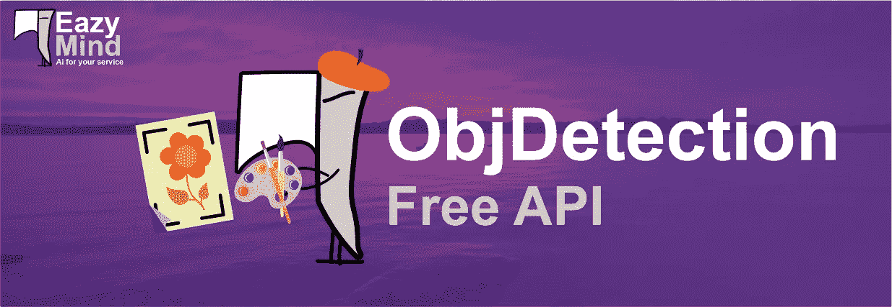
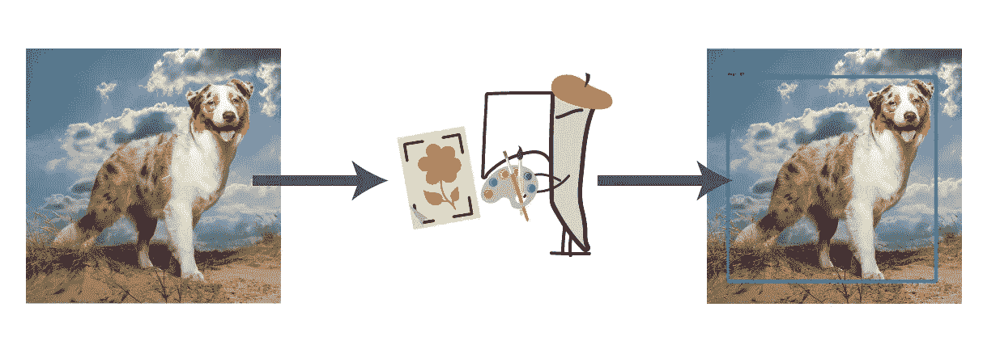

# EazyMind 提供的免费对象检测 API

> 原文：<https://pub.towardsai.net/free-objdetection-api-from-eazymind-tut-1-2159e6ffd25d?source=collection_archive---------0----------------------->

## 物体检测教程，第一部分| [走向 AI](https://towardsai.net)

本系列教程介绍了 [EazyMind](http://bit.ly/2VxhPqU) (一个人工智能即服务平台)提供的不同 API。 [EazyMind](http://bit.ly/2VxhPqU) 免费提供多项 AI 服务；Obj 检测就是其中之一！

EazyMind 也提供[文本摘要](http://bit.ly/eazysum)作为另一个免费的 API。


EazyMind 还提供免费的文本摘要 API

今天我们将介绍如何使用 [EazyMind](http://bit.ly/2VxhPqU) 提供的**对象检测 API** 。我们还将介绍这个 API 是如何构建的，所以让我们开始吧！！



# 1.如何在你的项目中使用 ObjDetecion 免费 API

[EazyMind](http://bit.ly/2VxhPqU) 以 [python PyPI](http://bit.ly/2Ef5XnS) 包的形式提供其免费 API，你需要在 [EazyMind](http://bit.ly/2VxhPqU) 上免费注册，然后使用你的密钥访问该 API

1.  在 [EazyMind](http://bit.ly/2VxhPqU) 上的第一个自由注册
2.  拿你的钥匙
3.  安装 python 包

```
pip install eazymind
```

4.然后使用 API 本身

```
from eazymind.vision.eazyobjdetect import  Detector
key = "xxxxxxxxxxxx"with open("image1.jpg" , "rb") as img:
    detector = Detector(key)
    detected_image = detector.run(img.read())
    with open("out_detected.jpg" , "wb") as out_img:
        out_img.write(detected_image)
```

注意:你也可以通过 curl 调用来使用这个 API

```
curl -X POST  
  http://eazymind.herokuapp.com/arabic_sum/eazyobjdetect 
  -F imagedata=@{imagefile}.jpg 
  -F key={eazymind api key} 
  -o {outputfile}.jpg
```

您可以进一步扩展这个 API，用任何其他语言调用它，因为毕竟它只是 HTTP 调用。

现在，让我们进一步了解这个 API 是如何构建的！！

# 2.API 的构建方式

我们已经创建了这个 API，作为谷歌通过使[他们的工作开源](https://github.com/tensorflow/models/blob/master/research/object_detection/object_detection_tutorial.ipynb)所做的巨大努力的延伸，我真诚地感谢他们将他们的工作公之于众，我们已经通过一个 API 将他们的工作包装在 [EazyMind](http://bit.ly/2VxhPqU) 中。

## 2a。使用的模型

谷歌已经为 ObjDetection 提供了一个[型号列表](https://github.com/tensorflow/models/blob/master/research/object_detection/g3doc/detection_model_zoo.md)，它们提供了速度和精度之间的平衡，我们选择了 **ssd_mobilenet_v1_coco** 作为我们的选择型号

## 2b。张量流模型

我们已经使用了[这个代码库](https://github.com/tensorflow/models/blob/master/research/object_detection/object_detection_tutorial.ipynb)并将其添加到 [EazyMind](http://bit.ly/2VxhPqU) 中。它建成了

[EazyMind](http://bit.ly/2VxhPqU) 也提供了[文本摘要](http://bit.ly/eazysum)作为另一个免费的 API，看看吧！！

```
from eazymind.nlp.eazysum import Summarizer
key = "xxxxxxxxxxxx"sentence = """Facebook CEO Mark Zuckerberg, left, makes the keynote speech at F8, the Facebook's developer conference, Tuesday, April 30, 2019, in San Jose, Calif. (AP Photo/Tony Avelar )
Facebook says that, unlike its past, its future is privacy
A trader works ahead of the closing bell on the floor of the New York Stock Exchange (NYSE) on April 12, 2019 in New York City. (Photo by Johannes EISELE / AFP)        (Photo credit should read JOHANNES EISELE/AFP/Getty Images)
Resilience is still the word for stocks"""summarizer = Summarizer(key)
print(summarizer.run(sentence))
```

如果你喜欢文本摘要的概念，我们已经发布了多个关于这个主题的教程，你可以在这里找到这些博客[的链接，在这里](https://github.com/theamrzaki/text_summurization_abstractive_methods#blogs)找到它的开源代码[。](http://bit.ly/eazysum)

> *我真心希望你喜欢阅读本教程，并且*我真心希望这些 API 对你有所帮助*。*
> 
> [*关注脸书页面上的 EazyMind*](https://www.facebook.com/profile.php?id=445521342941282&ref=br_rs)*至* ***享受免费的 AI 项目咨询。***
> 
> *希望在谈论 EazyMind 的其他功能时再次见到您，以保持对:D 的关注*