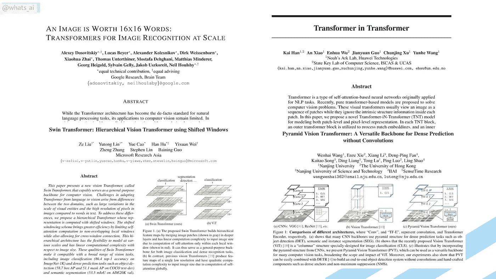
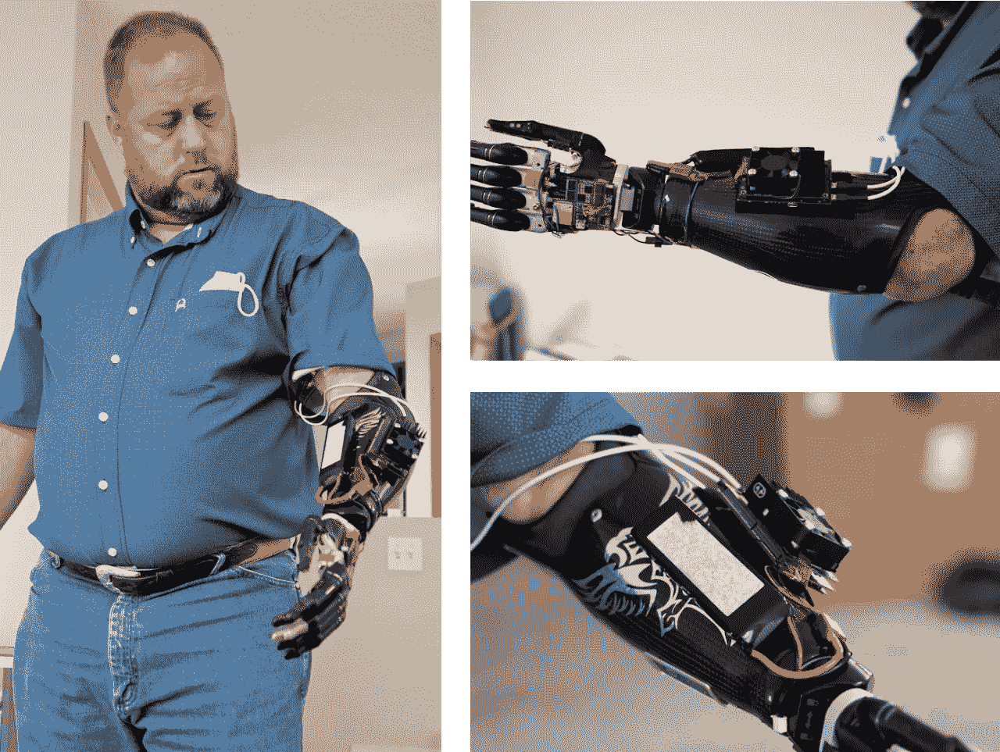
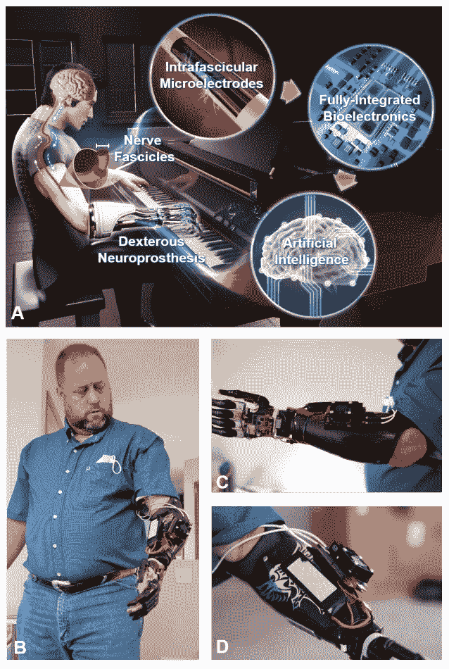
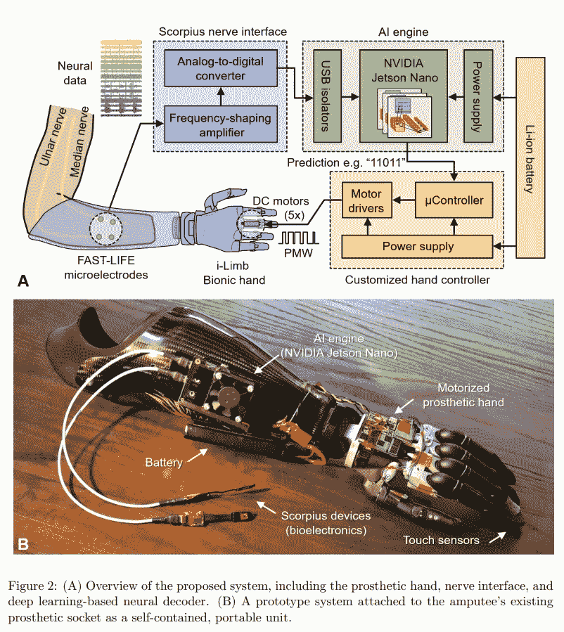
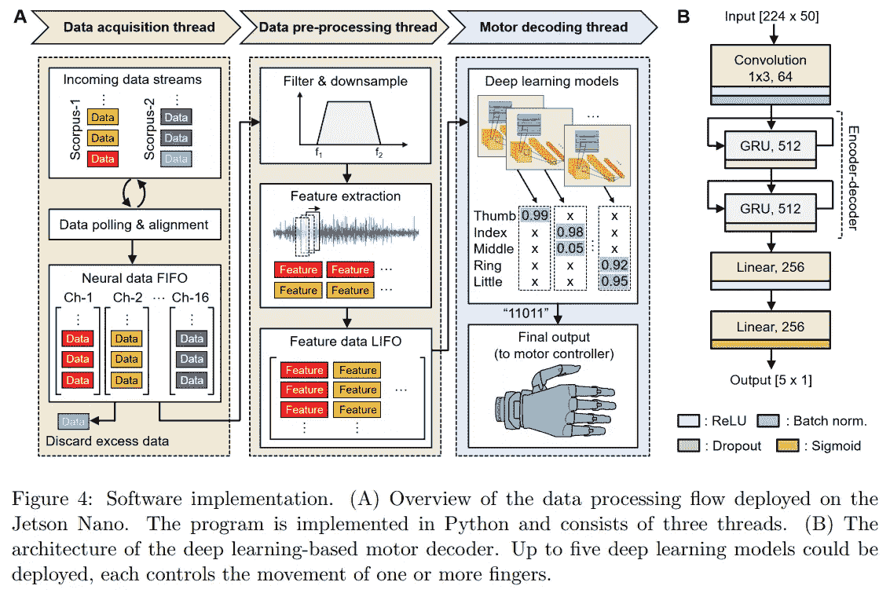
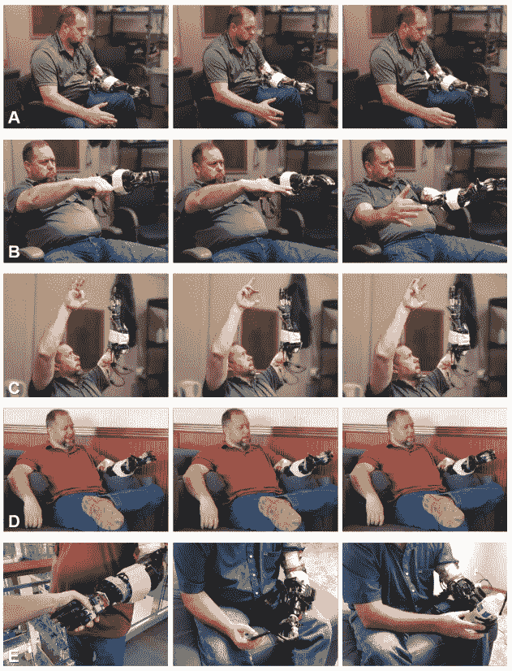

# 用这只人工智能手从截肢者变成机器人！🦾

> 原文：<https://pub.towardsai.net/from-amputee-to-cyborg-with-this-ai-powered-hand-bdeb40f9b0d8?source=collection_archive---------2----------------------->

## [人工智能](https://towardsai.net/p/category/artificial-intelligence)

## 有了这个人工智能驱动的神经接口，截肢者可以像生活一样灵活和直观地控制神经假体手。

> 原载于 [louisbouchard.ai](https://www.louisbouchard.ai/an-amputee-with-an-ai-powered-hand/) ，前两天在[我的博客](https://www.louisbouchard.ai/tag/artificial-intelligence/)上看到的！

听听这个故事:

我将谈论从本周发表的 600 篇新论文中随机挑选的变压器应用，对该领域没有什么贡献，但通过调整一些参数，在一个基准上提高了 0.01%的精度。

我希望你不要对这个介绍太兴奋，因为这只是为了扰乱变形金刚最近的流行。当然，它们在许多情况下非常棒，非常有用，大多数研究人员都在关注它们，但人工智能中还有其他一些东西同样令人兴奋，如果不是更多的话！你可以肯定，我将涵盖应用于 NLP、计算机视觉或其他领域的变形金刚架构的令人兴奋的进步，因为我认为这是非常有前途的，但涵盖这些新论文并对它们进行轻微修改对我来说并不有趣。

作为一个例子，这里有几篇在三月份分享的将变形金刚应用于图像分类的论文。由于它们都非常相似，我已经介绍了其中一个(如下)，我认为对计算机视觉中变形金刚的现状有一个概述就足够了。

 [## 变形金刚会取代计算机视觉中的 CNN 吗？

### 几分钟后，您将了解如何通过一种新的方式将 transformer 架构应用于计算机视觉

pub.towardsai.net](/will-transformers-replace-cnns-in-computer-vision-55657a196833) 

现在让我们进入这篇文章的真正主题！这和变形金刚或者 GANs 没有任何关系，除了“赛博朋克”之外没有任何热词，然而，这是我最近见过的最酷的人工智能应用之一！它解决了一个现实世界的问题，并能改变许多人的生活。当然，比起把脸换成动漫人物或者漫画，魅力要小一些，但有用得多。

我向你展示 Nguyen，Drealan 等人的“便携式，独立的神经修复手，基于深度学习的手指控制”，或者用其中一位作者的话说，“赛博朋克”手臂。

行动中的机器人！照片由 Nguyen & Drealan 等人(2021)经许可转载。

在深入讨论之前，我只想提醒你下周将举行的免费 NVIDIA GTC 活动，其中有许多与人工智能和深度学习研究所相关的令人兴奋的消息，如果你订阅我的时事通讯，我将举办免费活动。如果你感兴趣，我在之前的视频中谈到了这个赠品的更多细节，见下文。

现在，让我们直接进入这篇独特而令人惊叹的新论文。
这篇新论文将深度学习应用于神经假体手，以允许实时控制单个手指的运动，所有这些都直接在手臂本身内完成！只有 50 到 120 毫秒的延迟和 95 到 99%的准确率，一个失去手 14 年的手臂截肢者可以像正常手一样移动它的电子手指！这项工作表明，部署直接嵌入可穿戴生物医学设备的深度神经网络应用首先是可能的，但也是极其强大的！

行动中的机器人！照片由 Nguyen & Drealan 等人(2021)经许可转载。

在这里，深度学习被用来处理和解码从截肢者那里获得的神经数据，以获得灵巧的手指运动。这里的问题是，为了实现低延迟，这种深度学习模型必须在计算能力比我们的 GPU 低得多的便携式设备上。幸运的是，最近开发了用于深度学习的紧凑型硬件来解决这个问题。

在这种情况下，他们使用了专门为在自主应用中部署 AI 而设计的英伟达 Jetson Nano 模块。它允许在 arm 内部使用 GPU 和强大的库，如 TensorFlow 和 PyTorch。正如他们所说，“这为我们的神经解码器实现提供了尺寸、功率和性能之间最合适的平衡。”这就是本文的目标:解决在现实生活应用中使用的便携式设备上高效部署深度学习神经解码器的挑战，以供长期临床使用。

神经假体手。照片由 Nguyen & Drealan 等人(2021)经许可转载。

当然，由于我不是专家，有许多技术细节我不会进入，比如神经纤维和生物电子学如何连接在一起，允许这种同步神经记录和刺激的微芯片设计，或者支持这种实时运动解码系统的软件和硬件的实现。如果你想了解更多，你可以在他们的相关论文中阅读对这些的详细解释，它们都在参考文献中有链接。但是让我们更深入地研究一下这个疯狂创造的深度学习方面。在这里，他们的创新在于优化深度学习运动解码，以尽可能降低这个 Jetson Nano 平台的计算复杂性。

详细介绍 NVIDIA Jet Nano。照片由 Nguyen & Drealan 等人(2021)经许可转载。

此图显示了 Jetson Nano 上数据处理流程的概况。首先，来自截肢者手臂的周围神经信号形式的数据被发送到平台中。然后，对其进行预处理。这一步对于将原始输入神经数据切割成试验并在输入模型之前提取它们在时间域中的主要特征至关重要。该预处理数据对应于从噪声源中清除的来自被截肢者的过去 1 秒钟的神经数据的主要特征。然后，这些经过处理的数据被发送到深度学习模型中，以获得控制每个手指运动的最终输出。注意，有五个输出，每个手指一个。

快速浏览一下他们使用的模型，如图所示，从卷积层开始。这用于识别数据输入的不同表示。在这种情况下，您可以看到 64，这意味着有 64 个使用不同过滤器的卷积，因此有 64 种不同的表示。这些过滤器是在训练期间学习的网络参数，以在最终展开时正确地控制手。然后，我们知道时间在这种情况下非常重要，因为我们想要手指的流畅运动，所以他们选择了门控循环单位，或 GRU，来代表解码数据时的时间依赖性。GRUs 将允许模型理解手在过去一秒钟内正在做什么(首先编码的是什么)以及它接下来需要做什么(解码的是什么)。简单地说，gru 只是递归神经网络或 RNNs 的改进版本。通过增加门以在循环过程中仅保留过去输入的相关信息，而不是每次都洗去新输入，来解决 RNNs 具有长输入的计算问题。它基本上是允许网络决定什么信息应该被传递到输出端。如同在递归神经网络中一样，这里以 512 个特征的形式的一秒钟数据使用重复的 GRU 块进行迭代处理。每个 GRU 模块接收当前步骤的输入和先前的输出，以产生下面的输出。我们可以将 GRUs 视为“基本”递归神经网络架构的优化。最后，这个解码信息被发送到线性层，基本上只是传播信息并将其压缩成每个手指的概率。

他们研究了许多不同的架构，正如你可以在他们的论文中读到的那样，但这是他们能够做出的计算效率最高的模型，产生了超过 95%的令人难以置信的准确性。

现在我们对模型的工作原理有了一个很好的了解，并且知道它是准确的，一些问题仍然存在。比如使用它的人对它有什么感觉？感觉真实吗？有用吗？等等。简而言之，这和真的手臂相似吗？

正如病人自己所说:

> [病人]我觉得一旦这东西被微调成成品，就会出现在那里。这将是更像生活的功能，能够做日常工作，而不用考虑手在什么位置或手被编程在什么模式。就像如果我想拿起某样东西，我只是伸手拿起某样东西。[……]知道它就像我的[能干的]手一样，可以完成日常功能。我想我们会成功的。我真的想！

行动中的机器人！照片由 Nguyen & Drealan 等人(2021)经许可转载。

对我来说，这些是我们可以用人工智能进行的最不可思议的应用。它直接帮助人们提高生活质量，没有比这更好的了！我希望你喜欢这个简短的阅读，你可以观看视频版本，看看这个疯狂的机器人手移动的更多例子！

感谢您的阅读，正如他在上面的视频中所说，我也会对 AI 说同样的话:“这真是太酷了”！

如果你喜欢我的工作，并想与人工智能保持同步，你绝对应该关注我的其他社交媒体账户( [LinkedIn](https://www.linkedin.com/in/whats-ai/) ， [Twitter](https://twitter.com/Whats_AI) )，并订阅我的每周人工智能 [**简讯**](http://eepurl.com/huGLT5) ！

## 支持我:

*   支持我的最好方式是在 [**媒体**](https://medium.com/@whats-ai) 上关注我，或者如果你喜欢视频格式，在[**YouTube**](https://www.youtube.com/channel/UCUzGQrN-lyyc0BWTYoJM_Sg)**上订阅我的频道。**
*   **支持我在 [**Patreon**](https://www.patreon.com/whatsai) 上的工作**
*   **加入我们的 [**Discord 社区:** **一起学 AI**](https://discord.gg/learnaitogether)和*分享你的项目、论文、最佳课程、寻找 Kaggle 队友等等！***

# **参考**

**[1] Nguyen & Drealan 等人(2021)一种基于深度学习的手指控制的便携式独立神经修复手:[https://arxiv.org/abs/2103.13452](https://arxiv.org/abs/2103.13452)**

**[2].Luu & Nguyen 等人(2021)基于深度学习的从外周神经信号中解码运动意图的方法:[https://www . research gate . net/publication/349448928 _ Deep _ Learning-Based _ approach _ for _ Decoding _ Motor _ Intent _ from _ Peripheral _ neural _ Signals](https://www.researchgate.net/publication/349448928_Deep_Learning-Based_Approaches_for_Decoding_Motor_Intent_from_Peripheral_Nerve_Signals)**

**[3].Nguyen et al .(2021)Redundant cross fire:一种利用晶体管失配在神经刺激器设计中实现超分辨率的技术:https://experts . umn . edu/en/publications/Redundant-cross fire-A-Technique-to-Achieve-Super-Resolution-in-ne**

**[4].Nguyen 和 Xu 等人(2020)面向截肢者直观假肢控制的生物电神经接口:[https://www . bior XIV . org/content/10.1101/2020 . 09 . 17 . 301663 v1 . full](https://www.biorxiv.org/content/10.1101/2020.09.17.301663v1.full)**