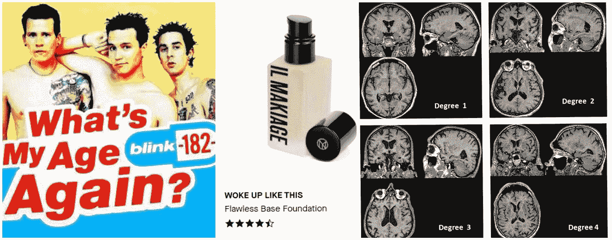
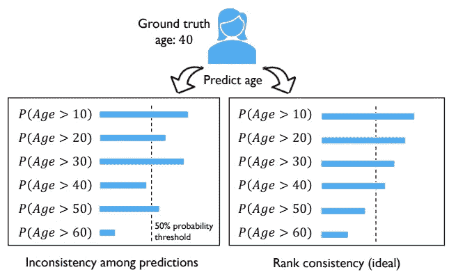
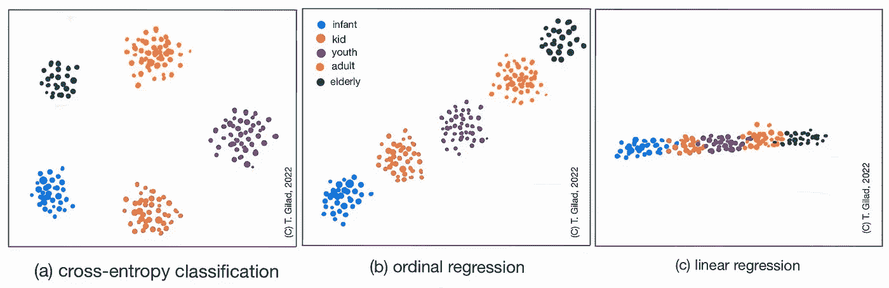

# 从分类到有序回归

> 原文：<https://pub.towardsai.net/from-classification-to-ordinal-regression-c659c074cb88?source=collection_archive---------0----------------------->

## 释放标签的潜力

人工智能生成的(中途):《狮子和大象的混合体，插图，儿童读物》和《狮子脸的大象》

> "狮子更接近长颈鹿还是大象？"

这是一个没有人问过的问题。永远不会。给狮子、大象和长颈鹿分类是一项简单的分类任务。因此，它可以主要通过交叉熵损失来解决。将某人归类为儿童/成人/老年人的任务是否应该以同样的方式处理？

在这篇博文中，我们将概述以下方面的最佳实践方法和论文:
(1)解决有序分类问题。
(2) **粗**分类标签成回归**连续**预测。
(3)如何**选择。**
(4)如何**评价。** 这篇文章中回顾的论文主要关注深度学习模型，但主要概念也适用于其他 ML 架构。

# 连续世界中的离散标签

> “世界是连续的，但心灵是离散的。”
> - [大卫·芒福德](https://en.wikipedia.org/wiki/David_Mumford)，ICM 2002

当把现实世界的问题分解成基于 ML 的解决方案时，我们经常定义类别。然而，实际目标值可能是连续的**或至少是有序的**。这是**在设计**你的 ML 模型**时要考虑甚至利用**的东西。你是否面临一个分类问题？花点时间去理解你的“类”之间隐藏的关系。

下面列举一些分类例子:
-网络评分:1–5 星。
-医学[诊断指标](https://radiopaedia.org/articles/modified-ct-severity-index)-1/2/3 期。
-人脸姿态估计【1】—45/90/180 度。
——年龄估计之类的。

从左到右:**年龄预测**:[https://data.vision.ee.ethz.ch/cvl/rrothe/imdb-wiki/](https://data.vision.ee.ethz.ch/cvl/rrothe/imdb-wiki/)。图片鸣谢:**预测评级**(ilmakiage . com)**医学** **严重度**dVRS 指数，朱等【https://www . aha journals . org/doi/10.1161/stroke aha . 110.591586

# 了解您的数据

在着手设计一个 ML 解决方案时，一些首要步骤是:
(a)了解您目前有哪些**数据/您可能在合理的时间内获得哪些数据。在某些情况下，您会有与您的数据相关的连续测量。例如，血液测量或关于确切年龄的信息。通常情况下，这些都是不可用的。手工标注细粒度标签是一项极其困难和耗时的任务。因此，在许多情况下，你所拥有的只是粗糙的分类标签。尤其是需要专家意见的时候。**

(二)探索领域。请你的**数据领域专家**澄清目标类之间的**关系。他们假设的每一点先验知识或假设。询问他们要求的输出格式。比如:一个介于 0 到 1 之间的平滑实数，能比一个失败/通过/优秀的学生成绩预测器更好的产品用途吗？**

如果你的课程确实是独立的，那么这篇博文不适合你！
然而，如果它们是依赖的，问问你自己:
(1)标签有顺序**吗**？
(2)你只关心顺序，还是有些标签比其他标签更接近自己最近的标签？标签间距离的**【步长】是否一致？**

# 回归救援

**逻辑回归** 大多数人都熟悉 [**逻辑回归**](http://deeplearning.stanford.edu/tutorial/supervised/LogisticRegression/) 来区分阶级。虽然目标标签是离散的，但估计的类别置信度是连续的。

让我们考虑以下情况:错误地将 A 类分类为 B 类的后果不如 A 和 c 之间的错误严重。一种方法可以是使用带有每种类型错误的风险系数的**加权损失**。

**有序回归** 另一种方法可以是对独热向量标签进行不同的编码，如 [NNRank](https://arxiv.org/pdf/0704.1028.pdf) 的论文【3】中所建议的。举个动手的例子，我推荐[格鲁伯的帖子](https://towardsdatascience.com/how-to-perform-ordinal-regression-classification-in-pytorch-361a2a095a99)和[科特瓦尼的](https://towardsdatascience.com/deep-ordinal-logistic-regression-1afd0645e591)。注意，如果建模为二元分类器集合的集合，则可能出现分类预测的不一致。[曹等 2020 CORAL](https://arxiv.org/pdf/1901.07884.pdf) 提出了一种实现秩一致性的解决方案【4】。

图来自 Cao 等人 2020[CORAL](https://arxiv.org/pdf/1901.07884.pdf)【4】:与预期结果(右)相比，聚合二元分类器时的等级不一致(左)

# 线性回归-超越可用标签

***网飞*** 最近推出了一款[双拇指竖起](https://about.netflix.com/en/news/two-thumbs-up-even-better-recommendations)。在此基础上，他们将 3(不喜欢/无所谓/喜欢)扩展为 4 类。这是过去“喜欢”类别中更好的区分:喜欢和非常喜欢。想象一下，你有很多过去的粗糙的“喜欢”票，只有几个新的“双拇指”票。评估用户满意度得分(而不是一个类别)可以让您更好地适应新的用户输入。

[秦等 BioeNet 2020](https://www.nature.com/articles/s41598-020-79007-5) 展示了一种利用粗标签进行细粒度线性回归的策略【5】。走这条路时要考虑的一件重要事情是评估你的内部阶级秩序。我们将讨论下一步如何做。

图来自秦等[生物网](https://www.nature.com/articles/s41598-020-79007-5) 2020:从粗标签学习细粒度估计【5】

将离散整数目标标签转换成实数的另一个可能的好处是**软标签**的积极效果。如[谷歌大脑团队(2020)](https://arxiv.org/pdf/1906.02629.pdf) 所示，使用软标签不仅**减少了过度自信**，而且**改善了** [**校准**](http://proceedings.mlr.press/v70/guo17a/guo17a.pdf) 甚至没有温度缩放【6–8】。

# 确保你在正确的方向上

**簇的形状和位置** 我非常相信你的 DNN 嵌入**特征空间**的分析。创建一个 [**T-SNE**](https://towardsdatascience.com/t-sne-clearly-explained-d84c537f53a) 你的测试集特征空间。遵循下图中的插图。在交叉熵损失的情况下，你会期望每个聚类压缩(最小化类内方差)并彼此远离(最大化类内方差)。然而，在有序回归中，你期望在特征空间中看到**中的聚类的正确接近顺序**。例如，对于有 MSE 损失的线性回归，您不仅会看到正确的顺序，还会看到从一个聚类到下一个聚类的类之间的连续顺序，并且具有**较小的余量**。如果您仍然看到一个明显的空白，这也可能表明您的测试集缺少边界示例。

作者插图

来自同一类别的样本之间的关系如果你能得到一些更细粒度的标签样本，你可以用它们作为测试集，看看你的模型在正确的类内顺序下是否足够概括。例如，假设您正在尝试估计一个人的年龄，但您拥有的大量标记数据都是粗略的标记(0-3/4-14/青少年/20 多岁/30 多岁等等)。如果您有几个来自相同“年龄组”的人的样本，但具有确切年龄标签的数据(比如 4 岁、8 岁、14 岁)，请检查他们在特征空间中的位置是否正确排序，以及输出预测是否如您所预期的那样排序。

# 结果

> 思考你的目标类之间的关系。它们可能是从属的或订购的。
> 
> 考虑不同类型的回归，从标签中获得更多。
> 
> 可视化您的特征空间，并测试预测输出的内部类顺序。

当给定一组可能的小类时，分类方法似乎是一个显而易见的方向，考虑类之间的关系是提高 ML 的关键，有时可能是成功的关键！

## 参考

[1]贝耶，l .，赫尔曼斯，a .和莱贝，b .，2015 年 10 月。[双神经元网络:从离散训练标签进行连续头部姿态回归](http://strands.acin.tuwien.ac.at/publications/y3/beyer_GCPR_15.pdf)。在*德国模式识别会议*(第 157-168 页)。斯普林格，查姆。

[2] Resheff、Yehezkel S .、Amit Mandelbom 和 Daphna Weinshall。[用对数双线性损失控制深度学习中的不平衡误差](http://proceedings.mlr.press/v74/resheff17a/resheff17a.pdf)。第一届不平衡领域学习国际研讨会:理论与应用。PMLR，2017。

[3]程，张，王，张，张，2008，6 .[有序回归的神经网络方法](https://arxiv.org/pdf/0704.1028.pdf)。在 *2008 年 IEEE 国际神经网络联合会议(IEEE 世界计算智能大会)*(第 1279-1284 页)。IEEE。

[4]曹，w .，米尔贾利利诉拉什卡，s .，2020 年。[应用于年龄估计的神经网络排序一致有序回归](https://arxiv.org/pdf/1901.07884.pdf)。*模式识别字母*， *140* ，第 325–331 页。

[5]秦，张，陈，江，张，余，胡，马，苗，周，2020 .[通过分布恢复从粗粒度标签学习生理状态的细粒度估计](https://www.nature.com/articles/s41598-020-79007-5)。*科学报告*， *10* (1)，第 1–10 页。

[6] Müller，r .，Kornblith，s .和 Hinton，G.E .，2019。[标签平滑什么时候有帮助](https://arxiv.org/pdf/1906.02629.pdf)？*神经信息处理系统的进展*、 *32* 。

[7]郭，c .，普莱斯，g .，孙，y .和温伯格，K.Q .，2017 年 7 月。[关于现代神经网络的校准](http://proceedings.mlr.press/v70/guo17a/guo17a.pdf)。在*机器学习国际会议*(第 1321–1330 页)。PMLR。

[8] Minderer，m .，Djolonga，j .，Romijnders，r .，Hubis，f .，Zhai，x .，Houlsby，n .，Tran，d .和 Lucic，m .，2021 年。[重温现代神经网络的校准](https://proceedings.neurips.cc/paper/2021/file/8420d359404024567b5aefda1231af24-Paper.pdf)。*神经信息处理系统进展*， *34* ，第 15682–15694 页。