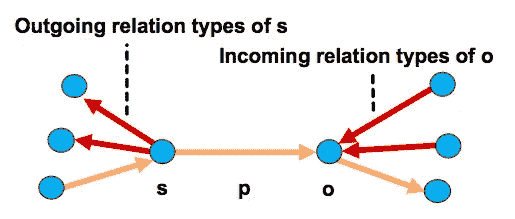
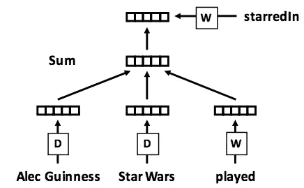
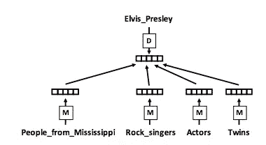

# 自然语言处理中从上下文到实体类型的嵌入

> 原文：<https://pub.towardsai.net/from-conte-to-entity-type-embeddings-in-natural-language-processing-19e53db90dd5?source=collection_archive---------0----------------------->

在 [Unsplash](https://unsplash.com?utm_source=medium&utm_medium=referral) 上由 [twinsfisch](https://unsplash.com/@twinsfisch?utm_source=medium&utm_medium=referral) 拍摄的照片

在之前的[故事](https://medium.com/towards-artificial-intelligence/a-gentle-introduction-to-graph-embeddings-c7b3d1db0fa8)中，TransE (Border et al .，2013)使用了一种翻译机制将主语(s)由谓语(p)转换成宾语(o)。就像 word2vec 一样，我们可以通过使用“King”+“Man”嵌入来计算“Queen”。

Word2vec 示例:国王+女人~=女王([来源](https://cfss.uchicago.edu/slides/text-analysis-fundamentals-and-sentiment-analysis/#1))

Moon 等人(2017)考虑上下文关系来解决图形完成。作者不仅考虑三元组(s，p，o ),而且考虑输出关系类型(从 s)和输入关系类型(到 o)。

三元组(s，p，o)的上下文关系。(Moon 等人，2017 年)

当两个实体(“亚历克斯·吉尼斯”和“星球大战”)与“已播放”和“主演”有关系时“Alex Guinness”、“played”和“Star Wars”的组合向量应该类似于“starredIn”的向量。

学习实体和关系类型向量的框架(Moon 等人，2017 年)

# ETE

基于 ContE (Moon 等人，2017)，Moon 等人提出了实体类型嵌入(ETE)来学习实体嵌入和实体类型嵌入。假设实体嵌入应该围绕相应的实体类型。例如，香蕉的嵌入(实体)应该类似于水果的嵌入(实体类型)。

在训练 ETE 模型之前，每个实体都应该接受 ContE 的训练(Moon et al. 2017)。换句话说，我们已经有了所有的实体嵌入。在 ETE (Moon 等人，2017)中训练三元组(实体、谓词、实体类型)时，只有实体类型嵌入将被更新，而实体嵌入和关系嵌入将被冻结。

给定由康特康特(Moon 等人，2017)训练的实体嵌入(例如，猫王)，E2E (Moon 等人，2017)优化对应的正面实体类型嵌入(例如，来自密西西比州的人、摇滚歌手、演员、双胞胎)，以单独最大化相似性值。

实体类型向量学习框架(Moon 等人，2017)

# 拿走

从我的角度来看，ETE (Moon 等人，2017)的概念类似于 [word2vec](https://towardsdatascience.com/3-silver-bullets-of-word-embedding-in-nlp-10fa8f50cc5a) (Mikolo 等人，2013)除了邻居来自图而不是句子。

# 延伸阅读

*   [上下文和 ETE 知识库](https://github.com/cmoon2/knowledge_graph)

# 关于我

我是湾区的数据科学家。专注于数据科学、人工智能，尤其是 NLP 和平台相关领域的最新发展。你可以通过[媒体博客](https://medium.com/@makcedward/)、 [LinkedIn](https://www.linkedin.com/in/edwardma1026) 或 [Github](https://github.com/makcedward) 联系我。

# 参考

*   C.Moon、S. Harenberg、J. Slankas 和 N. F. Samatova。[学习用于知识图完成的上下文嵌入](http://repository.ittelkom-pwt.ac.id/4358/1/Learning%20Contextual%20Embeddings%20for%20Knowledge%20Graph%20Completion.pdf)。2017
*   C.穆恩、p .琼斯和 N. F .萨马托瓦。[学习用于知识图完成的实体类型嵌入](https://persagen.com/files/misc/Moon2017Learning.pdf)。2017