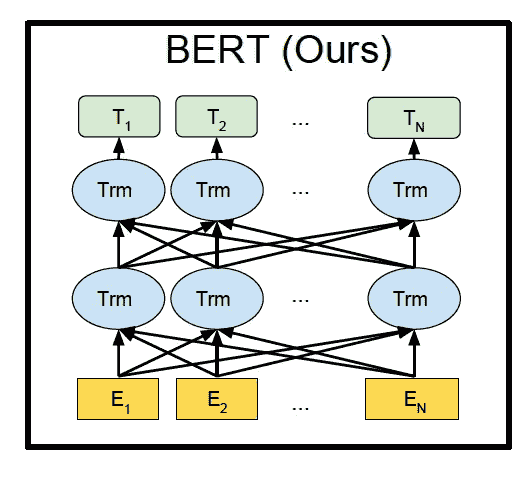
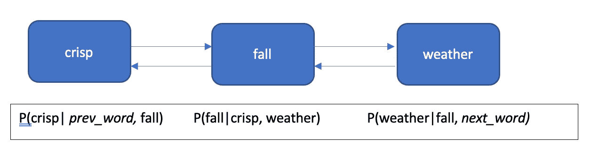
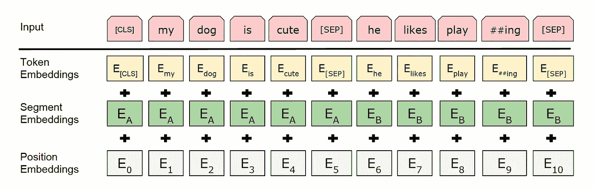

# 从不可能到不可替代:自然语言处理中的伯特

> 原文：<https://pub.towardsai.net/from-impossible-to-irreplaceable-bert-in-nlp-d0dd39dfef9f?source=collection_archive---------3----------------------->

## [自然语言处理](https://towardsai.net/p/category/nlp)

伯特是来自变压器的 T2、T4、编码器的代表

图片来自著名的电视连续剧《新民主主义者联盟》

# 介绍

**NLP 中的难点:**在 NLP 领域中，为了训练一个 ML 模型，我们需要一个与所研究问题的上下文相关的适当数据集。但是通常很难获得这种特定领域的数据，甚至发现执行标注是一项相当繁重的任务。

**解决方案:**为了解决这种情况，研究人员创建了一个通用模型，该模型在互联网上找到的大量未标注的原始文本上进行训练，其中包括广阔领域的上下文。

BERT 就是这样一种解决方案，它可以针对任何 NLP 相关的上下文预测进行微调。

# 伯特开始发挥作用了。

有多种算法试图找到 NLP 问题的解决方案。那么，伯特适合在哪里，它比其他人好在哪里？

让我们更进一步去发现

> BERT 是一个预先训练好的双向模型，它是根据来自网络的大量数据——原始论文——进行训练的

传统上，NLP 领域是从像 word2vec 这样的上下文无关模型发展而来的，word 2 vec 将每个单词转换为相应的数字表示，因为机器学习模型只能接受一组数字作为输入。使用这种方法，一个单词独立于句子中的其他单词，完全忽略了潜在的含义，导致准确性降低。

这就是伯特出手相救的地方。BERT 是一个基于上下文的双向模型，它从左到右以及从右到左理解单词的当前含义。

图片来自原纸— [链接](https://arxiv.org/pdf/1810.04805.pdf)

在这里，来自每个单词的信息传递到其他每个单词，使它成为双向的，并利用单词前后的上下文。

# 伯特是什么做的？

## 构建模块—变压器

BERT 属于基于变压器的模型。变压器**模型**使用 ***自关注机制*** 进行学习，该自关注机制具有恒定的步数(此时聚光灯下要学习的单词或字符的数量)，并且它直接对序列中所有单词的关系进行建模，而不考虑其位置。与*传统的 RNN、*模型顺序学习上下文相比，这种从所有单词并行学习的类型是一个巨大的优势。

变形金刚也利用**注意机制**。在这里，转换器将每个单词与其他每个单词进行比较，并生成一个注意力分数。这个 ***注意力得分*** 表示一个单词对于预测下一个单词/字符有多重要。然后，这个注意力得分被用作所有单词的加权平均值，并被输入到完全连接的网络中。

本质上，转换器具有读取输入并生成上述注意力分数的编码器和解码器，解码器使用来自编码器的结果来逐字预测。

**变压器工作:**

*   转换器为每个单词创建初始嵌入/表示(将字符串转换为数字)。
*   使用自我关注，它从所有单词中获得信息，并为每个单词创建新的嵌入，它具有所有的上下文。
*   上述步骤并行执行多次，并创建一个新的表示。
*   解码器一次创建一个单词。
*   解码器还试图基于来自编码器输出的信息以及先前预测的字来创建新的嵌入。

《变形金刚》中的编码器和解码器(图片由作者提供)

因为 BERT 的目标是只生成语言模型，所以它只利用了 Transformers 中的编码器概念。

# 伯特是如何工作的？

许多最初的语言模型都是单向的。单向模型的一个主要缺点是，如果一个句子太长而记不住，它往往会忘记上下文。双向概念似乎是解决上述问题的一个可行方案。但是，既然单向失败了，双向是很自然的，为什么以前没有实现呢？

## 双向学习:

在一个标准模型中，下一个单词的预测是通过用当前单词进行调节来进行的。所以既可以从左到右训练，也可以从右到左训练。

在双向的情况下，一个字必须以前一个字和下一个字为条件。这可能会导致“看到自己”的现象，在预测之前，模型实际上可能会看到一个单词(要预测的)。这真的没有帮助，因为有严重的[偏差](https://en.wikipedia.org/wiki/Bias–variance_tradeoff)。

***例如:*** *我喜欢凉爽、秋高气爽的天气*

顺序词的双向条件作用示例(图片由作者提供)

例如，在我们的单词预测引擎中，我们假设 *fall* 是正在研究的单词。但是如果是条件双向的，单词 *fall* 肯定已经可以用于前一个单词 *crisp* 。这使得模型直接预测单词，因此什么也没学到。

## 伯特的策略是:

为了防止上述情况，BERT 通过屏蔽(隐藏)一些随机单词(记号)来利用双向技术，并且该模型试图预测那些被屏蔽的单词。这种方法叫做**掩蔽学习模式，**也就是俗称的完形填空任务。

# 建筑深潜

## 预培训架构类型概述

增加 BERT 受欢迎程度的重要一点是，它是一个预先训练好的模型，可以直接用于解决上下文相关或非上下文相关的问题。基本上，有两种类型的预训练架构:

1.  *基于特征:*这里，预先训练的表示(嵌入)只是作为附加特征使用。因此，基础架构将是特定于任务的，并且计算要求很高。
2.  *微调:*这里不介绍特定于任务的架构。直接使用预先训练的表示，但是必须基于任务替角进行微调(用标签训练)。

BERT 属于*微调*方法，它使用更少的架构，导致更少的资源需求

## 伯特框架

对于任何任务，有两个步骤来实现 BERT。

*   预训练阶段:这是用大量**未标记的**数据训练模型(注意力模型)的阶段
*   微调阶段:这里用预先训练的参数初始化 BERT 模型，但是通过使用来自所研究的特定问题的标记为的**数据对它们进行微调。**

## 培训前阶段:

对于任何要执行的模型，都需要有一个预测目标。通常的模型倾向于以预测下一个单词为目标，但是在双向方法中，目标是用两种策略设定的。两种策略都在无监督方法上训练数据。

**掩蔽学习模型:**

在这种技术中，随机输入标记被屏蔽(标记被替换为**【MASK】**)，模型被训练来预测这些具有周围单词的屏蔽标记。

在模型被训练之后，来自转换器的屏蔽令牌的最终隐藏向量与单词嵌入相乘，以获得 logitss(模型的非归一化预测)，该 logit 随后被发送到 softmax 层，以获得归一化的概率分布。

由于在模型的实时实现中(*微调阶段* ) **【掩码】**)参数基本上不会出现在输入中(由于所研究的问题可能不同)，BERT 通过考虑以下因素来处理训练:

训练生成器屏蔽随机选择的标记位置的 15%,其中:

*   **80%** 的时候:用【面具】代替了这个词
*   **10%** 的时间:用一个随机单词替换这个单词
*   **10%** 的时间:保持字不变。这是为了使最终的表现偏向实际的语言观察

## 下一句预测

这种技术有助于理解句子关系，因为许多语言模型不能直接捕捉这种技术。句子关系无非是给定的句子是否是前一句的后继。

下一个句子预测任务只不过是二进制分类问题，其中 50%的时间，对于两个句子 A 和 B: B 是实际的后继者或 A(标记为 IsNext)，另 50%的时间 B 是随机选择的(标记为 NotNext)。

## 伯特嵌入

嵌入是一种用于将给定的原始文本转换成有意义的格式(通常是数字形式的文字表示)的技术，模型能够理解这种格式，同时能够基于这种格式提供准确的预测。

BERT 有 3 级嵌入，如下图所示

BERT 输入嵌入(来自原始文件的图像— [链接](https://arxiv.org/abs/1810.04805)

**输入:***指定分类标签，提到给定的句子是否遵循前一句的上下文。SEP 标记插在每个句子的末尾*

***Token 嵌入:**NLP 中的任何一个句子都被分割成单词称为 Token。然后，每个标记被转换成向量表示。这是将给定字符串转换成数字的部分，以便模型可以更好地理解它。创建的矢量表示具有固定的维数。*

***片段嵌入:**这个嵌入描述了记号属于哪个句子。例如，如果有两个由*【SEP】*标记分隔的句子，那么一个学习嵌入 *Ea* 被连接到属于 A 的句子的标记，并且 *Eb* 被连接到属于 b 的句子的标记。因此有两个可能的片段嵌入*

***位置嵌入:**该嵌入是序列中每个位置的学习向量表示。由于变压器不像 RNN 那样具有固有的时序性，因此应该可以获得一些时序方面的信息。因此，句子中的每个标记都有自己经过训练的嵌入，因此模型了解它的位置。*

## *微调阶段:*

*微调 BERT 无非是使用预先训练好的架构来解决给定的下游问题。对于每个任务，特定于任务的输入和输出被插入，因此它学习带有适当标签的结果。*

*在预训练中类似于句子 A & B 的输入可以是 1)问题回答中的问题段落对，2)释义中的句子对，3)文本分类中的退化文本对。在输出端，得到的表征表示被发送到输出层用于表征级预测任务，并且 *CLS* 表示被馈送到输出层用于分类任务，如情感分析。*

# *外卖食品*

*当双向学习的想法第一次被提出时，它被高度认为是实际上不可能的。然而，在可行的策略下，BERT 模型整体上是自然语言处理领域的突破性创新。*

*尽管这个模型已经由 GoogleAI 发布了 2 年，但它仍然是许多日常应用的支柱，包括*谷歌搜索、谷歌翻译、Gmail 文本建议。**

# *参考*

*📙[伯特:用于语言理解的深度双向转换器的预训练](https://ai.googleblog.com/2018/11/open-sourcing-bert-state-of-art-pre.html)*

*📙 [Transformer:一种用于语言理解的新型神经网络架构](http://ai.googleblog.com/2017/08/transformer-novel-neural-network.html)*