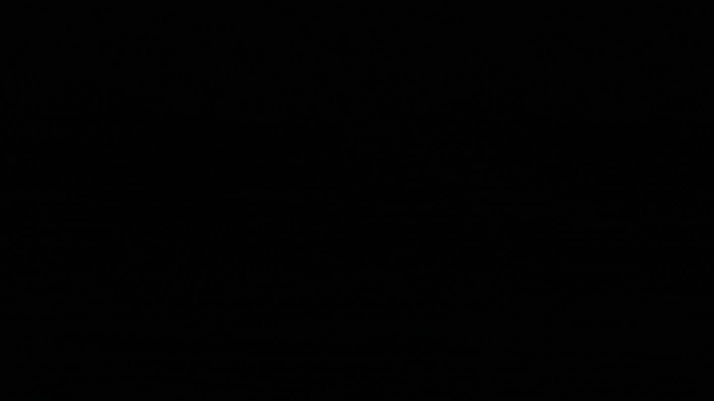
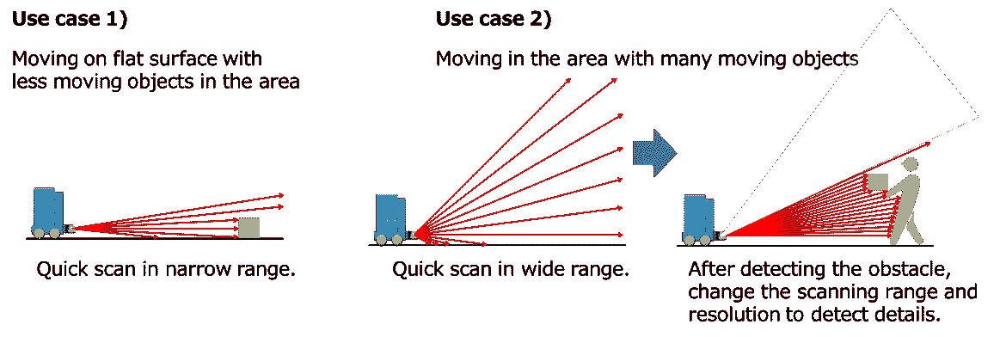
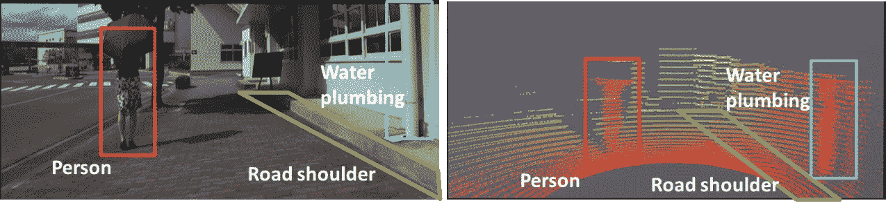
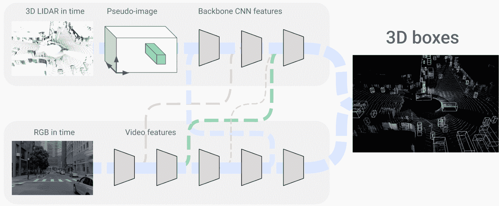
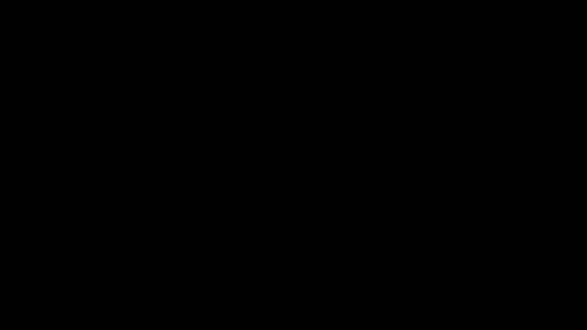
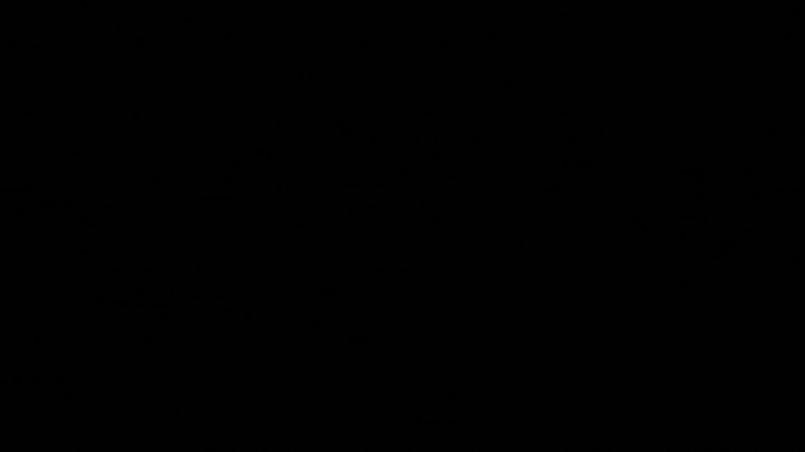
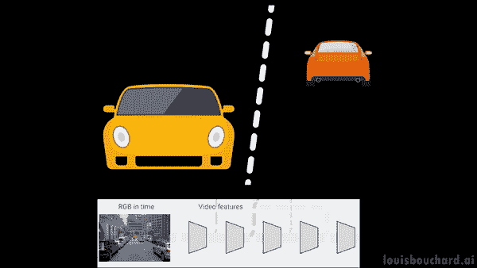
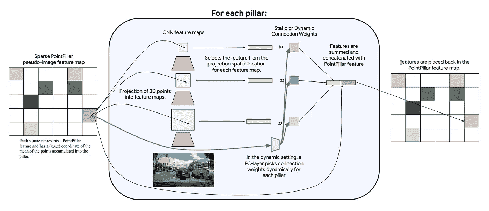

# 从激光雷达到 3D 渲染——Waymo 和谷歌研究

> 原文：<https://pub.towardsai.net/from-lidar-to-3d-renders-waymo-and-google-research-cc72a7a2383d?source=collection_archive---------2----------------------->

## 结合激光雷达和常规相机进行 3D 物体探测！

> 最初发表于 [louisbouchard.ai](https://www.louisbouchard.ai/waymo-lidar/) ，前两天在[我的博客](https://www.louisbouchard.ai/waymo-lidar/)上读到的！

## 观看视频

自动驾驶汽车怎么看？

自动驾驶汽车。图片由作者提供。

你可能听说过他们使用的[激光雷达传感器](https://en.wikipedia.org/wiki/Lidar)或其他奇怪的相机。但是他们是如何工作的，他们是如何看待这个世界的，与我们相比，他们到底看到了什么？如果我们想让它们上路，理解它们是如何工作的是至关重要的，主要是如果你在政府部门工作或建立下一个法规。也是这些服务的客户。

我们之前报道过[特斯拉 autopilot 如何看待和工作](/tesla-ai-day-in-10-minute-show-does-teslas-autopilot-work-3990252082dc)，但它们与传统的自动驾驶汽车不同。特斯拉只使用摄像头来了解世界，而大多数像 [Waymo](https://blog.waymo.com/2020/03/introducing-5th-generation-waymo-driver.html) 一样，使用普通摄像头和 3D 激光雷达传感器。这些激光雷达传感器非常容易理解:它们不会像普通相机那样产生图像，而是 3D 点云。激光雷达相机测量物体之间的距离，计算脉冲激光投射到物体上的传播时间。

“激光雷达传感器支持距离的 3D 检测”，[电子说明符](https://www.electronicspecifier.com/products/sensors/lidar-sensor-enables-3d-detection-of-distances)

这样，它们将产生非常少的具有有价值的精确距离信息的数据点，正如您在这里看到的。这些数据点被称为点云，这意味着我们将看到的只是许多位于正确位置的点，创建了某种三维世界模型。

“激光雷达传感器支持距离的 3D 检测”，[电子说明符](https://www.electronicspecifier.com/products/sensors/lidar-sensor-enables-3d-detection-of-distances)

在这里，您可以看到右侧的激光雷达并没有精确到可以理解它所看到的东西，但它可以很好地用很少的信息来理解深度，这对于高效地实时计算数据来说是完美的。自动驾驶汽车的基本标准。

这种最小量的数据和高空间精度是完美的，因为结合 RGB 图像，如左图所示，我们既有精确的距离信息，也有单独使用激光雷达数据时缺少的精确的对象信息，特别是来自远处对象或人的信息。这就是为什么 Waymo 和其他自动驾驶汽车公司使用这两种传感器来了解世界。

然而，我们如何有效地组合这些信息并让车辆理解它呢？这辆车最后看到了什么？只有到处分？在我们的道路上行驶足够了吗？我们将通过 Waymo 和 Google Research 的一篇新研究论文对此进行研究[1]。

我想我无法用他们在文章中使用的句子来更好地概括这篇论文；

> “我们提出了 4D 网络，它学习如何及时结合 3D 点云和 RGB 相机图像，以实现 3D 对象检测在自动驾驶中的广泛应用。”[1]

我希望你喜欢这篇文章。请让我知道你是否喜欢这本书……我只是在开玩笑！让我们更深入地研究一下这个句子。

我们合并激光雷达和 RGB 帧的 4D 网络架构。图片来自论文[1]。

这就是我们说的 3D 物体检测的样子。这也是这辆车最终会看到的。它非常精确地再现了车辆周围的世界，所有物体都清晰可见。

那看起来有多酷？而且更有意思的是，他们是怎么得出这个结果的？

他们使用激光雷达数据(称为时间点云(PCiT ))和常规相机(这里称为 RGB 视频)制作了这一视图。这两者都是 4 维输入，就像我们人类看待和理解世界一样。四维来自及时拍摄的视频，因此车辆可以访问过去的帧，以帮助理解上下文和对象，像我们一样猜测未来的行为，从而创建第四维。另外三个是我们熟悉的 3D 空间。

场景理解。图片由作者提供。

我们称之为任务场景理解，它已经在计算机视觉中得到广泛研究，并随着该领域和机器学习算法的最新进展而取得了许多进展。这在自动驾驶汽车中也至关重要，因为我们希望对场景有近乎完美的理解。

如果我们回到上面看到的网络，你可以看到两个网络总是用连接互相“对话”。这主要是因为当我们拍摄图像时，我们在镜头中有不同范围和不同比例的对象。

不同比例的汽车。图片由作者提供。

前面的车看起来会比远处的车大很多，但还是要两者兼顾。就像我们一样，当我们看到远处的人，觉得他是我们的朋友，但等待靠近以确定后再喊他的名字，汽车会缺乏如此遥远物体的细节。

图片由作者提供。

为了弥补这一点，我们将从网络的不同层面提取和共享信息。在整个网络中共享信息是一个强大的解决方案，因为神经网络使用固定大小的小型检测器来压缩图像，我们越深入网络。

早期和深层卷积神经网络中的滤波器示例。图片由作者提供。

这意味着早期的层将能够检测小物体，并且只能检测较大物体的边缘或部分。更深的层将丢失小的物体，但是能够非常精确地检测大的物体。

这种方法的主要挑战是通过这些连接将这两种截然不同的信息结合起来；激光雷达 3D 空间数据和更多常规 RGB 帧。如前所述，在所有网络步骤中使用这两种信息有助于更好地理解整个场景。

但是，我们如何合并两个不同的信息流，并有效地使用时间维度呢？这两个分支之间的数据转换是网络在训练期间以监督的方式学习的，其过程类似于我在[以前的文章](/will-transformers-replace-cnns-in-computer-vision-55657a196833)中介绍的自我关注机制，通过尝试重新创建世界的真实模型。但是为了促进这种数据转换，他们使用了一种称为 PointPillars 的模型，该模型采用点云并给出二维表示。

点柱。图片来自论文[1]。

你可以看到这是点云的伪图像，正如他们所说的，创建了一个代表点云的常规图像，具有与其他分支中的 RGB 图像相同的属性。像素不是红-绿-蓝颜色，而是简单地表示物体的深度和位置(x，y，z)坐标。这个伪图像也非常稀疏，这意味着这个表示上的信息只在重要对象周围密集，并且最有可能对模型有用。关于时间，我们只需要输入图像中的第四维来跟踪帧。

我们合并激光雷达和 RGB 帧的 4D 网络架构。图片来自论文[1]。

我们看到的这两个分支是卷积神经网络，它们对图像进行编码，正如我在[的多篇文章](/how-ai-generates-new-images-gans-put-simply-674e413bc22a)中所描述的那样，然后对这些编码信息进行解码，以重建我们这里的 3D 表示。因此，它对两个分支使用非常相似的编码器，彼此共享信息，并使用解码器重建世界的 3D 模型。

瞧！这就是 Waymo 车辆如何看待我们的世界，通过这些我们在上面图像右侧看到的世界的 3D 模型。它可以在 164 毫秒内处理 32 个时间点云和 16 个 RGB 帧，产生比其他方法更好的结果。这可能没有任何意义，所以我们可以将其与下一个最好的方法进行比较，后者不太准确，需要 300 毫秒，几乎是处理时间的两倍。

当然，这是谷歌研究和 Waymo 的这篇新论文的概述。我建议阅读下面链接的论文，以了解更多关于他们模型的架构和其他我没有深入研究的功能，如时间信息的效率问题。

我希望你喜欢这篇文章，如果你喜欢，请考虑订阅[频道](https://youtu.be/0nJMnw1Ldks)来支持我在 YouTube 上的工作，并评论你对这篇摘要的看法。我很想看看你的想法！

感谢您的阅读，下周我将带着另一篇精彩的论文与您见面！

## 参考

*   视频:
*   Piergiovanni，A.J .，Casser，v .，Ryoo，M.S .和 Angelova，a .，2021。 [4d-net 用于学习多模态比对](https://openaccess.thecvf.com/content/ICCV2021/papers/Piergiovanni_4D-Net_for_Learned_Multi-Modal_Alignment_ICCV_2021_paper.pdf)。IEEE/CVF 国际计算机视觉会议论文集(第 15435-15445 页)。
*   谷歌研究的博文:[https://ai . Google blog . com/2022/02/4d-net-learning-multi-modal-alignment . html？m=1](https://ai.googleblog.com/2022/02/4d-net-learning-multi-modal-alignment.html?m=1)