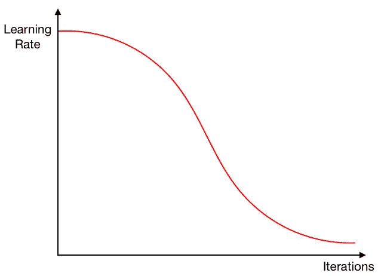
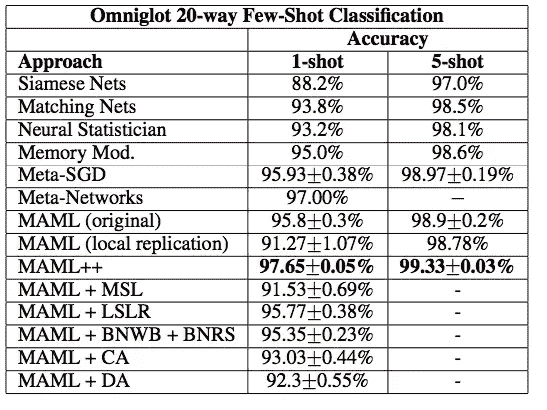
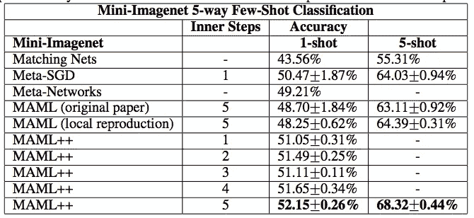

# 从 MAML 到 MAML++

> 原文：<https://pub.towardsai.net/from-maml-to-maml-20de07203d59?source=collection_archive---------0----------------------->

## 学会学习

[马志威](https://unsplash.com/@makcedward?utm_source=medium&utm_medium=referral)在 [Unsplash](https://unsplash.com/?utm_source=medium&utm_medium=referral) 上拍照

想象一下，你只看到狗几次，人类就能够识别一个新的概念或想法，并在以后识别狗。元学习受到这一思想的启发，而模型不可知的元学习，又名 MAML (Finn et al. 2017)，是元学习研究的突破之一。

如果你不熟悉元学习或 MAML (Finn et al. 2017)，你可以查看元学习故事中的[元学习介绍](https://medium.com/towards-artificial-intelligence/a-gentle-introduction-to-meta-learning-8e36f3d93f61)和[无监督学习。简而言之，元学习旨在克服缺乏训练问题和处理预测时间中看不见的标签。MAML (Finn et al. 2017)的目标是学习一个模型，如果模型经过预先训练，它可以在新任务上取得快速进展。](https://medium.com/dataseries/unsupervised-learning-in-meta-learning-f71c549e2ae2)

尽管 MAML (Finn 等人，2017 年)取得了良好的效果，但它也存在一些缺点。训练时间长是弊端之一。与一般的神经网络模型不同，MAML (Finn 等人，2017 年)包括两个梯度计算。两年后，研究人员重新审视了这种方法，并在原有方法的基础上提出了一些改进。

我们涵盖了 MAML++ (Antonio 等人，2018)，这是 MAML 的改进版本。首先，我们通过 MAML 的问题或局限性。之后，我们将讨论 MAML++如何解决上述问题。

# MAML++

虽然 MAML 是一个简单而强大的框架，但它有一些局限性，而 MAML++就是为了克服这些局限性而开发的。

## 训练不稳定性:

通过设计，参数在训练中被多次更新。由于缺少跳跃连接层，每个梯度都需要通过所有网络。它引入了梯度爆炸和梯度递减问题。

提出了多步损耗优化(MSL)来计算每一步后的加权损耗和，而不是内环的最后一步。加权方法确保模型参与后面的步骤而不是前面的步骤。

## 二阶导数成本

MAML 使用一阶导数而不是二阶导数来计算梯度。它节省了大量的计算成本，但牺牲了泛化性能。

为了平衡计算成本和性能，提出了导数阶退火算法。简单来说，MAML++在前 50 个历元使用一阶渐变，切换到二阶渐变。

## 缺少批量标准化统计累积

MAML 使用当前批次统计数据来执行批次标准化。但是，使用累积统计数据将覆盖全局平均值和标准差，而不是局部。

提出了逐步批量归一化运行统计(BNRS)。不是使用当前批次统计数据来执行批次归一化，而是为每个批次归一化图层引入运行批次均值和标准差。它是逐步更新的，而不是对所有步骤都使用静态值。

## 共享(跨步骤)批次标准化偏差

所有批次标准化偏差不会在同一个内循环中更新。假设所有基本模型在整个内循环更新中是相同的，并且具有相同的特征分布。

提出了分步批量归一化权重和偏差(BNWB)。简单地说，偏见是在内循环的每一步中习得的。

## 共享内循环(跨步骤和跨参数)学习率

与上述问题相同，学习率在同一个内循环中共享。为了找到更好的结果，它需要更多的计算成本。

提出了学习每层每步的学习速率和梯度方向(LSLR)。根据自我解释，它学习网络和基础网络中每一层的学习速率和方向。

## 固定外环学习速率

从最新的研究来看，使用动态学习率可以提高泛化性能。

提出了元优化器学习速率的余弦退火算法。与静态学习速率相比，退火方法不是使用静态外环学习速率，而是产生更高性能的已被证明的方法。余弦退火是一种根据步长改变学习方式的方法。

余弦退火(从[介质](https://towardsdatascience.com/https-medium-com-reina-wang-tw-stochastic-gradient-descent-with-restarts-5f511975163)

# 实验

Omniglot 数据集性能比较(安托尼乌等人，2018 年)

迷你图像网络数据集性能比较(安托尼乌等人，2018 年)

# 延伸阅读

*   [元学习简介](https://medium.com/towards-artificial-intelligence/a-gentle-introduction-to-meta-learning-8e36f3d93f61)
*   [元学习中的无监督学习](https://medium.com/dataseries/unsupervised-learning-in-meta-learning-f71c549e2ae2)

# 关于我

我是湾区的数据科学家。专注于数据科学、人工智能，尤其是 NLP 和平台相关领域的最新发展。你可以通过[媒体博客](https://medium.com/@makcedward/)、 [LinkedIn](https://www.linkedin.com/in/edwardma1026) 或 [Github](https://github.com/makcedward) 联系我。

# 参考

*   C.芬恩、p .阿贝耳和 s .莱文。[用于深度网络快速适应的模型不可知元学习](https://arxiv.org/pdf/1703.03400.pdf)。2017
*   A.安托尼乌，爱德华和斯托基。[如何训练你的 MAML](https://arxiv.org/pdf/1810.09502.pdf) 。2018.