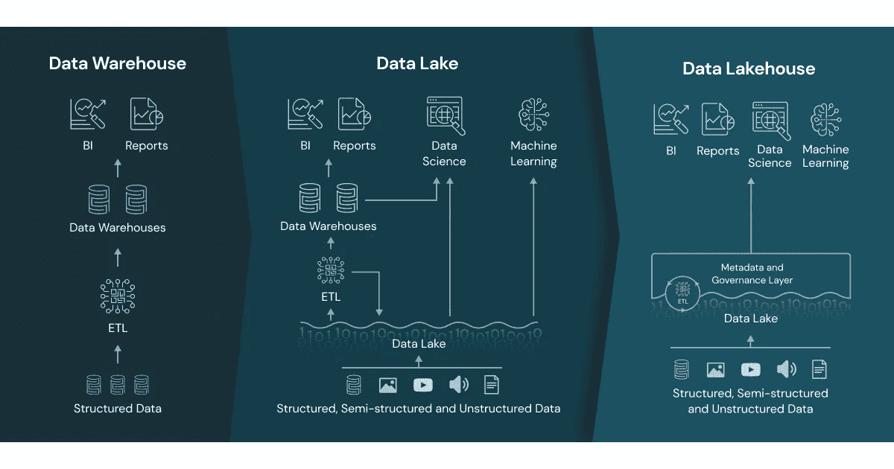

# 从 OLTP 到数据湖库

> 原文：<https://pub.towardsai.net/from-oltp-to-data-lakehouse-449b725d8b6f?source=collection_archive---------0----------------------->

## 用几段话对数据生态系统进行简单概述

照片由 Natan Dumlao 在 Unsplash 上拍摄

数据生态系统在过去几年中呈指数级增长，新兴技术和越来越多的供应商炒作为新来者铺平了道路。这篇文章是我的一个简单的尝试，用几个简短的段落解释从 OLTP 到 Data Lakehouse 的起源和路径。

耐心听我说，希望五分钟后，旅程会变得清晰。

从上到下的方法，我们一般可以认为数据库有两大类: **SQL** 和 **NoSQL** 。简单地说，前者是关系数据库，而后者是非关系数据库。前者是基于**表格的**，而后者可以有**多个存储选项**(键、文档、图形和宽列)。前者在很大程度上依赖于**多行事务**的概念(您可以将事务视为一组任务，要么整体成功，要么整体失败)，后者更适合于**非结构化数据**(尽管最近，这一界限变得越来越模糊)。

关系数据库管理系统( **RDBMS** )实现了 **ACID** 合规性，其中包括管理基于 **SQL 的**数据库的**事务**。 **NoSQL** 数据库反过来遵守**基地**合规( [*我就这个话题写了一篇长文*](/exploring-the-nosql-family-49e9f23313ad) )。

大多数后端系统依赖于在线事务处理( **OLTP** )，处理多个**事务**，记录读取、写入、更新和删除( **CRUD** 操作)，通常情况下，**不会保存历史数据**。然而，对于数据团队来说，每一项更改都很重要，因此，我们需要能够处理大量记录的系统，这些记录保存了运营数据库中发生的每一项与业务相关的更改！但是现在需要高效地存储和查询这些大量的数据。为此， **RDBMS** 已经被**扩展**以支持对**大量历史数据**的复杂查询，这些数据是从 OLTP 数据库和其他来源汇总的，从而导致在线分析处理( **OLAP** )。通常，这些庞大的数据是以数据仓库的形式存储的，这种数据结构是为分析而优化的，通常达到 Pb 级。

虽然 **OLAP** 适用于多种情况，像所有 RDBMS 一样，但是它们是**垂直**可伸缩的(注意:分布式 SQL 确实解决了这一点，但是，目前它的受欢迎程度很低)。 **NoSQL** 反过来又是**横向**可扩展的意思，**随着数据的增长降低数据存储成本，**这是一个非常令人向往但长期以来无法实现的特性，自从 NoSQL 缺少 ACID compliance 以来，这一特性非常有用。如果我们能够**将****RDBMS ACID compliance**、 **OLAP 的**、**海量历史数据分析**能力与**no SQL**、**水平可伸缩性**结合起来，会怎么样？这就是**数据仓库**的亮点。

[数据仓库、数据湖和数据湖库，由 Databricks 提供图像](https://databricks.com/blog/2020/01/30/what-is-a-data-lakehouse.html)

**数据湖库**利用**数据湖**的概念，数据湖是以低成本支持大量结构化和非结构化数据的文件系统；**数据仓库**；以及**解耦处理**。换句话说，**数据湖库不像 RDBMS 那样需要**你有一个**服务器持续在线**，并使用**数据湖**进行存储。为什么这很重要？

*   如果您的数据不需要每秒都被访问，那么您可以**节省让服务器持续在线的成本，**以检索数据的延迟为代价
*   事实上，由于**处理独立于存储**，您实际上可以使用**更强大的集群**来处理您的数据，这些集群只在工作负载持续期间运行，并且您只需为此付费。也就是说，你可以花很少的钱买到更多的果汁。此外，您甚至可以配置每个工作负载的服务器特性，进一步优化您的成本
*   **RDBMS** 增长**昂贵**依靠昂贵的耦合硬件。但是一个**数据湖库** **依赖于文件**，通过一些魔法，在其上有一个 ACID 合规层，以及一些其他漂亮的优化和特性(参见 [*Delta.io*](https://delta.io/) )。众所周知，文件**存储很便宜**，*尤其是当您可以围绕文件使用频率优化成本时(不常用的文件访问层明显更便宜)*
*   利用上述优势，您可以直接在 **Delta** 中**构建**您的**数据仓库**
*   **Delta** 包含一组**非常强大的特性**，极大地方便了数据工程师的工作:ACID 事务、可伸缩元数据、时间旅行、统一批处理/流、模式演化&实施、审计操作、DML 操作等。所有这些，在一个开源项目中如此，**没有厂商锁定**
*   您可以**以多种格式和监管级别保存数据**、**服务于多种用例**:从数据分析/BI 到数据科学/ML

没有缺点吗？像所有技术一样，没有一种技术是完美的，必须根据环境和要求选择技术。**湖畔小屋**没有什么不同，它们也有自己的一套**缺点**:

*   **技术**是相当**新的** (Delta Lake 1.0 在 2021 年 5 月通过了社区认证)意思是，一些特性可能会变异，一些非常需要的特性可能会暂时丢失
*   该技术**与传统的 RDBMS**非常不同，特别是在**优化**方面，因此风险更大，可能更难找到有经验的专业人员
*   它们很难优化，依赖于几种不同的技术，其中一些必须从项目开始就实现(Bloom Filters)
*   像所有新技术一样，**文档、示例和最佳实践都很稀缺**
*   最后，考虑一下**BI/报告层**很重要，因为**一些 BI 工具**(例如 Power BI)会对每个可视化进行**查询，因此，复杂的仪表板，尤其是那些用户经常与之交互的仪表板，**可能会导致高成本****

让我知道这篇文章是否有助于揭示生态系统——尽管是用简单的术语——或者如果你觉得有些东西不太准确！