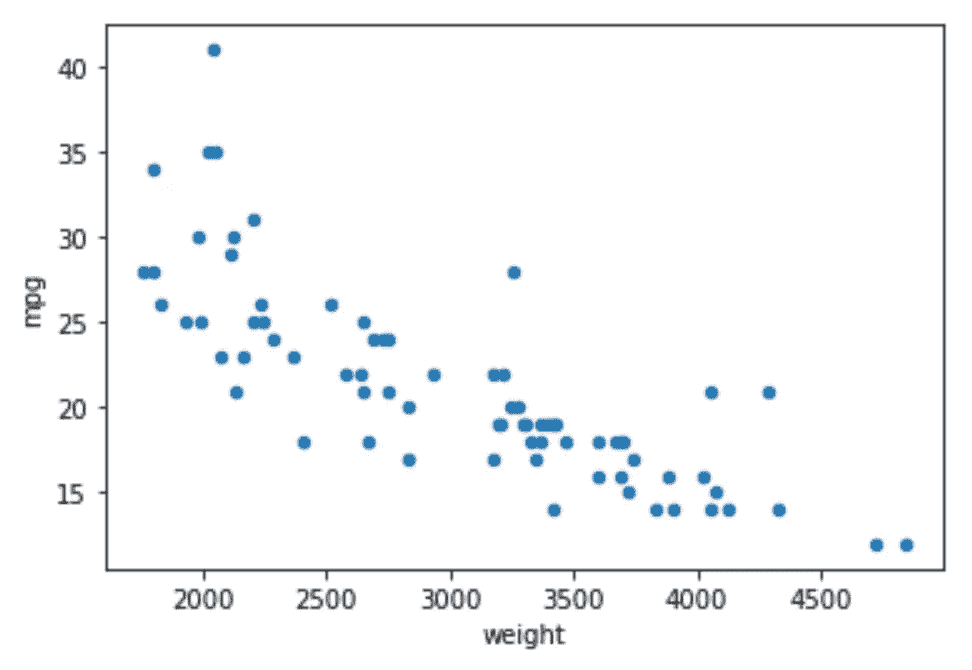
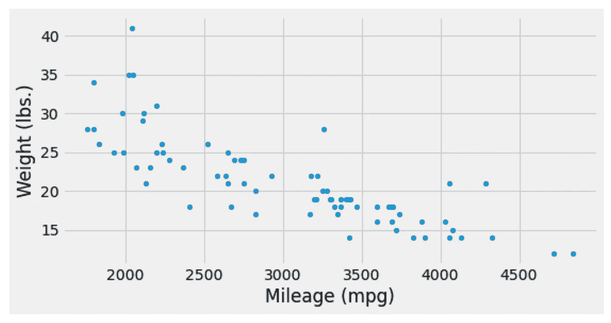
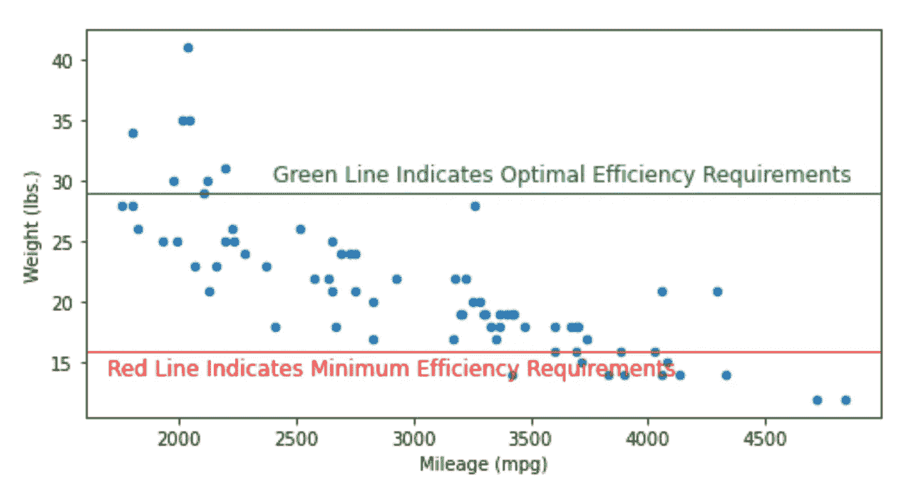
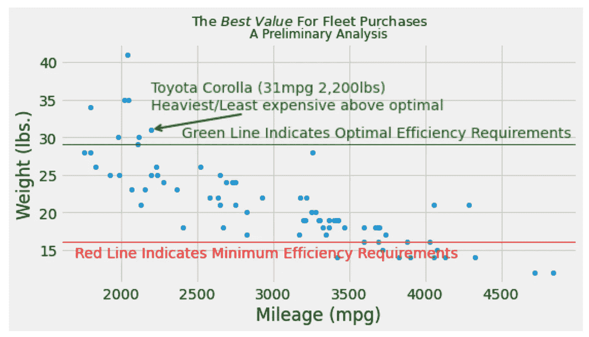

# 从散点图到故事:基础 Matplotlib 版

> 原文：<https://pub.towardsai.net/from-scatter-plot-to-story-the-base-matplotlib-edition-21e499dad421?source=collection_archive---------3----------------------->

## 通过增强散点图讲述完整的故事

# 概观

散点图是许多分析师和数据专家的重要工具。它们说明了两个(或更多)变量之间的关系。它们很快就会生成。它们很容易解释。当准备正确时，许多数据(和所谓的非数据)人会很容易理解它们。

准备散点图时，您可以让单个图讲述一个完整的故事。做得好的话，这可能意味着你的观众会有所反应(在他们的脑海中):

> 我们知道现在该做什么…

这篇文章将展示如何将你的可视化从一个简单的散点图变成一个完整的故事。这是 Matplotlib 版本。另一篇文章将在 Seaborn 展示同样的内容。 [还有一个版本在 Stata](https://medium.com/geekculture/from-scatter-plot-to-story-stata-edition-2d4658c7dbb3) 中展示了这个过程。

# 背景

您的公司要求您帮助决定应该为其车队购买什么车辆。利用 Stata 提供的 1978 年汽车数据([，我之前写过关于](https://towardsdatascience.com/three-datasets-i-often-use-as-examples-c70ec5b2f793))，我们还将假设自己身处 20 世纪 70 年代。

我们的数据由 74 个观察值组成。每次观察都是针对一辆车，我们知道一系列重要的数据，包括品牌、价格、效率(mpg)和其他因素。

假设车队管理人员已经将 16 英里每加仑设定为最低车队车辆效率要求，将 29 英里每加仑设定为可选效率标准。我们的任务是找到在最佳效率标准之上最具成本效益且重量最大的车辆。

# 入门指南

许多读者可能会意识到，仅仅使用`pandas`的几行代码，在`matplotlib`的帮助下，就可以生成一个简单的散点图(很容易):

```
# Standard Import(s)
import pandas as pd
import matplotlib.pyplot as plt# Load Data
df = pd.read_stata('[http://www.stata-press.com/data/r15/auto2.dta'](http://www.stata-press.com/data/r15/auto2.dta'))# Creating a plot
df.plot('weight','mpg',kind='scatter')
```

对于结果…



作者的再现。使用此处指定的数据和代码。

在我们称这个情节为一个完整的、自成一体的故事之前，我们有几个(许多)调整。完整独立的故事是目标。

# 更新尺寸、标签和主题

我们能做的第一件事就是更新量表。对于大多数演示格式来说，宽高比通常更好(宽幻灯片，以及您在 pdf 报告上看到的半页左右的页面，等等)。方便的`figsize=()`选项更新图形尺寸。

下一次迭代还将添加更多有意义和明确的轴标题，如`xlabel`和`ylabel`。

为了探索改变到预定义主题的选项，考虑探索来自`plt.style.available`的输出。在决定了应用哪个主题后，我们将继续使用模仿 538 风格的流行主题，用`plt.style.use('fivethirtyeight')`来做。

```
# Standard Import(s)
import pandas as pd
import matplotlib.pyplot as plt# Load Data
df = pd.read_stata('[http://www.stata-press.com/data/r15/auto2.dta'](http://www.stata-press.com/data/r15/auto2.dta'))# Generate scatter with updated dimensions, labels, and theme
plt.style.use('fivethirtyeight')
df.plot('weight', 'mpg', 
        kind='scatter', 
        xlabel='Mileage (mpg)', 
        ylabel='Weight (lbs.)',
        figsize=(8,4))
```

对于结果…



作者的再现。使用此处指定的数据和代码。

# 添加参考线

这些参考线是我们阐述故事的关键方面。它们鲜艳的颜色让读者觉得很显眼，就好像在说“嘿，看着我！”在本例中，我们添加了带有`plt.axhline()`的参考线。一个附加的技术是使用`plt.txt()`用额外的有用信息来注释这些行。

```
# Code from above
df.plot('weight', 
        'mpg', 
        kind='scatter', 
        xlabel='Mileage (mpg)', 
        ylabel='Weight (lbs.)', 
        figsize=(8,5))# Adding reference lines
plt.axhline(29, color='green', linewidth=1)
plt.axhline(16, color='red', linewidth=1)# Creating annotations
plt.text(2400, 30,
         "Green Line Indicates Optimal Efficiency Requirements", 
         color='green', 
         fontsize=12)
plt.text(1700, 14,
         "Red Line Indicates Minimum Efficiency Requirements", 
         color='red', 
         fontsize=12)
```

对于结果(显示默认样式)…



作者的再现。使用此处指定的数据和代码。

# 注释特定的数据点

故事差不多完成了。但是，我们到底应该买哪辆车还不是很清楚。我们不确定哪些点代表哪辆车。让我们用注释来修正这个遗漏。

注释指出并解释具体的数据点。有时注释帮助读者理解另一个附加的上下文。例如，上面我们注释了参考线。下面我们将为丰田卡罗拉添加一个注释，用`plt.text()`添加文本，用`plt.annotate()`和`arrowprops=()`选项添加一个有用的箭头。

最后一个代码示例和最后一个视觉效果也添加了带有一些基本字体格式建议的标题。

```
# Code from above
plt.style.use('fivethirtyeight')df.plot('weight', 
        'mpg',
        kind='scatter', 
        xlabel='Mileage (mpg)', 
        ylabel='Weight (lbs.)', 
        figsize=(8,4))plt.axhline(29, color='green', linewidth=1)
plt.axhline(16, color='red', linewidth=1)
plt.text(2400, 30, 
         "Green Line Indicates Optimal Efficiency Requirements", 
         color='green', 
         fontsize=14)
plt.text(1700, 14, 
         "Red Line Indicates Minimum Efficiency Requirements", 
         color='red', 
         fontsize=11)# Adding an annotation with an arrow 'prop'
plt.text(2200, 36, 'Toyota Corolla (31mpg 2,200lbs)',
         color='green',
         fontsize=14)
plt.annotate('Heaviest/Least expensive above optimal',
             xy=(2200, 31), 
             xytext=(2200, 33.75), 
             color='green', 
             arrowprops={'arrowstyle':'->',
                         'linewidth':2,
                         'color':'green'})# Creating the title and the subtitle
plt.suptitle('The ${Best \ Value}$ For Fleet Purchases',fontsize=13)
plt.title('A Preliminary Analysis',fontsize=12)
```

为了最终的结果…



作者的再现。使用此处指定的数据和代码。

正如我在这篇文章的同伴中所写的(在 Seaborn 和 Stata 中演示了相同的散点图修改)，没有视觉是完美的。这里有改进的余地。

将这篇文章加入书签，作为快速参考和下一次数据可视化的灵感来源。

# 感谢阅读

你准备好了解更多关于数据科学职业的信息了吗？我进行一对一的职业辅导，并有一份每周电子邮件列表，帮助专业求职者获取数据。联系我了解更多信息。

感谢阅读。把你的想法和主意发给我。你可以写信只是为了说声嗨。如果你真的需要告诉我是怎么错的，我期待着尽快和你聊天。推特:[@ adamrossnelson](https://twitter.com/adamrossnelson)LinkedIn:[亚当罗斯尼尔森](https://www.linkedin.com/in/arnelson/)。