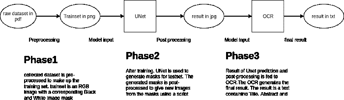
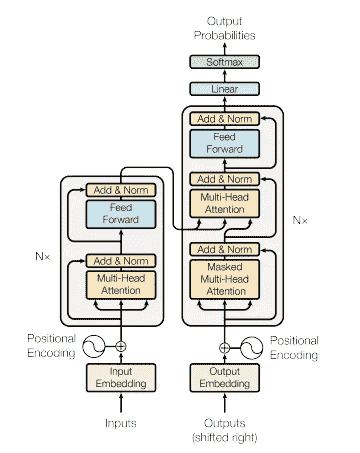
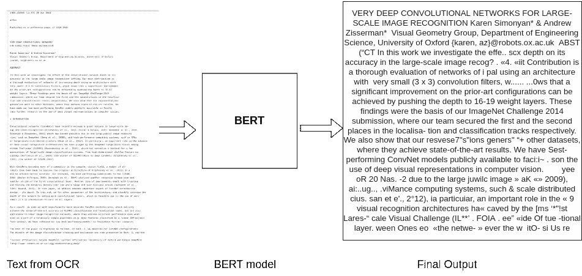

# 从 UNet 到 BERT:从科学论文中提取重要信息

> 原文：<https://pub.towardsai.net/from-unet-to-bert-extraction-of-important-information-from-scientific-papers-ef0f737e45e9?source=collection_archive---------3----------------------->

# 目标

尽管每年发表的论文数量都在增加，但将机器学习应用于科学论文的工作却很少。机器学习模型也变得越来越智能。尽管科学论文即使对我们人类来说也很难理解，但它们包含独特的结构、格式和语言，这使它们有别于其他文档。


安德烈·德·森蒂斯峰在 [Unsplash](https://unsplash.com?utm_source=medium&utm_medium=referral) 上拍摄的照片

在这个项目中，我将展示我们如何通过自然语言处理和计算机视觉的多学科方法从这些文档中提取和总结重要信息。请注意，这是我之前关于从科学论文中提取重要信息的[的博客的延续。](https://medium.com/@emanawel2/extraction-of-important-information-from-scientific-papers-812af55b24de)

# **重述**

我在之前的博客[这里](https://medium.com/@emanawel2/extraction-of-important-information-from-scientific-papers-812af55b24de)已经谈到了计算机视觉部分。以下是对所涵盖内容的总结。

计算机视觉部分包含一个 **UNet-OCR** 管道，它执行以下操作:

*   UNet 学习的重要章节摘录和
*   使用 OCR 将所学章节转换为文本

**UNet** 生成一个黑白遮罩，突出显示给定论文的*标题、作者、*和*摘要*部分。随后是后处理步骤，其中掩蔽的图像被重构为 RGB 图像。然后，该图像被传递到光学字符识别(OCR)引擎，以转换成文本。我在 OCR 中使用了默认参数的 Tesseract。



图 1: UNet-OCR 管道。作者图片

# **使用 BERT 进行文本摘要**

文本摘要是一种机器学习技术，旨在生成一个简洁而精确的文本摘要，而不会完全失去意义。文本摘要是自然语言处理的一个热门且研究较多的领域。

文本摘要有两种方法:

*   **摘要文本摘要**
*   **抽象文本摘要**

在**摘录文本摘要中，**摘要是使用文本的摘录生成的。不会生成新文本；总结过程中仅使用现有文本。这可以通过给每个句子打分并从文本中生成 ***k*** 个最重要的句子来完成。

抽象概括是人类如何对内容进行概括，即用自己的话来解释。摘要将包括文本中没有的单词、短语和句子。

我在这个项目中使用了一种**提取文本摘要**方法，并使用了开源的**Bert-Extractive summarizer[1]**库。

BERT[2]代表来自 Transformers[3]的双向编码器表示，是一个通过在非常大的语料库上训练来学习句子表示的模型。对于 BERT 模型，只有编码器部分取自变压器的编码器-解码器架构。



图 2:变压器架构。图片由 Vaswani 等人提供

简而言之，编码器部分接受输入文本的单词嵌入。位置编码转换单词嵌入，以相对于其位置上下文向每个单词添加含义。注意力模块(多头注意力)计算每个单词的注意力向量。这些向量然后被一次一个向量地馈送给前馈神经网络。这个结果由每个单词的一组编码矢量组成，它是 BERT 模型的最终输出。

**Bert-extract-summarizer**知识库基于论文[*利用 Bert 对讲座*](https://arxiv.org/abs/1906.04165)【4】*进行摘要文本摘要。这篇论文解释了使用 BERT 生成句子表示，然后使用 K-mean 算法将这些表示围绕 ***k*** 概念进行聚类。然后，返回最接近其各自质心的***k*** 句子，作为其聚类的代表性摘要。*

# **入门**

首先克隆我在 Dagshub[5]上的存储库。

```
git clone [https://dagshub.com/Eman22S/Unet-OCR-2.0.git](https://dagshub.com/Eman22S/Unet-OCR-2.0.git) 
```

安装 DVC。

```
pip install dvc
```

安装 dagshub。

```
pip install dagshub
```

安装宇宙魔方。

```
sudo apt install tesseract-ocr-all -y
```

安装 Bert。

```
pip install bert-extractive-summarizer
```

配置您的 DVC 原点。

```
dvc remote modify dv-origin — local auth basic 
dvc remote modify dv-origin — local user {your Dagshub username}
dvc remote modify dv-origin — local password {your Dagshub password}
```

如果您对配置 DVC 感到困惑，请参考此[文档](https://dagshub.com/docs/)。

接下来，使用以下命令将我的跟踪数据集拉入您的系统。

```
dvc pull -r dv-origin
```

在 python shell 中对您的图像运行 tesseract。

```
import subprocessresult= subprocess.run(['tesseract','postprocessed/1409.1556_0.jpg',
'-','-l','eng'], stdout=subprocess.PIPE)result = result.stdout
result = str(result)
```

将这个结果传递给 Summarizer 模型。

```
**from** summarizer **import** Summarizer 
body = result 
model = Summarizer() 
result = model(body, ratio=0.2)  *# Specified with ratio* result = model(body, num_sentences=3)  *# Will return 3 sentences* print(result)
```

上面的代码块使用您的文本 *(body)* 和句子数= 3 来调用模型。这意味着模型会用三句话总结你的文本。你可以根据你的用例增加或减少句子的数量。如果你在谷歌 Colab 笔记本上参考 [*这个*](https://dagshub.com/Eman22S/Unet-OCR-2.0/src/master/UNet-to-BERT:%20Extraction%20of%20vital%20information%20from%20scientific%20papers%20.ipynb) 笔记本。

# 我用了什么？

1.  Colab 笔记本免费版
2.  Dagshub 作为我的在线知识库
3.  DVC 跟踪我的数据集
4.  伯特萃取摘要器

# **项目管道**

下图显示了在处`1409.1556_0.jpg`找到[的输出。](https://dagshub.com/Eman22S/Unet-OCR-2.0/src/master/testset/imgs/1409.1556_0.jpg)



图 2:图像上的 Bert 输出。作者图片

# **结论**

您可以训练 UNet 从科学论文中提取任何一组部分，但是对于这个实验，我选择了*摘要、作者和标题*部分。伯特给了我们最后的结果，它是在摘要、作者和标题中找到的部分的总结。虽然大多数论文都有或多或少相似的格式、结构和章节，但这个项目的挑战是提取一个给定的章节，而这个章节对于一篇给定的论文来说可能存在，也可能不存在。

至此，我们到达了最后的里程碑。恭喜你走到这一步！如有任何问题或反馈，请随时联系我们。很高兴收到你的来信！

# **参考文献**

[1]https://github.com/dmmiller612/bert-extractive-summarizer

[2] Jacob Devlin、张明蔚、Kenton Lee 和 Kristina Toutanova。2019. [BERT:用于语言理解的深度双向转换器的预训练](https://aclanthology.org/N19-1423)。在*计算语言学协会北美分会 2019 年会议记录:人类语言技术，第 1 卷(长和短论文)*，第 4171-4186 页，明尼苏达州明尼阿波利斯。计算语言学协会。

[3] Vaswani、Ashish、Noam Shazeer、Niki Parmar、Jakob Uszkoreit、Llion Jones、Aidan N. Gomez、ukasz Kaiser 和 Illia Polosukhin。“你需要的只是关注。”*神经信息处理系统进展* 30 (2017)。

[4]米勒，德里克。"利用 BERT 在课堂上进行摘录性文本摘要." *arXiv 预印本 arXiv:1906.04165* (2019)。

[5][https://dagshub.com/docs/](https://dagshub.com/docs/)

[](https://www.kdnuggets.com/2019/01/approaches-text-summarization-overview.html) [## 文本摘要方法综述

### 对人类语言文本的真正语义理解，表现在对文本的有效概括上，很可能是人类语言研究的基础

www.kdnuggets.com](https://www.kdnuggets.com/2019/01/approaches-text-summarization-overview.html) [](https://blog.floydhub.com/gentle-introduction-to-text-summarization-in-machine-learning/) [## 机器学习中的文本摘要简介

### 机器学习文本摘要是机器学习和自然语言领域的一个常见问题

blog.floydhub.com](https://blog.floydhub.com/gentle-introduction-to-text-summarization-in-machine-learning/) 

https://www.youtube.com/watch?v=TQQlZhbC5ps