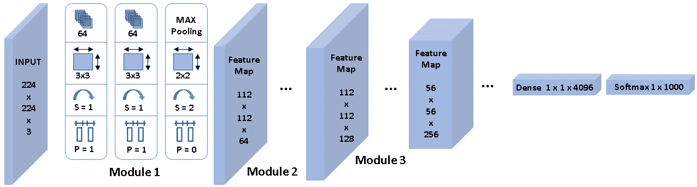
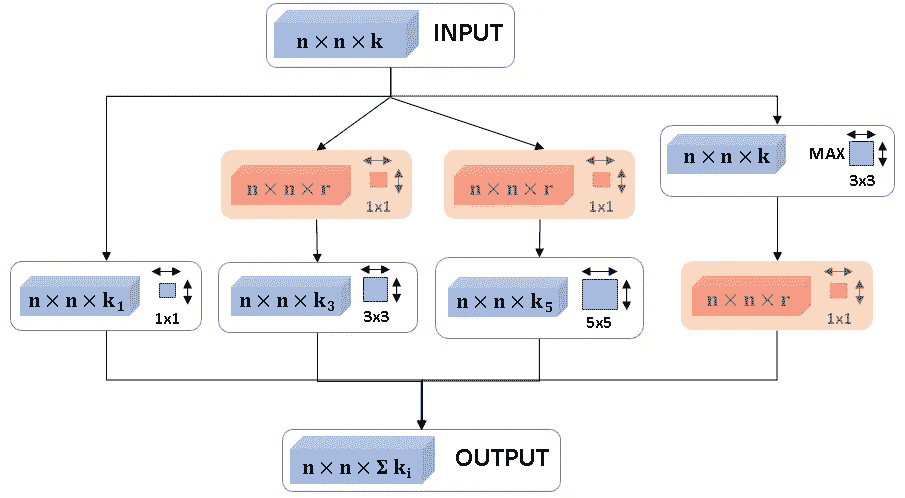
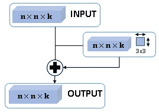
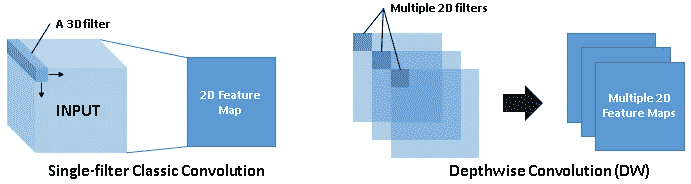
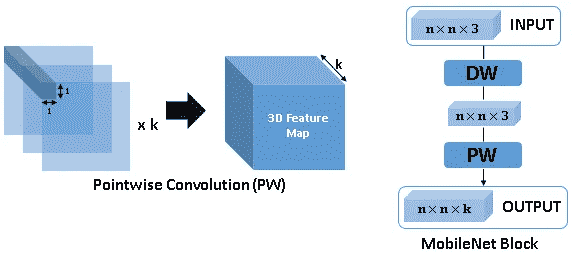
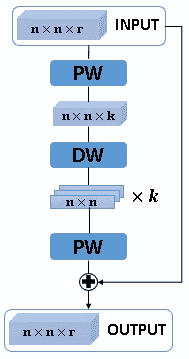
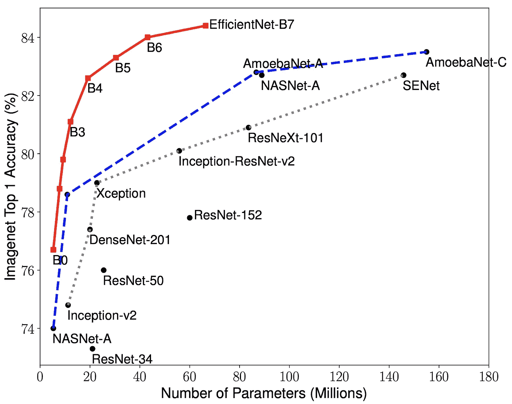

# 从 VGGNet 到 efficient net:CNN 设计发展的关键里程碑

> 原文：<https://pub.towardsai.net/from-vggnet-to-efficientnet-key-milestones-in-the-evolution-of-cnn-design-d778aa1e1bed?source=collection_archive---------0----------------------->

模块化、多路径、因式分解、压缩、可扩展…所有这些都在当今的 CNN 中，但是是什么将我们带到这里…我们将带你经历卷积神经网络设计历史上的主要里程碑…你不仅会学到东西，还会从中获得乐趣🤓

照片由在 [Unsplash](https://unsplash.com?utm_source=medium&utm_medium=referral) 拍摄的《我的镜头人生》

一般来说，分类问题形成了计算机视觉模型的基础，这些模型用于解决更复杂的视觉问题。

例如，对象检测的任务包括检测边界框并对其中的对象进行分类。为了完成分割任务，必须对图像中的每个像素进行分类。

因此，卷积神经网络(CNN)首先被用于解决图像分类问题，研究人员正是在这个问题上开始了竞争。通过针对 [ImageNet](https://www.image-net.org/) 挑战的更准确分类器的快速跟踪研究，他们解决了与高容量神经网络的统计学习相关的更普遍的问题，从而导致了深度学习的重大进展。

> *⚠️* **重要通知:**假设读者了解 CNN 的基本知识[ [1](https://towardsdatascience.com/a-comprehensive-guide-to-convolutional-neural-networks-the-eli5-way-3bd2b1164a53) ]。

# VGGNet

我们介绍我们的第一个 CNN，名为 VGGNet [2]。它是 AlexNet [3]的直接继任者，AlexNet 被认为是第一个“深度”神经网络，两个网络有一个共同的祖先，即 Lecun 的 LeNet [4]。

在本帖中，我们从 VGGNet 开始，因为它的特殊性。尽管年代久远，但这是少数几个至今仍在使用的 DL 型号之一，而大多数最新发明都已经过时了。此外，VGGNet 建立了随后的 CNN 所采用的通用组件和结构。

图 1: VGGNet 架构

您应该知道，卷积神经网络从输入层开始，如图 1 所示。它与输入图像`224**x**224**x**3`具有相同的尺寸。

然后，VGGNet 堆叠第一卷积层(c11 ),其包括大小为`3**x**3`的`64`个滤波器，具有活动填充和`1`的步长，这给出了具有`224**x**224**x**64`的输出张量。

接下来，它在具有相同配置的 64 个通道上堆叠一个使用相同滤波器大小`3**x**3`的 CL 2，从而产生相同维度的特征图。

之后，使用最大池(具有过滤器尺寸`2**x**2`、活动填充和步幅`2`)来降低特征图的空间分辨率，从`224**x**224**x**64`到`112**x**112**x**64`。

> 请注意，最大池化不会影响特征图深度，因此通道数量保持不变`64`。

此外，我将“模块 1”放在这三层之上，因为模块被定义为以特定分辨率运行的处理单元。因此，VGGNet 的模块 1 以`224**x**224`分辨率运行，并产生分辨率为`112**x**112`的特征图，模块 2 继续在该特征图上运行。

类似地，模块 2 也有两个带`3**x**3`过滤器的 CLs，用于提取更高级别的特征，随后是最大池以除以`2`空间分辨率，但过滤器的数量乘以`2`以使输出特征图的通道数量加倍。

毫无疑问，您已经可以猜到在接下来的模块中将会发生什么。每个模块处理输入的特征图，将其通道加倍，将其空间分辨率除以`2`等等。不可能永远这样做；空间分辨率已经是模块 6 中的`7**x**7`。

因此，VGGNet 包括一个从 3D 到 1D 的展平操作，然后应用一个或两个密集层，然后嘭！应用 softmax 来计算类分数(这里是`1000`标签)。

所有这些都是你在 CNN 课程中看到的东西。让我们总结一下 VGGNet 引入的在准确性方面优于所有前辈的设计模式:

✅ **模块化架构**允许卷积层内的对称性和同质性。事实上，构建具有相似特性的卷积层块，然后在模块之间执行下采样有助于在特征提取阶段保留有价值的信息，并允许使用小滤波器。换句话说，两个`3**x**3`连续滤光器的感知范围可以等同于单个`5**x**5`的感知范围。此外，小滤波器的级联增强了非线性，并且可以比具有较大滤波器的一层获得更好的精度。此外，小型过滤器加快了 Nvidia GPUs 的计算速度。

与平均池或步长卷积(步长大于 T2)相比，✅ **最大池运算**是一种有效的下采样方法。本质上，最大池允许捕获具有空间信息的数据的不变性。重要的是要强调，这种空间信息的减少是图像分类任务达到类分数输出所必需的，而且“流形假设”也证明了这一点。在计算机视觉中，流形假设表明`224**x**224**x**3`维空间中的真实图像代表非常有限的子空间。

✅ **金字塔形状**是指整体平滑的下采样，同时增加整个架构中的通道数量。事实上，通道的倍增补偿了由所学习的特征图的空间分辨率的持续降低所导致的代表性表达的损失。在整个层中，特征空间同步变得更窄和更深，直到它准备好被展平并作为输入向量馈送到完全连接的层。直观上，每个特征可以被视为一个对象，其存在将在整个推理计算中被量化。早期的卷积层捕捉基本形状，所以需要的对象更少。后来的图层将这些形状组合起来，以多种组合创建更复杂的对象，需要大量的通道来保存它们。

# 开始

接下来介绍第二个 CNN，它出现在同一年，但比 VGGNet [2]晚一点，名字叫 Inception [5]。这个名字的灵感来自克里斯托弗·诺兰的著名电影，这个网络引发了关于“深入 CNN”的辩论，这很快变成了一个问题。事实上，深度学习研究人员意识到，他们越是成功地正确训练更深层次的神经网络，他们实现的准确性就越好，特别是在像 ImageNet 这样的复杂分类任务方面。简而言之，更多的堆叠层提高了神经网络的学习能力，使其能够捕捉复杂的模式，并对复杂的条目集进行归纳。

等等，minute☝️I 是认真的，当我说，“当他们设法训练一个更深的网络。”堆叠更多的层确实有成本，并且使得训练神经网络更加困难。

这是由于**梯度消失问题**，当损耗梯度通过许多计算层反向传播，并逐渐收敛到很小的值，几乎为零时，就会发生这种问题。因此，训练网络的早期层变得太复杂，这是一个严重的问题，因为这些层执行特征提取并将提取的信息传输到后续层。

为了快速了解原因，损失梯度的反向传播使用导数链规则来利用先前计算的梯度。换句话说，链接到第一层的梯度的计算包括一项，该项是从后续层获得的梯度的乘积。当输入数据被归一化并且参数在`[0, 1]`之间被初始化时，在神经网络中估计的梯度也将小于 1。因此，梯度信号的强度会随着时间的推移而逐渐减弱，因为会连续乘以一个低于`1`的系数。

让我们回到 Inception，研究人员在一个深度级别上模拟几个层。通过这种方式，神经网络的学习能力得到增强，并且其参数空间得到扩展，而无需深入以避免消失梯度。

图 2:先启块

图 2 是内部视图🔍在这个新颖的多尺度处理层。关注蓝色🟦组件，我们看到一个输入层`n**x**n**x**3`和一个输出层`n**x**n**xΣ**ki`。不是应用大小为`3**x**3`的`k`卷积滤波器，而是并行应用多个处理层。相同的输入将同时通过一个`1**x**1`卷积、一个`3**x**3`卷积、一个`5**x**5`卷积和一个最大汇集(步长为`1`以保持分辨率)。然后，大小为`n**x**n**x**k1`、`n**x**n**x**k3`、`n**x**n**x**k5`和`n**x**n**x**k`的所有结果特征图被连接成大小为`n**x**n**xΣ**ki`的输出特征图。

就是这样，这是一个不起作用的初始多尺度层😅在这里，我们将看到红色🟥组件的行动。初始层的特征是由不同感知领域和处理路径产生的多尺度特征的集合。然而，每条路径至少产生`k`个通道，其中`k`是输入通道的数量。堆叠几个多尺度层肯定会引发*内存不足*异常。

🔔记住我之前提到的:使用 max-pooling 层的缩减采样阶段不会影响通道的数量。

为了克服这一点，inception 设计人员引入了逐点卷积，这是一种经典的卷积层，只有分辨率为`1**x**1`的过滤器和更少数量的过滤器`r **<** k`，从而有效地降低了特征图的深度，而不会牺牲在这一处理级别提取的相关数据。

Inception 引入了以下主要设计成果:

✅ **增殖路径**基于在架构中包括多个分支的想法，以模拟单个神经网络内的子网集合。想知道历史能教给我们什么是很有趣的。最后，这种多尺度分层确实很重，并且从未被广泛采用，然而，在一个层内组合多个路径的能力引发了以下神经网络的发展。

✅ **逐点卷积**现在是计算机视觉中非常有用和流行的工具。这是一种低成本的操作，参数占用空间小，处理时间相对较快。使用它，我们可以有效地减少输出特征图中的通道数量，使神经网络需要更少的内存和计算能力。我知道当你第一次面对它时，这是非常矛盾的😵如果你还想知道🤔添加额外的逐点卷积层如何减少参数数量，请记住，每个层的参数数量受输入通道数量的影响很大。

# 雷斯内特

接下来是 ResNet [6]，这是最具革命性的深度学习发明之一，也是被引用最多的研究论文之一🥇。这种受欢迎程度是由于 ResNet 是第一个成功堆叠超过 100 层的 CNN。回到那个时候，100 层就因为这个渐变消失的问题彻底疯了。现在，我们正在谈论变形金刚中的一万亿个参数。当我告诉你 ResNet 有 100 层时，你应该会得出结论，他们永远解决了渐变消失的问题，这就是它出名的原因。今天，我们不再听到梯度消失的问题。

我们一起来考察一下革命的诀窍。同样，我们维护 VGGNet 模块化架构，并且我们更改单个块的内容。如图 3 所示，残差块具有作为输入的`n**x**n**x**3`和作为输出的`n**x**n**x**3`。在这种块中，通道数保持是必须的。

图 3:残余块

🔍让我们看看里面。像往常一样，处理路径之一将是一个标准的与`3**x**3`滤波器的卷积，然后，在它旁边，我们添加一个快捷方式/跳过连接💡，即直接将输入传递到输出的恒等函数。仅此而已，乡亲们；这是深度学习最具革命性的创新之一。乍一看，这似乎很奇怪，但是你越想，它就变得越有逻辑。

因此，Resnet 将是模块加上下采样的堆栈，然后是进一步的模块再加上下采样，依此类推。在模块中，会有剩余的块，其中包含将输入链接到输出的快捷连接。因此，可以想象一种从出口(输出)到入口(输入)的信息高速公路，专门通过这些捷径连接。这正是 ResNet 解决渐变消失问题的原因。

还不明白吗？😵再想想当后者流经快捷连接(一个恒等函数)时如何不会有梯度损失。一旦你明白了👍，你可能仍然想知道🤔为什么它保留了很高的学习能力，甚至增强了学习能力？

直觉上，需要考虑两件事:

a)首先，ResNet 的快捷方式允许绕过给定输入数据的任何不必要的处理级别，因为深度神经网络中的一些层可能与检测应用于对象子集的某些模式有关。

b)其次，我们可以假设输入包含响应，计算层的目标是改进它，直到类被推导出来。因此，保持原始的输入流，同时在每一层添加处理结果作为迭代精化是有意义的。

📢从 ResNet 开始，ImageNet 社区决定不再每年进行挑战，因为问题已经解决，争论也差不多结束了。因此，研究人员越来越有兴趣寻找更有效的方法来解决这个问题。例如，他们试图减少 FLOPS 或内存占用的总数。这就是我在下面的神经网络中要讨论的内容。

# MobileNet

我们第一个成本最小化时代的 CNN 是 MobileNet [7]。它是一个具有较少参数的紧凑 CNN，在移动平台上快速运行，同时提供高性能。

💡MobileNet 的诀窍在于将卷积运算分解为两级超高效处理。是时候进入细节了。

图 4

如图 4 所示，经典卷积层通过 3D 过滤器，每个过滤器在输出特征图中产生一个通道。作为替代，MobileNet 提出了深度方向卷积，其中单独应用一组仅 2D 滤波器，即每个滤波器通过输入张量的所有通道。

在这里，我想你告诉我🤔他们所做的只是应用了经典的卷积，只不过他们采用了单个滤波器的结果，而不是将它们相加，而是将它们全部非级联。

我同意你的观点🤝这样做，我们将得到许多独立的特征地图，如果我们只是连接它们，不同通道之间将不再有任何关联。因此，我们忽略了两点:首先，需要链接特征地图，其次，需要改变通道。

🔔还记得我在《盗梦空间》中说过的话吗:当我们想要以低成本改变通道数量时，我们使用逐点卷积。

因此，MobileNet 确实将逐点卷积应用于来自深度卷积的特征映射。如图 5 所示，我们可以使用任意多的`1**x**1`滤波器来产生任意多的通道。例如，我们做时间`k`来得到我们典型的特征图，大小为`n**x**n**x**k`。

图 5

🔍如果我们查看 MobileNet 模块内部，如图 5 所示，我们将首先看到一个对 2D 空间信息进行操作的深度卷积，然后是一个沿 z 维度合并和处理通道信息的点卷积。

# MobileNet v2

这不是结束。MobileNet 发布了第二个版本。MobileNet v2 [8]是一个残差神经网络，即，它堆叠残差块以更深入，除了在各层内，它分解卷积操作以实现成本效益。

💡MobileNet v2 将这些层分成一个组来处理高维数据处理，另一个组将信息压缩并传输到相邻层。

图 6:反向残差块

🔍让我们看看图 6 中的 MobileNet v2 块。首先，我们使用逐点卷积达到高维度`k **>** r`，然后，我们使用深度卷积有效地分析信息，之后，我们再次使用逐点卷积返回到低维度。此外，我们强调应该从输入层到输出层添加一个剩余的快捷连接。

你可能想知道🤔这种压缩如何在不降低性能的情况下工作。如果是这样的话，我请你再想一想自 VGGNet 以来使用系统下采样背后的多种假设。

# 效率网

你已经上了效率网[9]，这是我在这篇文章中要讨论的最后一个 CNN。尽管是 2019 年底发布的，但是已经老了。如图 7 所示，这个网络已经超出了图表，远远超过了所有其他的神经网络。

*图 7:模型尺寸与精度对比[*[*ref*](https://ai.googleblog.com/2019/05/efficientnet-improving-accuracy-and.html)*]*

现在，让我们详细看看是什么使它如此强大。EfficientNet 是 MobileNetv2，在网络规模上有所改变。老实说，我希望你不会失望😒通过扭转，因为它真的很简单，但非常有效。

因此，EffectiveNet 也堆叠反转的残差块，但是质疑神经网络的深度、宽度和分辨率的任意选择。简单来说，网络的深度对应于网络的层数。宽度与层中神经元的数量相关，或者更确切地说，与卷积层中滤波器的数量相关。分辨率是输入的高度和宽度。

💡EfficientNet 设计人员提出了一种简单但有效的缩放技术，该技术使用复合系数ɸ以原则方式统一缩放网络宽度、深度和分辨率。ɸ是一个用户定义的全局比例因子(整数),控制有多少资源可用，而α、β和γ分别决定如何将这些资源分配给网络深度、宽度和分辨率。

因此，可以通过设置ɸ=1.，使用网格搜索来确定超参数α、β和γ由于网络规模较小，计算会很快。当最佳超参数确定后，复合系数ɸ可以增加，以获得更大和更准确的模型。这就是不同版本的 EfficientNet: B1 到 B7 是如何构造的，B 旁边的整数表示复合系数的值。

👊非常令人惊讶的是，使用这种聪明的网络规模启发式🧪优于所有最先进的 CNN，即使所有的设计结构和模式都与 MobileNet v2 相同。

在 [Unsplash](https://unsplash.com?utm_source=medium&utm_medium=referral) 上由 [Brina Blum](https://unsplash.com/@brina_blum?utm_source=medium&utm_medium=referral) 拍摄的照片

筋疲力尽的🥱我们完了。我们一起回到了过去🕕，因为 2014 年是深度学习的史前史。现在，当您看到 VGGNet、ResNet 或 EfficientNet 时，您可以认出它们。此外，你知道 CNN 逐步实施的重大改进以及它们解决了哪些问题。

然而，我只是触及了这些论文的表面。值得一读的是，他们中的许多人提出的实验，以了解为实现这一贡献所做的研究历程。

总之，要了解更多信息，请不要犹豫，特别是，请不要犹豫查看 2021 年末发布的 EfficientNetv2 [10]。

## 参考

【[1](https://towardsdatascience.com/a-comprehensive-guide-to-convolutional-neural-networks-the-eli5-way-3bd2b1164a53)】Sumit Saha，卷积神经网络综合指南，TDS，2018

【[2](https://arxiv.org/abs/1409.1556)】Simon Yan 等，面向大规模图像识别的极深度卷积网络，2014

[ [3](https://papers.nips.cc/paper/2012/hash/c399862d3b9d6b76c8436e924a68c45b-Abstract.html) ] Krizhevsky 等，深度卷积神经网络的 ImageNet 分类，2012

[ [4](http://yann.lecun.com/exdb/lenet/) 扬·勒昆，LeNet-5 卷积神经网络，1998

[ [5](https://arxiv.org/abs/1409.4842v1) ]塞格迪等人，深入研究卷积，2014 年

【 [6](https://arxiv.org/abs/1512.03385) 何等，图像识别的深度残差学习，2016

【[7](https://arxiv.org/abs/1704.04861)】g . Howard 等，MobileNets:面向移动视觉应用的高效卷积神经网络，2017

【 [8](https://arxiv.org/abs/1801.04381) 】桑德勒等，MobileNetV2:反向残差和线性瓶颈，2018

【 [9](https://arxiv.org/abs/1905.11946) 】谭等，EfficientNet:卷积神经网络模型缩放的再思考，2019

谭等，高效网络 2:更小的模型和更快的训练，2021